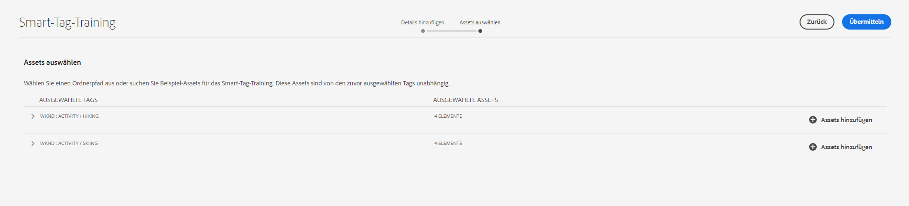
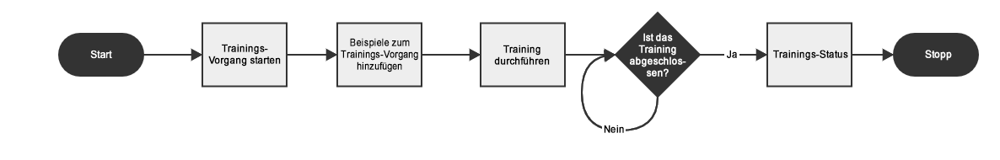

# Hinzufügen von Smart-Tags zu Assets in AEM {#smart-tags-assets-aem}

| [Best Practices für die Suche](/help/assets/search-best-practices.md) | [Best Practices für Metadaten](/help/assets/metadata-best-practices.md) | [Content Hub](/help/assets/product-overview.md) | [Dynamic Media mit OpenAPI-Funktionen](/help/assets/dynamic-media-open-apis-overview.md) | [Entwicklerdokumentation zu AEM Assets](https://developer.adobe.com/experience-cloud/experience-manager-apis/) |
| ------------- | --------------------------- |---------|----|-----|

| Version | Artikel-Link |
| -------- | ---------------------------- |
| AEM 6.5 | [Hier klicken](https://experienceleague.adobe.com/docs/experience-manager-65/assets/using/enhanced-smart-tags.html?lang=de) |
| AEM as a Cloud Service | Dieser Artikel |

Organisationen, die mit digitalen Assets arbeiten, verwenden zunehmend taxonomiegesteuertes Vokabular in Asset-Metadaten. Im Grunde umfasst dieses eine Liste von Keywords, die Mitarbeiter, Partner und Kunden häufig verwenden, um sich auf digitale Assets zu beziehen und nach diesen zu suchen. Das Tagging mit einem taxonomiegesteuerten Vokabular stellt sicher, dass die Assets in Suchvorgängen einfach identifiziert und abgerufen werden können.

Verglichen mit dem Vokabular natürlicher Sprachen hilft das Tagging anhand einer Unternehmenstaxonomie dabei, die Assets am Geschäft eines Unternehmens auszurichten, und stellt dabei sicher, dass nur die relevantesten Assets bei der Suche angezeigt werden. So könnte beispielsweise ein Automobilhersteller für das Erstellen einer Werbekampagne Bilder von Autos mit Tags versehen, die die Modellnamen darstellen, sodass bei einer Suche nur relevante Bilder angezeigt werden.

Im Hintergrund verwenden die Funktionen ein KI-Framework von [Adobe Sensei](https://business.adobe.com/de/why-adobe/experience-cloud-artificial-intelligence.html), um den Bilderkennungsalgorithmus auf Ihre Tag-Struktur und Ihre Unternehmenstaxonomie zu trainieren. Diese Content-Intelligenz wird dann verwendet, um relevante Tags auf einen anderen Satz von Assets anzuwenden. AEM wendet standardmäßig automatisch Smart-Tags auf hochgeladene Assets an.

<!-- TBD: Create a flowchart for how training works in CS.
 
-->

## Unterstützte Asset-Typen für Smart-Tags in AEM {#smart-tags-supported-file-formats}

Sie können die folgenden Asset-Typen mit Tags versehen:

* **Bilder**: Bilder in vielen Formaten werden mithilfe der intelligenten Content Services von Adobe Sensei mit Tags versehen. Sie [erstellen ein Trainings-Modell](#train-model) und die hochgeladenen Bilder werden automatisch mit Tags versehen. Smart-Tags werden auf die unterstützten Dateitypen angewendet, die Ausgabedarstellungen im JPG- und PNG-Format generieren.
* **Textbasierte Assets**: [!DNL Experience Manager Assets] versieht unterstützte textbasierte Assets beim Hochladen automatisch mit Tags.
* **Video-Assets**: Video-Tagging ist standardmäßig in [!DNL Adobe Experience Manager] as a [!DNL Cloud Service] aktiviert. [Videos werden automatisch mit Tags versehen](/help/assets/smart-tags-video-assets.md), wenn Sie neue Videos hochladen oder vorhandene erneut verarbeiten.

| Bilder (MIME-Typen) | Textbasierte Assets (Dateiformate) | Video-Assets (Dateiformate und Codecs) |
|----|-----|------|
| image/jpeg | CSV | MP4 (H264/AVC) |
| image/tiff | DOC | MKV (H264/AVC) |
| image/png | DOCX | MOV (H264/AVC, Motion JPEG) |
| image/bmp | HTML | AVI (indeo4) |
| image/gif | PDF | FLV (H264/AVC, vp6f) |
| image/pjpeg | PPT | WMV (WMV2) |
| image/x-portable-anymap | PPTX |  |
| image/x-portable-bitmap | RTF |  |
| image/x-portable-graymap | SRT |  |
| image/x-portable-pixmap | TXT |  |
| image/x-rgb | VTT |  |
| image/x-xbitmap | |  |
| image/x-xpixmap | |  |
| image/x-icon |  |  |
| image/photoshop |  |  |
| image/x-photoshop |  |  |
| image/psd |  |  |
| image/vnd.adobe.photoshop |  |  |

AEM fügt den textbasierten Assets und Videos standardmäßig automatisch die Smart-Tags hinzu. Führen Sie die folgenden Aufgaben aus, um Bilder automatisch mit Smart-Tags zu versehen.

* [Grundlegendes zu Tag-Modellen und Richtlinien](#understand-tag-models-guidelines).
* [Trainieren der Modelle](#train-model)
* [Tagging digitaler Assets](#tag-assets)
* [Verwalten von Tags und Suchvorgängen](#manage-smart-tags-and-searches)

## Grundlegendes zu Tag-Modellen und Richtlinien {#understand-tag-models-guidelines}

Ein Tag-Modell ist eine Gruppe verwandter Tags, die mit verschiedenen visuellen Aspekten von Bildern verknüpft sind, die mit Tags versehen werden. Tags beziehen sich auf die deutlich unterschiedlichen visuellen Aspekte von Bildern, sodass die Tags beim Suchen nach bestimmten Bildtypen hilfreich sind. Beispielsweise kann eine Schuhkollektion unterschiedliche Tags haben, aber alle Tags beziehen sich auf Schuhe und können zum selben Tag-Modell gehören. Tags helfen, verschiedene Schuhtypen zu finden, zum Beispiel nach Design oder nach Funktion. Um die inhaltliche Darstellung eines Trainings-Modells in [!DNL Experience Manager] zu verstehen, stellen Sie sich ein Trainings-Modell als eine Entität der obersten Ebene vor, die aus einer Gruppe manuell hinzugefügter Tags und Beispielbildern für jedes Tag besteht. Jedes Tag kann ausschließlich auf ein Bild angewendet werden.

Bevor Sie ein Tag-Modell erstellen und den Service trainieren, identifizieren Sie einen Satz eindeutiger Tags, die die Objekte in den Bildern im Kontext Ihres Unternehmens am besten beschreiben. Stellen Sie sicher, dass die Assets in Ihrem Satz den [Trainings-Richtlinien](#training-guidelines) entsprechen.

### Trainings-Richtlinien {#training-guidelines}

Stellen Sie sicher, dass die Bilder im Trainings-Satz den folgenden Richtlinien entsprechen:

**Menge und Größe:** Mindestens 10 Bilder und maximal 50 Bilder pro Tag.

**Kohärenz**: Stellen Sie sicher, dass die Bilder für ein Tag visuell ähnlich sind. Es wird empfohlen, die Tags derselben visuellen Aspekte (z. B. desselben Objekttyps in einem Bild) zu einem einzigen Tag-Modell zusammenzufassen. So ist es beispielsweise nicht empfehlenswert, diese Bilder mit dem Tag `my-party` zu versehen (zu Trainings-Zwecken), da sie einander visuell nicht ähnlich sind.

**Abdeckung:** Bei den Trainings-Bildern muss eine ausreichende Vielfalt vorhanden sein. Der Grundgedanke ist, einige Beispiele bereitzustellen, die jedoch verhältnismäßig vielfältig sind, sodass [!DNL Experience Manager] lernt, sich auf die richtigen Dinge zu konzentrieren. Wenn Sie dasselbe Tag auf visuell unähnliche Bilder anwenden, sollten Sie mindestens fünf Beispiele für jeden Typ einschließen. Beispiel: Schließen Sie für das Tag *model-down-pose* mehr Trainings-Bilder ein, die dem hervorgehobenen Bild unten ähnlich sind, sodass der Service ähnliche Bilder beim Hinzufügen von Tags genauer identifizieren kann.

**Ablenkung/Verdeckung**: Der Service kann besser mit Bildern trainieren, die weniger Ablenkungen enthalten (hervorgehobenen Hintergründe oder Elemente ohne Bezug wie Objekte/Personen neben dem Hauptsubjekt). Beispiel: Für das Tag *casual-shoe* ist das zweite Bild kein guter Kandidat für das Training.

**Vollständigkeit:** Wenn ein Bild für mehr als ein Tag qualifiziert ist, fügen Sie alle entsprechenden Tags hinzu, bevor Sie das Bild für eine Schulung hinzufügen. Fügen Sie beispielsweise für Tags wie *Regenmantel* und *Modell-Seitenansicht* beide Tags für das entsprechende Asset hinzu, bevor Sie es für die Schulung hinzufügen.

**Anzahl der Tags**: Adobe empfiehlt, dass Sie ein Modell mit mindestens zwei verschiedenen Tags und mindestens zehn verschiedenen Bildern für jedes Tag trainieren. Fügen Sie in einem einzelnen Tag-Modell nicht mehr als 50 Tags hinzu.

**Anzahl der Beispiele**: Fügen Sie für jedes Tag mindestens zehn Beispiele hinzu. Adobe empfiehlt jedoch etwa 30 Beispiele. Es werden maximal 50 Beispiele pro Tag unterstützt.

**Vermeidung falscher positiver Werte und von Konflikte**: Adobe empfiehlt die Erstellung eines einzelnen Tag-Modells für einen einzelnen visuellen Aspekt. Strukturieren Sie die Tag-Modelle so, dass überlappende Tags zwischen den Modellen vermieden werden. Verwenden Sie beispielsweise keine gemeinsamen Tags wie `sneakers` in zwei verschiedenen Tag-Modellen, die `shoes` und `footwear` heißen. Der Trainings-Prozess überschreibt ein trainiertes Tag-Modell mit dem anderen für ein gemeinsames Keyword.

**Beispiele**: Weitere Beispiele zur Orientierung:

* Erstellen Sie ein Tag-Modell, das Folgendes umfasst:

   * Die Tags, die sich auf Automodelle beziehen.
   * Die Tags, die sich auf Jacken für Erwachsene und Kinder beziehen.

* Erstellen Sie nicht Folgendes:

   * Ein Tag-Modell, das in den Jahren 2019 und 2020 auf den Markt gekommene Automodelle enthält.
   * Mehrere Tag-Modelle, die dieselben Automodelle enthalten.

**Zum Trainieren verwendete Bilder**: Sie können dieselben Bilder zum Trainieren verschiedener Tag-Modelle verwenden. Sie können jedoch kein Bild mit mehr als einem Tag in einem Tag-Modell verknüpfen. Es ist möglich, dasselbe Bild mit verschiedenen Tags zu versehen, die zu verschiedenen Tag-Modellen gehören.

Sie können das Training nicht rückgängig machen. Die obigen Richtlinien sollen Ihnen bei der Auswahl guter Bilder für das Training helfen.

## Trainieren des Modelle für Ihre benutzerdefinierten Tags {#train-model}

Gehen Sie folgendermaßen vor, um ein Modell für Ihre geschäftsspezifischen Tags zu erstellen und zu trainieren:

1. Erstellen Sie die erforderlichen Tags und die entsprechende Tag-Struktur. Laden Sie die entsprechenden Bilder in das DAM-Repository hoch.
1. Rufen Sie in der [!DNL Experience Manager]-Benutzeroberfläche **[!UICONTROL Assets]** > **[!UICONTROL Smart-Tag-Training]** auf.
1. Klicken Sie auf **[!UICONTROL Erstellen]**. Geben Sie einen **[!UICONTROL Titel]** und eine **[!UICONTROL Beschreibung]** ein.
1. Klicken Sie auf das Ordnersymbol im Feld **[!UICONTROL Tags]**. Ein Popup-Fenster wird geöffnet.
1. Suchen oder wählen Sie die entsprechenden Tags, die Sie dem Modell hinzufügen möchten, aus den vorhandenen Tags in `cq-tags` aus. Klicken Sie auf **[!UICONTROL Weiter]**.

   >[!NOTE]
   >
   >Sie können die Tag-Struktur anhand der Variablen **[!UICONTROL Name]** (alphabetische Reihenfolge), **[!UICONTROL Erstellt]**-Datum oder **[!UICONTROL Geändert]**-Datum aufsteigend oder absteigend sortieren.

1. Klicken Sie im Dialogfeld **[!UICONTROL Assets auswählen]** für jedes Tag auf **[!UICONTROL Assets hinzufügen]**. Suchen Sie im DAM-Repository oder durchsuchen Sie das Repository, um mindestens 10 und höchstens 50 Bilder auszuwählen. Wählen Sie Assets und nicht den Ordner aus. Nachdem Sie die Bilder ausgewählt haben, klicken Sie auf **[!UICONTROL Auswählen]**.

   

1. Um eine Vorschau der Miniaturen der ausgewählten Bilder anzuzeigen, klicken Sie auf das Akkordeon vor einem Tag. Sie können Ihre Auswahl ändern, indem Sie auf **[!UICONTROL Assets hinzufügen]** klicken. Wenn Sie mit der Auswahl zufrieden sind, klicken Sie auf **[!UICONTROL Senden]**. Die Benutzeroberfläche zeigt unten auf der Seite eine Benachrichtigung an, die angibt, dass das Training gestartet wurde.
1. Überprüfen Sie den Status des Trainings in der Spalte **[!UICONTROL Status]** für jedes Tag-Modell. Mögliche Status sind [!UICONTROL Ausstehend], [!UICONTROL Trainiert] und [!UICONTROL Fehlgeschlagen].

*Abbildung: Schritte des Trainings-Workflows zum Trainieren des Tagging-Modells.*

### Anzeigen von Trainings-Status und -Bericht {#training-status}

Um sicherzustellen, dass der Smart-Tags-Service mit Ihren Tags im Asset-Trainings-Satz trainiert wurde, überprüfen Sie den Bericht zum Trainings-Workflow über die Berichte-Konsole.

1. Gehen Sie in der [!DNL Experience Manager]-Benutzeroberfläche zu **[!UICONTROL Tools]** > **[!UICONTROL Assets]** > **[!UICONTROL Berichte]**.
1. Klicken Sie auf der Seite **[!UICONTROL Asset-Berichte]** auf **[!UICONTROL Erstellen]**.
1. Wählen Sie den Bericht **[!UICONTROL Smart-Tags-Training]** aus und klicken Sie dann in der Symbolleiste auf **[!UICONTROL Weiter]**.
1. Geben Sie einen Titel und eine Beschreibung für den Bericht an. Lassen Sie unter **[!UICONTROL Berichtplanen]** die Option **[!UICONTROL Jetzt]** aktiviert. Wenn Sie den Bericht für einen späteren Zeitpunkt planen möchten, wählen Sie **[!UICONTROL Später]** und geben Sie ein Datum und eine Uhrzeit an. Klicken Sie dann in der Symbolleiste auf **[!UICONTROL Erstellen]**.
1. Wählen Sie auf der Seite **[!UICONTROL Asset-Berichte]** den erstellten Bericht aus. Um den Bericht anzuzeigen, klicken Sie in der Symbolleiste auf **[!UICONTROL Ansicht]**.
1. Prüfen Sie die Details des Berichts. Der Bericht zeigt den Trainings-Status der von Ihnen trainierten Tags an. Grün in der Spalte **[!UICONTROL Trainings-Status]** gibt an, dass der Smart-Tag-Service für das Tag trainiert wurde. Gelb bedeutet, dass der Service für ein bestimmtes Tag nicht vollständig trainiert ist. Um den Dienst vollständig für ein Tag zu trainieren, fügen Sie weitere Bilder mit dem entsprechenden Tag hinzu und führen Sie den Trainings-Workflow aus. Wenn Ihre Tags nicht im Bericht angezeigt werden, führen Sie den Trainings-Workflow für diese Tags erneut aus.
1. Um den Bericht herunterzuladen, wählen Sie ihn aus der Liste aus und klicken Sie in der Symbolleiste auf **[!UICONTROL Herunterladen]**. Der Bericht wird als Tabelle heruntergeladen.

<!--
### Tag assets from the workflow console {#tagging-assets-from-the-workflow-console}

1. In [!DNL Experience Manager] interface, go to **[!UICONTROL Tools]** > **[!UICONTROL Workflow]** > **[!UICONTROL Models]**.
1. From the **[!UICONTROL Workflow Models]** page, select the **[!UICONTROL DAM Smart Tags Assets]** workflow and then click **[!UICONTROL Start Workflow]** from the toolbar.

   

1. In the **[!UICONTROL Run Workflow]** dialog, browse to the payload folder containing assets on which you want to apply your tags automatically.
1. Specify a title for the workflow and an optional comment. Click **[!UICONTROL Run]**.

   

   *Figure: Navigate to the asset folder and review the tags to verify whether your assets are tagged properly. For details, see [manage smart tags](#manage-smart-tags-and-searches).*

### Tag assets from the timeline {#tagging-assets-from-the-timeline}

1. From the [!DNL Assets] user interface, select the folder containing assets or specific assets to which you want to apply smart tags.
1. From upper-left corner, open the **[!UICONTROL Timeline]**.
1. Open actions from the bottom of the left sidebar and click **[!UICONTROL Start Workflow]**.

   

1. Select the **[!UICONTROL DAM Smart Tag Assets]** workflow, and specify a title for the workflow.
1. Click **[!UICONTROL Start]**. The workflow applies your tags on assets. Navigate to the asset folder and review the tags to verify that your assets are tagged properly. For details, see [manage smart tags](#manage-smart-tags-and-searches).

>[!NOTE]
>
>In the subsequent tagging cycles, only the modified assets are tagged again with newly trained tags. However, even unaltered assets are tagged if the gap between the last and current tagging cycles for the tagging workflow exceeds 24 hours. For periodic tagging workflows, unaltered assets are tagged when the time gap exceeds six months.

### Tag uploaded assets {#tag-uploaded-assets}

[!DNL Experience Manager] can automatically tag the assets that users upload to DAM. To do so, administrators configure a workflow to add an available step that tags assets. See [how to enable Smart Tags for uploaded assets](/help/assets/smart-tags-configuration.md#enable-smart-tagging-for-uploaded-assets).
-->

## Taggen von Assets mit Smart-Tags in AEM {#tag-assets}

Alle Typen unterstützter Assets werden beim Hochladen automatisch von [!DNL Experience Manager Assets] mit Tags versehen. Tagging ist standardmäßig aktiviert und funktioniert. AEM wendet die entsprechenden Smart-Tags nahezu in Echtzeit an. <!-- TBD: You can also apply the tagging workflow on-demand. The workflow applies to both, assets and folders. -->

* Für Bilder und Videos basieren die Smart-Tags auf visuellen Aspekten.

* Bei textbasierten Assets hängt die Wirksamkeit von Smart-Tags nicht von der Textmenge im Asset ab, sondern von den relevanten Keywords oder Entitäten, die im Text des Assets vorhanden sind. Bei textbasierten Assets sind die Smart-Tags die Keywords, die im Text angezeigt werden, und zwar die, die das Asset am besten beschreiben. Bei unterstützten Assets extrahiert [!DNL Experience Manager] bereits den Text, der dann indiziert und zum Suchen nach den Assets verwendet wird. Smart-Tags, die auf Keywords im Text basieren, bieten jedoch eine dedizierte, strukturierte und höher priorisierte Suchfacette. Letzteres trägt dazu bei, die Asset-Erkennung im Vergleich zu einem Suchindex zu verbessern.

## Verwalten von Smart-Tags und Asset-Suchvorgängen {#manage-smart-tags-and-searches}

Sie können Smart-Tags kuratieren, um ungenaue Tags zu entfernen, die möglicherweise Ihren Marken-Assets zugewiesen wurden, sodass nur die relevantesten Tags angezeigt werden.

Mithilfe der Moderation von Smart-Tags können Sie Tag-basierte Suchen nach Assets verfeinern, indem Sie sicherstellen, dass Ihr Asset nur in den Suchergebnissen für die relevantesten Tags angezeigt wird. Im Grunde wird so ausgeschlossen, dass in den Suchergebnissen Assets ohne Bezug angezeigt werden.

Sie können einem Tag auch einen höheren Rang zuweisen, um die Relevanz des Tags für das Asset zu erhöhen. Je höher der Rang eines Tags für ein Asset desto wahrscheinlicher ist bei einer Tag-basierten Suche die Aufnahme des Assets in die Suchergebnisse.

So moderieren Sie die Smart-Tags Ihrer digitalen Assets:

1. Suchen Sie im Suchfeld nach digitalen Assets, die auf einem Tag basieren.

1. Prüfen Sie die Suchergebnisse, um die digitalen Assets zu identifizieren, die für Ihre Suche nicht relevant sind.

1. Wählen Sie ein Asset aus, und wählen Sie dann in der Symbolleiste  aus.

1. Prüfen Sie die Tags auf der Seite **[!UICONTROL Tags verwalten]**. Wenn Sie ein spezifisches Tag für ein Asset ausschließen möchten, wählen Sie das Tag und anschießend in der Symbolleiste  aus. Alternativ können Sie `X`-Symbol neben der Beschriftung auswählen.

1. Um einem Tag einen höheren Rang zuzuweisen, wählen Sie das Tag und anschließend in der Symbolleiste  aus. Das höhergestufte Tag wird in den Abschnitt **[!UICONTROL Tags]** verschoben.

1. Wählen Sie **[!UICONTROL Speichern]** und dann **[!UICONTROL OK]** au, um das Dialogfeld [!UICONTROL Erfolg] zu schließen.

1. Gehen Sie zur Seite „[!UICONTROL Eigenschaften]“ des betreffenden Assets. Beachten Sie, dass das beworbene Tag eine hohe Relevanz erhält und es aus diesem Grund höher in den Suchergebnissen angezeigt wird.

### Grundlegendes zu [!DNL Experience Manager]-Suchergebnissen mit Smart-Tags {#understand-search}

Die [!DNL Experience Manager]-Suche kombiniert die Suchbegriffe standardmäßig mit einer `AND`-Klausel. Dieses Standardverhalten ändert sich durch die Verwendung von Smart-Tags nicht. Durch die Verwendung von Smart-Tags wird eine `OR`-Klausel hinzugefügt. Damit wird jeder Suchbegriff in den angewandten Smart-Tags gefunden. Suchen Sie beispielsweise nach `woman running`. Assets, die in den Metadaten nur das Keyword `woman`oder `running` aufweisen, werden standardmäßig nicht in den Suchergebnissen angezeigt. Ein Asset, das über Smart-Tags mit `woman` oder `running` getaggt wurde, wird bei dieser Suchanfrage jedoch angezeigt. Die Suchergebnisse sind also eine Kombination aus

* Assets mit den Keywords `woman` und `running` in den Metadaten.

* Assets, die über Smart-Tags mit einem der Keywords getaggt wurden.

Die Suchergebnisse, die in Metadatenfeldern alle Suchbegriffe aufweisen, werden zuerst angezeigt. Danach folgen die Suchergebnisse, die einem oder mehr Suchbegriffen in den Smart-Tags entsprechen. Im obigen Beispiel werden die Suchergebnisse ungefähr in dieser Reihenfolge angezeigt:

1. Treffer von `woman running` in den verschiedenen Metadatenfeldern.
1. Treffer von `woman running` in den Smart-Tags.
1. Treffer von `woman` oder `running` in Smart-Tags.

## Einschränkungen beim Tagging und Best Practices {#limitations}

Optimiertes Smart-Tagging basiert auf Lernmodellen von Markenbildern und den zugehörigen Tags. Diese Modelle können Tags nicht immer perfekt identifizieren. Bei der aktuellen Version der Smart-Tags gibt es folgende Einschränkungen:

* Subtile Unterschiede in Bildern können nicht erkannt werden. Beispiel: Hemden mit schlanker oder normaler Passform.
* Tags können nicht anhand von winzigen Mustern oder Teilen eines Bildes identifiziert werden. Beispiel: Logos auf Hemden.
* Tagging wird in den von [!DNL Experience Manager] unterstützten Sprachen unterstützt.
* Die Tags, die nicht verarbeitet werden, beziehen sich auf:

   * Nicht visuelle, abstrakte Aspekte, wie beispielsweise das Jahr oder die Saison der Produktveröffentlichung, die Stimmung oder die Emotionen, die durch ein Bild hervorgerufen werden, sowie die subjektive Konnotation eines Videos.
   * Feine visuelle Unterschiede bei Produkten wie Hemden mit und ohne Kragen oder kleinen Produkt-Logos, die in Produkte eingebettet sind.

Verwenden Sie zum Trainieren des Modells die am besten geeigneten Bilder. Das Training kann nicht rückgängig gemacht werden, das Trainings-Modell kann nicht entfernt werden. Ihre Tagging-Genauigkeit hängt von der aktuellen Schulung ab. Gehen Sie daher sorgfältig vor.

<!-- TBD: Add limitations related to text files. -->

Verwenden Sie die [!DNL Assets]-Suche (Volltextsuche), um nach Dateien mit Smart-Tags (normal oder erweitert) zu suchen. Es gibt kein separates Suchprädikat für Smart-Tags.

>[!NOTE]
>
>Die Fähigkeit der Smart-Tags, aus Ihren Tags zu lernen und diese Tags auf andere Bilder anzuwenden, hängt von der Qualität der für das Training verwendeten Bilder ab.
>Um die bestmöglichen Ergebnisse zu erzielen, empfiehlt Adobe die Verwendung visuell ähnlicher Bilder, um den Service für die einzelnen Tags zu trainieren.

**Siehe auch**

* [Assets übersetzen](translate-assets.md)
* [Assets-HTTP-API](mac-api-assets.md)
* [Von AEM Assets unterstützte Dateiformate](file-format-support.md)
* [Suchen von Assets](search-assets.md)
* [Connected Assets](use-assets-across-connected-assets-instances.md)
* [Asset-Berichte](asset-reports.md)
* [Metadatenschemata](metadata-schemas.md)
* [Herunterladen von Assets](download-assets-from-aem.md)
* [Verwalten von Metadaten](manage-metadata.md)
* [Suchfacetten](search-facets.md)
* [Verwalten von Sammlungen](manage-collections.md)
* [Massenimport von Metadaten](metadata-import-export.md)
* [Veröffentlichen von Assets in AEM und Dynamic Media](/help/assets/publish-assets-to-aem-and-dm.md)

>[!MORELIKETHIS]
>
>* [Wissenswertes über Smart-Tags bei der Verwaltung digitaler Dateien](https://medium.com/adobetech/efficient-asset-management-with-enhanced-smart-tags-887bd47dbb3f)
>* [Verwenden von Smart-Tags für Videos](smart-tags-video-assets.md)
