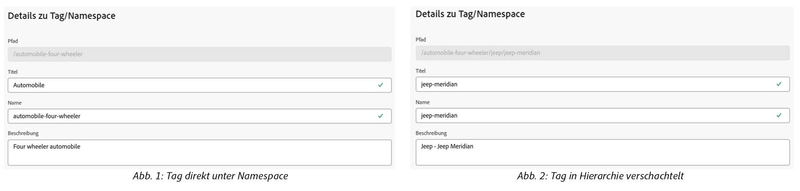
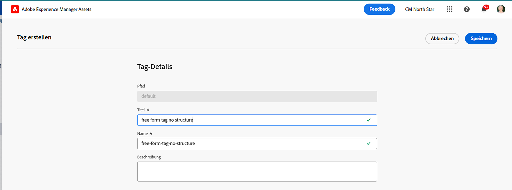
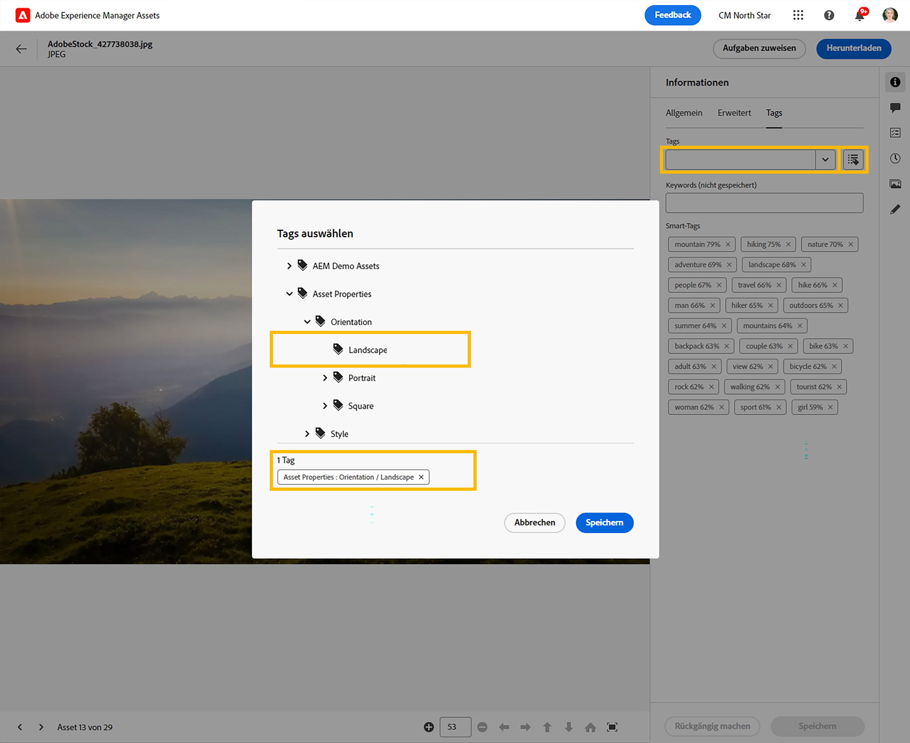

# Verwalten von Tags in der Asset-Ansicht {#view-assets-and-details}

>[!CONTEXTUALHELP]
>id="assets_taxonomy_management"
>title="Tags verwalten"
>abstract="Mit Tags können Sie Assets kategorisieren, damit sie sich leichter durchsuchen und suchen lassen. Admins haben die Möglichkeit, die hierarchische Tagging-Struktur zu verwenden, die die Anwendung relevanter Metadaten, die Kategorisierung von Assets, die Unterstützung der Suche, die Wiederverwendung von Tags, die Verbesserung der Auffindbarkeit usw. erleichtert."

Mit Tags können Sie Assets kategorisieren, damit sie sich leichter durchsuchen und suchen lassen. Tagging hilft bei der Verbreitung der entsprechenden Taxonomie an andere Benutzer und Workflows.

Einfache Listen kontrollierter Vokabeln können im Laufe der Zeit nicht mehr zu handhaben sein. Admins haben die Möglichkeit, die hierarchische Tagging-Struktur zu verwenden, die die Anwendung relevanter Metadaten, die Kategorisierung von Assets, die Unterstützung der Suche, die Wiederverwendung von Tags, die Verbesserung der Auffindbarkeit usw. erleichtert.

Sie können einen Namespace auf der Stammebene erstellen und eine hierarchische Struktur von Unter-Tags innerhalb des Namespace erstellen. Sie können beispielsweise eine `Activities` -Namespace auf der Stammebene und haben `Cycling`, `Hiking`und `Running` -Tags innerhalb des Namespace. Sie können weitere Untertags haben `Clothing` und `Shoes` Innerhalb `Running`.

Das Tagging bietet viele Vorteile, z. B.:

* Mit Tagging können Autoren unähnliche Assets einfach über eine gemeinsame Taxonomie organisieren. Autoren können Assets schnell anhand gemeinsamer Tags suchen und organisieren.

* Hierarchische Tags sind äußerst flexibel und eignen sich hervorragend, um Begriffe logisch zu organisieren. Mithilfe von Namespaces, Tags und Unter-Tags können ganze Taxonomiesysteme dargestellt werden.

* Tags können sich im Laufe der Zeit entwickeln, wenn sich das organisatorische Vokabular ändert.

* Tags, die in der Admin-Ansicht verwaltet werden, bleiben mit den Tags synchronisiert, die in der Assets-Ansicht verwaltet werden. Dadurch werden Metadaten-Governance und -Integrität gewährleistet.

Um Tags auf Assets anwenden zu können, müssen Sie zunächst einen Namespace erstellen und anschließend Tags erstellen und hinzufügen. Sie können auch Tags erstellen und sie zu einem vorhandenen Namespace hinzufügen. Alle Tags, die Sie auf der Stammebene erstellen, werden automatisch zum Standard-Tags-Namespace hinzugefügt. Anschließend können Sie das Feld Tags zum Metadatenformular hinzufügen, damit es auf der Seite Asset-Details angezeigt wird. Nachdem Sie diese Einstellungen konfiguriert haben, können Sie damit beginnen, Tags auf Assets anzuwenden.

>[!NOTE]
>
>Sie müssen das Feld Tags nur dann zum Metadatenformular hinzufügen, wenn Sie nicht das standardmäßige Metadatenformular verwenden.

In der Admin-Ansicht stehen zusätzliche Funktionen zur Verfügung, die über die in diesem Artikel erwähnten Funktionen hinausgehen, einschließlich Zusammenführen, Umbenennen, Lokalisieren und Veröffentlichen von Tags.

## Erstellen eines Namespace {#creating-a-namespace}

Ein Namespace ist ein Container für Tags, die nur auf der Stammebene vorhanden sein können. Sie können mit der Einrichtung der hierarchischen Struktur von Tags beginnen, indem Sie zunächst einen logischen Namen für den Namespace definieren. Wenn Sie keinem der vorhandenen Namespaces ein Tag hinzufügen, wird das Tag automatisch in Standard-Tags verschoben.

Führen Sie die folgenden Schritte aus, um einen Namespace zu erstellen:

1. Navigieren Sie zu `Taxonomy Management` under `Settings` um die Liste der vorhandenen Namespaces anzuzeigen. Sie können auch das Datum der letzten Änderung, den Benutzer, der den Namespace oder die Tags darunter geändert hat, und die Anzahl der Verwendungen des Tags in einem Asset anzeigen.
1. Klicken Sie auf `Create Namespace`.
1. Hinzufügen `Title`, `Name`und `Description` für den Namespace. Die Eingabe, die Sie in der `Title` -Feld wird oben in der Hierarchie angezeigt. In der folgenden Abbildung beispielsweise **Tätigkeiten** bezieht sich auf den Titel des Namespace.

   

   <!--
    >[!NOTE]
    >
    >You can use `Name` as a primary key if you are using any other metadata management tool is the source of truth for taxonomy values, you can use the name as a primary key.
    >
    -->

1. Klicken Sie auf `Save`.

## Hinzufügen von Tags zu einem Namespace {#adding-tags-to-namespace}

Führen Sie die folgenden Schritte aus, um einem Namespace Tags hinzuzufügen:

1. Rufen Sie `Taxonomy Management` auf.
1. Wählen Sie den Namespace aus und klicken Sie auf `Create` , um das Tag auf der obersten Ebene unter dem Namespace zu erstellen. Wenn Sie ein untergeordnetes Tag unter einem Tag erstellen müssen, das in einem Namespace vorhanden ist, wählen Sie das Tag aus und klicken Sie auf `Create`.
   

   In diesem Beispiel stellt das Bild auf der linken Seite das Tag direkt unter dem Namespace dar `automobile-four-wheeler` in der `Path` -Feld. Das Bild rechts ist ein Beispiel für Unter-Tags, die innerhalb eines Tags hinzugefügt werden, da es mehr Tag-Namen gibt. `jeep` und `jeep-meridian`, die in der `Path` neben dem Namespace.
1. Geben Sie den Titel, den Namen und die Beschreibung für das Tag an und klicken Sie auf `Save`.

   >[!NOTE]
   >
   >* Die `Title` und `Name` -Felder sind obligatorisch, während die Variable `Description` -Feld ist optional.
   >* Standardmäßig kopiert das Tool den Text, den Sie im Feld Titel eingeben, und entfernt leere Leerzeichen oder Sonderzeichen (. &amp; / \ : * ? [ ] | &quot; %) und speichert sie als Namen.
   >* Sie können die `Title` -Feld später, aber `Name` -Feld schreibgeschützt ist.

## Hinzufügen von Tags zu Standard-Tags {#adding-tags-to-standard-tags}

Unstrukturierte Tags oder Tags, die keine Hierarchie aufweisen, werden unter gespeichert. `Standard Tags` Namespace. Wenn Sie zusätzliche beschreibende Begriffe hinzufügen möchten, ohne die verwaltete Taxonomie zu beeinträchtigen, können Sie diesen Wert außerdem unter `Standard Tags`. Sie können diese Werte im Zeitverlauf unter strukturierte Namespaces verschieben. Darüber hinaus können Sie die `Standard Tags` Namespace als freien Formulareintrag für Suchbegriffe.

Um ein Standard-Tag zu erstellen, klicken Sie auf `Create Tag` auf der Stammebene. Geben Sie Titel, Namen und Beschreibung an und klicken Sie auf `Save`.

>[!NOTE]
>
>Wenn Sie `Standard Tags` -Namespace mithilfe der Admin-Ansicht erstellen, werden die auf der Stammebene erstellten Tags nicht in der Liste der verfügbaren Tags angezeigt.

## Verschieben von Tags {#moving-tags}

Wenn Sie Ihre Tags in der falschen Hierarchie speichern oder sich Ihre Taxonomie im Laufe der Zeit ändert, können Sie die ausgewählten Tags verschieben, um die Datenintegrität zu wahren. Beim Verschieben von Tags müssen die folgenden Bedingungen berücksichtigt werden:

* Tags können nur unter vorhandenen Namespaces oder innerhalb einer vorhandenen Tag-Hierarchie verschoben werden.
* Tags können nicht in den Stamm verschoben werden, um ein Namespace zu werden.
* Beim Verschieben eines übergeordneten Tags werden auch alle untergeordneten Tags verschoben, die in der Hierarchie gespeichert sind.

Führen Sie die folgenden Schritte aus, um Tags von einem Ort zum anderen zu verschieben:

1. Wählen Sie das Tag oder die gesamte Hierarchie der Tags unter dem entsprechenden Namespace aus und klicken Sie auf `Move`.
1. Wählen Sie im Dialogfeld Verschieben das neue Ziel-Tag oder den neuen Namespace mithilfe der `Select Tag` Abschnitt.
1. Klicken Sie auf `Save`. Das Tag wird an seiner neuen Position angezeigt.

## Bearbeiten von Tags {#editing-tags}

Um den Titel des Tags zu bearbeiten, wählen Sie das Tag aus und klicken Sie auf `Edit`. Geben Sie den neuen Titel an und klicken Sie auf `Save`.

>[!NOTE]
>
>* Die `Name` eines Tags kann nicht aktualisiert werden. Der Stammpfad für ein Tag basiert ebenfalls auf dem Namen des Tags. Der Pfad bleibt auch dann gleich, wenn Sie die `Title` -Feld.
>* Zusätzliche Vorgänge wie Zusammenführen, Lokalisieren und Veröffentlichen sind in der Admin-Ansicht verfügbar.

## Löschen von Tags {#deleting-tags}

Sie können mehrere Namespaces oder Tags gleichzeitig löschen. Der Löschvorgang kann nicht rückgängig gemacht werden.

Führen Sie die folgenden Schritte aus, um Tags zu löschen:

1. Wählen Sie den Namespace oder das Tag aus und klicken Sie auf `Delete`.
1. Klicken Sie auf `Confirm`.

>[!NOTE]
>
>* Durch Löschen des übergeordneten Tags oder Namespace werden auch die in der Hierarchie gespeicherten Unter-Tags gelöscht. Wenn Sie den übergeordneten Namespace löschen oder aktualisieren müssen, wird empfohlen, [Tags verschieben](#moving-tags) zum neuen Ziel hinzu, bevor Sie die übergeordnete Hierarchie löschen.
>* Beim Löschen eines Tags werden auch alle Verweise aus Assets gelöscht.
>* Sie können Standard-Tags, die auf der Stammebene vorhanden sind, nicht löschen.

## Hinzufügen der Komponente &quot;Tags&quot;zum Metadatenformular {#adding-tags-to-metadata-form}

Die Tag-Komponente wird zum `default` Metadatenformular automatisch. Sie können eine [Metadatenformular](https://experienceleague.adobe.com/docs/experience-manager-assets-essentials/help/metadata.html?lang=en#metadata-forms) entweder durch Verwendung einer Vorlage oder von Grund auf neu. Wenn Sie keine vorhandene Metadaten-Formularvorlage verwenden, können Sie Ihr Metadatenformular ändern und die Tags-Komponente hinzufügen. Die Metadaten-Eigenschaftszuordnung wird automatisch ausgefüllt und kann derzeit nicht geändert werden. Benutzer in der Admin-Ansicht können die Zuordnung aktualisieren, um Tag-Werte mithilfe benutzerdefinierter Namespaces zu speichern und nur Untergruppen von Hierarchien mithilfe von Stammpfaden verfügbar zu machen.

Sehen Sie sich dieses kurze Video an, um zu sehen, wie Sie Ihrem Metadatenformular die Komponente Tags hinzufügen:

>[!VIDEO](https://video.tv.adobe.com/v/3420452)

### Hinzufügen von Tags zu Assets {#adding-tags-to-assets}

1. Navigieren Sie zur Seite &quot;Asset-Details&quot;und navigieren Sie zur Seite `Tags` Abschnitt des Metadatenformulars.
1. Wählen Sie das Tag-Auswahl-Symbol neben dem Feld Tags aus oder geben Sie einen Tag-Namen ein, um die vorgeschlagenen Ergebnisse anzuzeigen.

   

1. Wählen Sie ein oder mehrere Tags aus. Das untergeordnete Tag wird automatisch zusammen mit dem übergeordneten Tag oder Namespace ausgewählt.
In der Ansicht &quot;Assets&quot;geänderte Tags werden auch in der Admin-Ansicht angewendet.

## Einschränkungen {#limitations}

Die folgenden erweiterten Taxonomiefunktionen sind derzeit in der Asset-Ansicht nicht verfügbar und stehen nur über die Admin-Ansicht zur Verfügung:

* **Lokalisierung:** Jede Lokalisierung muss in der Admin-Ansicht erfolgen.
* **Stammpfad:** Stammpfade können nicht konfiguriert werden. Alle im Taxonomie-Management gespeicherten Namespaces werden in der Ansicht &quot;Assets&quot;in der Eigenschaft &quot;Tags&quot;angezeigt.
* **Standard-Tags:** Die in der Admin-Ansicht angewendeten Standard-Tags sind in der Ansicht &quot;Assets&quot;sichtbar. Sie können in der Asset-Ansicht auf der Seite &quot;Asset-Details&quot;keine neuen Standard-Tags hinzufügen. Die vorhandenen Werte, die in Standard-Tags gespeichert sind, werden auf die Seite &quot;Asset-Details&quot;angewendet.
* **Benutzerdefinierte Namespaces:** Tags können benutzerdefinierten Namespaces nicht zugeordnet werden.
* **Anzeigen von Verweisen:** Administratoren können die Tag-Nutzung in der Ansicht &quot;Assets&quot;sehen. Dies bezieht sich auf alle Assets, die aktiv ein Tag verwenden. Administratoren können jedoch nicht einzelne Assets sehen, die das Tag in Verweisen verwenden.

<!--
*   Overview
*   Benefits
*   Prerequisites and Permissions
*   Configuration
*   Managing Tags
    *   Creating a Namespace
    *   Adding Tags to a Namespace
    *   Adding Tags to Standard Tags
    *   Moving Tags
    *   Editing Tags
    *   Deleting Tags
*   Applying Tags
    *   Adding Tags to the Metadata form
    *   Adding Tags to Assets
*   Limitations
-->