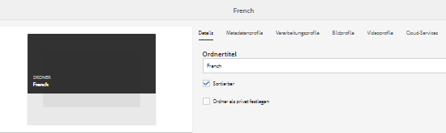
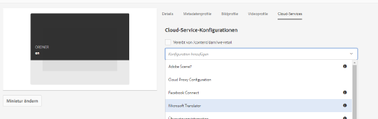
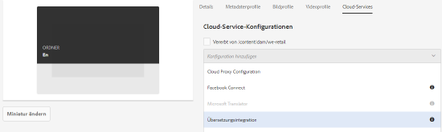
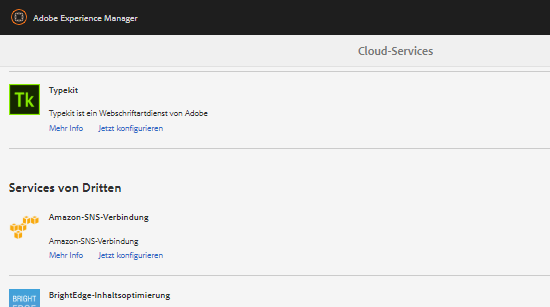
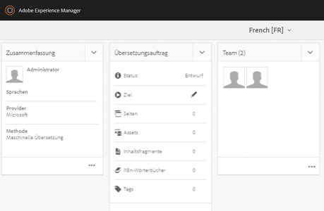

# Übersetzen von Assets in AEM {#multilingual-assets}

| Version | Artikel-Link |
| -------- | ---------------------------- |
| AEM 6.5 | [Hier klicken](https://experienceleague.adobe.com/docs/experience-manager-65/assets/using/multilingual-assets.html?lang=de) |
| AEM as a Cloud Service | Dieser Artikel |

Bei mehrsprachigen Assets handelt es sich um Assets mit Binärdateien, Metadaten und Tags in verschiedenen Sprachen. Im Allgemeinen liegen Binärdateien, Metadaten und Tags für Assets in einer Sprache vor, die dann für die Verwendung in mehrsprachigen Projekten in andere Sprachen übersetzt wird. Mit Adobe Experience Manager Assets können Sie Workflows für Assets automatisieren (einschließlich Binärdateien, Metadaten und Tags), um Assets in anderen Sprachen für die Verwendung in mehrsprachigen Projekten zu generieren.

Um die Übersetzung von AEM-Assets zu automatisieren, integrieren Sie Übersetzungsdienstleister in Experience Manager und erstellen Projekte für die Übersetzung von Assets in mehrere Sprachen. Experience Manager unterstützt Workflows für menschliche und maschinelle Übersetzungen.

Menschliche Asset-Übersetzung in AEM: Die übersetzten Assets werden zurückgegeben und in Experience Manager importiert. Wenn Ihr Übersetzungsanbieter mit Experience Manager integriert ist, werden die Assets automatisch zwischen Experience Manager und dem Übersetzungsanbieter übermittelt.

Maschinelle Asset-Übersetzung in AEM: Der Service für maschinelle Übersetzung übersetzt die Metadaten und Tags für Assets sofort.

<!--
We have multiple articles around translation of assets. For now, dumping all content in this article to remove others and create only ONE UBER article.

https://experienceleague.adobe.com/docs/experience-manager-65/assets/managing/translation-projects.html?lang=de
https://experienceleague.adobe.com/docs/experience-manager-65/assets/managing/preparing-assets-for-translation.html?lang=de
[Apply translation cloud services to folders](https://experienceleague.adobe.com/docs/experience-manager-65/assets/managing/transition-cloud-services.html?lang=de)

One of these articles is a copy of [Preparing Content for Translation](https://experienceleague.adobe.com/docs/experience-manager-65/administering/introduction/tc-prep.html?lang=de

-->

<!-- 
Translating assets includes the following:

1. [Connecting Experience Manager with the translation service provider](/help/sites-administering/tc-tic.md#connecting-to-a-translation-service-provider)
1. [Creating translation integration framework configurations](/help/sites-administering/tc-tic.md)
1. [Preparing assets for translation](prepare-assets-for-translation.md)
1. [Applying translation cloud services to folders](transition-cloud-services.md)
1. [Create translation projects](translation-projects.md)

If your translation service provider does not provide a connector to integrate with Experience Manager, use an [alternative process](/help/sites-administering/tc-manage.md#exporting-a-translation-job).

Also see, [Creating translation projects for content fragments](creating-translation-projects-for-content-fragments.md).

-->

## Vorbereitung der Übersetzung von Assets {#prepare-to-translate-assets}

Bei mehrsprachigen Assets handelt es sich um Assets mit Binärdateien, Metadaten und Tags in verschiedenen Sprachen. Im Allgemeinen liegen Binärdateien, Metadaten und Tags für Assets in einer Sprache vor, die dann für die Verwendung in mehrsprachigen Projekten in andere Sprachen übersetzt wird.

In Adobe Experience Manager Assets sind mehrsprachige Assets in Ordnern enthalten, wobei jeder Ordner die Assets in einer anderen Sprache enthält.

Jeder Sprachordner wird als Sprachkopie bezeichnet. Der Stammordner einer Sprachkopie, auch als Sprachstamm bezeichnet, identifiziert die Sprache des Inhalts in der Sprachkopie. Zum Beispiel ist `/content/dam/it` der Stamm der italienischen Sprache für die italienischsprachige Kopie. Sprachkopien müssen einen [korrekt konfigurierten Sprachstamm](#create-a-language-root) verwenden, damit die korrekte Sprache ausgewählt wird, wenn Übersetzungen von Quell-Assets durchgeführt werden.

Die Sprachkopie, für die Sie ursprünglich Assets hinzufügen, ist die primäre Sprachinstanz. Die primäre Sprachinstanz ist die Quelle, die in andere Sprachen übersetzt wird. Eine Beispielordnerhierarchie enthält mehrere Sprachstämme:

```shell
/content
    /- dam
        |- en
        |- fr
        |- de
        |- es
        |- it
        |- ja
        |- zh
```

Führen Sie die folgenden Schritte aus, um die Übersetzung von Assets vorzubereiten:

1. Erstellen Sie den Sprachstamm für Ihre primäre Sprachinstanz. Beispielsweise lautet der Sprachstamm der englischen Sprachkopie in der Beispielordnerhierarchie `/content/dam/en`. Stellen Sie sicher, dass der Sprachstamm entsprechend den Informationen unter [Erstellen eines Sprachstamms](#create-a-language-root) korrekt konfiguriert ist.

1. Fügen Sie Ihrer primären Sprachinstanz Assets hinzu.
1. Erstellen Sie den Sprachstamm der jeweiligen Zielsprache, für die Sie eine Sprachkopie benötigen.

### Erstellen eines Sprachstamms {#create-a-language-root}

Um den Sprachstamm zu erstellen, erstellen Sie einen Ordner und verwenden Sie einen ISO-Sprach-Code als Wert für die Name-Eigenschaft. Nachdem Sie den Sprachstamm erstellt haben, können Sie eine Sprachkopie auf jeder Ebene im Sprachstamm erstellen.

Beispielsweise verfügt die Stammseite der italienischsprachigen Kopie der Beispielhierarchie über `it` als Eigenschaft „Name“. Die Name-Eigenschaft wird als Name des Asset-Knotens im Repository verwendet und bestimmt daher den Pfad des Assets. (*&lt;Server>:&lt;Port>/assets.html/content/dam/it/*)

1. Wählen Sie in der Assets-Konsole **[!UICONTROL Erstellen]** und anschließend im Menü die Option **[!UICONTROL Ordner]** aus.
1. Geben Sie in das Namensfeld den Länder-Code im Format `<language-code>` ein.
1. Wählen Sie **[!UICONTROL Erstellen]** aus. Der Sprachstamm wird in der Assets-Konsole erstellt.

### Anzeigen von Sprachstämmen {#view-language-roots}

Die Touch-optimierte Benutzeroberfläche bietet einen Bereich „Verweise“, der eine Liste von Sprachstämmen anzeigt, die in [!DNL Assets] erstellt wurden.

1. Wählen Sie in der Assets-Konsole die primäre Sprachinstanz aus, für die Sie Sprachkopien erstellen möchten.
1. Wählen Sie das GlobalNav-Symbol und anschließend **[!UICONTROL Referenzen]** aus, um den Referenzbereich zu öffnen.
1. Wählen Sie im Bereich „Verweise“ **[!UICONTROL Sprachkopien]** aus. Der Bereich „Sprachkopien“ zeigt die Sprachkopien der Assets an.

### Erstellen eines neuen Übersetzungsprojekts {#create-a-new-translation-project}

Wenn Sie diese Option verwenden, werden die zu übersetzenden Assets in den Sprachstamm der Sprache kopiert, in die übersetzt werden soll. Je nach den von Ihnen gewählten Optionen wird ein Übersetzungsprojekt für die Assets in der Projektkonsole erstellt. Abhängig von den Einstellungen kann das Übersetzungsprojekt manuell gestartet oder automatisch ausgeführt werden, sobald das Übersetzungsprojekt erstellt wurde.

1. Wählen Sie in der Benutzeroberfläche der Assets den Ordner, für den Sie eine Sprachkopie erstellen möchten.
1. Öffnen Sie den Bereich **[!UICONTROL Verweise]** und wählen Sie unter **[!UICONTROL Kopien]** die Option **[!UICONTROL Sprachkopien]** aus.
1. Wählen Sie unten **[!UICONTROL Erstellen und Übersetzen]** aus.
1. Wählen Sie in der Liste **[!UICONTROL Zielsprachen]** die Sprache, für die Sie eine Ordnerstruktur erstellen möchten.
1. Wählen Sie aus der Liste **[!UICONTROL Projekt]** die Option **[!UICONTROL Neues Übersetzungsprojekt erstellen]**.
1. Geben Sie im Feld **[!UICONTROL Projekttitel]** einen Namen für das Projekt ein.
1. Wählen Sie **[!UICONTROL Erstellen]** aus. Assets aus dem Quellordner werden in die Zielordner für die Gebietsschemas kopiert, die Sie in Schritt 4 gewählt haben.
1. Um zum Ordner zu navigieren, wählen Sie die Sprachkopie und klicken Sie auf **[!UICONTROL In Assets einblenden]**.
1. Gehen Sie zur Projektekonsole. Der Übersetzungsordner wird in die Projektkonsole kopiert.
1. Öffnen Sie den Ordner, um das Übersetzungsprojekt anzuzeigen.
1. Wählen Sie das Projekt, um die Seite mit den Details zu öffnen.
1. Um den Status des Übersetzungsauftrags anzuzeigen, klicken Sie unten auf der Kachel **[!UICONTROL Übersetzungsauftrag]** auf das Auslassungszeichen. <!-- For more details around job statuses, see [Monitoring the Status of a Translation Job](/help/sites-administering/tc-manage.md#monitoring-the-status-of-a-translation-job). -->
1. Öffnen Sie in der Konsole „Assets“ die Seite mit den Eigenschaften für die einzelnen übersetzten Assets, um die übersetzten Metadaten anzuzeigen.

>[!NOTE]
>
>Diese Funktion ist sowohl für Assets als auch für Ordner verfügbar. Wenn ein Asset anstelle eines Ordners gewählt wurde, wird die gesamte Hierarchie der Ordner bis zum Sprachstamm kopiert, um eine Sprachkopie für das Asset zu erstellen.

### Hinzufügen zu einem vorhandenen Übersetzungsprojekt {#add-to-existing-translation-project}

Wenn Sie diese Option verwenden, wird der Übersetzungs-Workflow für Assets ausgeführt, die Sie dem Quellordner hinzufügen, nachdem Sie einen vorherigen Übersetzungs-Workflow ausgeführt haben. Nur die neu hinzugefügten Assets werden in den Zielordner kopiert, der zuvor übersetzte Assets enthält. In diesem Fall wird kein neues Übersetzungsprojekt erstellt.

1. Navigieren Sie in der Assets-Benutzeroberfläche zu dem Ordner, der nicht übersetzte Assets enthält.
1. Wählen Sie ein Asset, das Sie übersetzen möchten, und wechseln Sie zum Bereich **[!UICONTROL Verweise]**. Im Abschnitt **[!UICONTROL Sprachkopien]** wird die Anzahl der Übersetzungskopien angezeigt, die momentan verfügbar sind.
1. Wählen Sie **[!UICONTROL Sprachkopien]** unter **[!UICONTROL Kopien]** aus. Eine Liste der verfügbaren Übersetzungskopien wird angezeigt.
1. Wählen Sie unten **[!UICONTROL Erstellen und Übersetzen]** aus.
1. Wählen Sie in der Liste **[!UICONTROL Zielsprachen]** die Sprache, für die Sie eine Ordnerstruktur erstellen möchten.
1. Wählen Sie aus der Liste **[!UICONTROL Projekt]** die Option **[!UICONTROL Zu vorhandenem Übersetzungsprojekt hinzufügen]**, um den Übersetzungs-Workflow für den Ordner auszuführen.
   >[!NOTE]
   >
   >Wenn Sie die Option **[!UICONTROL Zu vorhandenem Übersetzungsprojekt hinzufügen]** wählen, wird Ihr Übersetzungsprojekt nur dann zu einem bereits vorhandenen Projekt hinzugefügt, wenn Ihre Projekteinstellungen genau mit den Einstellungen des bereits vorhandenen Projekts übereinstimmen. Andernfalls wird ein neues Projekt erstellt.
1. Wählen Sie aus der Liste **[!UICONTROL Vorhandenes Übersetzungsprojekt]** ein Projekt, dem das zu übersetzende Asset hinzugefügt werden soll.
1. Wählen Sie **[!UICONTROL Erstellen]** aus. Die zu übersetzenden Assets werden dem Zielordner hinzugefügt. Der aktualisierte Ordner wird unter **[!UICONTROL Sprachkopien]** aufgeführt.
1. Gehen Sie zur Projektkonsole und öffnen Sie das vorhandene Übersetzungsprojekt, dem Sie Assets hinzugefügt haben.
1. Wählen Sie das Übersetzungsprojekt, um die Seite mit den Projektdetails anzuzeigen.
1. Wählen Sie unten auf der Kachel **Übersetzungsauftrag** das Auslassungszeichen, um die Assets im Übersetzungs-Workflow anzuzeigen. In der Übersetzungsauftragsliste werden auch Einträge für Asset-Metadaten und -Tags aufgeführt. Diese Einträge geben an, dass die Metadaten und Tags für die Assets ebenfalls übersetzt werden.

   >[!NOTE]
   >
   >* Wenn Sie den Eintrag für Tags oder Metadaten löschen, werden keine Tags oder Metadaten für die Assets übersetzt.
   >* Wenn Sie maschinelle Übersetzung verwenden, werden Asset-Binärdateien nicht übersetzt.
   >* Wenn das Asset, das Sie zum Übersetzungsauftrag hinzufügen, Teil-Assets enthält, wählen Sie die Teil-Assets und entfernen Sie sie, damit die Übersetzung fehlerfrei fortgesetzt werden kann.

1. Um die Übersetzung der Assets zu starten, wählen Sie auf der Kachel **[!UICONTROL Übersetzungsauftrag]** den Pfeil und wählen Sie aus der Liste die Option **[!UICONTROL Starten]**. Eine Meldung informiert Sie darüber, dass mit der Ausführung des Übersetzungsauftrags begonnen wird.
1. Um den Status des Übersetzungsauftrags anzuzeigen, wählen Sie unten auf der Kachel **[!UICONTROL Übersetzungsauftrag]** die Auslassungspunkte aus. <!-- For more details, see [Monitoring the Status of a Translation Job](/help/sites-administering/tc-manage.md#monitoring-the-status-of-a-translation-job). -->
1. Nach Abschluss des Übersetzungsvorgangs ändert sich der Status in „Bereit für Überprüfung“. Navigieren Sie zur Assets-Benutzeroberfläche und öffnen Sie die Seite mit den Eigenschaften für die einzelnen übersetzten Assets, um die übersetzten Metadaten anzuzeigen.

### Aktualisieren von Sprachkopien {#update-language-copies}

Führen Sie diesen Workflow aus, um eine weitere Gruppe von Assets zu übersetzen und in eine Sprachkopie für ein bestimmtes Gebietsschema aufzunehmen. In diesem Fall werden die übersetzten Assets zu dem Zielordner hinzugefügt, der bereits zuvor übersetzte Assets enthält. Je nach Auswahl der Optionen wird ein Übersetzungsprojekt erstellt oder ein vorhandenes Übersetzungsprojekt für die neuen Assets aktualisiert. Der Workflow zum Aktualisieren der Sprachkopien umfasst die folgenden Optionen:

* Erstellen eines neuen Übersetzungsprojekts
* Hinzufügen zu einem vorhandenen Übersetzungsprojekt

### Hinzufügen zu einem vorhandenen Übersetzungsprojekt {#add-to-existing-translation-project-1}

Wenn Sie diese Option verwenden, wird die Gruppe der Assets zu einem vorhandenen Übersetzungsprojekt hinzugefügt, um die Sprachkopien für das von Ihnen gewählte Gebietsschema zu aktualisieren.

1. Wählen Sie in der Assets-Benutzeroberfläche den Quellordner, dem Sie einen Asset-Ordner hinzugefügt haben.
1. Öffnen Sie den Bereich **[!UICONTROL Verweise]** und wählen Sie unter **[!UICONTROL Kopien]** die Option **[!UICONTROL Sprachkopien]** aus, um die Liste der Sprachkopien anzuzeigen.
1. Aktivieren Sie das Kontrollkästchen **[!UICONTROL Sprachkopien]**, um alle Sprachkopien auszuwählen. Heben Sie die Auswahl anderer Kopien auf. Nur die Sprachkopien, die den gewünschten Gebietsschemata entsprechen, sollten ausgewählt bleiben.
1. Wählen Sie am unteren Rand **[!UICONTROL Sprachkopien aktualisieren]** aus.
1. Wählen Sie aus der Liste **[!UICONTROL Projekt]** die Option **[!UICONTROL Zu vorhandenem Übersetzungsprojekt hinzufügen]**.
1. Wählen Sie aus der Liste **[!UICONTROL Vorhandenes Übersetzungsprojekt]** ein Projekt, dem das zu übersetzende Asset hinzugefügt werden soll.
1. Wählen Sie **[!UICONTROL Starten]** aus.
1. Führen Sie Schritt 9 bis 14 des Verfahrens [Zu vorhandenem Übersetzungsprojekt hinzufügen](#add-to-existing-translation-project) aus, um den Vorgang abzuschließen.

### Erstellen temporärer Sprachkopien {#creating-temporary-language-copies}

Wenn Sie einen Übersetzungs-Workflow ausführen, um eine Sprachkopie mit bearbeiteten Versionen der ursprünglichen Assets zu aktualisieren, wird die vorhandene Sprachkopie beibehalten, bis Sie die übersetzten Assets genehmigen. [!DNL Assets] speichert die neu übersetzten Assets an einem temporären Speicherort und aktualisiert die vorhandene Sprachkopie, nachdem Sie die Assets ausdrücklich genehmigt haben. Wenn Sie die Assets ablehnen, bleibt die Sprachkopie unverändert.

1. Wählen Sie den Quellstammordner unter **[!UICONTROL Sprachkopien]** aus, für den Sie bereits eine Sprachkopie erstellt haben, und wählen Sie anschließend **[!UICONTROL In Assets einblenden]** aus, um den Ordner in [!DNL Assets] zu öffnen.
1. Wählen Sie in der Assets-Benutzeroberfläche ein bereits übersetztes Asset und anschließend in der Symbolleiste das Symbol **[!UICONTROL Bearbeiten]** aus, um das Asset im Bearbeitungsmodus zu öffnen.
1. Bearbeiten Sie das Asset und speichern Sie die Änderungen.
1. Führen Sie Schritt 2 bis 14 des Verfahrens [Zu vorhandenem Übersetzungsprojekt hinzufügen](#add-to-existing-translation-project) aus, um die Sprachkopie zu aktualisieren.
1. Wählen Sie unten auf der Kachel **[!UICONTROL Übersetzungsauftrag]** die Auslassungspunkte aus. Der Liste der Assets auf der Seite **[!UICONTROL Übersetzungsauftrag]** können Sie den temporären Speicherort der übersetzten Version des Assets entnehmen.
1. Aktivieren Sie das Kontrollkästchen neben **[!UICONTROL Titel]**.
1. Wählen Sie in der Symbolleiste **[!UICONTROL Übersetzung bestätigen]** und dann im Dialogfeld **[!UICONTROL Annehmen]** aus, um das übersetzte Asset im Zielordner mit der übersetzten Version des bearbeiteten Assets zu überschreiben.

   >[!NOTE]
   >
   >Damit der Übersetzungs-Workflow die Ziel-Assets aktualisieren kann, akzeptieren Sie sowohl das Asset als auch die Metadaten.

   Wählen Sie **[!UICONTROL Übersetzung ablehnen]** aus, wenn Sie die ursprünglich übersetzte Version des Assets im Zielgebietsschema-Stamm beibehalten und die bearbeitete Version ablehnen wollen.

1. Navigieren Sie zur Assets-Konsole und öffnen Sie für die einzelnen übersetzten Assets jeweils die Seite mit den Eigenschaften, um die übersetzten Metadaten anzuzeigen.

<!-- TBD: Possibly this blog was not migrated. Still try to find from the author. Old one is archived at https://web.archive.org/web/20180423042713/https://blogs.adobe.com/experiencedelivers/experience-management/translate_aemassets_metadata/

For tips on translating metadata for assets efficiently, see [5 Steps to efficiently translate metadata](https://blogs.adobe.com/experiencedelivers/experience-management/translate_aemassets_metadata/). 
-->

## Erstellen von Übersetzungsprojekten {#creating-translation-projects}

Lösen Sie zum Erstellen einer Sprachkopie einen der folgenden Sprachkopie-Workflows aus, die in der Assets-Benutzeroberfläche in der Leiste „Verweise“ verfügbar sind:

**Erstellen und übersetzen**

In diesem Workflow werden die zu übersetzenden Assets in den Sprachstamm der Sprache kopiert, in die sie übersetzt werden sollen. Darüber hinaus wird je nach den von Ihnen gewählten Optionen ein Übersetzungsprojekt für die Assets in der Projektkonsole erstellt. Abhängig von den Einstellungen kann das Übersetzungsprojekt manuell gestartet oder automatisch ausgeführt werden, sobald das Übersetzungsprojekt erstellt wurde.

**Aktualisieren von Sprachkopien**

Sie führen diesen Workflow aus, um eine zusätzliche Gruppe von Assets zu übersetzen und sie in eine Sprachkopie für ein bestimmtes Gebietsschema aufzunehmen. In diesem Fall werden die übersetzten Assets zu dem Zielordner hinzugefügt, der bereits zuvor übersetzte Assets enthält.

>[!NOTE]
>
>Asset-Binärdateien werden nur übersetzt, wenn der Übersetzungsdienstleister die Übersetzung von Binärdateien unterstützt.

>[!NOTE]
>
>Wenn Sie einen Übersetzungs-Workflow für komplexe Assets wie PDF- und Adobe InDesign-Dateien starten, werden ihre Teil-Assets oder Ausgabedarstellungen (sofern vorhanden) nicht zur Übersetzung übermittelt.

### Workflow für das Erstellen und Übersetzen {#create-and-translate-workflow}

Den Workflow für das Erstellen und Übersetzen verwenden Sie, um erstmals Sprachkopien für eine bestimmte Sprache zu erstellen. Der Workflow bietet die folgenden Optionen:

* Nur Struktur erstellen
* Erstellen eines neuen Übersetzungsprojekts
* Hinzufügen zu einem vorhandenen Übersetzungsprojekt

### Nur Struktur erstellen {#create-structure-only}

Verwenden Sie die Option **Nur Struktur erstellen**, um eine Zielordnerhierarchie im Zielsprachenstamm zu erstellen und die Hierarchie des Quellordners im Ausgangssprachenstamm widerzuspiegeln. In diesem Fall werden Quellelemente in den Zielordner kopiert. Es wird jedoch kein Übersetzungsprojekt generiert.

1. Wählen Sie in der Assets-Benutzeroberfläche den Ordner, für den Sie eine Struktur im Zielsprachenstamm erstellen möchten.
1. Öffnen Sie den Bereich **[!UICONTROL Verweise]** und wählen Sie unter **[!UICONTROL Kopien]** die Option **[!UICONTROL Sprachkopien]** aus.
1. Wählen Sie unten **[!UICONTROL Erstellen und Übersetzen]** aus.
1. Wählen Sie aus der Liste **[!UICONTROL Zielsprachen]** die Sprache, für die Sie eine Ordnerstruktur erstellen möchten.
1. Wählen Sie aus der Liste **[!UICONTROL Projekt]** die Option **[!UICONTROL Nur Struktur erstellen]**.
1. Wählen Sie **[!UICONTROL Erstellen]** aus. Die neue Struktur für die Zielsprache wird unter **[!UICONTROL Sprachkopien]** aufgeführt.
1. Wählen Sie die Struktur aus der Liste und dann **[!UICONTROL In Assets einblenden]** aus, um zur Ordnerstruktur in der Zielsprache zu navigieren.

## Anwenden von Übersetzungs-Cloud-Services auf Ordner {#applying-translation-cloud-services-to-folders}

Mit Adobe Experience Manager können Sie von Cloud-basierten Übersetzungs-Services von Ihrem bevorzugten Übersetzungsanbieter Gebrauch machen, um sicherzustellen, dass Ihre Assets basierend auf Ihren Anforderungen übersetzt werden.

Sie können den Übersetzungs-Cloud-Service direkt auf Ihren Asset-Ordner anwenden, sodass die Assets in den Übersetzungs-Workflows verwendet werden können.

### Anwenden von Übersetzungs-Services {#applying-the-translation-services}

Durch die direkte Anwendung der Übersetzungs-Cloud-Services auf Ihren Assets-Ordner entfällt die Notwendigkeit, Übersetzungs-Services zu konfigurieren, wenn Sie Übersetzungs-Workflows erstellen oder aktualisieren.

1. Wählen Sie in der Assets-Benutzeroberfläche den Ordner aus, auf den Sie die Übersetzungs-Services anwenden möchten.
1. Wählen Sie in der Symbolleiste das Symbol **[!UICONTROL Eigenschaften]** aus, um die Seite **[!UICONTROL Ordnereigenschaften]** anzuzeigen.

   

1. Navigieren Sie zur Registerkarte **[!UICONTROL Cloud-Services]**.
1. Wählen Sie aus der Liste „Cloud-Service-Konfigurationen“ den gewünschten Übersetzungsanbieter aus. Wenn Sie beispielsweise Übersetzungs-Services von Microsoft nutzen möchten, wählen Sie **[!UICONTROL Microsoft Translator]** aus.

   

1. Wählen Sie den Connector für den Übersetzungsanbieter aus.

   

1. Wählen Sie in der Symbolleiste **[!UICONTROL Speichern]** und anschließend **[!UICONTROL OK]** aus, um das Dialogfeld zu schließen. Der Übersetzungsdienst wird auf den Ordner angewendet.

### Anwenden eines benutzerdefinierten Übersetzungs-Connectors {#applying-custom-translation-connector}

Wenn Sie einen benutzerdefinierten Connector für die Übersetzungs-Services anwenden möchten, die in Übersetzungs-Workflows verwendet werden sollen. Um einen benutzerdefinierten Connector anzuwenden, installieren Sie zunächst den Connector über [Package Manager](/help/implementing/developing/tools/package-manager.md). Konfigurieren Sie dann den Connector über die Cloud Services Console. Nachdem Sie den Connector konfiguriert haben, ist er in der Liste der Connectoren auf der Registerkarte „Cloud Services“ verfügbar, wie unter [Anwenden der Übersetzungsservices](#applying-the-translation-services) beschrieben. Nachdem Sie den benutzerdefinierten Connector angewendet und Übersetzungsworkflows ausgeführt haben, werden in der Kachel **[!UICONTROL Übersetzungszusammenfassung]** des Übersetzungsprojekts die Details zum Connector unter den Überschriften **[!UICONTROL Anbieter]** und **[!UICONTROL Methode]** angezeigt.

1. Installieren Sie den Connector über [Package Manager](/help/implementing/developing/tools/package-manager.md).
1. Wählen Sie das Experience Manager-Logo aus und gehen Sie zu **[!UICONTROL Tools > Bereitstellung > Cloud Services]**.
1. Suchen Sie den installierten Connector unter **[!UICONTROL Services von Dritten]** auf der Seite **[!UICONTROL Cloud Services]**.

   

1. Wählen Sie den Link **[!UICONTROL Jetzt konfigurieren]** aus, um das Dialogfeld **[!UICONTROL Konfiguration erstellen]** zu öffnen.

   

1. Geben Sie einen Titel und einen Namen für die Verbindung ein und wählen Sie dann **[!UICONTROL Erstellen]** aus. Der benutzerdefinierte Connector ist in der Connector-Liste in der Registerkarte **[!UICONTROL Cloud Services]** verfügbar. Die Beschreibung hierzu finden Sie in Schritt 5 von [Anwenden der Übersetzungs-Services](#applying-the-translation-services).
1. Führen Sie einen beliebigen unter „Erstellen von Übersetzungsprojekten“ beschriebenen Übersetzungs-Workflow aus, wenn Sie den benutzerdefinierten Connector angewendet haben. Überprüfen Sie die Details des Connectors in der Kachel **[!UICONTROL Zusammenfassung der Übersetzung]** des Übersetzungsprojekts in der **[!UICONTROL Projektekonsole]**.

   

**Siehe auch**

* [Assets-HTTP-API](mac-api-assets.md)
* [Von AEM Assets unterstützte Dateiformate](file-format-support.md)
* [Suchen von Assets](search-assets.md)
* [Connected Assets](use-assets-across-connected-assets-instances.md)
* [Asset-Berichte](asset-reports.md)
* [Metadatenschemata](metadata-schemas.md)
* [Herunterladen von Assets](download-assets-from-aem.md)
* [Verwalten von Metadaten](manage-metadata.md)
* [Suchfacetten](search-facets.md)
* [Verwalten von Sammlungen](manage-collections.md)
* [Massenimport von Metadaten](metadata-import-export.md)
* [Veröffentlichen von Assets in AEM und Dynamic Media](/help/assets/publish-assets-to-aem-and-dm.md)
