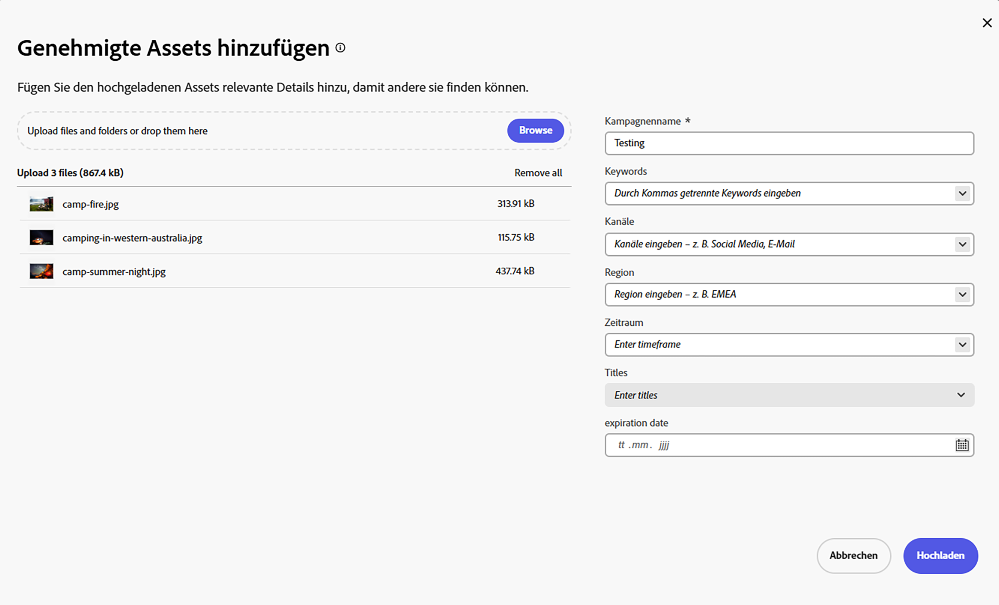

# Hochladen von markenkonformen Assets in Content Hub {#upload-brand-approved-assets-content-hub}

>[!CONTEXTUALHELP]
>id="upload_assets_content_hub"
>title="Hochladen von markenkonformen Assets in Content Hub"
>abstract="Fügen Sie genehmigte Assets entweder aus dem lokalen Dateisystem zu Content Hub hinzu oder importieren Sie Assets aus OneDrive- oder Dropbox-Datenquellen. Alle Assets werden unabhängig von der Ordnerstruktur auf der obersten Ebene in Content Hub angezeigt, um die Suchfunktionen zu verbessern."

[Content Hub-Benutzende mit Berechtigungen zum Hinzufügen von Assets](/help/assets/deploy-content-hub.md#onboard-content-hub-users-add-assets) können Assets zu Content Hub hinzufügen. Assets können aus dem lokalen Dateisystem hinzugefügt oder aus OneDrive- oder Dropbox-Datenquellen importiert werden. Alle Assets werden unabhängig von der Ordnerstruktur in Ihrem lokalen Dateisystem oder den OneDrive- und Dropbox-Datenquellen auf der obersten Ebene in Content Hub angezeigt, um die Suchfunktionen zu verbessern.

Die Assets, die in Assets as a Cloud Service als `Approved` markiert sind, sind automatisch in Content Hub verfügbar. Weitere Informationen finden Sie unter [Genehmigen von Assets für Content Hub](/help/assets/approve-assets-content-hub.md).

Zur weiteren Verbesserung der Asset-Suche bietet Content Hub folgende Möglichkeiten:

* Definieren Sie wichtige Details, die für den Asset-Upload relevant sind, wie Kampagnenname, Keywords und Kanäle.

* Generieren Sie bei erfolgreichen Uploads automatisch weitere Eigenschaften für jedes Asset, z. B. Dateigröße, Format, Auflösung und einige andere Eigenschaften.

* Verwenden Sie künstliche Intelligenz, die von [Adobe Sensei](https://www.adobe.com/de/sensei.html) bereitgestellt wird, um automatisch relevante Tags zu allen hochgeladenen Assets hinzuzufügen. Diese Tags, auch Smart-Tags genannt, erhöhen die Inhaltsgeschwindigkeit Ihrer Projekte, da Sie relevante Assets schnell finden können.

Stellen Sie sicher, dass Sie nur [markenkonforme Assets in Content Hub](/help/assets/approve-assets.md) hochladen.

## Voraussetzungen {#prerequisites-add-assets}

[Content Hub-Benutzende mit Berechtigungen zum Hinzufügen von Assets](/help/assets/deploy-content-hub.md#onboard-content-hub-users-add-assets) können Assets in Content Hub hochladen.

## Hinzufügen von Assets zu Content Hub aus dem lokalen Dateisystem {#add-assets-local-file-system}

Um Assets zu Content Hub hinzuzufügen, führen Sie die folgenden Schritte aus:

1. Klicken Sie auf **[!UICONTROL Assets hinzufügen]**, um das Dialogfeld **[!UICONTROL Genehmigte Assets hinzufügen]** anzuzeigen, mit dem Sie einen Upload erstellen können.

1. Im Abschnitt **[!UICONTROL Dateien oder Ordner hierher ziehen]** im rechten Bereich können Sie die Assets entweder aus dem lokalen Dateisystem ziehen oder auf **[!UICONTROL Durchsuchen]** klicken, um die im lokalen Dateisystem verfügbaren Dateien oder Ordner manuell auszuwählen. Diese Liste der Dateien, die Teil Ihres Uploads sind, ist als Liste verfügbar.

   Sie können auch mithilfe der Miniaturansichten eine Vorschau ausgewählter Bilder anzeigen und auf das X-Symbol klicken, um ein bestimmtes Bild aus der Liste zu entfernen. Das X-Symbol wird nur angezeigt, wenn Sie den Mauszeiger über den Bildnamen oder die Bildgröße bewegen. Sie können auch auf **[!UICONTROL Alle entfernen]** klicken, um alle Elemente aus Ihrer Upload-Liste zu löschen.

   Um das Hochladen abzuschließen und die **[!UICONTROL Schaltfläche „Hochladen“]** zu aktivieren, müssen Sie Ihre Assets unter einem Kampagnennamen gruppieren.

   

1. Definieren Sie den Namen für den Upload mithilfe des Felds **[!UICONTROL Kampagnenname]**. Sie können einen vorhandenen Namen verwenden oder einen neuen erstellen. Content Hub bietet weitere Optionen, wenn Sie den Namen eingeben. <!--You can define multiple Campaign names for your upload. While you are typing a name, either click anywhere else within the dialog box or press the `,` (Comma) key to register the name.-->

   Adobe empfiehlt als Best Practice, in den restlichen Feldern ebenfalls Werte anzugeben, da hierdurch ein verbessertes Sucherlebnis für Ihre hochgeladenen Assets geschaffen wird.

1. Definieren Sie auf ähnliche Weise Werte für die Felder **[!UICONTROL Keywords]**, **[!UICONTROL Kanäle]**, **[!UICONTROL Zeitraum]** und **[!UICONTROL Region]**. Durch das Tagging und Gruppieren von Assets nach Keywords, Kanälen und Speicherorten kann jede Person, die Ihre genehmigten Unternehmensinhalte verwendet, nach diesen Assets suchen und sie organisieren.

1. Klicken Sie auf **[!UICONTROL Hochladen]**, um Assets in Content Hub hochzuladen. Das Bestätigungsfeld [!UICONTROL Details überprüfen] wird angezeigt. Klicken Sie auf [!UICONTROL Weiter].

1. Der Asset-Upload wird gestartet. Klicken Sie auf [!UICONTROL Neuer Upload], um den Upload neu zu starten. Klicken Sie auf [!UICONTROL Fertig], um den Upload abzuschließen.

Admins können auch die obligatorischen und optionalen Felder konfigurieren, die beim Hochladen von Assets Hub angezeigt werden, z. B. Kampagnenname, Keywords oder Kanäle. Weitere Informationen finden Sie unter [Konfigurieren der Benutzeroberfläche von Content Hub](configure-content-hub-ui-options.md#configure-upload-options-content-hub).

## Verwalten von mit Content Hub hochgeladenen Assets {#manage-assets-uploaded-using-content-hub}

[Content Hub-Benutzende mit Berechtigungen zum Hinzufügen von Assets](/help/assets/deploy-content-hub.md#onboard-content-hub-users-add-assets) können [Assets zu Content Hub hinzufügen](/help/assets/upload-brand-approved-assets.md). Assets können aus dem lokalen Dateisystem hinzugefügt oder aus OneDrive- oder Dropbox-Datenquellen importiert werden. Alle Assets werden unabhängig von der Ordnerstruktur in Ihrem lokalen Dateisystem oder den OneDrive- und Dropbox-Datenquellen auf der obersten Ebene in Content Hub angezeigt, um die Suchfunktionen zu verbessern.

Ob die mit Content Hub hochgeladenen Assets angezeigt werden, hängt davon ab, ob Sie [den Umschalter für die automatische Genehmigung aktiviert haben](/help/assets/configure-content-hub-ui-options.md#configure-import-options-content-hub):

* Wenn der Umschalter **[!UICONTROL Automatische Genehmigung]** aktiviert ist, sind die Assets, die Sie mit Content Hub hochladen, automatisch verfügbar.

* Wenn der Umschalter **[!UICONTROL Automatische Genehmigung]** deaktiviert ist, werden die Assets, die Sie mit Content Hub hochladen, nicht automatisch angezeigt. Die Assets sind im Ordner `hydrated-assets` Ihrer Assets as a Cloud Service-Umgebung verfügbar. Navigieren Sie zu dem Ordner und ändern Sie die Status dieser Assets [gemeinsam](#bulk-approve-assets-content-hub) in `Approved`, damit diese Assets in Content Hub angezeigt werden.

