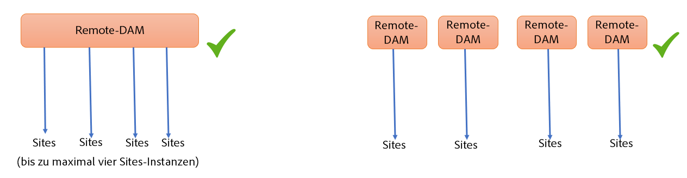
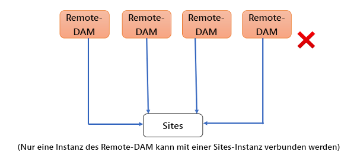
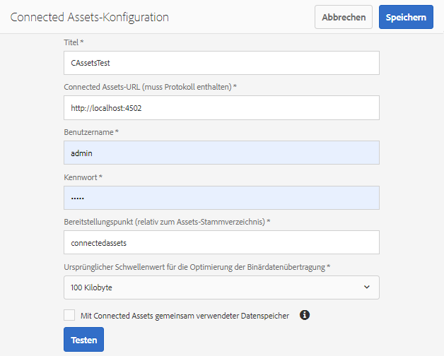
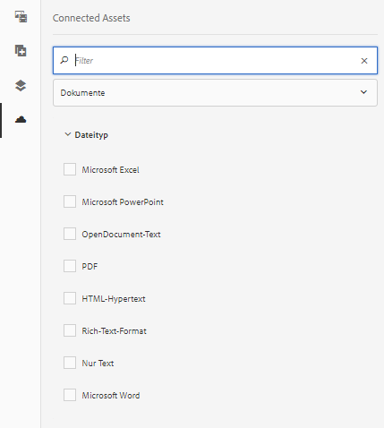
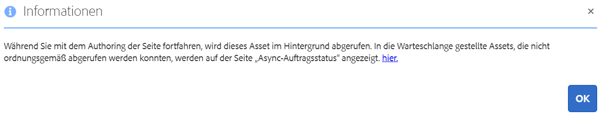
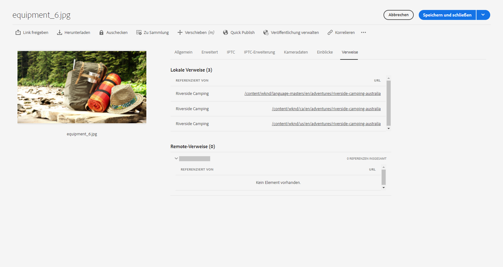
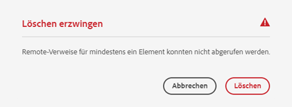
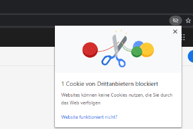
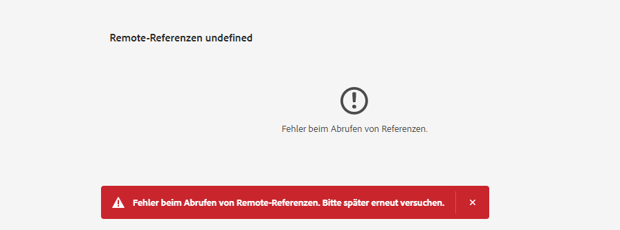

# Verwenden von Connected Assets zum Freigeben von DAM-Assets in [!DNL Experience Manager Sites] {#use-connected-assets-to-share-dam-assets-in-aem-sites}

| Version | Artikel-Link |
| -------- | ---------------------------- |
| AEM 6.5 | [Hier klicken](https://experienceleague.adobe.com/docs/experience-manager-65/assets/using/use-assets-across-connected-assets-instances.html?lang=de) |
| AEM as a Cloud Service | Dieser Artikel |

In großen Unternehmen ist die zur Erstellung von Websites erforderliche Infrastruktur möglicherwiese verteilt. Manchmal befinden sich die Funktionen und digitale Assets zum Erstellen von Web-Seiten in verschiedenen Bereitstellungen. Ein Grund können geografisch verteilte vorhandene Bereitstellungen sein, die zusammenarbeiten müssen. Ein weiterer Grund können Akquisitionen sein, die zu einer heterogenen Infrastruktur führen, einschließlich unterschiedlicher [!DNL Experience Manager]-Versionen, die die übergeordnete Firma gemeinsam nutzen möchte.

>[!NOTE]
>
>Adobe empfiehlt die Nutzung von Dynamic Media mit OpenAPI-Funktionen, um AEM Assets as a Cloud Service und AEM Sites zu verbinden. Siehe [Integrieren der Remote-Version von AEM Assets mit AEM Sites](/help/assets/integrate-remote-approved-assets-with-sites.md).

Die Funktion „Connected Assets“ unterstützt die oben genannten Anwendungsfälle durch die Integration von [!DNL Experience Manager Sites] und [!DNL Experience Manager Assets]. Anwender können Web-Seiten in [!DNL Sites] erstellen, die die digitalen Assets aus einer separaten [!DNL Assets]-Bereitstellung verwenden.

>[!NOTE]
>
>Konfigurieren Sie Connected Assets nur, wenn Sie die Assets verwenden müssen, die in einer Remote-DAM-Bereitstellung in einer separaten Sites-Bereitstellung für das Verfassen von Web-Seiten verfügbar sind.

## Überblick über Connected Assets {#overview-of-connected-assets}

Beim Bearbeiten von Seiten als Ziel im [!UICONTROL Seiteneditor] können die Autoren nahtlos Assets aus einer anderen [!DNL Assets]-Bereitstellung, die als Asset-Quelle dient, suchen, durchsuchen und einbetten. Die Administratoren erstellen eine einmalige Integration einer Bereitstellung von [!DNL Experience Manager] mit [!DNL Sites]-Funktion mit einer anderen Bereitstellung von [!DNL Experience Manager] mit [!DNL Assets]-Funktion. Sie können Dynamic Media-Bilder auch über Connected Assets auf den Web-Seiten Ihrer Site verwenden und die Dynamic Media-Funktionen wie intelligentes Zuschneiden und Bildvorgaben nutzen.

Für [!DNL Sites]-Autoren stehen die Remote-Assets als schreibgeschützte lokale Assets zur Verfügung. Die Funktion unterstützt die nahtlose Suche und den Zugriff auf Remote-Assets im Site-Editor. Für alle anderen Anwendungsfälle, bei denen das gesamte Korpus der Assets auf den Sites verfügbar sein muss, sollten Sie in Erwägung ziehen, die Assets in Massen zu migrieren, anstatt Connected Assets zu verwenden.

### Voraussetzungen und unterstützte Bereitstellungen {#prerequisites}

Bevor Sie diese Funktion verwenden oder konfigurieren, stellen Sie Folgendes sicher:

* Die Benutzer sind Teil von entsprechenden Benutzergruppen für jede Bereitstellung.
* Bei Bereitstellungstypen von [!DNL Adobe Experience Manager] ist eines der unterstützten Kriterien erfüllt. [!DNL Experience Manager] as a Cloud Service [!DNL Assets] funktioniert mit [!DNL Experience Manager] 6.5. Weitere Informationen dazu, wie diese Funktion in [!DNL Experience Manager] 6.5 funktioniert, finden Sie unter [Connected Assets in [!DNL Experience Manager] 6.5 [!DNL Assets]](https://experienceleague.adobe.com/docs/experience-manager-65/assets/using/use-assets-across-connected-assets-instances.html?lang=de).

  | | [!DNL Sites] as a [!DNL Cloud Service] | [!DNL Experience Manager] 6.5 [!DNL Sites] auf AMS | [!DNL Experience Manager] 6.5 [!DNL Sites] On-Premise |
  |---|---|---|---|
  | **[!DNL Experience Manager Assets]as a[!DNL Cloud Service]** | Unterstützt | Unterstützt | Unterstützt |
  | **[!DNL Experience Manager]6.5 [!DNL Assets] auf AMS** | Unterstützt | Unterstützt | Unterstützt |
  | **[!DNL Experience Manager]6.5 [!DNL Assets] On-Premise** | Nicht unterstützt | Nicht unterstützt | Nicht unterstützt |

### Unterstützte Dateiformate {#mimetypes}

Autoren können im Content Finder nach Bildern und den folgenden Dokumenttypen suchen und die gesuchten Assets in den Seiteneditor ziehen. Dokumente werden der Komponente `Download` und Bilder der Komponente `Image` hinzugefügt. Autoren können die Remote-Assets auch zu jeder benutzerdefinierten [!DNL Experience Manager]-Komponente hinzufügen, die die standardmäßigen `Download`- oder `Image`-Komponenten erweitert. Folgende Formate werden unterstützt:

* **Bildformate**: Die Formate, die von der [Bildkomponente](file-format-support.md#image-formats) unterstützt werden.
* **Dokumentenformate**: Siehe [Unterstützte Dokumentformate](file-format-support.md#document-formats).

### Beteiligte Anwender und Gruppen {#users-and-groups-involved}

Nachfolgend werden die verschiedenen Rollen, die an der Konfiguration beteiligt sind, sowie deren Fähigkeit und ihre entsprechenden Benutzergruppen beschrieben. Der lokale Umfang wird für den Anwendungsfall verwendet, in dem ein Autor eine Web-Seite erstellt. Der Remote-Umfang wird für die DAM-Bereitstellung verwendet, die die erforderlichen Assets hostet. Der [!DNL Sites]-Autor ruft diese Remote-Assets ab.

| Rolle | Anwendungsbereich | Benutzergruppe | Beschreibungen |
|------|--------|-----------|----------|
| [!DNL Sites]-Administrator | Lokal | [!DNL Experience Manager] `administrators` | Einrichten von [!DNL Experience Manager], Konfigurieren der Integration mit der Remote-[!DNL Assets]-Bereitstellung. |
| DAM-Benutzer | Lokal | `Authors` | Wird zum Anzeigen und Duplizieren der abgerufenen Assets unter `/content/DAM/connectedassets/` verwendet. |
| [!DNL Sites]-Autor | Lokal | <ul><li>`Authors` (mit Lesezugriff auf das Remote-DAM und Autorenzugriff auf lokale [!DNL Sites]) </li> <li>`dam-users` auf lokale [!DNL Sites]</li></ul> | Endbenutzer sind [!DNL Sites]-Autoren, die diese Integration für die Beschleunigung ihrer Inhalte verwenden. Autoren können mit der [!UICONTROL Content-Suche] Assets im Remote-DAM suchen und durchsuchen und die gewünschten Bilder in lokalen Web-Seiten verwenden. |
| [!DNL Assets]-Administrator | Remote | [!DNL Experience Manager] `administrators` | Cross-Origin Resource Sharing (CORS) konfigurieren. |
| DAM-Benutzer | Remote | `Authors` | Autorenrolle in der Remote-[!DNL Experience Manager]-Bereitstellung. Suchen und Durchsuchen von Assets in Connected Assets mit dem [!UICONTROL Content Finder]. |
| DAM-Distributor (technischer Benutzer) | Remote | <ul> <li> [!DNL Sites] `Authors`</li> <li> `connectedassets-assets-techaccts` </li> </ul> | Dieser Benutzer in der Remote-Bereitstellung wird vom lokalen [!DNL Experience Manager]-Server (nicht vom [!DNL Sites]-Autor) zum Abrufen der Remote-Assets im Auftrag des [!DNL Sites]-Autors verwendet. |
| Technischer[!DNL Sites]-Benutzer | Lokal | `connectedassets-sites-techaccts` | Ermöglicht die [!DNL Assets]-Bereitstellung, um nach Referenzen auf Assets in den [!DNL Sites]-Web-Seiten zu suchen. |

### Connected Assets-Architektur {#connected-assets-architecture}

Mit Experience Manager können Sie eine Remote-DAM-Bereitstellung als Quelle mit mehreren Experience Manager [!DNL Sites]-Bereitstellungen verbinden. Sie können jedoch eine [!DNL Sites]-Bereitstellung nur mit einer Remote-DAM-Bereitstellung verbinden.

Ermitteln Sie die optimale Anzahl von Sites-Instanzen für das Verbinden mit einer entfernten DAM-Bereitstellung. Adobe empfiehlt, Sites-Instanzen schrittweise in die Bereitstellung einzubinden und zu testen, dass es keine Auswirkungen auf die Leistung des Remote-DAM gibt, da jede verbundene Sites-Instanz zum Datenverkehr auf dem Remote-DAM beiträgt.

Die folgenden Diagramme veranschaulichen die unterstützten Szenarien:

Das folgende Diagramm zeigt ein nicht unterstütztes Szenario:

## Konfigurieren einer Verbindung zwischen [!DNL Sites]- und [!DNL Assets]-Bereitstellungen {#configure-a-connection-between-sites-and-assets-deployments}

Ein [!DNL Experience Manager]-Administrator kann diese Integration erstellen. Nach der Erstellung werden die erforderlichen Berechtigungen über Benutzergruppen festgelegt. Die Benutzergruppen werden für die [!DNL Sites]-Bereitstellung und die DAM-Bereitstellung definiert.

Gehen Sie wie folgt vor, um die Verbindung zwischen Connected Assets und lokalen [!DNL Sites] zu konfigurieren:

1. Rufen Sie eine vorhandene [!DNL Sites]-Bereitstellung auf. Diese [!DNL Sites]-Bereitstellung wird für das Erstellen von Web-Seiten verwendet, z. B. bei `https://<sites_server_fqdn>:[port]`. Da die Seitenerstellung bei der [!DNL Sites]-Bereitstellung erfolgt, bezeichnen wir die [!DNL Sites]-Bereitstellung aus Sicht der Seitenerstellung als lokal.

1. Rufen Sie eine vorhandene [!DNL Assets]-Bereitstellung auf. Diese [!DNL Assets]-Bereitstellung wird zur Verwaltung digitaler Assets verwendet, z. B. bei `https://[assets_servername]:port`.

1. Stellen Sie sicher, dass die Benutzer und Rollen im entsprechenden Bereich der [!DNL Sites]-Bereitstellung und in der [!DNL Assets]-Bereitstellung auf AMS vorhanden sind. Erstellen Sie einen technischen Benutzer in der [!DNL Assets]-Bereitstellung und fügen Sie ihn der in [Beteiligte Benutzer und Gruppen](/help/assets/use-assets-across-connected-assets-instances.md#users-and-groups-involved) erwähnten Benutzergruppe hinzu.

1. Greifen Sie auf die lokale [!DNL Sites]-Bereitstellung unter `https://[sites_servername]:port` zu. Klicken Sie auf **[!UICONTROL Tools]** > **[!UICONTROL Assets]** > **[!UICONTROL Connected Assets-Konfiguration]** und geben Sie die folgenden Werte ein:

   1. Einen **[!UICONTROL Titel]** der Konfiguration.
   1. Die **[!UICONTROL Remote-DAM-URL]** ist die URL des Speicherorts von [!DNL Assets] im Format `https://[assets_servername]:[port]`.
   1. Anmeldeinformationen eines DAM-Distributors (technischer Benutzer).
   1. Geben Sie im Feld **[!UICONTROL Bereitstellungspunkt]** den lokalen [!DNL Experience Manager]-Pfad ein, aus dem [!DNL Experience Manager] die Assets abruft. Beispielsweise den Ordner `connectedassets`. Die Assets, die von DAM abgerufen werden, werden in diesem Ordner der [!DNL Sites]-Bereitstellung gespeichert.
   1. Die **[!UICONTROL lokale Sites-URL]** ist der Speicherort der [!DNL Sites]-Bereitstellung. Bei der [!DNL Assets]-Bereitstellung wird dieser Wert verwendet, um Referenzen auf die digitalen Assets zu erhalten, die von dieser [!DNL Sites]-Bereitstellung abgerufen werden.
   1. Anmeldedaten des technischen [!DNL Sites]-Benutzers.
   1. Der Wert des Felds **[!UICONTROL Ursprünglicher Schwellenwert für die Optimierung der Binärdatenübertragung]** gibt an, ob die ursprünglichen Assets (einschließlich der Darstellungen) synchron übertragen werden. Assets mit kleinerer Dateigröße können problemlos abgerufen werden, während Assets mit relativ großer Dateigröße am besten asynchron synchronisiert werden. Der Wert hängt von Ihren Netzwerkfähigkeiten ab.
   1. Wählen Sie **[!UICONTROL Mit Connected Assets gemeinsam verwendete Datenspeicherung]** aus, wenn Sie zum Speichern Ihrer Assets eine Datenspeicherung verwenden und die Datenspeicherung der gemeinsam verwendete Speicher beider Bereitstellungen ist. In diesem Fall spielt die Schwellenwertbegrenzung keine Rolle, da sich die tatsächlichen Asset-Binärdateien im Datenspeicher befinden und nicht übertragen werden.

   

   *Abbildung: Eine typische Konfiguration für die Connected Assets-Funktionen.*

1. Die vorhandenen digitalen Assets bei [!DNL Assets]-Bereitstellung werden bereits verarbeitet und die Darstellungen werden generiert. Diese Ausgabedarstellungen werden mit dieser Funktion abgerufen, sodass keine erneute Generierung der Ausgabedarstellungen erforderlich ist. Deaktivieren Sie die Workflow-Starter, um die erneute Generierung von Darstellungen zu verhindern. Passen Sie die Konfigurationen der Starter in der ([!DNL Sites]-) Bereitstellung an, um den Ordner `connectedassets` auszuschließen (die Assets werden in diesem Ordner abgerufen).

   1. Klicken Sie in einer [!DNL Sites]-Bereitstellung auf **[!UICONTROL Tools]** > **[!UICONTROL Workflow]** > **[!UICONTROL Starter]**.

   1. Suchen Sie nach Startern mit Workflows wie **[!UICONTROL DAM-Update-Asset]** und **[!UICONTROL DAM-Metadaten-Writeback]**.

   1. Wählen Sie den Workflow-Starter aus und klicken Sie in der Aktionsleiste auf **[!UICONTROL Eigenschaften]**.

   1. Ändern Sie im [!UICONTROL Eigenschaften]-Assistenten die **[!UICONTROL Pfad]**-Felder in die folgenden Zuordnungen, um ihre regulären Ausdrücke zu aktualisieren und den Bereitstellungspunkt **[!UICONTROL connectedassets]** auszuschließen.

   | Vorher | Nachher |
   | ------ | ------------ |
   | `/content/dam(/((?!/subassets).)*/)renditions/original` | `/content/dam(/((?!/subassets)(?!connectedassets).)*/)renditions/original` |
   | `/content/dam(/.*/)renditions/original` | `/content/dam(/((?!connectedassets).)*/)renditions/original` |
   | `/content/dam(/.*)/jcr:content/metadata` | `/content/dam(/((?!connectedassets).)*/)jcr:content/metadata` |

   >[!NOTE]
   >
   >Wenn Autoren ein Asset abrufen, werden alle in der Remote-Bereitstellung verfügbaren Ausgabedarstellungen abgerufen. Überspringen Sie diesen Konfigurationsschritt, wenn Sie mehr Ausgabedarstellungen eines abgerufenen Assets erstellen möchten. Der Workflow [!UICONTROL DAM-Update-Asset] wird gestartet und es werden mehr Ausgabedarstellungen erstellt. Diese Ausgabedarstellungen sind nur für die lokale [!DNL Sites]-implementierung verfügbar und nicht für die Remote-DAM-Bereitstellung.

1. Fügen Sie die [!DNL Sites]-Bereitstellung als zulässigen Ursprung in der CORS-Konfiguration der [!DNL Assets]-Bereitstellung hinzu. Weitere Informationen finden Sie unter [Grundlegendes zu CORS](https://experienceleague.adobe.com/docs/experience-manager-learn/foundation/security/understand-cross-origin-resource-sharing.html?lang=de).

1. Konfigurieren Sie [Cookie-Unterstützung für dieselbe Website](/help/security/same-site-cookie-support.md).

Sie können die Verbindung zwischen konfigurierten [!DNL Sites]-Bereitstellungen und der [!DNL Assets]-Bereitstellung überprüfen.

![Verbindungstest für konfigurierte Connected Assets [!DNL Sites]](assets/connected-assets-multiple-config.png)
*Abbildung: Verbindungstest für konfigurierte Connected Assets [!DNL Sites].*

<!-- TBD: Check if Launchers are to be disabled on CS instances. Is this option even available to the users on CS? -->

## Verwenden von Dynamic Media-Assets {#dynamic-media-assets}

Mit Connected Assets können Sie Bild-Assets, die von [!DNL Dynamic Media] aus der DAM-Remote-Bereitstellung verarbeitet wurden, auf Sites-Seiten verwenden und Dynamic Media-Funktionen wie intelligentes Zuschneiden und Bildvorgaben nutzen.

Verwenden von [!DNL Dynamic Media] mit Connected Assets:

1. Konfigurieren Sie [!DNL Dynamic Media] auf einer Remote-DAM-Bereitstellung mit aktiviertem Synchronisierungsmodus.
1. Konfigurieren Sie [Connected Assets](#configure-a-connection-between-sites-and-assets-deployments).
1. Konfigurieren Sie [!DNL Dynamic Media] auf der Sites-Instanz mit demselben Firmennamen wie er auf dem Remote-DAM konfiguriert wurde. Die Sites-Bereitstellung muss über schreibgeschützten Zugriff auf das Dynamic Media-Konto verfügen, um mit Connected Assets arbeiten zu können. Stellen Sie daher sicher, dass Sie den Synchronisierungsmodus in der Dynamic Media-Konfiguration in der Sites-Instanz deaktivieren.

>[!CAUTION]
>
>Mit Connected Assets und der [!DNL Dynamic Media]-Konfiguration können Sie [!DNL Dynamic Media] nicht verwenden, um lokale Assets zu verarbeiten, die in der [!DNL Sites]-Bereitstellung verfügbar sind.

## Konfigurieren von [!DNL Dynamic Media] {#configure-dynamic-media}

So konfigurieren Sie [!DNL Dynamic Media] in [!DNL Assets]- und [!DNL Sites]-Bereitstellungen:

1. Erstellen Sie die Connected Assets-Konfiguration wie oben beschrieben. Wenn Sie die Funktion nicht konfigurieren, wählen Sie die Option **[!UICONTROL Original-Ausgabedarstellung für mit Dynamic Media verbundene Assets abrufen]** aus.

1. Konfigurieren Sie [!DNL Dynamic Media] in lokalen [!DNL Sites]- und Remote-[!DNL Assets]-Bereitstellungen. Befolgen Sie die Anweisungen zum [Konfigurieren [!DNL Dynamic Media]](/help/assets/dynamic-media/config-dm.md#configuring-dynamic-media-cloud-services).

   * Verwenden Sie in allen Konfigurationen denselben Unternehmensnamen.
   * Wählen Sie im lokalen [!DNL Sites] im [!UICONTROL Modus Dynamic Media-Synchronisation] **[!UICONTROL Standardmäßig deaktiviert]** aus. Die [!DNL Sites]-Bereitstellung benötigt lediglich Lesezugriff auf das [!DNL Dynamic Media]-Konto.
   * Wählen Sie im lokalen [!DNL Sites] in der Option **[!UICONTROL Assets veröffentlichen]** die Option **[!UICONTROL Selektive Veröffentlichung]** aus. Wählen Sie nicht **[!UICONTROL Alle Inhalte synchronisieren]** aus.
   * Wählen Sie in der Remote-Bereitstellung von [!DNL Assets] im [!UICONTROL Modus Dynamic Media-Synchronisation] die Option **[!UICONTROL Standardmäßig aktiviert]** aus.

1. Aktivieren Sie [[!DNL Dynamic Media] Unterstützung in der Bild-Kernkomponente](https://experienceleague.adobe.com/docs/experience-manager-core-components/using/components/image.html?lang=de#dynamic-media). Diese Funktion ermöglicht es der standardmäßigen [Bildkomponente](https://www.aemcomponents.dev/content/core-components-examples/library/core-content/image.html), [!DNL Dynamic Media]-Bilder anzuzeigen, wenn [!DNL Dynamic Media]-Bilder von Autoren auf Web-Seiten in einer lokalen [!DNL Sites]-Bereitstellung verwendet werden.

## Verwenden von Remote-Assets {#use-remote-assets}

Die Website-Autoren verwenden Content Finder zum Verbinden mit der DAM-Bereitstellung. Die Autoren können die Remote-Assets durchsuchen und in eine Komponente ziehen. Um sich beim Remote-DAM zu authentifizieren, halten Sie die von Ihrem Administrator bereitgestellten Anmelddaten (falls vorhanden) bereit.

Autoren können in lokalen und Remote-DAM-Bereitstellungen verfügbare Assets auf derselben Web-Seite nutzen. Verwenden Sie Content Finder, um zwischen der Suche im lokalen und im Remote-DAM zu wechseln.

Es werden nur die Tags von Remote-Assets abgerufen, die über ein exakt entsprechendes Tag – mit derselben Taxonomie-Hierarchie – verfügen, das in der lokalen [!DNL Sites]-Bereitstellung verfügbar ist. Alle anderen Tags werden verworfen. Autoren können mit allen Tags in der Remote-[!DNL Experience Manager]-Bereitstellung nach Remote-Assets suchen, da eine Volltextsuche verfügbar ist.

### Beispiel für die Verwendung {#walk-through-of-usage}

Verwenden Sie die oben beschriebenen Einstellungen, um die Funktionsweise der Funktionen im Authoring-Erlebnis zu überprüfen. Verwenden Sie Dokumente oder Bilder Ihrer Wahl in der Remote-DAM-Bereitstellung.

1. Navigieren Sie zur [!DNL Assets]-Benutzeroberfläche in der Remote-Bereitstellung, indem Sie im [!DNL Experience Manager]-Arbeitsbereich auf **[!UICONTROL Assets]** > **[!UICONTROL Dateien]** zugreifen. Sie können `https://[assets_servername_ams]:[port]/assets.html/content/dam` auch in einem Browser aufrufen. Laden Sie die Assets Ihrer Wahl hoch.

1. Klicken Sie in der [!DNL Sites]-Bereitstellung in der Profilaktivierung oben rechts auf **[!UICONTROL Identität annehmen als]**. Geben Sie den Benutzernamen ein, wählen Sie die bereitgestellte Option und klicken Sie auf **[!UICONTROL OK]**.

1. Öffnen Sie eine [!DNL Sites]-Seite und bearbeiten Sie die Seite.

   Klicken Sie oben links auf der Seite auf **[!UICONTROL Seitliches Bedienfeld ein/aus]**.

1. Öffnen Sie die Registerkarte [!UICONTROL Assets] (Remote Content Finder) und klicken Sie auf **[!UICONTROL Bei Connected Assets anmelden]**.

1. Geben Sie die Anmeldedaten für die Anmeldung bei Connected Assets an. Der Benutzer hat Autorenberechtigungen für beide [!DNL Experience Manager]-Bereitstellungen.

1. Suchen Sie nach dem Asset, das Sie dem DAM hinzugefügt haben. Die Remote-Assets werden im linken Bereich angezeigt. Filtern Sie nach Bildern oder Dokumenten und weiter nach unterstützten Dokumenttypen. Ziehen Sie die Bilder auf eine `Image`-Komponente und die Dokumente auf eine `Download`-Komponente.

   Die abgerufenen Assets sind in der lokalen [!DNL Sites]-Bereitstellung schreibgeschützt. Sie können weiterhin die Optionen verwenden, die Ihre [!DNL Sites]-Komponenten bereitstellen, um das abgerufene Asset zu bearbeiten. Die Bearbeitung durch Komponenten erfolgt zerstörungsfrei.

   

   *Abbildung: Optionen zum Filtern von Dokumenttypen und Bildern bei der Suche nach Assets auf Remote-DAM.*

1. Ein Site-Autor wird benachrichtigt, wenn ein Asset asynchron abgerufen wird und wenn eine Abrufaufgabe fehlschlägt. Beim oder auch nach dem Authoring können die Autoren detaillierte Informationen zu Abrufaufgaben und -fehlern in der Benutzeroberfläche für [asynchrone Aufträge](/help/operations/asynchronous-jobs.md) anzeigen.

   

   *Abbildung: Benachrichtigung zum asynchronen Abrufen von Assets, die im Hintergrund ausgeführt werden.*

1. Beim Veröffentlichen einer Seite zeigt [!DNL Experience Manager] eine vollständige Liste der auf der Seite verwendeten Assets an. Stellen Sie sicher, dass die Remote-Assets zum Zeitpunkt der Veröffentlichung erfolgreich abgerufen wurden. Informationen zum Überprüfen des Status der einzelnen abgerufenen Assets finden Sie in der Benutzeroberfläche für [asynchrone Aufträge](/help/operations/asynchronous-jobs.md).

   >[!NOTE]
   >
   >Auch wenn ein oder mehrere Remote-Assets nicht vollständig abgerufen wurden, wird die Seite veröffentlicht. Im [!DNL Experience Manager]-Benachrichtigungsbereich werden Benachrichtigungen zu Fehlern angezeigt, die auf der Seite für asynchrone Aufträge angezeigt werden.

>[!CAUTION]
>
>Nach der Verwendung auf einer Web-Seite können die abgerufenen Remote-Assets von jedem durchsucht und verwendet werden, der über die Berechtigung zum Zugriff auf den lokalen Ordner verfügt. Die abgerufenen Assets werden im lokalen Ordner gespeichert (`connectedassets` in der obigen Anleitung). Die Assets sind außerdem über [!UICONTROL Content Finder] durchsuchbar und im lokalen Repository sichtbar.

Die abgerufenen Assets können wie jedes andere lokale Element verwendet werden. Nur die zugehörigen Metadaten können nicht bearbeitet werden.

### Überprüfen der Verwendung eines Assets auf mehreren Web-Seiten {#asset-usage-references}

[!DNL Experience Manager] ermöglicht es DAM-Benutzern, alle Referenzen auf ein Asset zu überprüfen. Damit wird es leichter, die Verwendung eines Assets in Remote-[!DNL Sites]- und in zusammengesetzten Assets zu verstehen und zu verwalten. Bei der Bereitstellung von [!DNL Experience Manager Sites] können viele Autoren von Web-Seiten ein Asset von einem Remote-DAM in verschiedenen Web-Seiten verwenden. Um die Verwaltung von Assets zu vereinfachen und nicht zu fehlerhaften Referenzen zu führen, ist es für die DAM-Benutzer wichtig, die Verwendung eines Assets auf lokalen und Remote-Web-Seiten zu überprüfen. Auf der Registerkarte [!UICONTROL Referenzen] auf der Seite [!UICONTROL Eigenschaften] des Assets werden lokale und Remote-Referenzen des Assets aufgeführt.

Gehen Sie wie folgt vor, um Referenzen auf die [!DNL Assets]-Bereitstellung anzuzeigen und zu verwalten:

1. Wählen Sie ein Asset in der [!DNL Assets]-Konsole aus und klicken Sie in der Symbolleiste auf **[!UICONTROL Eigenschaften]**.
1. Klicken Sie auf die Registerkarte **[!UICONTROL Referenzen]**. Unter **[!UICONTROL Lokale Referenzen]** finden Sie weitere Informationen zur Verwendung des Assets in der [!DNL Assets]-Bereitstellung. Siehe [!UICONTROL Remote-Referenzen] für die Verwendung des Assets bei der [!DNL Sites]-Bereitstellung, bei der das Asset mithilfe der Funktionen für Connected Assets abgerufen wurde.

   

1. Die Referenzen für [!DNL Sites]-Seiten zeigen die Gesamtzahl der Referenzen für jede lokale [!DNL Sites] an. Es kann einige Zeit dauern, bis alle Referenzen gefunden und die Gesamtzahl der Referenzen angezeigt werden.
1. Die Liste der Verweise ist interaktiv, und DAM-Benutzende können auf einen Verweis klicken, um die verweisende Seite zu öffnen. Wenn Remote-Referenzen aus irgendeinem Grund nicht abgerufen werden können, wird eine Benachrichtigung angezeigt, die den Benutzer über den Fehler informiert.
1. Benutzer können das Asset verschieben oder löschen. Beim Verschieben oder Löschen eines Assets wird die Gesamtzahl der Referenzen aller ausgewählten Assets/Ordner in einem Warndialogfeld angezeigt. Beim Löschen eines Assets, für das die Referenzen noch nicht abgerufen wurden, wird ein Warndialogfeld angezeigt.

   

### Verwalten von Aktualisierungen von Assets im Remote-DAM {#handling-updates-to-remote-assets}

Nach dem [Konfigurieren einer Verbindung](#configure-a-connection-between-sites-and-assets-deployments) zwischen Remote-DAM- und Sites-Bereitstellungen werden die Assets auf Remote-DAM in der Sites-Implementierung verfügbar gemacht. Anschließend können Sie Vorgänge zum Aktualisieren, Löschen, Umbenennen und Verschieben von Remote-DAM-Assets oder -Ordnern durchführen. Die Aktualisierungen stehen mit etwas Verzögerung automatisch in der Sites-Bereitstellung zur Verfügung. Wenn ein Asset auf dem Remote-DAM auf einer lokalen Experience Manager Sites-Seite verwendet wird, werden außerdem die Aktualisierungen des Assets auf Remote-DAM auf der Sites-Seite angezeigt.

Stellen Sie beim Verschieben eines Assets von einem Speicherort an einen anderen sicher, dass Sie [Verweise anpassen](manage-digital-assets.md), sodass das Asset auf der Sites-Seite angezeigt wird. Wenn Sie ein Asset an einen Speicherort verschieben, auf den nicht über die lokale Sites-Bereitstellung zugegriffen werden kann, wird das Asset nicht in der Sites-Bereitstellung angezeigt.

Sie können auch die Metadateneigenschaften für ein Asset auf dem Remote-DAM aktualisieren. Die Änderungen sind dann in der lokalen Sites-Bereitstellung verfügbar.

Sites-Autoren können eine Vorschau der verfügbaren Aktualisierungen in der Sites-Bereitstellung anzeigen und dann die Änderungen erneut veröffentlichen, um sie in der Adobe Experience Manager-Veröffentlichungsinstanz verfügbar zu machen.

Experience Manager zeigt die Statusanzeige `expired` für Assets in Remote Assets Content Finder an, um Autoren der Site daran zu hindern, das Asset auf einer Sites-Seite zu verwenden. Wenn Sie ein Asset mit dem Status `expired` auf einer Sites-Seite verwenden, kann das Asset nicht in der Experience Manager-Veröffentlichungsinstanz angezeigt werden.

## Häufig gestellte Fragen {#frequently-asked-questions}

+++**Sollten Sie Connected Assets konfigurieren, wenn Sie Assets verwenden müssen, die in Ihrer [!DNL Sites]-Bereitstellung verfügbar sind?**

In diesem Fall müssen keine Connected Assets konfiguriert werden. Sie können Assets verwenden, die in der [!DNL Sites]-Bereitstellung verfügbar sind.

+++

+++**Wann muss man die Funktion „Connected Assets“ konfigurieren?**

Konfigurieren Sie die Funktion „Connected Assets“ nur, wenn Sie die in einer Remote-DAM-Bereitstellung verfügbaren Assets in einer [!DNL Sites]-Bereitstellung verwenden müssen.

+++

+++**Kann man nach der Konfiguration von Connected Assets mehrere [!DNL Sites]-Bereitstellungen mit einer Remote-DAM-Bereitstellung verbinden?**

Ja, Sie können mehrere [!DNL Sites]-Bereitstellungen mit einer Remote-DAM-Bereitstellung verbinden, nachdem Sie Connected Assets konfiguriert haben. Weitere Informationen finden Sie unter [Connected Assets-Architektur](#connected-assets-architecture).

+++

+++**Wie viele Remote-DAM-Bereitstellungen kann man nach der Konfiguration von Connected Assets mit einer [!DNL Sites]-Bereitstellung verbinden?**

Sie können nach der Konfiguration von Connected Assets eine Remote-DAM-Bereitstellung mit einer [!DNL Sites]-Bereitstellung verbinden. Weitere Informationen finden Sie unter [Connected Assets-Architektur](#connected-assets-architecture).

+++

+++**Kann man nach der Konfiguration von Connected Assets Dynamic Media Assets aus der [!DNL Sites]-Bereitstellung verwenden?**

Nach der Konfiguration von Connected Assets sind [!DNL Dynamic Media]-Assets in einer [!DNL Sites]-Bereitstellung in einem schreibgeschützten Modus verfügbar. Folglich können Sie mit [!DNL Dynamic Media] keine Assets in der [!DNL Sites]-Bereitstellung bearbeiten. Weitere Informationen finden Sie unter [Konfigurieren einer Verbindung zwischen Sites- und Dynamic Media-Bereitstellungen](#dynamic-media-assets).

+++

+++**Kann man nach der Konfiguration von Connected Assets der Formattypen „Bild“ und „Dokument“ aus der Remote-DAM-Bereitstellung in der [!DNL Sites]-Bereitstellung verwenden?**

Ja, Sie können nach der Konfiguration von Connected Assets der Typen „Bild“ und „Dokument“ aus der Remote-DAM-Bereitstellung in der [!DNL Sites]-Bereitstellung verwenden.

+++

+++**Kann man nach der Konfiguration von Connected Assets Inhaltsfragmente und Video-Assets aus der Remote-DAM-Bereitstellung in der [!DNL Sites]-Bereitstellung verwenden?**

Nein, Sie können nach der Konfiguration von Connected Assets keine Inhaltsfragmente und Video-Assets aus der Remote-DAM-Bereitstellung in der [!DNL Sites]-Bereitstellung verwenden.

+++

+++**Kann man nach der Konfiguration von Connected Assets Dynamic Media-Assets aus der Remote-DAM-Bereitstellung in der [!DNL Sites]-Bereitstellung verwenden?**

Ja, Sie können nach der Konfiguration von Connected Assets Dynamic Media-Image-Assets aus der Remote-DAM-Bereitstellung in der [!DNL Sites]-Bereitstellung konfigurieren und verwenden. Weitere Informationen finden Sie unter [Konfigurieren einer Verbindung zwischen Sites- und Dynamic Media-Bereitstellungen](#dynamic-media-assets).

+++

+++**Kann man nach der Konfiguration von Connected Assets Aktualisierungs-, Lösch-, Umbenennungs- und Verschiebungsvorgänge an den Remote-DAM-Assets oder -Ordnern durchführen?**

Ja, nach der Konfiguration von Connected Assets können Sie Vorgänge zum Aktualisieren, Löschen, Umbenennen und Verschieben von Remote-DAM-Assets oder -Ordnern durchführen. Die Aktualisierungen stehen mit etwas Verzögerung automatisch in der Sites-Bereitstellung zur Verfügung. Weitere Informationen finden Sie unter [Verwalten von Aktualisierungen von Assets im Remote-DAM](#handling-updates-to-remote-assets).

+++

+++**Kann man nach der Konfiguration von Connected Assets in der eigenen [!DNL Sites]-Bereitstellung hinzufügen oder ändern und sie in einer Remote-DAM-Bereitstellung verfügbar machen?**

Sie können der [!DNL Sites]-Bereitstellung Assets hinzufügen, diese Assets können jedoch nicht für die Remote-DAM-Bereitstellung verfügbar gemacht werden.

+++

## Einschränkungen und Best Practices {#tip-and-limitations}

* Um Erkenntnisse zur Asset-Nutzung zu erhalten, konfigurieren Sie die Funktion [Assets Insights](/help/assets/assets-insights.md) in der [!DNL Sites]-Instanz.
* Die Verwendung des Pfad-Browsers beim Verfassen von Komponenten wird in verbundenen Assets nicht unterstützt.

* Sie können das Remote-Asset nicht in das [Dialogfeld „Konfiguration der Bildkomponente“](https://experienceleague.adobe.com/docs/experience-manager-core-components/using/wcm-components/image.html?lang=de#configure-dialog) ziehen. Sie können jedoch das Remote-Asset direkt auf die Bildkomponente auf der Sites-Seite ziehen, ohne auf **[!UICONTROL Konfigurieren]** zu klicken.

### Berechtigungen und Asset-Management {#permissions-and-managing-assets}

* Lokale Assets sind schreibgeschützte Kopien. [!DNL Experience Manager]-Komponenten nehmen zerstörungsfreie Änderungen an Assets vor. Sonstige Änderungen sind nicht zulässig.
* Lokal abgerufene Assets sind nur für Autoren verfügbar. Asset-Update-Workflows können nicht angewendet werden und Metadaten können nicht bearbeitet werden.
* Bei Verwendung von [!DNL Dynamic Media] auf [!DNL Sites]-Seiten wird das Original-Asset nicht abgerufen und in der lokalen Bereitstellung gespeichert. Der Knoten `dam:Asset`, die Metadaten und Ausgabeformate, die von der [!DNL Assets]-Bereitstellung generiert werden, werden alle in der [!DNL Sites]-Bereitstellung abgerufen.
* Es werden nur Bilder und die aufgelisteten Dokumentenformate unterstützt. [!DNL Content Fragments] und [!DNL Experience Fragments] werden nicht unterstützt.
* [!DNL Experience Manager] ruft die Metadatenschemata nicht ab. Das bedeutet, dass möglicherweise nicht alle abgerufenen Metadaten angezeigt werden. Wenn die Schemata bei der [!DNL Sites]-Bereitstellung separat aktualisiert werden, werden alle Metadateneigenschaften angezeigt.
* Alle [!DNL Sites]-Autoren erhalten Leseberechtigungen für die abgerufenen Kopien, auch wenn sie keine Zugriffsberechtigungen für die Remote-DAM-Bereitstellung haben.
* Keine API-Unterstützung, um die Integration anzupassen.
* Die Funktion unterstützt die nahtlose Suche und Verwendung von Remote-Assets. Wenn Sie viele Remote-Assets auf einmal für die lokale Bereitstellung verfügbar machen möchten, sollten Sie die Assets migrieren.
* Es ist nicht möglich, ein Remote-Asset als Miniatur in der Benutzeroberfläche der [!UICONTROL Seiteneigenschaften] zu verwenden. Sie können eine Miniatur einer Web-Seite in der Benutzeroberfläche [!UICONTROL Seiteneigenschaften] von [!UICONTROL Miniatur] aus festlegen, indem Sie auf [!UICONTROL Bild auswählen] klicken.

### Einrichten und Lizenzieren {#setup-licensing}

* Die [!DNL Assets]-Bereitstellung auf [!DNL Adobe Managed Services] wird unterstützt.
* [!DNL Sites] kann jeweils nur eine Verbindung zu einer [!DNL Assets]-Bereitstellung herstellen.
* Eine Lizenz für [!DNL Assets], die als Remote-Repository dient, ist erforderlich.
* Eine oder mehrere Lizenzen für [!DNL Sites], die als lokale Autorenbereitstellung dienen, sind erforderlich.

### Nutzung {#usage}

* Benutzer können bei der Inhaltserstellung nach Remote-Assets suchen und diese auf die lokale Seite ziehen. Es werden keine anderen Funktionen unterstützt.
* Nach 5 Sekunden tritt bei Abrufvorgängen ein Timeout auf. Autoren können beispielsweise bei Netzwerkproblemen Probleme beim Abrufen von Assets haben. Autoren können es erneut versuchen, indem sie das Remote-Asset aus [!UICONTROL Content Finder] in den [!UICONTROL Seiteneditor] ziehen.
* An abgerufenen Assets können einfache, zerstörungsfreie Änderungen sowie Änderungen, die von der `Image`-Komponente unterstützt werden, vorgenommen werden. Assets sind schreibgeschützt.
* Die einzige Methode zum erneuten Abrufen des Assets besteht darin, es auf eine Seite zu ziehen. Es gibt keine API-Unterstützung oder andere Methoden zum erneuten Abrufen eines Assets, um es zu aktualisieren.
* Wenn Assets aus dem DAM eingestellt werden, werden sie weiterhin auf [!DNL Sites]-Seiten verwendet.
* Die Remote-Referenzeinträge eines Assets werden asynchron abgerufen. Die Referenzen und die Gesamtanzahl stehen nicht in Echtzeit zur Verfügung und es kann zu Unterschieden kommen, wenn ein [!DNL Sites]-Autor das Asset verwendet, während ein DAM-Benutzer die Referenz anzeigt. DAM-Benutzer können die Seite aktualisieren und in einigen Minuten erneut versuchen, die Gesamtanzahl abzurufen.

## Fehlerbehebung bei Problemen {#troubleshoot}

Führen Sie die folgenden Schritte aus, um häufig auftretende Fehler zu beheben:

* Wenn Sie im [!UICONTROL Content Finder] nicht nach Remote-Assets suchen können, überprüfen Sie erneut, ob die erforderlichen Rollen und Berechtigungen eingerichtet sind.

* Ein aus dem Remote-DAM abgerufenes Asset kann aus verschiedenen Gründen nicht auf einer Web-Seite veröffentlicht werden. Es existiert nicht auf dem Remote-Server, es fehlen entsprechende Berechtigungen zum Abrufen oder es liegt ein Netzwerkfehler vor. Stellen Sie sicher, dass das Asset nicht aus dem Remote-DAM entfernt wird. Stellen Sie sicher, dass die entsprechenden Berechtigungen eingerichtet und die Voraussetzungen erfüllt sind. Wiederholen Sie den Vorgang zum Hinzufügen des Assets zur Seite und veröffentlichen Sie erneut. Überprüfen Sie die [Liste asynchroner Aufträge](/help/operations/asynchronous-jobs.md) auf Fehler beim Abrufen von Assets.

* Wenn Sie über die lokale [!DNL Sites]-Implementierung nicht auf die Remote-DAM-Bereitstellung zugreifen können, stellen Sie sicher, dass Website-übergreifende Cookies zulässig sind und [Cookie-Unterstützung für dieselbe Website](/help/security/same-site-cookie-support.md) konfiguriert ist. Wenn Website-übergreifende Cookies blockiert werden, werden die Bereitstellungen von [!DNL Experience Manager] möglicherweise nicht authentifiziert. Beispielsweise kann [!DNL Google Chrome] im Inkognito-Modus Cookies von Drittanbietern blockieren. Um Cookies im [!DNL Chrome]-Browser zuzulassen, klicken Sie auf das Augensymbol in der Adressleiste, gehen Sie zu **Site funktioniert nicht** > **Blockiert**, wählen Sie die Remote-DAM-URL aus und lassen Sie das Anmelde-Token-Cookie zu. Alternativ finden Sie Informationen hierzu in [Aktivieren von Cookies von Drittanbietern](https://support.google.com/chrome/answer/95647).

  

* Wenn keine Remote-Referenzen abgerufen werden und eine Fehlermeldung angezeigt wird, überprüfen Sie, ob die [!DNL Sites]-Bereitstellung verfügbar ist und ob es Probleme mit der Netzwerkverbindung gibt. Versuchen Sie es später erneut. Bei der [!DNL Assets]-Bereitstellung wird zweimal versucht, eine Verbindung zur [!DNL Sites]-Bereitstellung herzustellen. Anschließend wird ein Fehler ausgegeben.

  

**Siehe auch**

* [Assets übersetzen](translate-assets.md)
* [Assets-HTTP-API](mac-api-assets.md)
* [Von AEM Assets unterstützte Dateiformate](file-format-support.md)
* [Assets durchsuchen](search-assets.md)
* [Asset-Berichte](asset-reports.md)
* [Metadatenschemata](metadata-schemas.md)
* [Herunterladen von Assets](download-assets-from-aem.md)
* [Verwalten von Metadaten](manage-metadata.md)
* [Suchfacetten](search-facets.md)
* [Verwalten von Sammlungen](manage-collections.md)
* [Massenimport von Metadaten](metadata-import-export.md)
* [Veröffentlichen von Assets in AEM und Dynamic Media](/help/assets/publish-assets-to-aem-and-dm.md)
