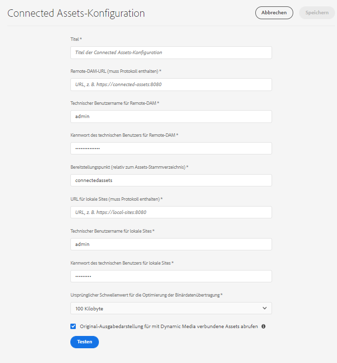

# Verwenden von Connected Assets zum Freigeben von DAM-Assets in [!DNL Experience Manager Sites] {#use-connected-assets-to-share-dam-assets-in-aem-sites}

In großen Unternehmen ist die zur Erstellung von Websites erforderliche Infrastruktur möglicherwiese verteilt. Manchmal befinden sich die Funktionen und digitale Assets zum Erstellen von Web-Seiten in verschiedenen Implementierungen. Ein Grund können geografisch verteilte vorhandene Implementierungen sein, die zusammenarbeiten müssen. Ein weiterer Grund können Akquisitionen sein, die zu einer heterogenen Infrastruktur führen, die die übergeordnete Firma gemeinsam nutzen möchte.

Benutzer können Web-Seiten in [!DNL Experience Manager Sites] erstellen. [!DNL Experience Manager Assets] ist das DAM (Digital Asset Management)-System, das die erforderlichen Assets für Websites bereitstellt. [!DNL Experience Manager] unterstützt nun dank Integration von [!DNL Sites] und [!DNL Assets] das obige Nutzungsszenario.

## Überblick über Connected Assets {#overview-of-connected-assets}

Beim Bearbeiten von Seiten als Ziel im [!UICONTROL Seiteneditor] können die Autoren nahtlos Assets aus einer anderen [!DNL Assets]-Bereitstellung, die als Asset-Quelle dient, suchen, durchsuchen und einbetten. Die Administratoren erstellen eine einmalige Integration einer Bereitstellung von [!DNL Experience Manager] mit [!DNL Sites]-Funktion mit einer anderen Bereitstellung von [!DNL Experience Manager] mit [!DNL Assets]-Funktion.

Für [!DNL Sites]-Autoren stehen die Remote-Assets als schreibgeschützte lokale Assets zur Verfügung. Die Funktion unterstützt die nahtlose Suche und die gleichzeitige Verwendung einiger weniger Remote-Assets. Wenn Sie viele Remote-Assets auf einmal für die [!DNL Sites]-Implementierung verfügbar machen möchten, sollten Sie die Assets als Stapel migrieren.

### Voraussetzungen und unterstützte Implementierungen {#prerequisites}

Bevor Sie diese Funktion verwenden oder konfigurieren, stellen Sie Folgendes sicher:

* Die Benutzer sind Teil von entsprechenden Benutzergruppen für jede Implementierung.
* Bei Implementierungstypen von [!DNL Adobe Experience Manager] ist eines der unterstützten Kriterien erfüllt. Weitere Informationen zur Funktionsweise dieser Funktion in [!DNL Experience Manager] 6.5 finden Sie unter [Verbundene Assets in [!DNL Experience Manager] 6.5 [!DNL Assets]](https://experienceleague.adobe.com/docs/experience-manager-65/assets/using/use-assets-across-connected-assets-instances.html?lang=de).

   |  | [!DNL Sites] as a [!DNL Cloud Service] | [!DNL Experience Manager] 6.5 [!DNL Sites] auf AMS | [!DNL Experience Manager] 6.5 [!DNL Sites] On-Premise |
   |---|---|---|---|
   | **[!DNL Experience Manager Assets]als[!DNL Cloud Service]** | Unterstützt | Unterstützt | Unterstützt |
   | **[!DNL Experience Manager]6.5 [!DNL Assets] auf AMS** | Unterstützt | Unterstützt | Unterstützt |
   | **[!DNL Experience Manager]6.5 [!DNL Assets] On-Premise** | Nicht unterstützt | Nicht unterstützt | Nicht unterstützt |

### Unterstützte Dateiformate {#mimetypes}

Autoren können in Content Finder nach Bildern und den folgenden Dokumenten suchen und die gefundenen Assets im Seiteneditor verwenden. Dokumente werden der Komponente `Download` und Bilder der Komponente `Image` hinzugefügt. Autoren können die Remote-Assets auch zu jeder benutzerdefinierten [!DNL Experience Manager]-Komponente hinzufügen, die die standardmäßigen `Download`- oder `Image`-Komponenten erweitert. Folgende Formate werden unterstützt:

* **Bildformate**: Die Formate, die von der [Bildkomponente](https://experienceleague.adobe.com/docs/experience-manager-core-components/using/components/image.html?lang=de) unterstützt werden. [!DNL Dynamic Media]-Bilder werden nicht unterstützt.
* **Dokumentenformate**: Siehe [Unterstützte Dokumentformate](file-format-support.md#document-formats).

### Beteiligte Benutzer und Gruppen {#users-and-groups-involved}

Nachfolgend erfahren Sie mehr über die verschiedenen Rollen, die am Konfigurieren und Verwenden der Funktionen und entsprechenden Benutzergruppen beteiligt sind. Der lokale Umfang wird für den Anwendungsfall verwendet, in dem ein Autor eine Web-Seite erstellt. Der Remote-Umfang wird für die DAM-Implementierung verwendet, die die erforderlichen Assets hostet. Der [!DNL Sites]-Autor ruft diese Remote-Assets ab.

| Rolle | Anwendungsbereich | Benutzergruppe | Benutzername im Beispiel | Anforderung |
|------|--------|-----------|-----|----------|
| [!DNL Sites]-Administrator | Lokal | [!DNL Experience Manager] `administrators` | `admin` | Einrichten von [!DNL Experience Manager], Konfigurieren der Integration mit der Remote[!DNL Assets]-Implementierung. |
| DAM-Benutzer | Lokal | `Authors` | `ksaner` | Wird zum Anzeigen und Duplizieren der abgerufenen Assets unter `/content/DAM/connectedassets/` verwendet. |
| [!DNL Sites]-Autor | Lokal | <ul><li>`Authors` (mit Lesezugriff auf das Remote-DAM und Autorenzugriff auf lokale [!DNL Sites]) </li> <li>`dam-users` auf lokale [!DNL Sites]</li></ul> | `ksaner` | Endbenutzer sind [!DNL Sites]-Autoren, die diese Integration für die Beschleunigung ihrer Inhalte verwenden. Die Autoren suchen und durchsuchen Assets im Remote-DAM mit [!UICONTROL Content Finder] und verwenden die erforderlichen Bilder auf lokalen Web-Seiten. Die Anmeldeinformationen des DAM-Benutzers `ksaner` werden verwendet. |
| [!DNL Assets]-Administrator | Remote | [!DNL Experience Manager] `administrators` | `admin` auf Remote-[!DNL Experience Manager] | Cross-Origin Resource Sharing (CORS) konfigurieren. |
| DAM-Benutzer | Remote | `Authors` | `ksaner` auf Remote-[!DNL Experience Manager] | Autorenrolle in der Remote[!DNL Experience Manager]-Implementierung. Suchen und Durchsuchen von Assets in Connected Assets mit dem [!UICONTROL Content Finder]. |
| DAM-Distributor (technischer Benutzer) | Remote | <ul> <li> [!DNL Sites] `Authors`</li> <li> `connectedassets-assets-techaccts` </li> </ul> | `ksaner` auf Remote-[!DNL Experience Manager] | Dieser Benutzer in der Remote-Implementierung wird vom lokalen [!DNL Experience Manager]-Server (nicht vom [!DNL Sites]-Autor) zum Abrufen der Remote-Assets im Auftrag des [!DNL Sites]-Autors verwendet. Diese Rolle unterscheidet sich von den beiden oben aufgeführten `ksaner`-Rollen und gehört einer anderen Benutzergruppe an. |
| Technischer[!DNL Sites]-Benutzer | Lokal | `connectedassets-sites-techaccts` | - | Ermöglicht die [!DNL Assets]-Bereitstellung, um nach Referenzen auf Assets in den [!DNL Sites]-Web-Seiten zu suchen. |

## Konfigurieren einer Verbindung zwischen [!DNL Sites]- und [!DNL Assets]-Implementierungen {#configure-a-connection-between-sites-and-assets-deployments}

Ein [!DNL Experience Manager]-Administrator kann diese Integration erstellen. Nach der Erstellung werden die erforderlichen Berechtigungen über Benutzergruppen festgelegt. Die Benutzergruppen werden für die [!DNL Sites]-Implementierung und die DAM-Implementierung definiert.

Gehen Sie wie folgt vor, um die Verbindung zwischen Connected Assets und lokalen [!DNL Sites] zu konfigurieren:

1. Rufen Sie eine vorhandene [!DNL Sites]-Bereitstellung auf. Diese [!DNL Sites]-Bereitstellung wird für das Erstellen von Web-Seiten verwendet, z. B. bei `https://[sites_servername]:port`. Da die Seitenerstellung bei der [!DNL Sites]-Bereitstellung erfolgt, bezeichnen wir die [!DNL Sites]-Bereitstellung aus Sicht der Seitenerstellung als lokal.

1. Rufen Sie eine vorhandene [!DNL Assets]-Bereitstellung auf. Diese [!DNL Assets]-Bereitstellung wird zur Verwaltung digitaler Assets verwendet, z. B. bei `https://[assets_servername]:port`.

1. Stellen Sie sicher, dass die Benutzer und Rollen im entsprechenden Bereich der [!DNL Sites]-Implementierung und in der [!DNL Assets]-Implementierung auf AMS vorhanden sind. Erstellen Sie einen technischen Benutzer in der [!DNL Assets]-Implementierung und fügen Sie ihn der in [Beteiligte Benutzer und Gruppen](/help/assets/use-assets-across-connected-assets-instances.md#users-and-groups-involved) erwähnten Benutzergruppe hinzu.

1. Greifen Sie auf die lokale [!DNL Sites]-Implementierung unter `https://[sites_servername]:port` zu. Klicken Sie auf **[!UICONTROL Tools]** > **[!UICONTROL Assets]** > **[!UICONTROL Connected Assets-Konfiguration]** und geben Sie die folgenden Werte ein:

   1. Einen **[!UICONTROL Titel]** der Konfiguration.
   1. Die **[!UICONTROL Remote-DAM-URL]** ist die URL des Speicherorts von [!DNL Assets] im Format `https://[assets_servername]:[port]`.
   1. Anmeldeinformationen eines DAM-Distributors (technischer Benutzer).
   1. Geben Sie im Feld **[!UICONTROL Bereitstellungspunkt]** den lokalen [!DNL Experience Manager]-Pfad ein, aus dem [!DNL Experience Manager] die Assets abruft. Beispielsweise den Ordner `connectedassets`. Die Assets, die von DAM abgerufen werden, werden in diesem Ordner der [!DNL Sites]-Bereitstellung gespeichert.
   1. Die **[!UICONTROL lokale Sites-URL]** ist der Speicherort der [!DNL Sites]-Bereitstellung. Bei der [!DNL Assets]-Bereitstellung wird dieser Wert verwendet, um Referenzen auf die digitalen Assets zu erhalten, die von dieser [!DNL Sites]-Bereitstellung abgerufen werden.
   1. Anmeldedaten des technischen [!DNL Sites]-Benutzers.
   1. Der Wert des Felds **[!UICONTROL Ursprünglicher Schwellenwert für die Optimierung der Binärdatenübertragung]** gibt an, ob die ursprünglichen Assets (einschließlich der Darstellungen) synchron übertragen werden. Assets mit kleinerer Dateigröße können problemlos abgerufen werden, während Assets mit relativ großer Dateigröße am besten asynchron synchronisiert werden. Der Wert hängt von Ihren Netzwerkfähigkeiten ab.
   1. Wählen Sie **[!UICONTROL Mit Connected Assets gemeinsam verwendeter Datenspeicher]** aus, wenn Sie zum Speichern Ihrer Assets einen Datenspeicher verwenden und der Datenspeicher der gemeinsam verwendete Speicher beider Implementierungen ist. In diesem Fall spielt die Schwellenwertbegrenzung keine Rolle, da sich die tatsächlichen Asset-Binärdateien im Datenspeicher befinden und nicht übertragen werden.

   

   *Abbildung: Eine typische Konfiguration für die Connected Assets-Funktionen.*

1. Die vorhandenen digitalen Assets bei [!DNL Assets]-Bereitstellung werden bereits verarbeitet und die Darstellungen werden generiert. Diese Darstellungen werden mit dieser Funktion abgerufen, sodass keine erneute Generierung der Darstellungen erforderlich ist. Deaktivieren Sie die Workflow-Starter, um die erneute Generierung von Darstellungen zu verhindern. Passen Sie die Konfigurationen der Starter in der ([!DNL Sites]-)Bereitstellung an, um den Ordner `connectedassets` auszuschließen (die Assets werden in diesem Ordner abgerufen).

   1. Klicken Sie in einer [!DNL Sites]-Implementierung auf **[!UICONTROL Tools]** > **[!UICONTROL Workflow]** > **[!UICONTROL Starter]**.

   1. Suchen Sie nach Startern mit Workflows wie **[!UICONTROL DAM-Update-Asset]** und **[!UICONTROL DAM-Metadaten-Writeback]**.

   1. Wählen Sie den Workflow-Starter aus und klicken Sie in der Aktionsleiste auf **[!UICONTROL Eigenschaften]**.

   1. Ändern Sie im [!UICONTROL Eigenschaften]-Assistenten die **[!UICONTROL Pfad]**-Felder in die folgenden Zuordnungen, um ihre regulären Ausdrücke zu aktualisieren und den Bereitstellungspunkt **[!UICONTROL connectedassets]** auszuschließen.

   | Vorher | Nachher |
   | ------ | ------------ |
   | `/content/dam(/((?!/subassets).)*/)renditions/original` | `/content/dam(/((?!/subassets)(?!connectedassets).)*/)renditions/original` |
   | `/content/dam(/.*/)renditions/original` | `/content/dam(/((?!connectedassets).)*/)renditions/original` |
   | `/content/dam(/.*)/jcr:content/metadata` | `/content/dam(/((?!connectedassets).)*/)jcr:content/metadata` |

   >[!NOTE]
   >
   >Wenn Autoren ein Asset abrufen, werden alle in der Remote-Implementierung verfügbaren Ausgabedarstellungen abgerufen. Überspringen Sie diesen Konfigurationsschritt, wenn Sie mehr Ausgabedarstellungen eines abgerufenen Assets erstellen möchten. Der Workflow [!UICONTROL DAM-Update-Asset] wird gestartet und es werden mehr Ausgabedarstellungen erstellt. Diese Ausgabedarstellungen sind nur für die lokale [!DNL Sites]-implementierung verfügbar und nicht für die Remote-DAM-Bereitstellung.

1. Fügen Sie die [!DNL Sites]-Bereitstellung als zulässigen Ursprung in der CORS-Konfiguration der [!DNL Assets]-Bereitstellung hinzu. Weitere Informationen finden Sie unter [Grundlegendes zu CORS](https://experienceleague.adobe.com/docs/experience-manager-learn/foundation/security/understand-cross-origin-resource-sharing.html?lang=de).

Sie können die Verbindung zwischen konfigurierten [!DNL Sites]-Bereitstellungen und der [!DNL Assets]-Bereitstellung überprüfen.

![Verbindungstest für konfigurierte Connected Assets [!DNL Sites]](assets/connected-assets-multiple-config.png)

<!-- TBD: Check if Launchers are to be disabled on CS instances. Is this option even available to the users on CS? -->

## Verwenden von Remote-Assets  {#use-remote-assets}

Die Website-Autoren verwenden Content Finder zum Verbinden mit der DAM-Implemetierung. Die Autoren können die Remote-Assets durchsuchen und in eine Komponente ziehen. Halten Sie zum Authentifizieren beim Remote-DAM die von Ihrem Administrator bereitgestellten Anmeldeinformationen des DAM-Benutzers bereit.

Autoren können in lokalen und Remote-DAM-Implemetierungen verfügbare Assets auf derselben Web-Seite nutzen. Verwenden Sie Content Finder, um zwischen der Suche im lokalen und im Remote-DAM zu wechseln.

Es werden nur die Tags von Remote-Assets abgerufen, die über ein exakt entsprechendes Tag – mit derselben Taxonomie-Hierarchie – verfügen, das in der lokalen [!DNL Sites]-Implemetierung verfügbar ist. Alle anderen Tags werden verworfen. Autoren können mit allen Tags in der Remote[!DNL Experience Manager]-Implementierung nach Remote-Assets suchen, da eine Volltextsuche verfügbar ist.

### Beispiel für die Verwendung {#walk-through-of-usage}

Verwenden Sie die oben beschriebenen Einstellungen, um die Funktionsweise der Funktionen im Authoring-Erlebnis zu überprüfen. Verwenden Sie Dokumente oder Bilder Ihrer Wahl in der Remote-DAM-Implemetierung.

1. Navigieren Sie zur [!DNL Assets]-Benutzeroberfläche in der Remote-Implementierung, indem Sie im [!DNL Experience Manager]-Arbeitsbereich auf **[!UICONTROL Assets]** > **[!UICONTROL Dateien]** zugreifen. Sie können `https://[assets_servername_ams]:[port]/assets.html/content/dam` auch in einem Browser aufrufen. Laden Sie die Assets Ihrer Wahl hoch.
1. Klicken Sie in der [!DNL Sites]-Implemetierung in der Profilaktivierung oben rechts auf **[!UICONTROL Identität annehmen als]**. Geben Sie `ksaner` als Benutzernamen ein, wählen Sie die bereitgestellte Option und klicken Sie auf **[!UICONTROL OK]**.
1. Öffnen Sie eine We.Retail-Web-Seite unter **[!UICONTROL Sites]** > **[!UICONTROL We.Retail]** > **[!UICONTROL us]** > **[!UICONTROL en]**. Bearbeiten Sie die Seite. Sie können `https://[aem_server]:[port]/editor.html/content/we-retail/us/en/men.html` auch in einem Browser aufrufen, um die Seite zu bearbeiten.

   Klicken Sie oben links auf der Seite auf **[!UICONTROL Seitliches Bedienfeld ein/aus]**.

1. Öffnen Sie die Registerkarte [!UICONTROL Assets] und klicken Sie auf **[!UICONTROL Bei Connected Assets anmelden]**.
1. Geben Sie die Benutzerdaten – `ksaner` als Benutzername und `password` als Kennwort – ein. Der Benutzer hat Autorenberechtigungen für beide [!DNL Experience Manager]-Implementierungen.
1. Suchen Sie nach dem Asset, das Sie dem DAM hinzugefügt haben. Die Remote-Assets werden im linken Bereich angezeigt. Filtern Sie nach Bildern oder Dokumenten und weiter nach unterstützten Dokumenttypen. Ziehen Sie die Bilder auf eine `Image`-Komponente und die Dokumente auf eine `Download`-Komponente.

   Die abgerufenen Assets sind in der lokalen [!DNL Sites]-Implementierung schreibgeschützt. Sie können weiterhin die Optionen verwenden, die Ihre [!DNL Sites]-Komponenten bereitstellen, um das abgerufene Asset zu bearbeiten. Die Bearbeitung durch Komponenten erfolgt zerstörungsfrei.

   

   *Abbildung: Optionen zum Filtern von Dokumenttypen und Bildern bei der Suche nach Assets auf Remote-DAM.*

1. Ein Site-Autor wird benachrichtigt, wenn ein Asset asynchron abgerufen wird und wenn eine Abrufaufgabe fehlschlägt. Beim oder auch nach dem Authoring können die Autoren detaillierte Informationen zu Abrufaufgaben und -fehlern in der Benutzeroberfläche für [asynchrone Aufträge](/help/operations/asynchronous-jobs.md) anzeigen.

   

   *Abbildung: Benachrichtigung zum asynchronen Abrufen von Assets, die im Hintergrund ausgeführt werden.*

1. Beim Veröffentlichen einer Seite zeigt [!DNL Experience Manager] eine vollständige Liste der auf der Seite verwendeten Assets an. Stellen Sie sicher, dass die Remote-Assets zum Zeitpunkt der Veröffentlichung erfolgreich abgerufen wurden. Informationen zum Überprüfen des Status der einzelnen abgerufenen Assets finden Sie in der Benutzeroberfläche für [asynchrone Aufträge](/help/operations/asynchronous-jobs.md).

   >[!NOTE]
   >
   >Auch wenn ein oder mehrere Remote-Assets nicht abgerufen wurden, wird die Seite veröffentlicht. Die Komponente, die das Remote-Asset verwendet, wird leer veröffentlicht. Im [!DNL Experience Manager]-Benachrichtigungsbereich werden Benachrichtigungen zu Fehlern angezeigt, die auf der Seite für asynchrone Aufträge angezeigt werden.

>[!CAUTION]
>
>Nach der Verwendung auf einer Web-Seite können die abgerufenen Remote-Assets von jedem durchsucht und verwendet werden, der über die Berechtigung zum Zugriff auf den lokalen Ordner verfügt. Die abgerufenen Assets werden im lokalen Ordner gespeichert (`connectedassets` in der obigen Anleitung). Die Assets sind außerdem über [!UICONTROL Content Finder] durchsuchbar und im lokalen Repository sichtbar.

Die abgerufenen Assets können wie jedes andere lokale Element verwendet werden. Nur die zugehörigen Metadaten können nicht bearbeitet werden.

### Überprüfen der Verwendung eines Assets auf mehreren Web-Seiten {#asset-usage-references}

[!DNL Experience Manager] ermöglicht es DAM-Benutzern, alle Referenzen auf ein Asset zu überprüfen. Damit wird es leichter, die Verwendung eines Assets in Remote-[!DNL Sites]- und in zusammengesetzten Assets zu verstehen und zu verwalten. Bei der [!DNL Experience Manager Sites]-Bereitstellung können viele Autoren von Web-Seiten ein Asset auf einer Remote-[!DNL Assets]-Web-Seite verwenden. Um die Verwaltung von Assets zu vereinfachen und nicht zu fehlerhaften Referenzen zu führen, ist es für die DAM-Benutzer wichtig, die Verwendung eines Assets auf lokalen und Remote-Web-Seiten zu überprüfen. Auf der Registerkarte [!UICONTROL Referenzen] auf der Seite [!UICONTROL Eigenschaften] des Assets werden lokale und Remote-Referenzen des Assets aufgeführt.

Gehen Sie wie folgt vor, um Referenzen auf die [!DNL Assets]-Bereitstellung anzuzeigen und zu verwalten:

1. Wählen Sie ein Asset in der [!DNL Assets]-Konsole aus und klicken Sie in der Symbolleiste auf **[!UICONTROL Eigenschaften]**.
1. Klicken Sie auf die Registerkarte **[!UICONTROL Referenzen]**. Unter **[!UICONTROL Lokale Referenzen]** finden Sie weitere Informationen zur Verwendung des Assets in der [!DNL Assets]-Bereitstellung. Siehe [!UICONTROL Remote-Referenzen] für die Verwendung des Assets bei der [!DNL Sites]-Bereitstellung, bei der das Asset mithilfe der Funktionen für Connected Assets abgerufen wurde.

   

1. Die Referenzen für [!DNL Sites]-Seiten zeigen die Gesamtzahl der Referenzen für jede lokale [!DNL Sites] an. Es kann einige Zeit dauern, bis alle Referenzen gefunden und die Gesamtzahl der Referenzen angezeigt werden.
1. Die Liste der Referenzen ist interaktiv und DAM-Benutzer können auf eine Referenz klicken, um die verweisende Seite zu öffnen. Wenn Remote-Referenzen aus irgendeinem Grund nicht abgerufen werden können, wird eine Benachrichtigung angezeigt, die den Benutzer über den Fehler informiert.
1. Benutzer können das Asset verschieben oder löschen. Beim Verschieben oder Löschen eines Assets wird die Gesamtzahl der Referenzen aller ausgewählten Assets/Ordner in einem Warndialogfeld angezeigt. Beim Löschen eines Assets, für das die Referenzen noch nicht angezeigt werden, wird ein Warndialogfeld angezeigt.

   

## Einschränkungen und Best Practices {#tip-and-limitations}

* Um Einblicke in die Asset-Nutzung zu erhalten, konfigurieren Sie die Funktion [Asset-Einblicke](/help/assets/assets-insights.md) in der [!DNL Sites]-Instanz.

### Berechtigungen und Asset-Verwaltung {#permissions-and-managing-assets}

* Lokale Assets werden nicht mit den ursprünglichen Assets auf der Remote-Implementierung synchronisiert. Das Ändern, Löschen oder Widerrufen von Berechtigungen auf der DAM-Implementierung wird nicht auf absteigende Hierarchien angewendet.
* Lokale Assets sind schreibgeschützte Kopien. [!DNL Experience Manager]-Komponenten nehmen zerstörungsfreie Änderungen an Assets vor. Sonstige Änderungen sind nicht zulässig.
* Lokal abgerufene Assets sind nur für Autoren verfügbar. Asset-Update-Workflows können nicht angewendet werden und Metadaten können nicht bearbeitet werden.
* Es werden nur Bilder und die aufgelisteten Dokumentenformate unterstützt. [!DNL Dynamic Media]-Assets, Inhaltsfragmente und Experience Fragments werden nicht unterstützt.
* [!DNL Experience Manager] ruft die Metadatenschemas nicht ab. Das bedeutet, dass möglicherweise nicht alle abgerufenen Metadaten angezeigt werden. Wenn das Schema separat aktualisiert wird, werden alle Eigenschaften angezeigt.
* Alle [!DNL Sites]-Autoren erhalten Leseberechtigungen für die abgerufenen Kopien, auch wenn sie keine Zugriffsberechtigungen für die Remote-DAM-Implemetierung haben.
* Keine API-Unterstützung, um die Integration anzupassen.
* Die Funktion unterstützt die nahtlose Suche und Verwendung von Remote-Assets. Wenn Sie viele Remote-Assets auf einmal für die lokale Implementierung verfügbar machen möchten, sollten Sie die Assets migrieren.
* Es ist nicht möglich, ein Remote-Asset als Seitenminiaturansicht in der Benutzeroberfläche der [!UICONTROL Seiteneigenschaften] zu verwenden. Sie können eine Miniaturansicht einer Web-Seite in der Benutzeroberfläche [!UICONTROL Seiteneigenschaften] von [!UICONTROL Miniaturansicht] aus festlegen, indem Sie auf [!UICONTROL Bild auswählen] klicken.

### Einrichten und Lizenzieren {#setup-licensing}

* Die [!DNL Assets]-Implementierung auf [!DNL Adobe Managed Services] wird unterstützt.
* [!DNL Sites] kann jeweils nur eine Verbindung zu einem [!DNL Assets]-Repository herstellen.
* Eine Lizenz für [!DNL Assets], die als Remote-Repository dient.
* Eine oder mehrere Lizenzen für [!DNL Sites], die als lokale Autorenimplementierung dienen.

### Nutzung {#usage}

* Benutzer können bei der Inhaltserstellung nach Remote-Assets suchen und diese auf die lokale Seite ziehen. Es werden keine anderen Funktionen unterstützt.
* Nach 5 Sekunden tritt bei Abrufvorgängen ein Timeout auf. Autoren können beispielsweise bei Netzwerkproblemen Probleme beim Abrufen von Assets haben. Autoren können es erneut versuchen, indem sie das Remote-Asset aus [!UICONTROL Content Finder] in den [!UICONTROL Seiteneditor] ziehen.
* An abgerufenen Assets können einfache, zerstörungsfreie Änderungen sowie Änderungen, die von der `Image`-Komponente unterstützt werden, vorgenommen werden. Assets sind schreibgeschützt.
* Die einzige Methode zum erneuten Abrufen des Assets besteht darin, es auf eine Seite zu ziehen. Es gibt keine API-Unterstützung oder andere Methoden zum erneuten Abrufen eines Assets, um es zu aktualisieren.
* Wenn Assets aus dem DAM eingestellt werden, werden sie weiterhin auf [!DNL Sites]-Seiten verwendet.
* Die Remote-Referenzeinträge eines Assets werden asynchron abgerufen. Die Referenzen und die Gesamtanzahl stehen nicht in Echtzeit zur Verfügung und es kann zu Unterschieden kommen, wenn ein Sites-Autor das Asset verwendet, während ein DAM-Benutzer die Referenz anzeigt. DAM-Benutzer können die Seite aktualisieren und in einigen Minuten erneut versuchen, die Gesamtanzahl abzurufen.

## Fehlerbehebung bei Problemen   {#troubleshoot}

Führen Sie die folgenden Schritte aus, um häufig auftretende Fehler zu beheben:

* Wenn Sie im [!UICONTROL Content Finder] nicht nach Remote-Assets suchen können, überprüfen Sie erneut, ob die erforderlichen Rollen und Berechtigungen eingerichtet sind.
* Ein aus dem Remote-DAM abgerufenes Asset kann aus verschiedenen Gründen nicht auf einer Web-Seite veröffentlicht werden. Es existiert nicht auf dem Remote-Server, es fehlen entsprechende Berechtigungen zum Abrufen oder ein Netzwerkfehler liegt vor. Stellen Sie sicher, dass das Asset nicht aus dem Remote-DAM entfernt wird. Stellen Sie sicher, dass die entsprechenden Berechtigungen eingerichtet und die Voraussetzungen erfüllt sind. Wiederholen Sie den Vorgang zum Hinzufügen des Assets zur Seite und veröffentlichen Sie erneut. Überprüfen Sie die [Liste asynchroner Aufträge](/help/operations/asynchronous-jobs.md) auf Fehler beim Abrufen von Assets.
* Wenn Sie von der lokalen [!DNL Sites]-Bereitstellung aus nicht auf die Remote-DAM-Bereitstellung zugreifen können, stellen Sie sicher, dass seitenübergreifende Cookies erlaubt sind. Wenn seitenübergreifende Cookies blockiert werden, werden die beiden Bereitstellungen von [!DNL Experience Manager] möglicherweise nicht authentifiziert. Beispielsweise kann [!DNL Google Chrome] im Inkognito-Modus Cookies von Drittanbietern blockieren. Um Cookies im [!DNL Chrome]-Browser zuzulassen, klicken Sie auf das Augensymbol in der Adressleiste, navigieren Sie zu „Site funktioniert nicht“ > „Blockiert“, wählen Sie die Remote-DAM-URL aus und lassen Sie das Anmelde-Token-Cookie zu. Alternativ finden Sie in der Hilfe Informationen zum [Aktivieren von Cookies von Drittanbietern](https://support.google.com/chrome/answer/95647).

   

* Wenn keine Remote-Referenzen abgerufen werden und eine Fehlermeldung angezeigt wird, überprüfen Sie, ob die Sites-Bereitstellung verfügbar ist und ob es Probleme mit der Netzwerkverbindung gibt. Versuchen Sie es später erneut. Bei der [!DNL Assets]-Bereitstellung wird zweimal versucht, eine Verbindung zur [!DNL Sites]-Bereitstellung herzustellen. Anschließend wird ein Fehler ausgegeben.

