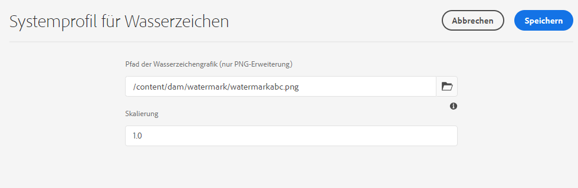

# Versehen von Assets mit Wasserzeichen {#watermark-assets}

In [!DNL Adobe Experience Manager Assets] können Sie Bildern ein digitales Wasserzeichen hinzufügen. [!DNL Assets] unterstützt das Anwenden eines Bilds als Wasserzeichen für andere Bilddateien. Wasserzeichen können Benutzern dabei helfen, die Authentizität und das Urheberrecht von Assets zu überprüfen. Außerdem können Wasserzeichen dazu dienen, den Status eines Dokuments (wie vertraulich, Entwurf, Gültigkeit usw.) anzugeben.

So konfigurieren Sie [!DNL Experience Manager] zu Wasserzeichen-Assets:

1. Eine PNG-Datei wird als Wasserzeichen angewendet. Laden Sie diese Datei in Ihr DAM-Repository hoch.

1. Navigieren Sie zu **[!UICONTROL Tools > Assets > Assets-Konfigurationen]**.

1. Klicken **[!UICONTROL System-Wasserzeichenprofil]**.

1. Im [!UICONTROL Seite &quot;System Watermarking Profile&quot;], geben Sie den Bildpfad an, der in Schritt 1 in Ihr DAM-Repository hochgeladen wurde.

1. Geben Sie die Wasserzeichenskala von 0,0 bis 1,0 relativ zur Ausgabedarstellungsbreite in der **[!UICONTROL Skalieren]** -Feld.

1. Klicken Sie auf **[!UICONTROL Speichern]**.

   

   >[!NOTE]
   >
   >Wenn Sie das System Watermarking Profile mithilfe von `com.adobe.cq.assetcompute.impl.profile.WatermarkingProfileServiceImpl.cfg.json` Konfigurationsdatei (OSGi-Konfiguration) verwenden, können Sie sie weiterhin verwenden. Adobe empfiehlt jedoch die Verwendung der neuen Methode.

1. [Erstellen Sie ein Verarbeitungsprofil](/help/assets/asset-microservices-configure-and-use.md#create-custom-profile), um Asset-Microservices zur Anwendung des Wasserzeichens zu nutzen.

   

   Stellen Sie sicher, dass Sie die **[!UICONTROL Wasserzeichen]** beim Erstellen des Verarbeitungsprofils umschalten.

1. [Wenden Sie die Verarbeitungsprofile auf einen Ordner](/help/assets/asset-microservices-configure-and-use.md#use-profiles) an, um mit Wasserzeichen versehene Assets zu erstellen.

## Tipps und Einschränkungen {#tips-limitations-bestpractices}

* Sie können eine einzelne Konfiguration verwenden, um alle Ihre Assets mit Wasserzeichen zu versehen. Für Wasserzeichen wird nur ein Bild verwendet; dessen Breite ist fest.
* Sie können das Wasserzeichen ohne Tiling in der Mitte platzieren.
* Textbasierte Wasserzeichen werden nicht unterstützt.

>[!MORELIKETHIS]
>
>* [Asset-Microservices – Überblick](/help/assets/asset-microservices-overview.md).
>* [Verwenden von Asset-Microservices mit Verarbeitungsprofilen](/help/assets/asset-microservices-configure-and-use.md).

