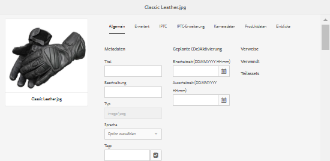
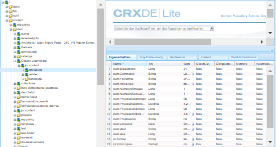
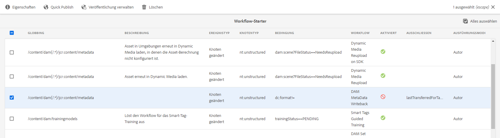
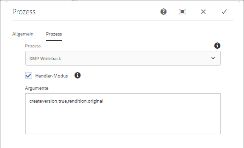

# XMP-Metadaten {#xmp-metadata}

XMP (Extensible Metadata Platform) ist der Metadatenstandard, der von AEM Assets für die gesamte Metadatenverwaltung eingesetzt wird. XMP liefert ein Standardformat für die Erstellung, die Verarbeitung und den Austausch von Metadaten für eine Vielzahl an Programmen.

XMP bietet nicht nur universelle Metadatenkodierung, die in alle Dateiformate eingebettet werden kann, sondern auch ein [Rich-Content-Modell](#xmp-core-concepts). Außerdem wird XMP [von Adobe](#advantages-of-xmp) und anderen Unternehmen unterstützt, sodass Benutzer, die XMP in Kombination mit AEM Assets einsetzen, über eine leistungsstarke Plattform verfügen.

## XMP-Übersicht und Ökosystem {#xmp-ecosystem}

AEM Assets unterstützt nativ den XMP-Metadatenstandard. XMP ist ein Standard für die Verarbeitung und Speicherung von standardisierten und proprietären Metadaten in digitalen Assets. XMP ist als der gemeinsame Standard konzipiert, dank dem mehrere Programme effektiv mit Metadaten arbeiten können.

Produktionsexperten nutzen beispielsweise die integrierte XMP-Unterstützung innerhalb der Adobe-Programme, um Informationen über mehrere Dateiformate hinweg zu übergeben. Das AEM Assets-Repository extrahiert die XMP-Metadaten und verwaltet damit den Inhaltslebenszyklus. Außerdem wird die Erstellung von Automatisierungs-Workflows ermöglicht.

XMP standardisiert die Art, wie Metadaten definiert, erstellt und verarbeitet werden, indem ein Datenmodell, ein Speichermodell und Schemata bereitgestellt werden. Diese Grundlagen werden alle in diesem Abschnitt behandelt.

Alle Legacy-Metadaten aus EXIF, ID3 oder Microsoft Office werden automatisch in XMP übersetzt. Dies kann erweitert werden, um kundenspezifische Metadatenschemata wie Produktkataloge zu unterstützen.

Metadaten in XMP bestehen aus einer Reihe von Eigenschaften. Diese Eigenschaften sind stets mit einer bestimmten Entität verknüpft, die als Ressource bezeichnet wird. Die Eigenschaften beziehen sich also auf die Ressource. Bei XMP ist die Ressource stets das Asset.

XMP definiert ein [Metadatenmodell](https://de.wikipedia.org/wiki/Metadaten), das mit jedem definierten Satz von Metadatenelementen verwendet werden kann. XMP definiert außerdem bestimmte [Schemata](https://de.wikipedia.org/wiki/Schemasprache_(XML)) für Standardeigenschaften, die für die Aufzeichnung des Verlaufs einer Ressource nützlich sind, während sie mehrere Verarbeitungsschritte durchläuft – von der Aufnahme über [Scannen](https://de.wikipedia.org/wiki/Scanner_(Datenerfassung)) oder Verfassen als Text und Bildbearbeitungsschritte (wie [Zuschneiden](https://de.wikipedia.org/wiki/Cropping) oder Farbkorrektur) bis hin zur Zusammensetzung in das endgültige Bild. XMP ermöglicht es jedem Softwareprogramm oder Gerät, eigene Informationen zu einer digitalen Ressource hinzuzufügen, die dann in der endgültigen digitalen Datei gespeichert werden kann.

XMP wird am häufigsten mit einer Untergruppe des [W3C](https://de.wikipedia.org/wiki/World_Wide_Web_Consortium) [Resource Description Framework](https://de.wikipedia.org/wiki/Resource_Description_Framework) (RDF) serialisiert und gespeichert, das wiederum in [XML](https://de.wikipedia.org/wiki/Extensible_Markup_Language) ausgedrückt wird.

### Vorteile von XMP  {#advantages-of-xmp}

XMP bietet die folgenden Vorteile gegenüber anderen Kodierungsstandards und Schemata:

* XMP-basierte Metadaten sind sehr leistungsstark und fein granuliert.
* Mit XMP können Sie mehrere Werte für eine Eigenschaft festlegen.
* XMP verfügt über standardisierte Kodierung, wodurch Sie Metadaten einfach austauschen können.
* XMP ist erweiterbar. Sie können Assets zusätzliche Informationen hinzufügen.

Das XMP-Standardformat ist erweiterbar, sodass Sie den XMP-Daten benutzerdefinierte Arten von Metadaten hinzufügen können. Bei EXIF ist dies dagegen nicht möglich. Die feste Liste der Eigenschaften kann nicht erweitert werden.

>[!NOTE]
>
>XMP lässt im Allgemeinen nicht zu, dass binäre Datentypen eingebettet werden. Um binäre Daten wie etwa Miniaturansichten in XMP zu übertragen, müssen diese in einem XML-kompatiblen Format wie beispielsweise `Base64` kodiert werden.

### Grundlegende XMP-Konzepte {#xmp-core-concepts}

**Namespaces und Schemata**

Ein XMP-Schema ist ein Set aus Eigenschaftsnamen in einem gemeinsamen XML-Namespace, der
den Datentyp und beschreibende Informationen umfasst. Ein XMP-Schema wird durch die zugehörige XML-Namespace-URI identifiziert. Durch Verwendung von Namespaces werden Konflikte zwischen Eigenschaften in verschiedenen Schemata verhindert, die denselben Namen, aber eine andere Bedeutung haben.

Beispiel: Die Eigenschaft **Creator** in zwei unabhängig voneinander entwickelten Schemata kann einerseits für die Person stehen, die das Asset erstellt hat, oder andererseits für das Programm, von dem das Asset erstellt wurde (z. B. Adobe Photoshop).

**XMP-Eigenschaften und -Werte**

XMP kann Eigenschaften von einem oder mehreren der Schemata umfassen. Viele Adobe-Programme verwenden beispielsweise Folgendes:

* Dublin Core-Schema: `dc:title`, `dc:creator`, `dc:subject`, `dc:format`, `dc:rights`
* XMP-Basisschema: `xmp:CreateDate`, `xmp:CreatorTool`, `xmp:ModifyDate`, `xmp:metadataDate`
* XMP-Rechteverwaltungsschema: `xmpRights:WebStatement`, `xmpRights:Marked`
* XMP-Medienverwaltungsschema: `xmpMM:DocumentID`

**Sprachalternativen**

Mit XMP können Sie die Eigenschaft `xml:lang` zu Texteigenschaften hinzufügen, um die Sprache des Textes anzugeben.

## XMP-Writeback in Ausgabedarstellungen {#xmp-writeback-to-renditions}

Diese XMP Funktion für die Rückgabe von Metadaten in [!DNL Adobe Experience Manager Assets] repliziert die Änderungen an den Darstellungen des ursprünglichen Assets.
Wenn Sie die Metadaten eines Assets von [!DNL Assets] oder beim Hochladen des Assets ändern, werden die Änderungen zunächst im Metadaten-Knoten in der Asset-Hierarchie gespeichert. Mit der Funktion zum Erstellen einer Sicherungskopie können Sie die Änderungen an den Metadaten an alle oder bestimmte Darstellungen des Assets weiterleiten. Die Funktion schreibt nur die Metadateneigenschaften zurück, die den Namensraum `jcr` verwenden, d. h., eine Eigenschaft mit dem Namen `dc:title` wird zurückgeschrieben, eine Eigenschaft mit dem Namen `mytitle` jedoch nicht.

Angenommen, Sie ändern die Eigenschaft [!UICONTROL Title] des Assets mit dem Titel `Classic Leather` in `Nylon`.

In diesem Fall speichert [!DNL Assets] die Änderungen an der Eigenschaft **[!UICONTROL Title]** im Parameter `dc:title` für die in der Asset-Hierarchie gespeicherten Asset-Metadaten.

>[!NOTE]
>
>Die Funktion zum Zurückschreiben ist in [!DNL Assets] nicht standardmäßig aktiviert. Erfahren Sie, wie Sie die Metadaten-Schreibweise [aktivieren.](#enable-xmp-writeback)

### Aktivieren XMP Schreibback {#enable-xmp-writeback}

[!UICONTROL DAM Metadata ] Writebackworkflow wird zum Schreiben der Metadaten eines Assets verwendet. Gehen Sie wie folgt vor, um die Rückgabe zu aktivieren:

* Verwenden Sie Launchers.
* Manueller Beginn `DAM MetaData Writeback`-Arbeitsablauf.
* Konfigurieren Sie den Arbeitsablauf für die Nachbearbeitung.

Gehen Sie wie folgt vor, um Launchers zu verwenden:

1. Als Administrator greifen Sie auf **[!UICONTROL Tools]** > **[!UICONTROL Workflow]** > **[!UICONTROL Launchers]** zu.
1. Wählen Sie die Spalte [!UICONTROL Starter] aus, für die **[!UICONTROL Workflow]** **[!UICONTROL DAM MetaData Writeback]** angezeigt wird. Klicken Sie in der Symbolleiste auf **[!UICONTROL Eigenschaften.]**

   

1. Wählen Sie **[!UICONTROL Aktivieren]** auf der Seite **[!UICONTROL Startereigenschaften]**. Klicken Sie auf **[!UICONTROL Speichern und schließen]**.

Um den Workflow manuell nur einmal auf ein Asset anzuwenden, wenden Sie den Workflow [!UICONTROL DAM Metadata Writeback] in der linken Leiste an.

Um den Workflow auf alle hochgeladenen Assets anzuwenden, fügen Sie den Workflow einem nachbearbeitenden Profil hinzu.

<!-- Commenting for now. Need to document how to enable metadata writeback. See CQDOC-17254.

### Enable XMP writeback {#enable-xmp-writeback}

To enable the metadata changes to be propagated to the renditions of the asset when uploading it, modify the **[!UICONTROL Adobe CQ DAM Rendition Maker]** configuration in Configuration Manager.

1. To open Configuration Manager, access `https://[aem_server]:[port]/system/console/configMgr`.
1. Open the **[!UICONTROL Adobe CQ DAM Rendition Maker]** configuration.
1. Select the **[!UICONTROL Propagate XMP]** option, and then save the changes.

### Enable XMP write-back for specific renditions {#enable-xmp-writeback-for-specific-renditions}

To let the XMP write-back feature propagate metadata changes to select renditions, specify these renditions to the [!UICONTROL XMP Writeback Process] workflow step of DAM Metadata WriteBack workflow. By default, this step is configured with the original rendition.

For the XMP write-back feature to propagate metadata to the rendition thumbnails 140.100.png and 319.319.png, perform these steps.

1. Tap/click the AEM logo, and then navigate to **[!UICONTROL Tools]** &gt; **[!UICONTROL Workflow]** &gt; **[!UICONTROL Models]**.
1. From the Models page, open the **[!UICONTROL DAM Metadata Writeback]** workflow model.
1. In the **[!UICONTROL DAM Metadata Writeback]** properties page, open the **[!UICONTROL XMP Writeback Process]** step.
1. In the **[!UICONTROL Step Properties]** dialog box, tap/click the **[!UICONTROL Process]** tab.
1. In the **[!UICONTROL Arguments]** box, add `rendition:cq5dam.thumbnail.140.100.png,rendition:cq5dam.thumbnail.319.319.png`, and then tap/click **[!UICONTROL OK]**.

   

1. Save the changes.
1. To regenerate the Pyramid TIFF (PTIFF) renditions for Dynamic Media images with the new attributes, add the **[!UICONTROL Dynamic Media Process Image Assets]** step to the DAM Metadata write-back workflow. PTIFF renditions are only created and stored locally in a Dynamic Media Hybrid implementation.

1. Save the workflow.

The metadata changes are propagated to the renditions renditions thumbnail.140.100.png and thumbnail.319.319.png of the asset, and not the others.
-->
