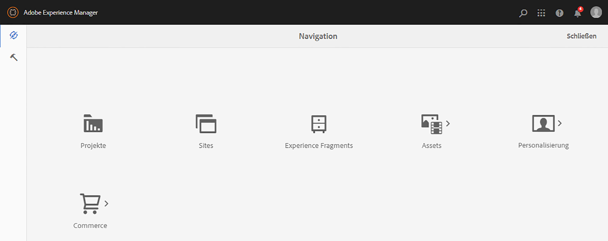
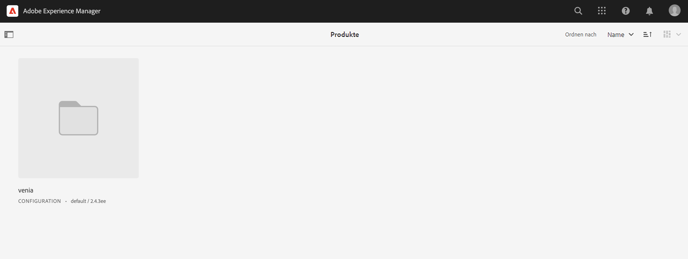
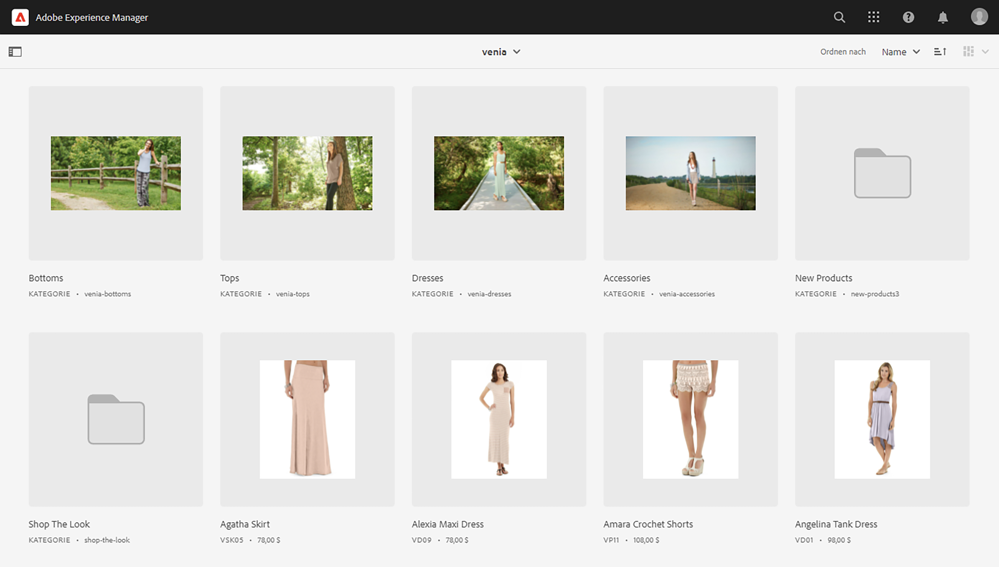
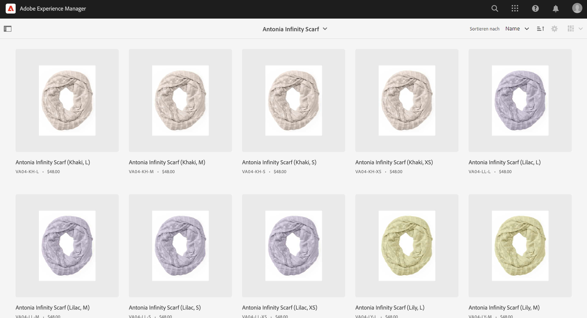
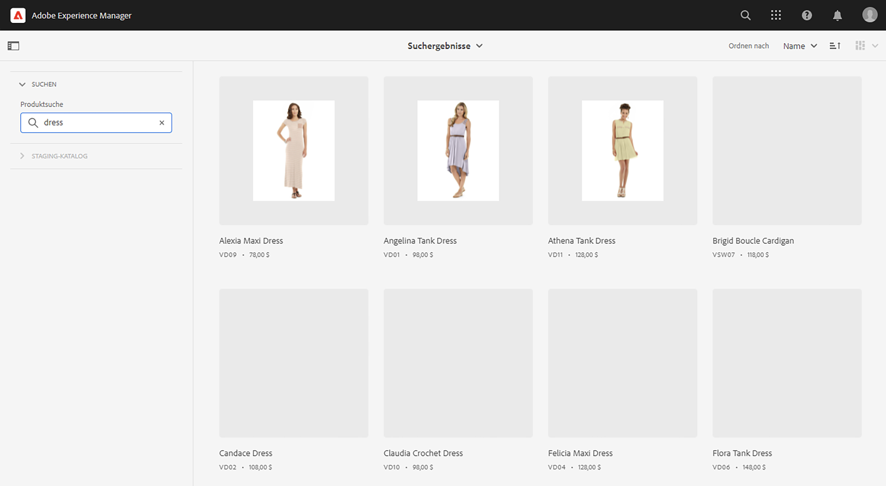
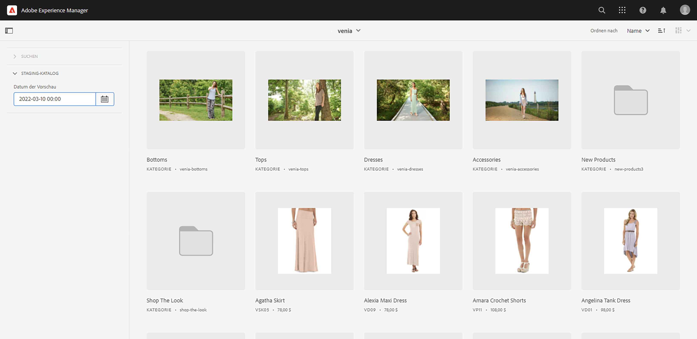
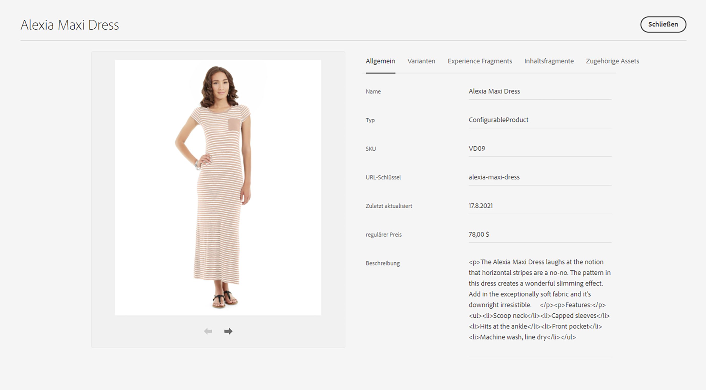
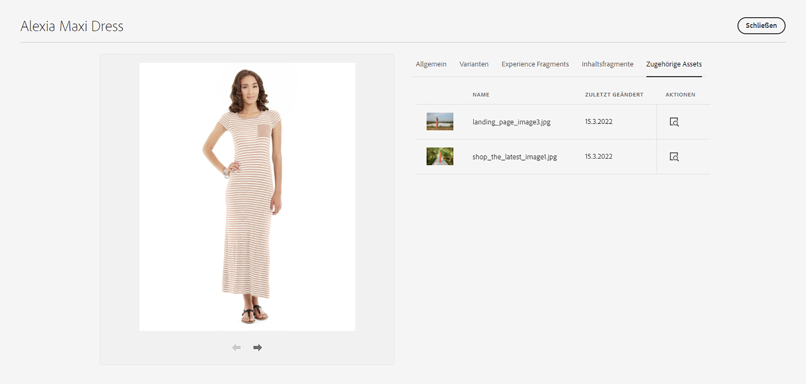

# Produkt-Cockpit {#product-cockpit}

## Übersicht {#overview}

Das Produkt-Cockpit bietet einen einheitlichen Überblick über verknüpfte Produktkataloge und zugehörige Inhalte. Alle zugehörigen Inhalte verfügen über Links, über die Sie schnell vom Cockpit aus darauf zugreifen können.

Staging-Produktdaten beinhalten zukünftig jede Mutation wie neue Kategorien, Produkte oder aktualisierte Eigenschaften.

>[!NOTE]
>
>Der Begriff „Produktkatalog“ ist gleichbedeutend mit „Handels-Shop“, „Store-Ansicht“ und ähnlichen Ausdrücken.

## Konfiguration {#configuration}

Produktkataloge müssen in AEM konfiguriert werden. Siehe [Konfigurieren von Shops und Katalogen](https://experienceleague.adobe.com/docs/experience-manager-cloud-service/content/content-and-commerce/storefront/getting-started.html?lang=de#catalog) für weitere Informationen.

Das Aktivieren von gestaffelten Katalogfunktionen erfordert eine Authentifizierung. Siehe [Erste Schritte](https://experienceleague.adobe.com/docs/experience-manager-cloud-service/content/content-and-commerce/storefront/getting-started.html?lang=de) für weitere Informationen.

>[!NOTE]
>
>Gestaffelte Katalogfunktionen sind nur mit Adobe Commerce und Connectoren von Drittanbietern verfügbar, die eine Token-basierte Authentifizierung unterstützen.

## Öffnen des Produkt-Cockpits {#opening-product-cockpit}

Der einfachste Weg, auf das Produkt-Cockpit zuzugreifen, ist über das Menü „Commerce“ im AEM-Hauptmenü. Es ist auch möglich, Omnisearch (Suche nach „Commerce“) zu verwenden oder `https://<yourAEMInstance>/commerce.html` zu öffnen.

## Durchsuchen von Produktkatalogen {#browsing-product-catalogs}

Das Produkt-Cockpit ist hierarchisch nach der Produktkatalogstruktur organisiert. Die erste Ebene zeigt die Katalogstammebene aller konfigurierten Produktkataloge einschließlich Metadaten des Commerce-Backends.

Durch Klicken auf eine Kategorie werden die untergeordneten Elemente der angeklickten Kategorie geladen.

Wenn Sie auf ein Produkt klicken, werden Produktvarianten geladen, sofern verfügbar.

>[!NOTE]
>
>Produktkatalogdaten in AEM sind Daten, die in Echtzeit über den konfigurierten Commerce-Endpunkt abgerufen werden. In AEM werden keine Produktkatalogdaten gespeichert.

## Durchsuchen von Produktkatalogen {#searching-product-catalog}

Eine Volltextsuche über den gesamten Produktkatalog wird auf der linken Filter-Registerkarte angeboten, um Produkte schnell zu finden.

## Durchsuchen des gestaffelten Produktkatalogs {#staged-product-catalogs}

Standardmäßig zeigt das Produkt-Cockpit Live-Produktkatalogdaten an. Mithilfe von „STAGED CATALOG“ auf der linken Filterseite wird der Produktkatalog für jedes ausgewählte Datum geladen.

## Eigenschaften des Produktkatalogs {#catalog-properties}

Durch Klicken auf das Eigenschaftensymbol eines Produkts oder einer Kategorie wird die Eigenschaftenansicht des ausgewählten Objekts geöffnet. Das Öffnen der Eigenschaften einer Produktvariante ist gleichbedeutend mit dem Öffnen der Haupteigenschaften des Produkts.

### Registerkarten „Commerce“ {#tabs}

Die Registerkarten „Allgemein“ und „Varianten“ zeigen vordefinierte Commerce-Eigenschaften, die aus dem Commerce-Backend stammen. Diese Daten (einschl. Varianten) sind schreibgeschützte Daten in AEM, da das Aufzeichnungssystem das Commerce-Backend ist. Die Registerkarte „Varianten“ wird nur für Produkte mit Varianten angezeigt und enthält eine Liste aller Varianten.

### AEM-Inhaltsregisterkarten {#content-tabs}

Diese Registerkarten, gruppiert nach AEM Inhaltstypen (Experience Fragments, Inhaltsfragmente, zugehörige Assets), zeigen AEM-Inhalte an, die mit dem Commerce-Objekt verknüpft sind. Durch die Aktion „Details anzeigen“ wird eine neue Browser-Registerkarte mit dem ausgewählten Inhalt geöffnet.

