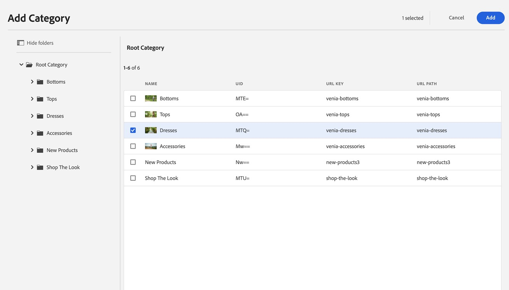

# Authoring von Commerce-Erlebnissen {#authoring-commerce-experiences}

## Übersicht {#overview}

Das CIF-Add-on erweitert die Bearbeitung in AEM mit Commerce-spezifischen Funktionen. Dadurch können Autoren Commerce-bezogene Erlebnisse effizient erstellen und verwalten, indem sie Zugriff auf Produktdaten und Inhalte erhalten, ohne den Kontext verlassen zu müssen.

## Auswahloptionen {#pickers}

Produkt- und Kategorieauswahloptionen sind Dialogfelder der modalen Benutzeroberfläche, mit denen AEM-Autoren bei Bedarf Produkte oder Kategorien finden und auswählen können. Kernkomponenten, Inhaltsverknüpfung und Produktvorlagen sind die typischen Bereiche mit Konfigurationen, für die Produktkatalogdaten erforderlich sind. Auswahloptionen unterstützen verschiedene Konfigurationsoptionen, z. B. Mehrfachauswahl, Variantenauswahl und Vorabauswahl von Werten.

### Produktauswahl {#product-picker}

Diese Auswahl bietet die Möglichkeit, durch die Katalogstruktur oder die Volltextsuche zu navigieren, um das Produkt zu finden. Produkte mit Variante bieten in der Spalte „Typ“ ein Ordnersymbol. Durch Klicken auf das Ordnersymbol werden die Varianten des ausgewählten Produkts geöffnet.

Durch Klicken auf die übergeordnete Kategorie kehrt der Autor zur Produktebene zurück.

#### Beispiel für Produkt-Teaser {#example-product-teaser}

Das Konfigurationsdialogfeld dieser Komponente erfordert ein Produkt. CIF verwendet die SKU als Produktkennung. Autorinnen und Autoren können entweder die SKU manuell eingeben oder auf das Ordnersymbol klicken, um die Produktauswahl zu öffnen. Nach dem Auswählen und Schließen der Auswahl zeigt das Komponentendialogfeld den Namen des ausgewählten Produkts an.

### Kategorieauswahl {#category-picker}

Mit dieser Auswahl können Sie die Katalogstruktur durchsuchen, um die Kategorie zu finden.

#### Beispiel für Kategoriekarussell {#example-carousel}

Das Konfigurationsdialogfeld dieser Komponente erfordert 1:n Kategorien. CIF verwendet die UID/ID als Kategoriekennung. Autorinnen und Autoren können entweder die UID manuell eingeben oder auf das Ordnersymbol klicken, um die Kategorieauswahl zu öffnen. Nach dem Auswählen und Schließen der Auswahl zeigt das Komponentendialogfeld den Namen der ausgewählten Kategorie an.

## Seiteneditor {#page-editor}

Der Seiteneditor in AEM wird um Funktionen erweitert, mit denen Sie auf die Echtzeit-Produktdaten und die zugehörigen Produktinhalte zugreifen können.

### Zugreifen auf Produktdaten {#access-product-data}

Die Registerkarte „Elemente“ im Seitenbereich des Editors bietet Zugriff auf Produktdaten, indem der Typ „Produkte“ ausgewählt wird. Die Daten werden live vom konfigurierten Commerce-Endpunkt abgerufen. Der Filter ist eine Volltextsuche auf dem Commerce-Endpunkt, um nach bestimmten Produkten zu suchen.

Analog zu Elementen können Produkte (wodurch standardmäßig eine Produkt-Teaser-Komponente erstellt wird) oder Komponenten (derzeit werden Produkt-Teaser und Produktkarussell unterstützt) auf einer Seite hinzugefügt werden.

### Hinzufügen von Links in Textfeldern mithilfe von RTE {#rte}

CIF-Produktkatalogseiten sind virtuelle Seiten, die dynamisch gerendert werden. Daher ist das Einbetten von Hyperlinks wie bei regulären AEM-Seiten nicht möglich. CIF fügt eine neue Aktion für Commerce-Links zum RTE (Rich-Text-Editor) hinzu. Diese Aktion funktioniert genau wie die normale Aktion „Hyperlink“, ermöglicht es Autoren jedoch, entweder ein Produkt oder eine Kategorie mithilfe der Auswahl auszuwählen.

>[!NOTE]
>
> Wenn sowohl Kategorie als auch Produkt ausgewählt werden, wird das Produkt verwendet.

Dadurch wird ein Platzhalter-Link erstellt, der beim Rendern der Seite durch einen echten Link ersetzt wird.

### Zugreifen auf zugehörige Produktinhalte {#associated-content}

Wenn der Editor 1:n Produkte auf einer Seite erkennt, wird im Seitenbereich automatisch die Registerkarte „Zugehörige Commerce-Inhalte“ angezeigt. Auf dieser Registerkarte können Autorinnen und Autoren schnell auf AEM-Inhalte zugreifen, die mit dem Produkt getaggt wurden. Weitere Informationen finden Sie unter [Anreichern von Produktdaten mit zugehörigen AEM-Inhalten](/help/commerce-cloud/cif-storefront/authoring/enrich-product-associated-content.md). Auf dieser Registerkarte finden Sie Dropdown-Listen, mit denen nach Content-Typ und bestimmten Produkten gefiltert werden kann, wenn sich mehrere Produkte auf der Seite befinden. Die Verwendung des Inhalts funktioniert wie die Verwendung von Inhalt auf der Registerkarte „Elemente“.

### Vorschau von gestaffelten Produktdaten {#staged-data}

Der Timewarp-Modus im Editor ermöglicht es Autoren, ein AEM-Erlebnis mit gestaffelten Produktkatalogdaten basierend auf dem Timewarp-Datum in der Vorschau anzuzeigen und zu durchsuchen.

Komponenten zeigen einen visuellen Indikator an, wenn das verwendete Datum gestaffelt ist.

## Omnisearch {#omnisearch}

Die Verwendung von Omnisearch ist eine einfache Möglichkeit für Anwender, AEM-Inhalt und Produktkatalogdaten mithilfe der Volltextsuche zu finden. Omnisearch führt die Volltextsuche in AEM und im Commerce-Backend durch, um Produktkatalogobjekte im Commerce-Backend und AEM-Inhalt zu finden. AEM Ergebnisse umfassen auch Inhalte, die mit Produkt-/Kategoriedaten getaggt wurden.

Das Ergebnis wird nach Typ gruppiert.

>[!NOTE]
>
> Volltextsuche in Omnisearch unterstützt keine verknüpften Inhaltsfragmente. Verwenden Sie SKU oder UID, um verknüpfte Inhaltsfragmente zu finden.
