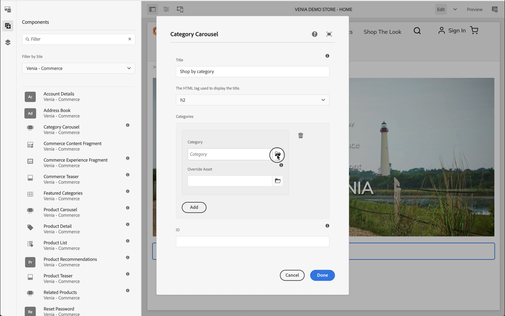

# Erste Schritte mit AEM-CIF-Authoring {#getting-started}

Lernen Sie Adobe Experience Manager (AEM) CIF-Authoring kennen.

## Ihre bisherige Tour {#story-so-far}

Im vorherigen Dokument dieser AEM Content and Commerce Journey, [Erfahren Sie mehr über AEM Content and Commerce](/help/commerce-cloud/cif-storefront/introduction.md), haben Sie die Grundtheorie und -konzepte von Headless CMS und AEM Content and Commerce kennengelernt.

Dieser Artikel baut auf diesen Grundlagen auf.

## Ziel {#objective}

In diesem Dokument erfahren Sie, wie Sie CIF für das Authoring in Content and Commerce verwenden. Nach dem Lesen sollten Sie Folgendes können:

* Verstehen der Konzepte des CIF-Authorings mit dem Seiteneditor in AEM
* Zugreifen auf Produktkatalogdaten in AEM mithilfe von Produkt- und Kategorieauswahlelementen
* Zugreifen auf Inhalts- und Commerce-Daten mithilfe des Produkt-Cockpits und AEM Omnisearch

## CIF-Authoring im AEM-Seiteneditor {#cif-authoring}

CIF erweitert den Seiteneditor in AEM um Funktionen, um auf die Echtzeit-Produktdaten zuzugreifen, ohne den Kontext zu verlassen:

Öffnen Sie den Seitenbereich und wählen Sie „Produkte“ aus der Dropdown-Liste aus.

Sie können den Produktkatalog durchsuchen oder das Feld für die Volltextsuche verwenden, um Produkte zu finden.

Produkte können auf Komponenten, die dies unterstützen (z. B. Produkt-Teaser, Produktkarussell), direkt auf der Seite abgelegt werden. Dadurch wird automatisch eine Produkt-Teaser-Komponente erstellt.

## Produkt- und Kategorieauswahl {#pickers}

Wenn Produkt- und Kategoriedaten in Commerce-Komponenten oder AEM-Back-Office-Dialogfeldern erforderlich sind, können AEM-Autoren Auswahlelemente verwenden. Dies sind Benutzeroberflächenelemente, mit den Produktkatalogdaten bequem gesucht und ausgewählt werden können.

### Produktauswahl {#product-picker}

Wenn Sie auf das Ordnersymbol klicken, wird die modale Benutzeroberfläche der Auswahl geöffnet (z. B. Produkt-Teaser).

Produkte können über die Katalogstruktur auf der linken Seite oder über die Suche gefunden werden. Die Volltextsuche berücksichtigt die ausgewählte Kategorie und beschränkt die Suchergebnisse auf diese Kategorie.

Produkte mit Varianten werden mit einem Ordnersymbol gekennzeichnet, auf das Sie klicken können, um alle Varianten anzuzeigen.

### Kategorieauswahl {#category-picker}

Funktioniert wie eine Produktauswahl. Wenn Sie auf das Ordnersymbol klicken, wird die modale Benutzeroberfläche der Auswahl geöffnet (z. B. Kategoriekarussell).

Durchsuchen Sie die Katalogstruktur links und wählen Sie die Kategorie aus.

## Produkt-Cockpit {#cockpit}

Das Produkt-Cockpit ist ein zentraler Ort, um schnell auf den Produktkatalog mit allen angereicherten Inhalten zuzugreifen. In einem der nächsten Module erfahren Sie, wie Sie Produktdaten mit Inhalten anreichern. Zunächst konzentrieren wir uns auf den Zugriff auf Produktdaten.

Klicken Sie im Hauptmenü auf „Commerce“, um eine Liste aller angehängten Produktkataloge anzuzeigen.

Hier wird eine Liste aller verbundenen Produktkataloge angezeigt.

Der Produktkatalog zeigt standardmäßig alle Kategorien der ersten Ebene mit allen Produkten an. Wenn Sie auf eine Kategorie klicken, wird diese Kategorie mit allen zugehörigen Produkten und Unterkategorien, einschließlich ihrer Produkte, geöffnet.

Sie können die Produkteigenschaften öffnen, indem Sie auf das Eigenschaftssymbol klicken. Das Symbol wird angezeigt, wenn Sie den Mauszeiger über eine Produktkachel bewegen.

Alle Produkteigenschaften sind schreibgeschützt, da die Daten in Echtzeit vom verbundenen Backend geladen werden. Das Ändern der Produkteigenschaften muss im Backend-System vorgenommen werden, das als Aufzeichnungssystem dient. Die Registerkarte **Varianten** wird nur angezeigt, wenn das Produkt Varianten aufweist. Durch Klicken auf die Registerkarte werden alle Varianten mit ihren Attributen angezeigt.

Die übrigen Registerkarten zeigen alle AEM-Inhalte an, die mit dem Produkt verknüpft sind. Diese Registerkarten werden in einem der nächsten Module beschrieben.

## AEM Omnisearch {#omnisearch}

Die Verwendung von Omnisearch ist eine einfache Möglichkeit, AEM-Inhalte mithilfe der Volltextsuche zu finden. CIF erweitert Omnisearch um die Volltextsuche in Produktkatalogen mit den zugehörigen AEM-Inhalten.

Omnisearch führt eine Volltextsuche im Commerce-Backend durch, um alle zugehörigen Produkte zu finden. Das Ergebnis wird unter **Alle Produkte anzeigen** aufgeführt. Omnisearch durchsucht auch AEM nach Inhalten, die mit dem gesuchten Produkt verknüpft sind. Die Ergebnisse werden in den jeweiligen AEM-Kategorien aufgelistet. In diesem Beispiel ist ein Inhaltsfragment mit dem Produkt verknüpft.

## Wie geht es weiter {#what-is-next}

Nachdem Sie nun diesen Teil der Tour abgeschlossen haben, sollten Sie:

* die Konzepte des CIF-Authorings mit dem Seiteneditor verstehen
* Zugreifen auf den Produktkatalog in AEM mithilfe von Produkt- und Kategorieauswahlelementen
* Zugreifen auf Inhalts- und Commerce-Daten mithilfe des Produkt-Cockpits und AEM Omnisearch

Nutzen Sie diese Kenntnisse und fahren Sie mit dem Journey fort, indem Sie als Nächstes das Dokument [Verwalten von Produktkatalogseiten und -vorlagen](/help/commerce-cloud/cif-storefront/commerce-journeys/aem-commerce-content-author/catalog-templates.md) lesen, in dem Sie lernen, wie Sie Ihr erstes Produktkatalogerlebnis erstellen und anpassen.

## Zusätzliche Ressourcen {#additional-resources}

Es wird empfohlen, mit dem nächsten Teil der Journey fortzufahren - [Verwalten von Produktkatalogseiten und -vorlagen](/help/commerce-cloud/cif-storefront/commerce-journeys/aem-commerce-content-author/catalog-templates.md). Im Folgenden finden Sie einige optionale Ressourcen, die einige der hier erwähnten Konzepte vertiefen. Diese optionalen Ressourcen sind jedoch nicht erforderlich, um die Tour fortzusetzen.

* [Konfigurieren von Stores und Katalogen](/help/commerce-cloud/cif-storefront/getting-started.md#catalog)
