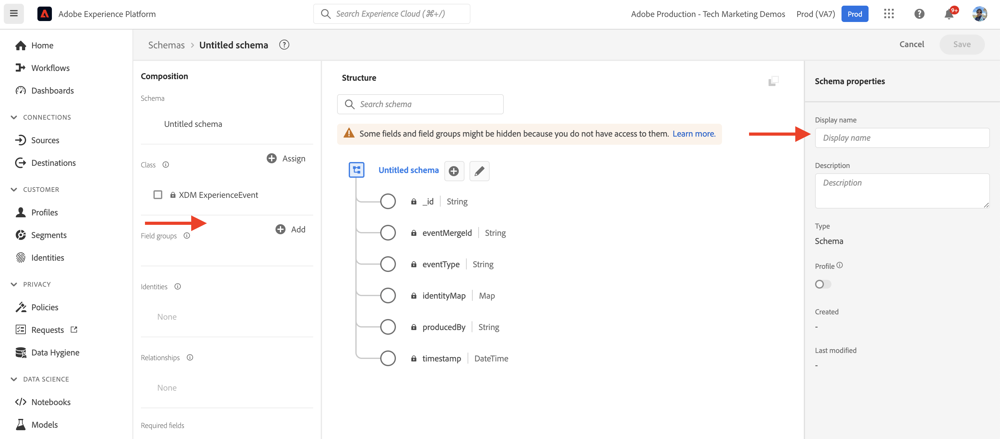
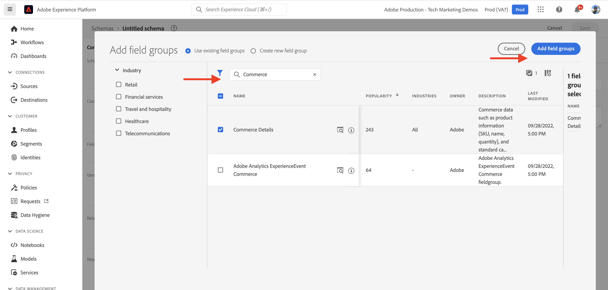

# AEM-CIF-Kernkomponenten und Integration mit Adobe Experience Platform {#aem-cif-aep-integration}

Die Kernkomponenten des [Commerce Integration Framework (CIF)](https://github.com/adobe/aem-core-cif-components) bieten eine nahtlose Integration mit [Adobe Experience Platform](https://experienceleague.adobe.com/docs/experience-platform/landing/platform-overview.html), um Storefront-Ereignisse und deren Daten aus Client-seitigen Interaktionen, z. B. __zum Warenkorb hinzufügen__, weiterzuleiten.

Das Projekt [CIF-Kernkomponenten für AEM](https://github.com/adobe/aem-core-cif-components) stellt eine JavaScript-Bibliothek mit dem Namen [Adobe Experience Platform Connector für Adobe Commerce](https://github.com/adobe/aem-core-cif-components/tree/master/extensions/experience-platform-connector) zur Verfügung, um Ereignisdaten aus Ihrer Commerce-Storefront zu erfassen. Diese Ereignisdaten werden an Experience Platform gesendet. Dort werden sie in anderen Adobe Experience Cloud-Produkten wie Adobe Analytics und Adobe Target zum Erstellen eines 360-Grad-Profils verwendet, das eine Customer Journey abdeckt. Durch die Verbindung von Commerce-Daten mit anderen Produkten in Adobe Experience Cloud können Sie Aufgaben wie die Analyse des Benutzerverhaltens auf Ihrer Site, AB-Tests und die Erstellung personalisierter Kampagnen durchführen.

Hier finden Sie weitere Informationen zur [Experience Platform Data Collection](https://experienceleague.adobe.com/docs/experience-platform/collection/home.html?lang=de), einer Zusammenstellung von Technologien, mit denen Sie Kundenerlebnisdaten aus Client-seitigen Quellen erfassen können.

## Senden von `addToCart`-Ereignisdaten an Experience Platform {#send-addtocart-to-aep}

Die folgenden Schritte zeigen, wie Sie `addToCart`-Ereignisdaten von mit AEM gerenderten Produktseiten mithilfe des CIF Experience Platform-Connectors an Experience Platform senden können. Mithilfe der Browser-Erweiterung „Adobe Experience Platform Debugger“ können Sie die gesendeten Daten testen und überprüfen.


## Voraussetzungen {#prerequisites}

Verwenden Sie eine lokale Entwicklungsumgebung, um diese Demo abzuschließen. Dazu gehört eine laufende Instanz von AEM, die konfiguriert und mit einer Adobe Commerce-Instanz verbunden ist. Überprüfen Sie die Anforderungen und Schritte zum [Einrichten einer lokalen Entwicklungsumgebung mit AEM as a Cloud Service SDK.](/help/commerce-cloud/cif-storefront/develop.md)

Sie benötigen außerdem Zugriff auf [Adobe Experience Platform](https://experienceleague.adobe.com/docs/experience-platform/landing/platform-ui/ui-guide.html?lang=de) und Berechtigungen zum Erstellen des Schemas, des Datensatzes und der Datenströme für die Datenerfassung. Weitere Informationen finden Sie unter [Berechtigungsverwaltung.](https://experienceleague.adobe.com/docs/experience-platform/collection/permissions.html?lang=de)

## Einrichten von AEM Commerce as a Cloud Service {#aem-setup}

Um eine funktionierende lokale Umgebung für __AEM Commerce as a Cloud Service__ mit dem notwendigen Code und der richtigen Konfiguration einzurichten, führen Sie die folgenden Schritte aus.

### Lokales Setup

Befolgen Sie die unter [Lokales Setup](/help/commerce-cloud/cif-storefront/develop.md#local-setup) angegebenen Schritte, um eine funktionierende AEM Commerce as a Cloud Service-Umgebung zu erhalten.

### Projekt-Setup

Befolgen Sie die unter [AEM Projektarchetyp](/help/commerce-cloud/cif-storefront/develop.md#project) angegebenen Schritte, um ein brandneues AEM Commerce(CIF)-Projekt anzulegen.

>[!TIP]
>
>Im folgenden Beispiel trägt das AEM Commerce-Projekt den Namen `My Demo Storefront`. Sie können jedoch Ihren eigenen Projektnamen auswählen.


Erstellen Sie das angelegte AEM Commerce-Projekt und stellen Sie es im lokalen AEM SDK bereit, indem Sie den folgenden Befehl aus dem Stammverzeichnis des Projekts ausführen.

```bash
$ mvn clean install -PautoInstallSinglePackage
```

Die lokal bereitgestellte Commerce-Site `My Demo StoreFront` mit Standard-Code und Standardinhalt sieht wie folgt aus:


### Installation der Connector-Abhängigkeiten von Peregrine und CIF-AEP

Um die Ereignisdaten von den Kategorie- und Produktseiten dieser AEM Commerce-Site zu erfassen und zu senden, installieren Sie die `npm`-Schlüsselpakete in das Modul `ui.frontend` des AEM Commerce-Projekts.

Navigieren Sie zum Modul `ui.frontend` und installieren Sie die erforderlichen Pakete, indem Sie die folgenden Befehle über die Befehlszeile ausführen.

```bash
npm i --save lodash.get@^4.4.2 lodash.set@^4.3.2
npm i --save apollo-cache-persist@^0.1.1
npm i --save redux-thunk@~2.3.0
npm i --save @adobe/apollo-link-mutation-queue@~1.1.0
npm i --save @magento/peregrine@~12.5.0
npm i --save @adobe/aem-core-cif-react-components --force
npm i --save-dev @magento/babel-preset-peregrine@~1.2.1
npm i --save @adobe/aem-core-cif-experience-platform-connector --force
```

>[!IMPORTANT]
>
>Mitunter ist das Argument `--force` erforderlich, da [PWA Studio](https://developer.adobe.com/commerce/pwa-studio/) gegenüber den unterstützten Peer-Abhängigkeiten restriktiv ist. Normalerweise sollte dies keine Probleme verursachen.


### Konfigurieren von Maven für die Verwendung des Arguments `--force`

Im Rahmen des Build-Prozesses von Maven wird die bereinigte npm-Installation (mithilfe von `npm ci`) ausgelöst. Dies erfordert auch das Arument `--force`.

Navigieren Sie zur POM-Datei `pom.xml` im Stammverzeichnis des Projekts und suchen Sie nach dem Ausführungsblock `<id>npm ci</id>`. Aktualisieren Sie den Block so, dass er wie folgt aussieht:

```xml
<execution>
    <id>npm ci</id>
    <goals>
    <goal>npm</goal>
    </goals>
    <configuration>
    <arguments>ci --force</arguments>
    </configuration>
</execution>
```

### Ändern des Babel-Konfigurationsformats

Wechseln Sie von der standardmäßigen Datei `.babelrc` für das Konfigurationsdateiformat zum Format `babel.config.js`. Dies ist ein projektweit gültiges Konfigurationsformat, das ermöglicht, die Plug-ins und Vorgaben mit besserer Steuerungsmöglichkeit auf `node_module` anzuwenden.

1. Navigieren Sie zum `ui.frontend`-Modul und löschen Sie die vorhandene Datei `.babelrc`.

1. Erstellen Sie eine Datei `babel.config.js`, die die Voreinstellung `peregrine` verwendet.

   ```javascript
   const peregrine = require('@magento/babel-preset-peregrine');
   
   module.exports = (api, opts = {}) => {
       const config = {
           ...peregrine(api, opts),
           sourceType: 'unambiguous'
       } 
   
       config.plugins = config.plugins.filter(plugin => plugin !== 'react-refresh/babel');
   
       return config;
   }
   ```

### Konfigurieren von Webpack für die Verwendung von Babel

Um die JavaScript-Dateien mit dem Babel-Lader (`babel-loader`) und Webpack zu transpilieren, bearbeiten Sie die Datei `webpack.common.js`.

Navigieren Sie zum Modul `ui.frontend` und aktualisieren Sie die Datei `webpack.common.js` so, dass die folgende Regel im `module`-Eigenschaftswert eingeschlossen ist:

```javascript
{
    test: /\.jsx?$/,
    exclude: /node_modules\/(?!@magento\/)/,
    loader: 'babel-loader'
}
```

### Konfigurieren des Apollo-Clients

Der [Apollo-Client](https://www.apollographql.com/docs/react/) wird verwendet, um sowohl lokale Daten als auch Remote-Daten mit GraphQL zu verwalten. Außerdem speichert er die Ergebnisse von GraphQL-Abfragen in einem lokalen, normalisierten Arbeitsspeichercache.

Damit [`InMemoryCache`](https://www.apollographql.com/docs/react/caching/cache-configuration/) effektiv arbeitet, benötigen Sie eine Datei `possibleTypes.js`. Informationen zum Generieren dieser Datei finden Sie unter [Automatisches Generieren möglicher Typen.](https://www.apollographql.com/docs/react/data/fragments/#generating-possibletypes-automatically)

Siehe auch [PWA Studio-Referenzimplementierung](https://github.com/magento/pwa-studio/blob/1977f38305ff6c0e2b23a9da7beb0b2f69758bed/packages/pwa-buildpack/lib/Utilities/graphQL.js#L106-L120), wo Sie ein Beispiel für eine Datei [`possibleTypes.js`](../assets/aep-integration/possibleTypes.js) finden.

1. Navigieren Sie zum `ui.frontend`-Modul und speichern Sie die Datei als `./src/main/possibleTypes.js`

1. Aktualisieren Sie den Abschnitt `DefinePlugin` der Datei `webpack.common.js`, um die erforderlichen statischen Variablen zum Zeitpunkt der Erstellung zu ersetzen.

   ```javascript
   const { DefinePlugin } = require('webpack');
   const { POSSIBLE_TYPES } = require('./src/main/possibleTypes');
   
   ...
   
   plugins: [
       ...
       new DefinePlugin({
           'process.env.USE_STORE_CODE_IN_URL': false,
           POSSIBLE_TYPES
       })
   ]
   ```

### Initialisieren der Peregrine- und CIF-Kernkomponenten

Um die React-basierten Peregrine- und CIF-Kernkomponenten zu initialisieren, erstellen Sie die erforderlichen Konfigurations- und JavaScript-Dateien.

1. Navigieren Sie zum `ui.frontend`-Modul und erstellen Sie den folgenden Ordner: `src/main/webpack/components/commerce/App`

1. Erstellen Sie eine `config.js`-Datei mit folgendem Inhalt:

   ```javascript
   // get and parse the CIF store configuration from the <head>
   const storeConfigEl = document.querySelector('meta[name="store-config"]');
   const storeConfig = storeConfigEl ? JSON.parse(storeConfigEl.content) : {};
   
   // the following global variables are needed for some of the peregrine features
   window.STORE_VIEW_CODE = storeConfig.storeView || 'default';
   window.AVAILABLE_STORE_VIEWS = [
       {
           code: window.STORE_VIEW_CODE,
           base_currency_code: 'USD',
           default_display_currency_code: 'USD',
           id: 1,
           locale: 'en',
           secure_base_media_url: '',
           store_name: 'My Demo StoreFront'
       }
   ];
   window.STORE_NAME = window.STORE_VIEW_CODE;
   window.DEFAULT_COUNTRY_CODE = 'en';
   
   export default {
       storeView: window.STORE_VIEW_CODE,
       graphqlEndpoint: storeConfig.graphqlEndpoint,
       // Can be GET or POST. When selecting GET, this applies to cache-able GraphQL query requests only.
       // Mutations will always be executed as POST requests.
       graphqlMethod: storeConfig.graphqlMethod,
       headers: storeConfig.headers,
   
       mountingPoints: {
           // TODO: define the application specific mount points as they may be used by <Portal> and <PortalPlacer>
       },
       pagePaths: {
           // TODO: define the application specific paths/urls as they may be used by the components
           baseUrl: storeConfig.storeRootUrl
       },
       eventsCollector: {
           eventForwarding: {
               acds: true,
               aep: false,
           }
       }
   };
   ```

   >[!IMPORTANT]
   >
   >Vielleicht kennen Sie bereits die Datei [`config.js`](https://github.com/adobe/aem-cif-guides-venia/blob/main/ui.frontend/src/main/components/App/config.js) aus __AEM Guides – CIF Venia Project__. An dieser Datei müssen Sie einige Änderungen vornehmen. Überprüfen Sie zunächst alle __TODO__-Kommentare. Anschließend suchen Sie innerhalb der Eigenschaft `eventsCollector` nach dem `eventsCollector > aep`-Objekt und aktualisieren die Eigenschaften `orgId` und `datastreamId` auf die korrekten Werte. [Weitere Informationen](#add-aep-values-to-aem)

1. Erstellen Sie eine Datei `App.js` mit folgendem Inhalt. Diese Datei ähnelt einer typischen React-App-Startpunktdatei und enthält React- und benutzerdefinierte Hooks sowie die Verwendung von React Context, um die Integration von Experience Platform zu erleichtern.

   ```javascript
   import config from './config';
   
   import React, { useEffect } from 'react';
   import ReactDOM from 'react-dom';
   import { IntlProvider } from 'react-intl';
   import { BrowserRouter as Router } from 'react-router-dom';
   import { combineReducers, createStore } from 'redux';
   import { Provider as ReduxProvider } from 'react-redux';
   import { createHttpLink, ApolloProvider } from '@apollo/client';
   import { ConfigContextProvider, useCustomUrlEvent, useReferrerEvent, usePageEvent, useDataLayerEvents, useAddToCartEvent } from '@adobe/aem-core-cif-react-components';
   import { EventCollectorContextProvider, useEventCollectorContext } from '@adobe/aem-core-cif-experience-platform-connector';
   import { useAdapter } from '@magento/peregrine/lib/talons/Adapter/useAdapter';
   import { customFetchToShrinkQuery } from '@magento/peregrine/lib/Apollo/links';
   import { BrowserPersistence } from '@magento/peregrine/lib/util';
   import { default as PeregrineContextProvider } from '@magento/peregrine/lib/PeregrineContextProvider';
   import { enhancer, reducers } from '@magento/peregrine/lib/store';
   
   const storage = new BrowserPersistence();
   const store = createStore(combineReducers(reducers), enhancer);
   
   storage.setItem('store_view_code', config.storeView);
   
   const App = () => {
       const [{ sdk: mse }] = useEventCollectorContext();
   
       // trigger page-level events
       useCustomUrlEvent({ mse });
       useReferrerEvent({ mse });
       usePageEvent({ mse });
       // listen for add-to-cart events and enable forwarding to the magento storefront events sdk
       useAddToCartEvent(({ mse }));
       // enable CIF specific event forwarding to the Adobe Client Data Layer
       useDataLayerEvents();
   
       useEffect(() => {
           // implement a proper marketing opt-in, for demo purpose you hard-set the consent cookie
           if (document.cookie.indexOf('mg_dnt') < 0) {
               document.cookie += '; mg_dnt=track';
           }
       }, []);
   
       // TODO: use the App to create Portals and PortalPlaceholders to mount the CIF / Peregrine components to the server side rendered markup
       return <></>;
   };
   
   const AppContext = ({ children }) => {
       const { storeView, graphqlEndpoint, graphqlMethod = 'POST', headers = {}, eventsCollector } = config;
       const { apolloProps } = useAdapter({
           apiUrl: new URL(graphqlEndpoint, window.location.origin).toString(),
           configureLinks: (links, apiBase) =>
               // reconfigure the HTTP link to use the configured graphqlEndpoint, graphqlMethod and storeView header
   
               links.set('HTTP', createHttpLink({
                   fetch: customFetchToShrinkQuery,
                   useGETForQueries: graphqlMethod !== 'POST',
                   uri: apiBase,
                   headers: { ...headers, 'Store': storeView }
               }))
       });
   
       return (
           <ApolloProvider {...apolloProps}>
               <IntlProvider locale='en' messages={{}}>
                   <ConfigContextProvider config={config}>
                       <ReduxProvider store={store}>
                           <PeregrineContextProvider>
                               <EventCollectorContextProvider {...eventsCollector}>
                                   {children}
                               </EventCollectorContextProvider>
                           </PeregrineContextProvider>
                       </ReduxProvider>
                   </ConfigContextProvider>
               </IntlProvider>
           </ApolloProvider>
       );
   };
   
   window.onload = async () => {
       const root = document.createElement('div');
       document.body.appendChild(root);
   
       ReactDOM.render(
           <Router>
               <AppContext>
                   <App />
               </AppContext>
           </Router>,
           root
       );
   };
   ```

   `EventCollectorContext` exportiert den React Context, der

   - die Bibliotheken „commerce-events-sdk“ und „commerce-events-collection“ lädt,
   - sie mit einer bestimmten Konfiguration für Experience Platform und/oder ACDS initialisiert,
   - alle Ereignisse von Peregrine abonniert und an den Ereignis-SDK weiterleitet.

   Sie können sich die Details der Implementierung von `EventCollectorContext` anschauen. Siehe [aem-core-cif-components auf GitHub.](https://github.com/adobe/aem-core-cif-components/blob/3d4e44d81fff2f398fd2376d24f7b7019f20b31b/extensions/experience-platform-connector/src/events-collector/EventCollectorContext.js)

### Erstellen und Bereitstellen des aktualisierten AEM-Projekts {#build-and-deploy}

Um sicherzustellen, dass die vorstehend angegebenen Änderungen an Paketinstallation, Code und Konfiguration korrekt sind, erstellen Sie das aktualisierte AEM Commerce-Projekt neu und stellen Sie es mithilfe des folgenden Maven-Befehls bereit: `$ mvn clean install -PautoInstallSinglePackage`.

## Setup von Experience Platform {#aep-setup}

Um die von den AEM Commerce-Seiten kommenden Ereignisdaten, wie etwa Kategorie und Produkt, zu empfangen und zu speichern, führen Sie die folgenden Schritte vollständig aus:

>[!AVAILABILITY]
>
>Stellen Sie sicher, dass Sie Teil der korrekten __Produktprofile__ unter __Adobe Experience Platform__ und __Adobe Experience Platform-Datenerfassung__ sind. Arbeiten Sie bei Bedarf mit Ihrem Systemadministrator zusammen, um „Produktprofile“ unter ____ Admin Console [&#x200B; erstellen, zu aktualisieren oder zuzuweisen](https://adminconsole.adobe.com/)

### Erstellen eines Schemas mit einer Commerce-Feldergruppe {#create-schema}

Um die Struktur für Commerce-Ereignisdaten zu definieren, müssen Sie ein Schema für ein Experience-Datenmodell (XDM) erstellen. Ein Schema ist ein Set von Regeln, das die Datenstruktur und das Datenformat darstellt und validiert.

1. Navigieren Sie im Browser zur Produkt-Startseite von __Adobe Experience Platform__. Beispiel: <https://experience.adobe.com/#/@YOUR-ORG-NAME/sname:prod/platform/home>.

1. Suchen Sie das Menü __Schemata__ im linken Navigationsbereich. Klicken Sie dann oben rechts auf die Schaltfläche __Schema erstellen__ und wählen Sie __XDM ExperienceEvent__.

   

1. Benennen Sie Ihr Schema mithilfe von __Schemaeigenschaften > Anzeigename__ und fügen Sie über die Schaltfläche  __Komposition > Feldergruppen > Hinzufügen__ Feldergruppen hinzu.

   

1. Suchen Sie im Dialogfeld __Feldergruppen hinzufügen__ nach `Commerce`, aktivieren Sie das Kontrollkästchen __Commerce-Details__ und klicken Sie auf __Feldergruppen hinzufügen__.

   


>[!TIP]
>
>Weiter Informationen finden Sie unter [Grundlagen der Schemakomposition](https://experienceleague.adobe.com/docs/experience-platform/xdm/schema/composition.html?lang=de).

### Erstellen eines Datensatzes {#create-dataset}

Um die Ereignisdaten zu speichern, müssen Sie einen Datensatz erstellen, der der Schemadefinition entspricht. Ein Datensatz ist ein Speicher- und Verwaltungskonstrukt für eine Sammlung von Daten, normalerweise eine Tabelle, die ein Schema (Spalten) und Felder (Zeilen) enthält.

1. Navigieren Sie im Browser zur Produkt-Startseite von __Adobe Experience Platform__. Beispiel: <https://experience.adobe.com/#/@YOUR-ORG-NAME/sname:prod/platform/home>.

1. Suchen Sie das Menü __Datensätze__ im linken Navigationsbereich und klicken Sie oben rechts auf die Schaltfläche __Datensatz erstellen__.

   

1. Wählen Sie auf der neuen Seite die Karte __Datensatz aus Schema erstellen__ aus.

   

   __Suchen und wählen__ Sie auf der neuen Seite das Schema aus, dass Sie im vorherigen Schritt erstellt haben, und klicken Sie auf __Weiter__.

   

1. Benennen Sie Ihren Datensatz, indem Sie das Feld __Datensatz konfigurieren > Name__ benutzen, und klicken Sie auf __Beenden__.

   

>[!TIP]
>
>Weitere Informationen finden Sie unter [Datensätze – Übersicht](https://experienceleague.adobe.com/docs/experience-platform/catalog/datasets/overview.html?lang=de).


### Datenstrom erstellen {#create-datastream}

Führen Sie die folgenden Schritte aus, um einen Datenstrom in Experience Platform zu erstellen.

1. Navigieren Sie im Browser zur Produkt-Startseite von __Adobe Experience Platform__. Beispiel: <https://experience.adobe.com/#/@YOUR-ORG-NAME/sname:prod/platform/home>.

1. Suchen Sie das Menü __Datenströme__ im linken Navigationsbereich und klicken Sie oben rechts auf __Neuer Datenstrom__.

   

1. Benennen Sie Ihren Datenstrom mithilfe des erforderlichen Feldes __Name__. Wählen Sie das erstellte Schema unter dem Feld __Ereignisschema__ aus und wählen Sie dann __Speichern__.

   

1. Öffnen Sie den erstellten Datenstrom und klicken Sie auf __Service hinzufügen__.

   

1. Wählen Sie unter dem Feld __Service__ die Option __Adobe Experience Platform__ aus. Wählen Sie unter dem Feld __Datensatzereignis__ den Datensatznamen aus dem vorherigen Schritt aus und klicken Sie auf __Speichern__.

   

>[!TIP]
>
>Weitere Informationen finden Sie unter [Datenströme – Übersicht](https://experienceleague.adobe.com/docs/experience-platform/datastreams/overview.html?lang=de).

## Hinzufügen des Datenstromwerts in die AEM Commerce-Konfiguration {#add-aep-values-to-aem}

Nach Abschluss des oben genannten Experience Platform-Setups sollten Sie `datastreamId` in der linken Leiste der Datenstromdetails und `orgId` in der oberen rechten Ecke des Modals __Profilbild > Kontoinformationen > Benutzerinformationen__ sehen.


1. Aktualisieren Sie im Modul `ui.frontend` des AEM Commerce-Projekts die Datei `config.js` und insbesondere die Eigenschaften des Objekts `eventsCollector > aep`.

1. Erstellen und Bereitstellen des aktualisierten AEM Commerce-Projekts


## Triggern des `addToCart`-Ereignisses und Überprüfen der Datenerfassung {#event-trigger-verify}

Mit den obigen Schritten ist die Einrichtung von AEM Commerce und Experience Platform abgeschlossen. Sie können jetzt ein Ereignis `addToCart` auslösen und die Datenerfassung mit der Google Chrome-Erweiterung _Snowplow Inspector_ sowie mit dem Datensatz-Umschalter __Metriken und Diagramme__ in der Produkt-Benutzeroberfläche überprüfen.

Um das Ereignis zu triggern, können Sie den AEM-Autor oder den Veröffentlichungs-Service Ihrer lokalen Einrichtung verwenden. Verwenden Sie für dieses Beispiel den AEM-Autor, indem Sie sich bei Ihrem Konto anmelden.

1. Wählen Sie auf der Sites-Seite die Seite __My Demo StoreFront > us > en__ und klicken Sie auf __Bearbeiten__ in der oberen Aktionsleiste.

1. Klicken Sie in der oberen Aktionsleiste auf __Als veröffentlicht anzeigen__ und klicken Sie dann in der Navigation der Storefront auf eine beliebige bevorzugte Kategorie.

1. Klicken Sie auf eine beliebige Produktkarte auf der __Produktseite__ und wählen Sie __Farbe, Größe__, um die Schaltfläche __Zum Warenkorb hinzufügen__ zu aktivieren.

1. Öffnen Sie im Erweiterungsbedienfeld des Browsers die Erweiterung __Snowplow Inspector__ und wählen Sie in der linken Leiste die Option __Experience Platform Web SDK__ aus.

1. Kehren Sie zur __Produktseite__ zurück und klicken Sie auf die Schaltfläche __Zum Warenkorb hinzufügen__. Dadurch werden Daten an die Experience Platform gesendet. Die Erweiterung __Adobe Experience Platform Debugger__ zeigt die Ereignisdetails an.

   

1. Navigieren Sie in der Experience Platform-Produktoberfläche unter der Registerkarte __Datensatzaktivität__ zu __Datensätze > My Demo StoreFront__. Wenn __Metriken und Diagramme__ aktiviert ist, werden die Statistiken für Ereignisdaten angezeigt.

   

## Implementierungsdetails {#implementation-details}

Der [CIF Experience Platform Connector](https://github.com/adobe/aem-core-cif-components/tree/master/extensions/experience-platform-connector) basiert auf [Data Connection für Adobe Commerce](https://commercemarketplace.adobe.com/magento-experience-platform-connector.html), was Teil des [PWA Studio](https://developer.adobe.com/commerce/pwa-studio/)-Projekts ist.

Mit dem PWA Studio-Projekt können Sie Storefronts als Progressive Web Applications (PWA) erstellen, die von Adobe Commerce oder Magento Open Source unterstützt werden. Das Projekt enthält auch eine Komponentenbibliothek mit dem Namen [Peregrin](https://developer.adobe.com/commerce/pwa-studio/api/peregrine/) für das Hinzufügen von Logiken zu visuellen Komponenten. Die [Peregrin-Bibliothek](https://developer.adobe.com/commerce/pwa-studio/api/peregrine/) stellt auch die benutzerdefinierten React-Hooks bereit, die von [CIF Experience Platform Connector](https://github.com/adobe/aem-core-cif-components/tree/master/extensions/experience-platform-connector) zur nahtlosen Integration in Experience Platform verwendet werden.

## Unterstützte Ereignisse {#supported-events}

Ab sofort werden die folgenden Ereignisse unterstützt:

__Erlebnis-XDM-Ereignisse :__

1. Zum Warenkorb hinzufügen (AEM)
1. Anzeigen der Seite (AEM)
1. Anzeigen des Produkts (AEM)
1. Suchanfrage gesendet (AEM)
1. Suchantwort erhalten (AEM)

Wann [Peregrine-Komponenten](https://developer.adobe.com/commerce/pwa-studio/guides/packages/peregrine/) im AEM Commerce-Projekt wiederverwendet werden:

__Erlebnis-XDM-Ereignisse :__

1. Entfernen aus Warenkorb
1. Öffnen des Warenkorbs
1. Anzeigen des Warenkorbs
1. Sofortkauf
1. Start des Checkouts
1. Abschließen des Checkouts

__Profil-XDM-Ereignisse :__

1. Anmelden
1. Konto erstellen
1. Konto bearbeiten

## Zusätzliche Ressourcen {#additional-resources}

Weitere Informationen finden Sie in den folgenden Ressourcen:

- [PWA Studio](https://developer.adobe.com/commerce/pwa-studio/)
- Überblick über [[!DNL Data Connection] &#x200B;](https://experienceleague.adobe.com/docs/commerce-merchant-services/data-connection/overview.html?lang=de)
- [[!DNL Data Connection] Ereignisse](https://experienceleague.adobe.com/docs/commerce-merchant-services/data-connection/event-forwarding/events.html?lang=de)
- [Überblick zu Adobe Experience Platform](https://experienceleague.adobe.com/docs/experience-platform/landing/home.html?lang=de)
