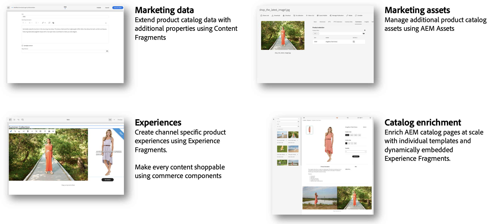

# Einführung in AEM Commerce Integration Framework (CIF) {#cif-intro}

Eine Commerce-Lösung kann eine beliebige Lösung sein, von einer Lösung für den Handel wie Adobe Commerce Cloud bis hin zu einer Reihe anwenderdefinierter Commerce-Services. Die Integration hängt in hohem Maße vom Anwendungsfall und vom Ökosystem ab. Sie wirkt sich in der Regel auf verschiedene Systeme aus und kommt in vielen verschiedenen Varianten vor:

* Integration eines komplexen und dynamischen Ökosystems (z. B. Produktkataloge)
* Das Unternehmen muss Produktinhalte mit seinem eigenen Lebenszyklus effizient und kanalübergreifend verwalten
* Erstellung komplexer und personalisierter Customer Journeys für verschiedene Leads
* Fähigkeit, sich schnell anzupassen und Innovationen am Back- und Frontend zu entwickeln
* Betrieb einer skalierbaren und stabilen E2E-Infrastruktur, die für Spitzenleistung entwickelt wurde (Flash Sale, Black Friday, …), einschließlich einheitlicher Suche- und Cache-Verwaltung

Diese Komplexität sorgt für potenzielle Schwachstellen, erhöhte Gesamtbetriebskosten, Verzögerungen und eine verminderte Wertschöpfung. Aus diesem Grund wurde das Commerce Integration Framework (CIF) entwickelt, einem Add-on für Experience Manager ist. CIF erweitert Experience Manager um Commerce-Funktionen und standardisiert die Integration mit Commerce-Engines. Das Ergebnis ist eine zukunftssichere, stabile und skalierbare Lösung mit niedrigeren Gesamtbetriebskosten (TCO). Sie ermöglicht technische und geschäftliche Innovationen mit agilen Tools und nahtlos integrierten Funktionen, um ansprechende Commerce-Erlebnisse zu gestalten.

## Vorteile des CIF {#cif-benefits}

CIF bietet vordefinierte Commerce-Kernkomponenten, die den Bedarf an anwenderdefiniertem Code reduzieren und die Markteinführungszeit für Marken verkürzen. Alle Kernkomponenten sind gebrauchsfertig in die Client-seitige Datenschicht von Adobe integriert, um Kundenprofile zu erweitern, wie etwas das einheitliche Profil. Dieses Profil erfasst detailliert das Verhalten von Besucherinnen und Besuchern und dient dazu, die Customer Journey in Echtzeit zu prognostizieren und zu personalisieren.

Das CIF-Add-on integriert Produktkontext in Experience Manager und bietet Authoring-Tools wie eine Produktkonsole und Produkt-/Kategorieauswahl, mit denen Marketing-Experten „shoppable“ Erlebnisse in Experience Manager erstellen und bereitstellen können, ohne auf die Hilfe von Entwicklern angewiesen zu sein. Die Vorteile:

* [Überzeugende Erlebnisse](#experiences)
* [Schnellere Time-to-Value](#ttv)
* [Robuste Integrationen](#integrations)

### Erlebnisse {#experiences}

Effektive CIF-Tools in AEM ermöglichen es Inhaltserstellern, schnell umfassende und personalisierte Commerce-Erlebnisse auf skalierbare und bereitstellungsunabhängige Weise zu erstellen, um Geschäftschancen optimal zu nutzen.

### Time-To-Value (TTV) {#ttv}

CIF beschleunigt die Projektentwicklung mit [AEM-Kernkomponenten](https://www.aemcomponents.dev/), [AEM Venia-Referenz-Storefront](https://github.com/adobe/aem-cif-guides-venia), [AEM-Projektarchetyp](https://experienceleague.adobe.com/docs/experience-manager-core-components/using/developing/archetype/overview.html?lang=de) und Integrationsmustern für PWA (Headless-Content and Commerce).

CIF wurde für kontinuierliche Innovation mit einem stets aktuellen Add-on entwickelt, sodass Sie auf neue und verbesserte Funktionen zugreifen können.

### Integrationen {#integrations}

Verbinden Sie Ihr Ökosystem (z. B. eine Lösung für den Handel) mit Experience Cloud, indem Sie [Adobe I/O Runtime](https://www.adobe.io/apis/experienceplatform/runtime.html), eine auf Micro-Services basierenden PaaS-Lösung ohne Server, und die [CIF-Referenzimplementierung](https://github.com/adobe/commerce-cif-graphql-integration-reference) nutzen.

## Bewährte Muster und Best Practices {#proven}

CIF unterstützt Sie mit standardisierten Integrationsmustern, die auf Best Practices basieren. Dies hilft Ihnen, heute erfolgreich zu sein, und ist flexibel, mit Ihren Anforderungen zu wachsen und sich an zukünftige Anforderungen anzupassen:

* Beseitigt typische Probleme bei Produktkatalog-Integrationen, die auftreten können, z. B.:
   * Performance-Probleme bei erhöhtem Katalogvolumen oder zunehmender Komplexität
   * Kein Zugriff auf bereitgestellte Daten
   * Notwendigkeit von Echtzeit-Produktdaten und -Erlebnissen
* Eine wachsende digitale Reife führt zu einem Bedarf an Experience Management
* 
   * CIF bietet Funktionen für das Produkterlebnis-Management, die ohne zusätzlichen Aufwand für die IT schrittweise integriert werden können.
* Bereit für Omni-Channel
   * CIF unterstützt eine Vielzahl von Touchpoint-Technologien (Server-seitig, Hybrid, Client-seitig) mit Mustern, Accelerators und Kernkomponenten.

## Tour {#journey}

Wenn Sie einer Commerce-Tour folgen, gehen Sie zum nächsten Schritt:

* Die [AEM-Inhaltsautoren-Tour](/help/commerce-cloud/cif-storefront/commerce-journeys/aem-commerce-content-author/getting-started.md)
