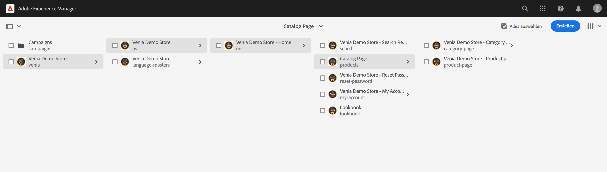
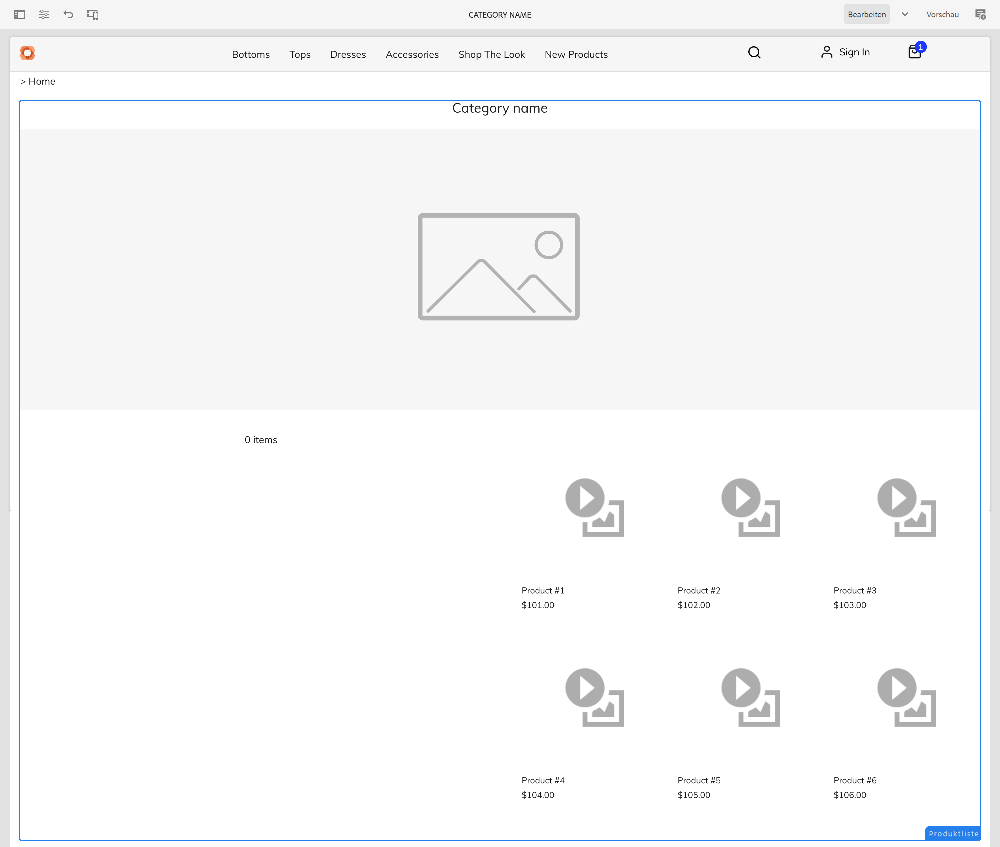
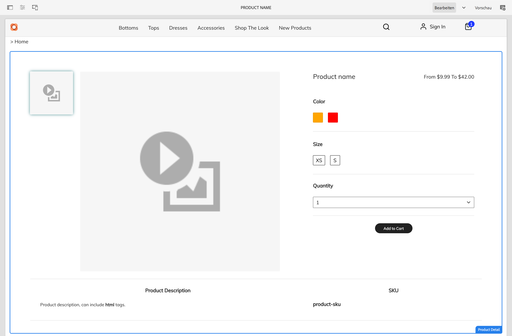
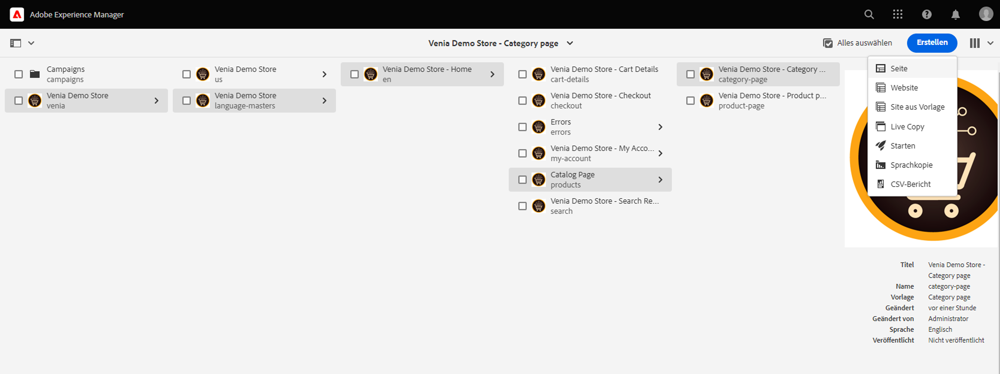
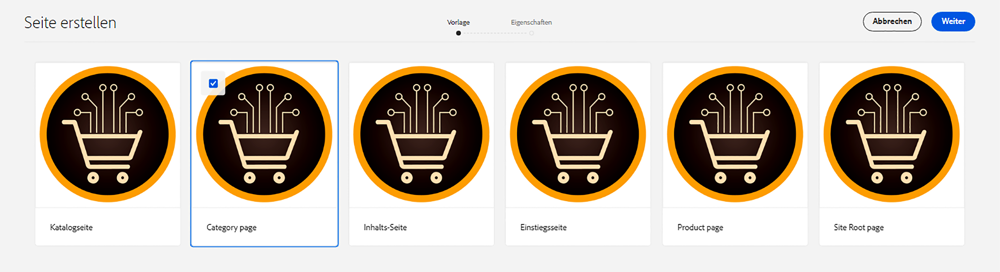
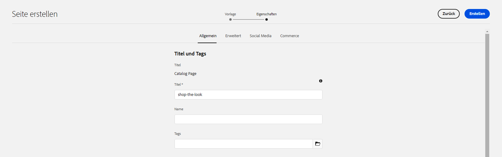
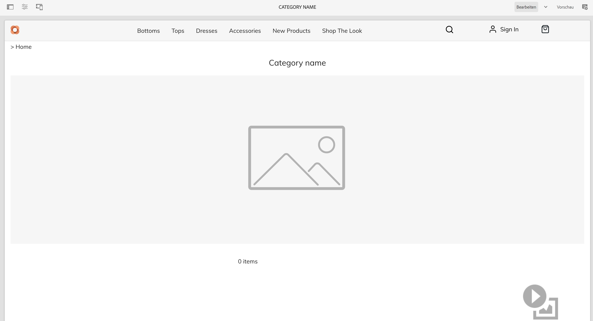
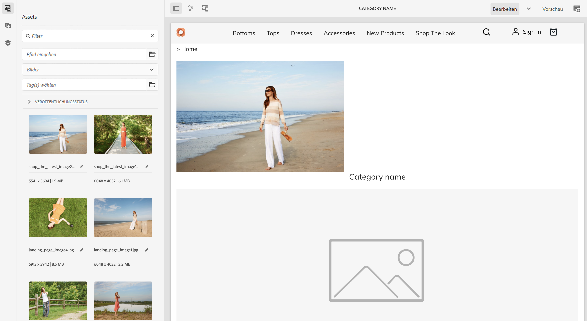
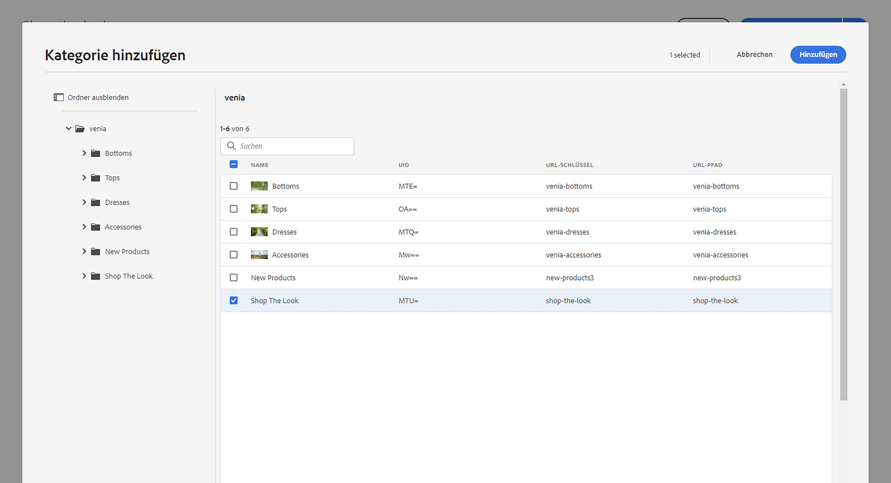
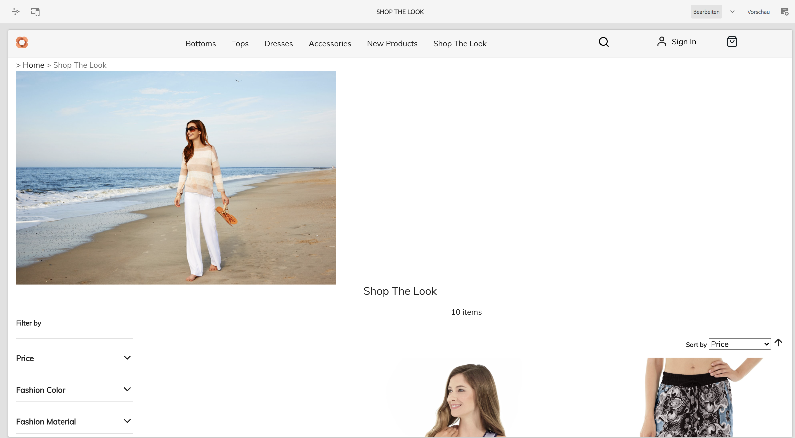

# Verwalten von Produktkatalogseiten und Vorlagen {#product-catalog}

Hier erfahren Sie, wie Sie Produktkatalog-Seiten und -Vorlagen verwalten.

## Die bisherige Entwicklung {#story-so-far}

Im vorherigen Dokument der Journey zur Inhaltserstellung und zum AEM Commerce [Erste Schritte mit AEM Grundlagen der CIF-Bearbeitung](getting-started.md), haben Sie die Grundlagen des CIF-Authoring gelernt.

Dieser Artikel baut auf diesen Grundlagen auf.

## Ziel {#objective}

In diesem Dokument erfahren Sie, wie Sie Produktkatalogseiten und -vorlagen verwalten. Nach dem Lesen sollten Sie:

* Konzepte von Katalogvorlagen verstehen
* Funktionsweise generischer Vorlagen
* eine individuelle Vorlage erstellt haben

## Das Grundkonzept {#basic-concept}

Die Venia-Storefront verfügt über ein typisches Produktkatalog-Erlebnis mit Navigation, Landingpage, Kategorie (PLP) und Produktdetailseiten (PDP).

Katalogseiten werden dynamisch mithilfe einer AEM CIF-Katalogvorlage und Echtzeit-Produktdaten erstellt, die bei Bedarf vom Commerce-Endpunkt abgerufen werden. Jeder Katalog verfügt über eine generische Vorlage für Produkt- und Kategorieseiten.

Die Navigationskomponente zeigt Inhalte und Katalogseiten an. Es ist möglich, entweder die Katalogeinstiegsseite oder die Kategorien der ersten Ebene in der Navigation anzuzeigen. Wenn Sie den Mauszeiger über eine Kategorie bewegen, werden Kategorien der zweiten Ebene als zweite Zeile angezeigt.

Durch Klicken auf eine Kategorie wird die Kategorieseite (oder Produktlistenseite) geöffnet.

Durch Klicken auf ein Produkt wird die Produktdetailseite geöffnet.

## Die Vorlagen {#templates}

### Allgemeine Vorlagen {#generic}

Die generische Venia-Katalogvorlage verwendet die Produktlisten-Kernkomponente. Diese Komponente zeigt das Kategoriebild (sofern verfügbar) und Produkte aus der Kategorie an.

Die generische Venia-Produktvorlage verwendet die Produktdetails-Kernkomponente. Diese Komponente zeigt Produktinformationen für verschiedene Produktarten und Aktionen zum Hinzufügen zum Warenkorb an.

### Vorlagen bearbeiten {#edit-templates}

Vorlagen können bearbeitet werden, indem Sie entweder direkt die Vorlagenseite öffnen oder beim Durchsuchen einer Produktkatalogseite in den Bearbeitungsmodus wechseln. Denken Sie daran, dass durch Ändern der Seite die Vorlage und nicht nur die spezifische Seite des Produkts/der Kategorie geändert wird.

### Kategorie- oder produktspezifische Vorlagen {#specific}

CIF unterstützt mehrere Vorlagen mit nur wenigen Klicks. Um eine andere Vorlage zu erstellen, wählen Sie die generische Vorlage aus der entsprechenden Kategorie aus und erstellen Sie eine neue Seite mithilfe der **Erstellen** Aktion.

Wählen Sie die entsprechende Produkt- oder Kategorievorlage aus.

Geben Sie den Titel ein und erstellen Sie die Seite.

Beachten Sie, dass Sie jetzt eine bestimmte Vorlage unter der generischen haben.

Öffnen Sie die Vorlage. Sie sieht genau wie die allgemeine Kategorievorlage aus.

Fügen Sie oben auf der Seite ein Bild hinzu.

Die Vorlage kann mit jeder Kategorie/jedem Produkt in der Vorschau angezeigt werden. Öffnen **Seiteninformationen** und wählen Sie **Anzeigen mit Kategorie/Produkt**. Wählen Sie das Produkt/die Kategorie aus der Auswahl aus, um eine Vorschau mit diesem Produkt/dieser Kategorie zu erhalten. Auswählen **Look kaufen** -Kategorie, um eine Vorschau der aktualisierten Vorlage zu erhalten.

Nun müssen wir diese Vorlage der jeweiligen Kategorie zuweisen. Öffnen Sie die Eigenschaften in **Seiteninformationen** und wechseln Sie zur Registerkarte &quot;Commerce&quot;. Klicken Sie auf das Ordnersymbol, um die **Look kaufen** aus der Kategorieauswahl. Es ist möglich, einer Vorlage mehrere Kategorien und auch Unterkategorien zuzuweisen, indem Sie das Kontrollkästchen aktivieren.

Gehen Sie zurück zur Hauptseite und klicken Sie auf **Look kaufen** -Kategorie, um die spezifische Vorlage anzuzeigen. Alle anderen Kategorien verwenden weiterhin die generische Vorlage.

Derselbe Workflow kann angewendet werden, um individuelle Produktvorlagen zu erstellen.

## Wie geht es weiter {#what-is-next}

Nachdem Sie diesen Teil der Journey abgeschlossen haben, sollten Sie:

* Konzepte von Katalogvorlagen verstehen
* Funktionsweise generischer Vorlagen
* eine individuelle Vorlage erstellt haben

Machen Sie sich mit diesem Wissen vertraut und fahren Sie mit dem Journey fort, indem Sie das Dokument erneut überprüfen. [Erlebnisse im gestaffelten Produktkatalog verwalten](staged-catalog.md), wo Sie erfahren, wie Sie mit gestaffelten Produktdaten und AEM Launches arbeiten.

## Zusätzliche Ressourcen {#additional-resources}

Es wird empfohlen, zum nächsten Teil der Journey zu wechseln, indem Sie sich das Dokument ansehen. [Erlebnisse im gestaffelten Produktkatalog verwalten](staged-catalog.md)Im Folgenden finden Sie einige zusätzliche optionale Ressourcen, die einen tieferen Einblick in einige der in diesem Dokument erwähnten Konzepte ermöglichen, aber nicht auf der Headless-Journey weiterarbeiten müssen:

* [Erstellen mehrerer Kategorie- und Produktseiten](/help/commerce-cloud/authoring/multi-template-usage.md)
* [Migrationshandbuch für den Experience Manager Cloud Service](/help/commerce-cloud/migration.md) - Migration von einer alten Version zum AEM Commerce Integration Framework (CIF)-Add-on
