# Erstellen von Produkterlebnissen {#building-experiences}

Erfahren Sie, wie Sie Produkterlebnisse verwalten.

## Die bisherige Entwicklung {#story-so-far}

Im vorherigen Dokument der Tour durch Adobe Experience Manager Content and Commerce, [Verwalten von bereitgestellten Produktkatalog-Erlebnissen](staged-catalog.md), haben Sie gelernt, wie Sie bereitgestellte Produktkatalog-Erlebnisse verwalten.

## Ziel {#objective}

In diesem Dokument erfahren Sie, wie Sie Produktinhalte und Erlebnisse erstellen.

## Produkt Experience Management {#management}

Product Experience Management ist die Disziplin, Produktdaten (die einer PIM-Lösung oder Commerce-Lösung gehören) mit Marketing-Inhalten in AEM zu dekorieren. Diese angereicherten Produktdaten mit Inhalten können dann auf verschiedenen Kanälen verwendet werden, um ein immersives Einkaufserlebnis zu schaffen.

In AEM können Sie verschiedene Inhaltstypen erstellen und mit dem Produktkatalog verknüpfen. Zugehörige Inhalte können leicht erkannt und verwendet werden, was zu einer hohen Produktivität führt.

### Assets {#assets}

Auf höherer Ebene gibt es zwei Arten von Assets, die sich auf Produkte beziehen: Produkt und Marketing. Produkt-Assets werden auf Händlerseite verwaltet und konzentrieren sich auf die Anzeige des Produkts (meist vor neutralem Hintergrund). Die Assets werden entweder in der Commerce-Lösung oder in AEM Assets verwaltet (mit einer Assets-Integration in die Commerce-/PIM-Lösung).

Marketing-Assets beziehen sich auf die Promotion und Verwendung des Produkts, für das das Marketing  verantwortlich ist. Beispiele sind die Anzeige mehrerer Produkte („Shop the Look“), die Anzeige in einem bestimmten Kontext („Outdoor-Herbstkollektion“) oder Anleitungs-PDFs. CIF bietet eine einfache Möglichkeit, jedes AEM-Asset mit einem Produktkatalogobjekt zu verknüpfen.

Öffnen Sie die Asset-Eigenschaften und wechseln Sie zur Registerkarte **Commerce**. Auf dieser Registerkarte können Sie die Verknüpfung mit Produkten verwalten. Die Tabelle unter der Auswahl enthält zusätzliche Informationen zu den verknüpften Objekten (nur bei einer Auswahl sichtbar). Klicken Sie auf das Detailsymbol, um eine vollständige Ansicht im Produkt-Cockpit zu erhalten. Um ein neues Objekt zu verknüpfen, klicken Sie auf das Produktauswahlsymbol (Ordnersymbol), wählen Sie ein Objekt aus und schließen Sie die Auswahl.

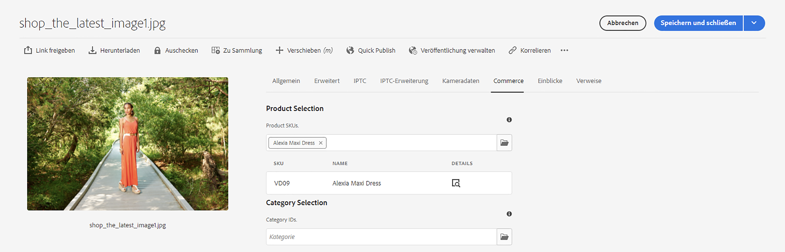

### Experience Fragments {#experience-fragments}

Experience Fragments eignen sich hervorragend, um wiederverwendbare oder individuelle Produktinhalte im benötigten Umfang zu erstellen. Die Zuordnung funktioniert ähnlich wie bei einem Asset. Öffnen Sie die Eigenschaften und wechseln Sie zur Registerkarte **Commerce**. Auf dieser Registerkarte können Sie die Verknüpfung mit Produkten und Kategorien verwalten. Die Tabellen unter den Auswahlelementen enthalten zusätzliche Informationen zu den verknüpften Objekten (nur sichtbar bei einer Auswahl). Klicken Sie auf das Detailsymbol, um eine vollständige Ansicht im Produkt-Cockpit zu erhalten. Um ein neues Objekt zu verknüpfen, klicken Sie auf das Produktauswahlsymbol (Ordnersymbol), wählen Sie ein Objekt aus und schließen Sie die Auswahl.

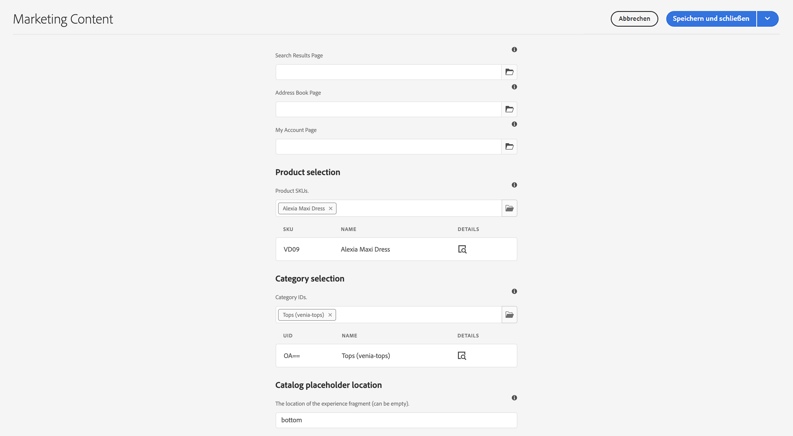

### Inhaltsfragmente {#content-fragments}

Inhaltsfragmente sind der beste Inhaltstyp für jegliche Art von strukturierten Inhalten. Dieser kann verwendet werden, um externe Produktdaten mit zusätzlichen Marketing-Daten anzureichern oder um Headless-Inhalte zu erstellen. Die Zuordnung eines Inhaltsfragments zu einem Produktkatalogobjekt erfolgt über die Referenztypen für Produkte bzw. Kategorien im Inhaltsfragmentmodell-Editor. Ziehen Sie einfach den richtigen Referenztyp per Drag-and-Drop auf das Modell und konfigurieren Sie das Feld. Diese Typen unterstützen eine Einfach- oder Mehrfachauswahl.

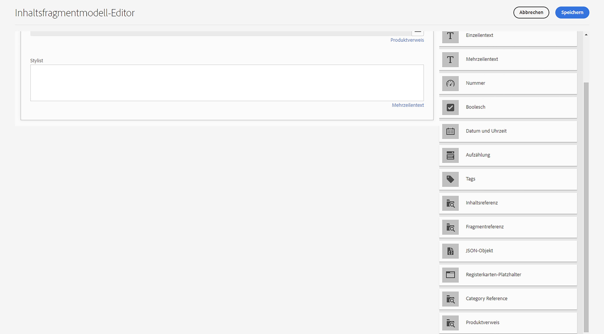

Wenn Sie ein Inhaltsfragment erstellen, das auf diesem Modell basiert, bieten diese Referenztypen eine einfache Möglichkeit, das richtige Objekt mithilfe der entsprechenden Auswahl auszuwählen.

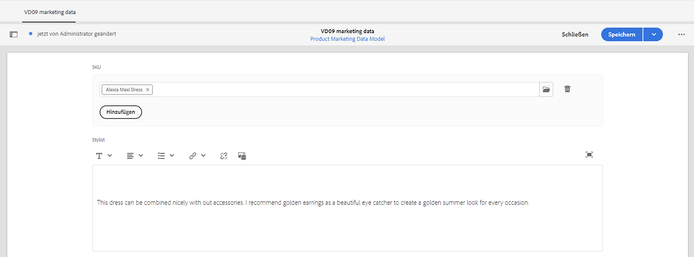

### Produkt-Cockpit {#product-cockpit}

Sie haben in einem der vorherigen Module das Produkt-Cockpit (oder die Produktkonsole) kennengelernt. Mit dem Cockpit können Sie nicht nur problemlos den Produktkatalog durchsuchen, sondern auch alle damit verbundenen AEM-Inhalte an einem Ort sehen. Wechseln Sie zur Produktkonsole und öffnen Sie die Eigenschaften eines Produkts, mit dem Inhalte verknüpft sind. Wechseln Sie zur entsprechenden Registerkarte, um die verknüpften Inhalte anzuzeigen.

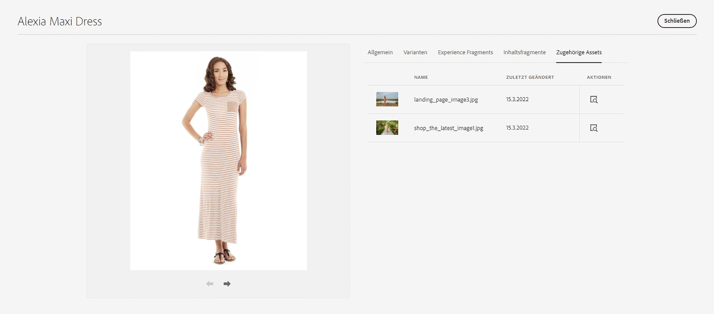

Durch Klicken auf das Aktionssymbol wird dieser Inhalt in einer neuen Browser-Registerkarte geöffnet.

## Anreichern einzelner Produkt- und Kategorieseiten {#enrich}

In den vorherigen Modulen haben Sie gelernt, wie Sie mit mehreren Produktkatalogvorlagen arbeiten können. Viele Vorlagen zu haben ist eine gute Möglichkeit, unterschiedliche Vorlagen zu erstellen, doch das ist häufig nicht erforderlich. Häufig kann dieselbe Vorlage mit Platzhaltern für individuelle Inhalte verwendet werden. CIF unterstützt Platzhalter für Inhaltsfragmente und Experience Fragments.

Beginnen wir mit dem Experience Fragment-Platzhalter. Öffnen Sie eine Produktvorlage im AEM-Editor. Ziehen Sie die Komponente **Commerce Experience Fragment** auf die Vorlage und öffnen Sie dann das Konfigurationsdialogfeld.

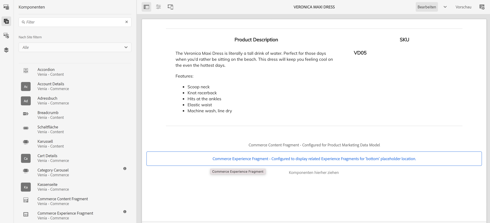

Öffnen Sie das Dialogfeld der Komponente und geben Sie einen Namen für diesen Platzhalter ein. Der Platzhaltername ist erforderlich und ermöglicht das Hinzufügen beliebig vieler Platzhalter.

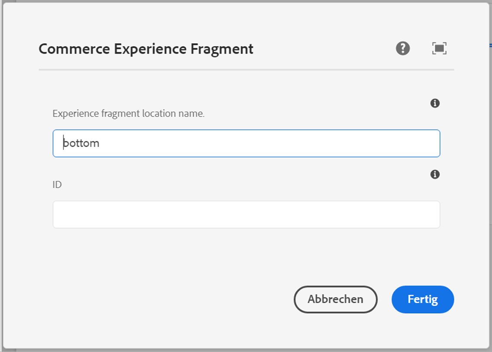

Öffnen Sie das Experience Fragment, das Sie im vorherigen Schritt mit einem Produkt verknüpft haben. Öffnen Sie die Eigenschaften und wechseln Sie zur Registerkarte „Commerce“. Geben Sie unter **Speicherort des Katalogplatzhalters** denselben Platzhalternamen ein.

Ziehen Sie jetzt die Komponente **Commerce-Inhaltsfragment** in die Vorlage und öffnen Sie das Konfigurationsdialogfeld.

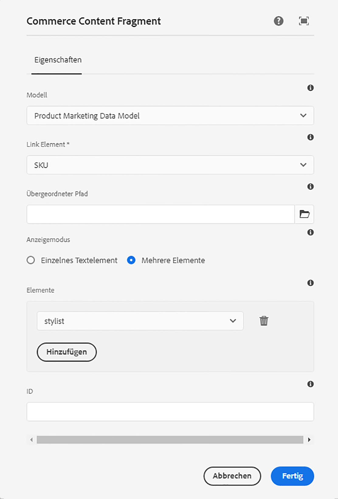

In diesem Dialogfeld wird das Dialogfeld „Kernkomponente Inhaltsfragment“ wiederverwendet. Weitere Informationen finden Sie unter „Zusätzliche Ressourcen“. Der einzige Unterschied ist die Eigenschaft **Link-Element**, die das Kennungsfeld (Produkt-SKU oder Kategorie-UID) im Inhaltsfragmentmodell konfiguriert.

Zeigen Sie jetzt eine Produktseite mit einem zugehörigen Inhaltsfragment und/oder Experience Fragment in der Vorschau an. Wenn AEM eine Seite rendert, werden alle Platzhalter basierend auf dem Typ (Inhaltsfragment oder Experience Fragment), der Kennung und dem Platzhalternamen für Experience Fragments nachgeschlagen. AEM verwendet einen URL-Resolver, um die Kennung abzurufen (SKU für Produkte, UID für Kategorien). Wenn ein Experience Fragment oder ein Inhaltsfragment zurückgegeben wird, wird es an der Position des Platzhalters gerendert. Andernfalls wird der Platzhalter ignoriert.

## Erstellen von Shop-fähigen Inhalten {#making-shoppable}

Es ist auch möglich, eine reguläre AEM-Seite durch Hinzufügen von Commerce-Komponenten Shop-fähig zu machen. Erstellen Sie eine neue Inhaltsseite in AEM und öffnen Sie die leere Seite im Editor.

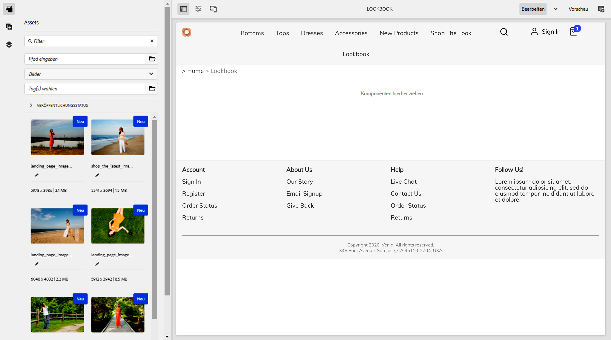

Ziehen Sie zunächst eine Produktdetailkomponente auf die Seite. Wechseln Sie dann zur Seitenleiste für Elemente und anschließend zu Produkten. Wählen Sie ein Produkt aus. Ziehen Sie das Produkt auf die Produktkomponente. Dadurch wird eine normale Produktkomponente auf einer Inhaltsseite angezeigt.

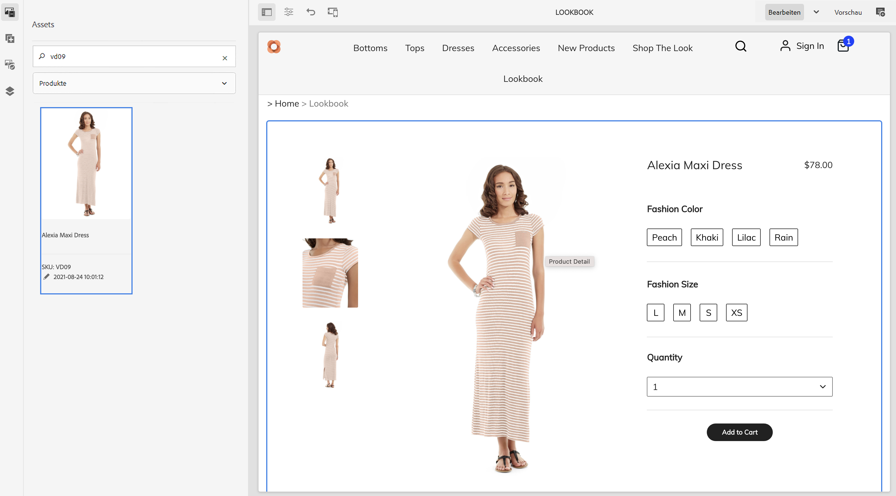

Wenn Sie verknüpften Inhalt für dieses Produkt erstellt haben, wechseln Sie in der Seitenleiste für Elemente zu **Zugehörige Commerce-Inhalte**. Auf dieser Registerkarte werden alle AEM-Inhalte angezeigt, die mit diesem Produkt verknüpft wurden. Dadurch können Sie die Seiten schnell mit allen zugehörigen Inhalten gestalten.

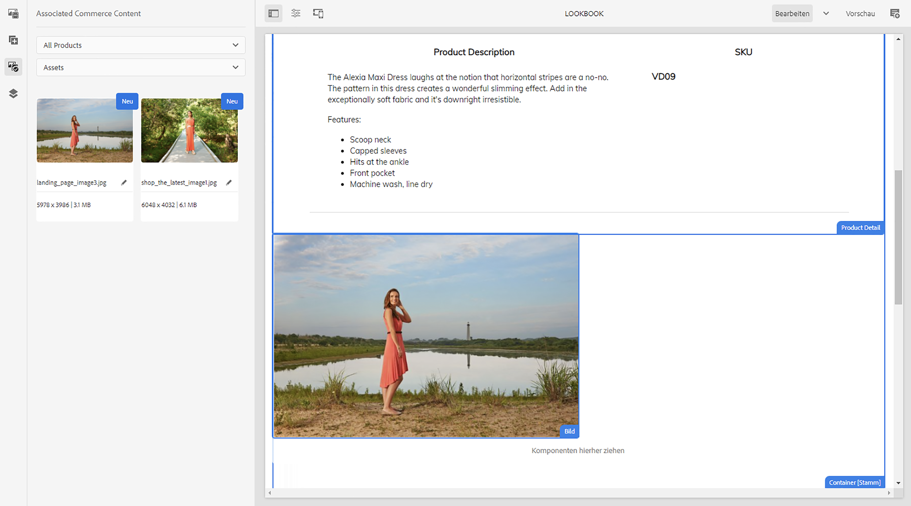

## Tour beendet? {#end-of-journey}

Herzlichen Glückwunsch! Sie haben die Journey für AEM Content and Commerce-Entwickler abgeschlossen. Sie sollten jetzt:

* Wissen, wie Sie beliebige Inhalts- und Produktkatalogobjekte von AEM verknüpfen können
* Platzhalter zur individuellen Anreicherung von Produkt- und Kategorieseiten verwenden
* Wissen, wie Sie Shop-fähige Inhalte erstellen und die zugehörige Registerkarte „Inhalt“ verwenden

Sie können jetzt Produkterlebnisse mit AEM Content and Commerce verwalten. Für AEM Content and Commerce stehen jedoch viele weitere Optionen zur Verfügung. Schauen Sie sich einige der zusätzlichen Ressourcen an, die im Abschnitt [Zusätzliche Ressourcen](#additional-resources) verfügbar sind, um mehr über die Funktionen zu erfahren, die Sie während dieser Tour gesehen haben.

## Zusätzliche Ressourcen {#additional-resources}

* [Authoring von Commerce-Erlebnissen](/help/commerce-cloud/authoring/authoring-commerce-experiences.md)
* [Produkt-Cockpit](/help/commerce-cloud/authoring/product-cockpit.md)
* [Inhaltsfragmentkomponente](https://experienceleague.adobe.com/docs/experience-manager-core-components/using/wcm-components/content-fragment-component.html?lang=de)
