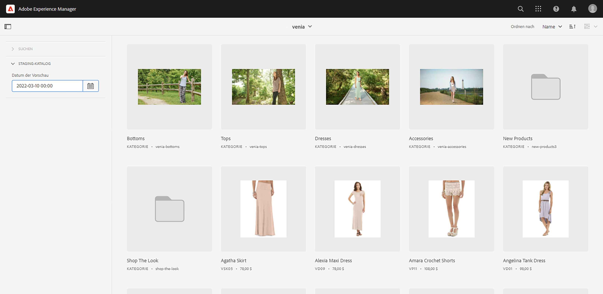
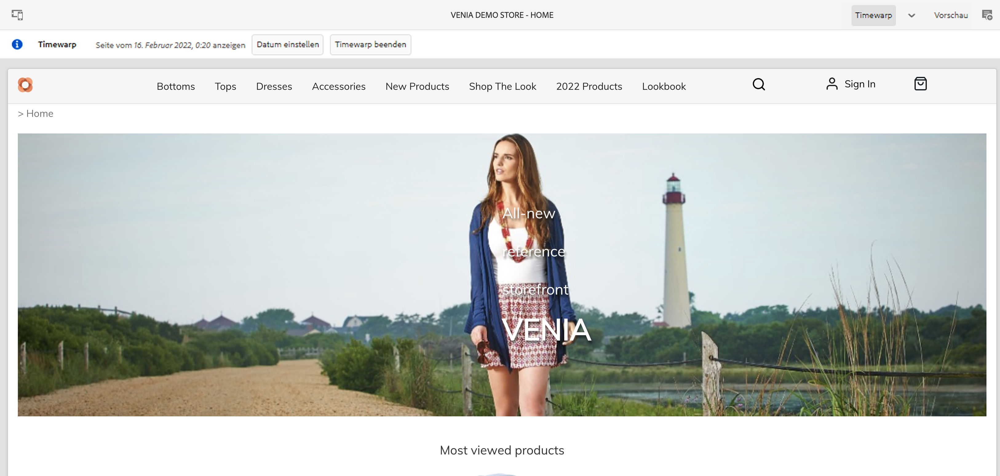
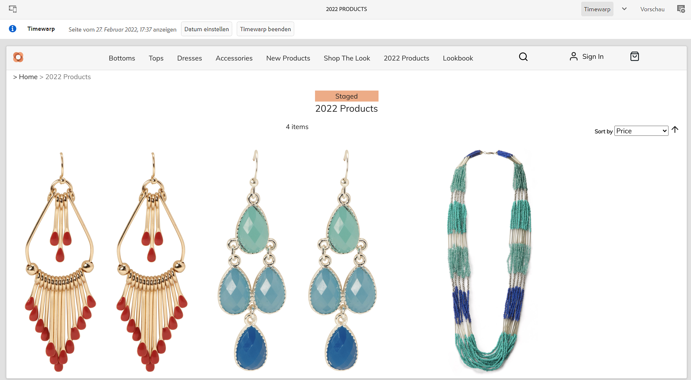
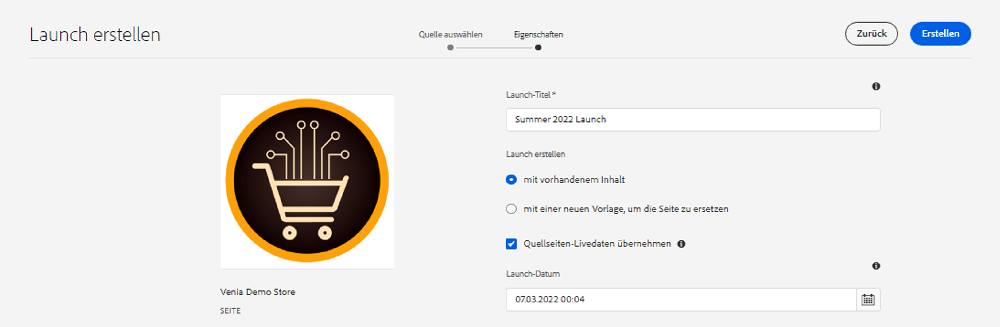
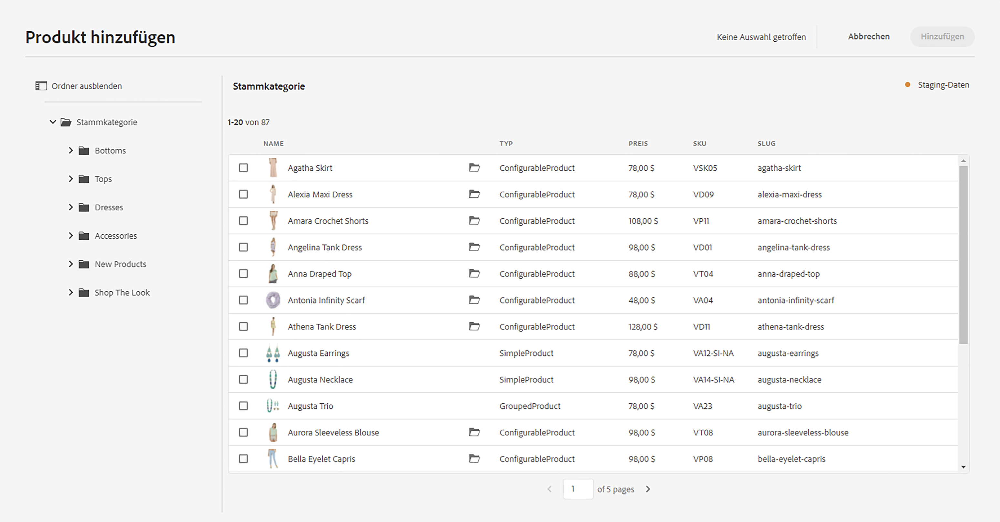

# Erstellen von Staging-Produktkatalog-Erlebnissen {#building-experiences}

Erfahren Sie, wie Sie die Erlebnisse im Staging-Produktkatalog verwalten.

## Die bisherige Entwicklung {#story-so-far}

Im vorherigen Dokument der Tour zu AEM Content and Commerce [Verwalten von Produktkatalogseiten und -vorlagen](catalog-templates.md) haben Sie erfahren, wie Sie Produktkatalog-Erlebnisse basierend auf Vorlagen verwalten und erstellen.

Dieser Artikel baut auf diesen Grundlagen auf.

## Ziel {#objective}

In diesem Dokument erfahren Sie, wie Sie das Produktkatalogerlebnis basierend auf Staging-Produktdaten und AEM-Launches verwalten. Oft müssen Autoren parallel einen bevorstehenden Produktstart vorbereiten (z. B. eine neue Bekleidungskollektion). Dies erfordert den Zugriff auf Staging-Produktdaten (noch nicht verfügbar) und die Möglichkeit, den Inhalt vorzubereiten. Dieser neue Inhalt wird mit dem Produktstart live geschaltet.

>[!NOTE]
>
>Diese Funktion ist nur bei Adobe Commerce- oder Cloud Edition- und Drittanbieter-Connectoren verfügbar, die Token-basierte Authentifizierung unterstützen. Siehe [Erste Schritte](https://experienceleague.adobe.com/docs/experience-manager-cloud-service/content-and-commerce/storefront/getting-started.html?lang=de) für weitere Informationen.

Zunächst sehen wir, wie Autoren mit CIF auf Staging-Produktdaten zugreifen können.

## Arbeiten mit Staging-Produktdaten {#staged-product-data}

Das Produkt-Cockpit ist eine Möglichkeit, auf Staging-Produktdaten zuzugreifen. Öffnen Sie den Produktkatalog, indem Sie im Hauptmenü von AEM auf das Symbol „Commerce“ klicken. Dadurch erhalten Sie Zugriff auf Live-Produktdaten. Öffnen Sie die Registerkarte „Filter“ auf der linken Seite und erweitern Sie **STAGING-KATALOG**. Mithilfe der Vorschaudaten können Sie nun auf Staging-Produktdaten für jeden beliebigen Zeitpunkt zugreifen. Staging-Daten enthalten neue Kategorien, Produkte oder aktualisierte Felder wie den Preis.

Die Vorschau einer Storefront mit Staging-Daten ist über die Timewarp-Ansicht möglich. Öffnen Sie den Editor und wechseln Sie in den Timewarp-Modus. Wählen Sie ein zukünftiges Datum aus. Beachten Sie die Informationen oben im Editor, die darauf hinweisen, dass Sie die Seite für ein bestimmtes Datum anzeigen.

Sie können jetzt den Katalog mit den Staging-Daten durchsuchen. Wenn Sie eine Staging-Kategorie oder -Produktseite öffnen, zeigt der Editor einen visuellen Indikator an.

>[!NOTE]
>
>Omnisearch hat keinen Kontext und gibt daher nur Live-Produktkatalogdaten zurück.

## AEM-Launches {#launches}

Mit AEM-Launches können Sie Inhalte für Staging-Produktdaten erstellen. Wenn Sie nicht mit Launches vertraut sind, folgen Sie dem Dokumentations-Link unter dem [Abschnitt „Zusätzliche Ressourcen“](#additional-resources). Das Launch-Datum wird dann zum Zugriff auf Staging-Produktdaten verwendet.

Beachten Sie, dass die Auswahlfelder das Startdatum im Staging-Indikator auf der rechten Seite berücksichtigen.

## Wie geht es weiter {#what-is-next}

Nachdem Sie nun diesen Teil der Tour abgeschlossen haben, sollten Sie:

* die Konzepte des Staging-Produktkatalogs und Inhalts im Zusammenhang mit Launches verstehen
* Zugriff auf Staging-Produktkatalogdaten über das Produkt-Cockpit und den Editor haben

Sie können jetzt [Produkterlebnisse](product-experience-management.md) verwalten. Für AEM Content and Commerce stehen jedoch viele zusätzliche Optionen zur Verfügung. Schauen Sie sich einige der zusätzlichen Ressourcen an, die im Abschnitt [Zusätzliche Ressourcen](#additional-resources) verfügbar sind, um mehr über die Funktionen zu erfahren, die Sie während dieser Tour gesehen haben.

## Zusätzliche Ressourcen {#additional-resources}

* [Produkt-Cockpit](/help/commerce-cloud/authoring/product-cockpit.md)
* [Erste Schritte](/help/commerce-cloud/getting-started.md)
* [Launches](/help/sites-cloud/authoring/launches/overview.md)
