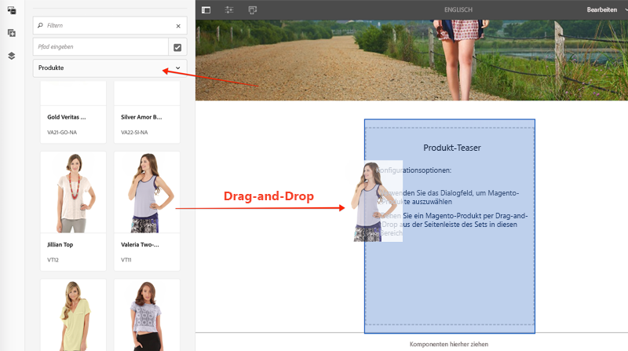

# AEM CIF-Kernkomponenten anpassen {#customize-cif-components}

Das [CIF-Venia-Projekt](https://github.com/adobe/aem-cif-guides-venia) ist eine Referenz-Code-Basis für die Verwendung von [CIF-Kernkomponenten](https://github.com/adobe/aem-core-cif-components). In diesem Tutorial erweitern Sie die Komponente [Produkt-Teaser](https://github.com/adobe/aem-core-cif-components/tree/master/ui.apps/src/main/content/jcr_root/apps/core/cif/components/commerce/productteaser/v1/productteaser) weiter, um ein benutzerdefiniertes Attribut von Magento anzuzeigen. Außerdem erfahren Sie mehr über die GraphQL-Integration zwischen AEM und Magento und die von den CIF-Kernkomponenten bereitgestellten Erweiterungs-Hooks.

>[!TIP]
>
> Verwenden Sie den [AEM-Projektarchetyp](https://github.com/adobe/aem-project-archetype), wenn Sie Ihre eigene Commerce-Implementierung starten.

## Was Sie erstellen werden

Die Marke Venia hat vor kurzem begonnen, Produkte mit nachhaltigen Materialien zu produzieren, und das Unternehmen möchte als Teil des Produkt-Teasers ein Zeichen für **Umweltfreundlich** anzeigen. In Magento wird ein neues benutzerspezifisches Attribut erstellt, um anzugeben, ob ein Produkt das **umweltfreundliche** Material verwendet. Dieses benutzerspezifische Attribut wird dann als Teil der GraphQL-Abfrage hinzugefügt und im Produkt-Teaser bei bestimmten Produkten angezeigt.


## Voraussetzungen {#prerequisites}

Zum Absolvieren dieses Tutorials ist eine lokale Entwicklungsumgebung erforderlich. Dazu gehört eine laufende Instanz von AEM, die konfiguriert und mit einer Magento-Instanz verbunden ist. Überprüfen Sie die Anforderungen und Schritte zum [Einrichten einer lokalen Entwicklungsumgebung mit dem AEM as a Cloud Service SDK](../develop.md). Zum Absolvieren des ganzen Tutorials benötigen Sie Berechtigungen, um in Magento [Attribute einem Produkt](https://docs.magento.com/user-guide/catalog/product-attributes-add.html) hinzufügen zu können.

Außerdem benötigen Sie eine GraphQL-IDE wie [GraphiQL](https://github.com/graphql/graphiql) oder eine Browser-Erweiterung, um die Code-Beispiele und Tutorials ausführen zu können. Stellen Sie beim Installieren einer Browser-Erweiterung sicher, dass diese die Möglichkeit hat, Anfragekopfzeilen festzulegen. In Google Chrome ist der [Altair GraphQL Client](https://chrome.google.com/webstore/detail/altair-graphql-client/flnheeellpciglgpaodhkhmapeljopja) eine Erweiterung, die dazu geeignet ist.

## Venia-Projekt klonen {#clone-venia-project}

Wir werden das [Venia-Projekt](https://github.com/adobe/aem-cif-guides-venia) klonen und dann die Standardstile überschreiben.

>[!NOTE]
>
> **Sie können auch ein vorhandenes Projekt** nutzen (basierend auf dem AEM-Projektarchetyp mit enthaltenem CIF) und diesen Abschnitt überspringen.

1. Führen Sie folgenden git-Befehl aus, um das Projekt zu klonen:

   ```shell
   $ git clone git@github.com:adobe/aem-cif-guides-venia.git
   ```

1. Erstellen Sie das Projekt und stellen Sie es in einer lokalen Instanz von AEM bereit:

   ```shell
   $ cd aem-cif-guides-venia/
   $ mvn clean install -PautoInstallPackage,cloud
   ```

1. Fügen Sie die erforderlichen OSGi-Konfigurationen hinzu, um Ihre AEM-Instanz mit einer Magento-Instanz zu verbinden, oder fügen Sie die Konfigurationen dem neu erstellten Projekt hinzu.

1. An diesem Punkt sollten Sie über eine funktionierende Version einer Storefront verfügen, die mit einer Magento-Instanz verbunden ist. Navigieren Sie zur Seite `US` > `Home` unter: [http://localhost:4502/editor.html/content/venia/us/en.html](http://localhost:4502/editor.html/content/venia/us/en.html).

   Sie sollten sehen, dass die Storefront derzeit im Venia-Design erscheint. Wenn Sie das Hauptmenü der Storefront erweitern, sollten verschiedene Kategorien angezeigt werden, was darauf hinweist, dass die Verbindung mit Magento funktioniert.

   

## Produkt-Teaser erstellen {#author-product-teaser}

Die Komponente Produkt-Teaser wird im Laufe dieses Tutorials erweitert. Als ersten Schritt fügen Sie der Startseite eine neue Instanz des Produkt- Teasers hinzu. So können Sie sich mit den Grundfunktionen vertraut machen.

1. Navigieren Sie zur **Startseite** der Site: [http://localhost:4502/editor.html/content/acme/us/en.html](http://localhost:4502/editor.html/content/acme/us/en.html)

2. Fügen Sie auf der Seite eine neue **Produkt-Teaser**-Komponente in den Haupt-Layout-Container ein.

   

3. Erweitern Sie das seitliche Bedienfeld (falls noch nicht geschehen) und wechseln Sie im Dropdown-Menü der Asset-Suche zu **Produkte**. Nun sollte eine Liste mit verfügbaren Produkten einer verbundenen Magento-Instanz angezeigt werden. Wählen Sie ein Produkt aus und ziehen Sie es auf der Seite per **Drag-and-Drop** auf die Komponente **Produkt-Teaser**.

   

   >[!NOTE]
   >
   > Beachten Sie, dass Sie das angezeigte Produkt auch konfigurieren können, indem Sie die Komponente mithilfe des Dialogfelds konfigurieren (durch Klicken auf das _Schraubenschlüsselsymbol_).

4. Sie sollten nun sehen, dass der Produkt-Teaser ein Produkt anzeigt. Name und Preis des Produkts sind standardmäßig angezeigte Attribute.

   

## Hinzufügen eines benutzerdefinierten Attributs in Magento {#add-custom-attribute}

Die in AEM angezeigten Produkte und Produktdaten werden in Magento gespeichert. Als Nächstes fügen Sie als Teil des Produktattributs, das mithilfe der Magento-Benutzeroberfläche definiert wird, ein neues Attribut für **Umweltfreundlich** hinzu.

>[!TIP]
>
> Sie verfügen bereits über ein benutzerdefiniertes **Ja/Nein**-Attribut als Teil Ihres Produktattributs? Dann können Sie es gerne nutzen und diesen Abschnitt überspringen.

1. Melden Sie sich bei Ihrer Magento-Instanz an.
1. Navigieren Sie zu **Katalog** > **Produkte**.
1. Aktualisieren Sie den Suchfilter, um das **konfigurierbare Produkt** zu finden, das zum Einsatz kam, als es in der vorherigen Übung der Teaser-Komponente hinzugefügt wurde. Öffnen Sie das Produkt im Bearbeitungsmodus.

   

1. Klicken Sie in der Produktansicht auf **Attribut hinzufügen** > **Neues Attribut erstellen**.
1. Füllen Sie das Formular **Neues Attribut** mit den folgenden Werten aus (bei anderen Werten bleiben die Standardeinstellungen erhalten).

   | Feldsatz | Feldbezeichnung | Wert |
   | ----------------------------- | ------------------ | ---------------- |
   | Attributeigenschaften | Attributbezeichnung | **Umweltfreundlich** |
   | Attributeigenschaften | Katalogeingabetyp | **Ja/Nein** |
   | Erweiterte Attributeigenschaften | Attribut-Code | **eco_friendly** |

   

   Klicken Sie auf **Attribut speichern**, wenn Sie fertig sind.

1. Blättern Sie zum unteren Rand des Produkts und erweitern Sie die Überschrift **Attribute**. Sie sollten das neue Feld **Umweltfreundlich** sehen. Schalten Sie die Umschaltfläche in die Position **Ja**.

   

   **Speichern** Sie die Änderungen am Produkt.

   >[!TIP]
   >
   > Weitere Informationen zur Verwaltung von [Produktattributen finden Sie im Magento-Benutzerhandbuch](https://docs.magento.com/user-guide/catalog/attribute-best-practices.html).

1. Navigieren Sie zu **System** > **Tools** > **Cache-Verwaltung**. Da das Datenschema aktualisiert wurde, müssen wir einige der Cache-Typen in Magento ungültig machen.
1. Aktivieren Sie das Kontrollkästchen neben **Konfiguration** und senden Sie den Cache-Typ zum **Aktualisieren**.

   

   >[!TIP]
   >
   > Weitere Informationen zur [Cache-Verwaltung finden Sie im Magento-Benutzerhandbuch](https://docs.magento.com/user-guide/system/cache-management.html).

## GraphQL-IDE zur Überprüfung von Attribut {#use-graphql-ide} verwenden

Bevor Sie mit dem AEM-Code anfangen, sollten Sie [Magento GraphQL](https://devdocs.magento.com/guides/v2.4/graphql/) mit einer GraphQL-IDE erkunden. Die Magento-Integration mit AEM erfolgt hauptsächlich über eine Reihe von GraphQL-Abfragen. Das Verstehen und Ändern der GraphQL-Abfragen ist eine der wichtigsten Methoden zum Erweitern der CIF-Kernkomponenten.

Verwenden Sie anschließend eine GraphQL-IDE, um zu prüfen, ob das `eco_friendly`-Attribut dem Produktattributsatz hinzugefügt wurde. Screenshots in diesem Tutorial stellen den [Altair GraphQL Client](https://chrome.google.com/webstore/detail/altair-graphql-client/flnheeellpciglgpaodhkhmapeljopja) dar.

1. Öffnen Sie die GraphQL-IDE und geben Sie die URL `http://<magento-server>/graphql` in die URL-Leiste Ihrer IDE oder Erweiterung ein.
2. Fügen Sie die folgende [Produktabfrage](https://devdocs.magento.com/guides/v2.4/graphql/queries/products.html) hinzu, wobei `YOUR_SKU` die **SKU** des in der vorherigen Übung verwendeten Produkts ist:

   ```json
     {
       products(
       filter: { sku: { eq: "YOUR_SKU" } }
       ) {
           items {
           name
           sku
           eco_friendly
           }
       }
   }
   ```

3. Führen Sie die Abfrage aus und Sie sollten eine Antwort wie die folgende erhalten:

   ```json
   {
     "data": {
       "products": {
         "items": [
           {
             "name": "Valeria Two-Layer Tank",
             "sku": "VT11",
             "eco_friendly": 1
           }
         ]
       }
     }
   }
   ```

   

   Beachten Sie, dass der Wert von **Ja** eine Ganzzahl von **1** ist. Dies ist nützlich, wenn wir die GraphQL-Abfrage in Java schreiben.

   >[!TIP]
   >
   > Eine detailliertere Dokumentation zu [Magento GraphQL finden Sie hier](https://devdocs.magento.com/guides/v2.4/graphql/index.html).

## Sling-Modell für den Produkt-Teaser aktualisieren {#updating-sling-model-product-teaser}

Als Nächstes erweitern wir die Geschäftslogik des Produkt-Teasers durch Implementierung eines Sling-Modells. [Sling-Modelle](https://sling.apache.org/documentation/bundles/models.html) sind von Anmerkungen gesteuerte „POJOs“ (Plain Old Java Objects), die eine beliebige Geschäftslogik implementieren, die von der Komponente benötigt wird. Sling-Modelle werden in Verbindung mit den HTL-Skripten als Teil der Komponente verwendet. Wir folgen dem [Delegationsmuster für Sling-Modelle](https://github.com/adobe/aem-core-wcm-components/wiki/Delegation-Pattern-for-Sling-Models), sodass wir Teile des bestehenden Produkt-Teaser-Modells bequem erweitern können.

Sling-Modelle werden als Java implementiert und können im **Kernmodul** des erstellten Projekts gefunden werden.

Verwenden Sie [eine IDE Ihrer Wahl](https://experienceleague.adobe.com/docs/experience-manager-learn/cloud-service/local-development-environment-set-up/development-tools.html#set-up-the-development-ide), um das Venia-Projekt zu importieren. Die verwendeten Screenshots stammen aus der [Visual Studio Code-IDE](https://experienceleague.adobe.com/docs/experience-manager-learn/cloud-service/local-development-environment-set-up/development-tools.html#microsoft-visual-studio-code).

1. Navigieren Sie in Ihrer IDE unter dem **Kernmodul** zu: `core/src/main/java/com/venia/core/models/commerce/MyProductTeaser.java`.

   

   `MyProductTeaser.java` ist eine Java-Schnittstelle, die die CIF-[ProductTeaser](https://github.com/adobe/aem-core-cif-components/blob/master/bundles/core/src/main/java/com/adobe/cq/commerce/core/components/models/productteaser/ProductTeaser.java)-Schnittstelle erweitert.

   Es wurde bereits eine neue Methode mit dem Namen `isShowBadge()` zur Anzeige eines Abzeichens hinzugefügt, wenn das Produkt als „Neu“ gilt.

1. Fügen Sie der Schnittstelle eine neue Methode `isEcoFriendly()` hinzu:

   ```java
   @ProviderType
   public interface MyProductTeaser extends ProductTeaser {
       // Extend the existing interface with the additional properties which you
       // want to expose to the HTL template.
       public Boolean isShowBadge();
   
       public Boolean isEcoFriendly();
   }
   ```

   Dies ist eine neue Methode, die wir einführen werden, um die Logik zu kapseln und anzugeben, ob das `eco_friendly`-Attribut beim Produkt auf **Ja** oder **Nein** gesetzt ist.

1. Überprüfen Sie dann das `MyProductTeaserImpl.java` unter `core/src/main/java/com/venia/core/models/commerce/MyProductTeaserImpl.java`.

   Das [Delegationsmuster für Sling-Modelle](https://github.com/adobe/aem-core-wcm-components/wiki/Delegation-Pattern-for-Sling-Models) ermöglicht es `MyProductTeaserImpl`, das `ProductTeaser`-Modell über die `sling:resourceSuperType`-Eigenschaft zu referenzieren:

   ```java
   @Self
   @Via(type = ResourceSuperType.class)
   private ProductTeaser productTeaser;
   ```

   Bei allen Methoden, die wir nicht überschreiben oder ändern möchten, können wir einfach den Wert zurückgeben, den der `ProductTeaser` zurückgibt. Beispiel:

   ```java
   @Override
   public String getImage() {
       return productTeaser.getImage();
   }
   ```

   Dadurch wird die Menge an Java-Code minimiert, die eine Implementierung schreiben muss.

1. Einer der zusätzlichen Erweiterungspunkte, die von AEM CIF-Kernkomponenten bereitgestellt werden, ist der `AbstractProductRetriever`, der Zugriff auf bestimmte Produktattribute bietet. Überprüfen Sie die `initModel()`-Methode:

   ```java
   import javax.annotation.PostConstruct;
   ...
   @Model(adaptables = SlingHttpServletRequest.class, adapters = MyProductTeaser.class, resourceType = MyProductTeaserImpl.RESOURCE_TYPE)
   public class MyProductTeaserImpl implements MyProductTeaser {
       ...
       private AbstractProductRetriever productRetriever;
   
       /* add this method to intialize the proudctRetriever */
       @PostConstruct
       public void initModel() {
           productRetriever = productTeaser.getProductRetriever();
   
           if (productRetriever != null) {
               productRetriever.extendProductQueryWith(p -> p.createdAt());
           }
   
       }
   ...
   ```

   Die `@PostConstruct`-Anmerkung stellt sicher, dass diese Methode aufgerufen wird, sobald das Sling-Modell initialisiert wurde.

   Beachten Sie, dass die GraphQL-Abfrage des Produkts bereits mit der `extendProductQueryWith`-Methode erweitert wurde, um das zusätzliche `created_at`-Attribut abzurufen. Dieses Attribut wird später als Teil der `isShowBadge()`-Methode verwendet.

1. Aktualisieren Sie die GraphQL-Abfrage, um das `eco_friendly`-Attribut in die partielle Abfrage einzuschließen:

   ```java
   //MyProductTeaserImpl.java
   
   private static final String ECO_FRIENDLY_ATTRIBUTE = "eco_friendly";
   
   @PostConstruct
   public void initModel() {
       productRetriever = productTeaser.getProductRetriever();
   
       if (productRetriever != null) {
           productRetriever.extendProductQueryWith(p ->
                productRetriever.extendProductQueryWith(p -> p
                   .createdAt()
                   .addCustomSimpleField(ECO_FRIENDLY_ATTRIBUTE)
               );
           );
       }
   }
   ```

   Das Hinzufügen zur `extendProductQueryWith`-Methode ist eine effektive Möglichkeit, um sicherzustellen, dass dem Rest des Modells zusätzliche Produktattribute zur Verfügung stehen. Außerdem wird die Anzahl der ausgeführten Abfragen minimiert.

   Im obigen Code wird das `addCustomSimpleField` zum Abrufen des `eco_friendly`-Attributs verwendet. Dadurch wird deutlich, wie Sie Abfragen für beliebige benutzerdefinierte Attribute durchführen können, die Teil des Magento-Schemas sind.

   >[!NOTE]
   >
   > Die `createdAt()`-Methode wurde tatsächlich als Teil der [Produktschnittstelle](https://github.com/adobe/commerce-cif-magento-graphql/blob/master/src/main/java/com/adobe/cq/commerce/magento/graphql/ProductInterface.java) implementiert. Die meisten häufig gefundenen Schemaattribute wurden implementiert. Verwenden Sie daher das `addCustomSimpleField` nur für echte benutzerdefinierte Attribute.

1. Fügen Sie eine Protokollierung hinzu, um das Debugging des Java-Codes zu erleichtern:

   ```java
   import org.slf4j.Logger;
   import org.slf4j.LoggerFactory;
   ...
   @Model(adaptables = SlingHttpServletRequest.class, adapters = MyProductTeaser.class, resourceType = MyProductTeaserImpl.RESOURCE_TYPE)
   public class MyProductTeaserImpl implements MyProductTeaser {
   
   private static final Logger LOGGER = LoggerFactory.getLogger(MyProductTeaserImpl.class);
   ```

1. Implementieren Sie anschließend die `isEcoFriendly()`-Methode:

   ```java
   @Override
   public Boolean isEcoFriendly() {
   
       Integer ecoFriendlyValue;
       try {
           ecoFriendlyValue = productRetriever.fetchProduct().getAsInteger(ECO_FRIENDLY_ATTRIBUTE);
           if(ecoFriendlyValue != null && ecoFriendlyValue.equals(Integer.valueOf(1))) {
               LOGGER.info("*** Product is Eco Friendly**");
               return true;
           }
       } catch (SchemaViolationError e) {
           LOGGER.error("Error retrieving eco friendly attribute");
       }
       LOGGER.info("*** Product is not Eco Friendly**");
       return false;
   }
   ```

   Bei der obigen Methode wird `productRetriever` genutzt, um das Produkt abzurufen, während die `getAsInteger()`-Methode dazu dient, den Wert des `eco_friendly`-Attributs abzurufen. Dank der GraphQL-Abfragen, die wir zuvor ausgeführt haben, wissen wir, dass der erwartete Wert, wenn das `eco_friendly`-Attribut auf „**Ja**“ gesetzt ist, eigentlich eine Ganzzahl von **1** ist.

   Nachdem das Sling-Modell aktualisiert wurde, muss das Komponenten-Markup aktualisiert werden, um basierend auf dem Sling-Modell ein Zeichen für **Umweltfreundlich** anzuzeigen.

## Anpassen des Markups des Produkt-Teasers {#customize-markup-product-teaser}

Eine gebräuchliche Erweiterung von AEM-Komponenten besteht darin, das von der Komponente erstellte Markup zu ändern. Dies geschieht durch Überschreiben des [HTL-Skripts](https://experienceleague.adobe.com/docs/experience-manager-htl/using/overview.html?lang=de), das die Komponente zum Rendern des Markups verwendet. HTML Template Language (HTL) ist eine einfache Vorlagensprache, die AEM-Komponenten nutzen, um Markup basierend auf erstellten Inhalten dynamisch zu rendern, sodass sich die Komponenten wiederverwenden lassen. So kann z. B. der Produkt-Teaser immer wieder neu verwendet werden, um verschiedene Produkte anzuzeigen.

In unserem Fall möchten wir ein Banner auf dem Teaser rendern, um anhand eines benutzerspezifischen Attributs anzugeben, dass das Produkt „Umweltfreundlich“ ist. Das Design-Muster zum [Anpassen des Markups](https://experienceleague.adobe.com/docs/experience-manager-core-components/using/developing/customizing.html#customizing-the-markup) einer Komponente ist eigentlich Standard bei allen AEM-Komponenten, nicht nur bei den AEM CIF-Kernkomponenten.

1. Navigieren Sie in der IDE zum `ui.apps`-Modul und erweitern Sie es. Erweitern Sie dann die Ordnerhierarchie zu `ui.apps/src/main/content/jcr_root/apps/venia/components/commerce/productteaser` und überprüfen Sie die `.content.xml`-Datei.

   

   ```xml
   <?xml version="1.0" encoding="UTF-8"?>
   <jcr:root xmlns:sling="http://sling.apache.org/jcr/sling/1.0" xmlns:cq="http://www.day.com/jcr/cq/1.0" xmlns:jcr="http://www.jcp.org/jcr/1.0"
       jcr:description="Product Teaser Component"
       jcr:primaryType="cq:Component"
       jcr:title="Product Teaser"
       sling:resourceSuperType="core/cif/components/commerce/productteaser/v1/productteaser"
       componentGroup="Venia - Commerce"/>
   ```

   Oben sehen Sie die Komponentendefinition für die Produkt-Teaser-Komponente in unserem Projekt. Beachten Sie die Eigenschaft `sling:resourceSuperType="core/cif/components/commerce/productteaser/v1/productteaser"`. Dies ist ein Beispiel für das Erstellen einer [Proxy-Komponente](https://experienceleague.adobe.com/docs/experience-manager-core-components/using/get-started/using.html#create-proxy-components). Anstatt alle Produkt-Teaser-HTL-Skripte aus den AEM CIF-Kernkomponenten zu kopieren und einzufügen, können wir sämtliche Funktionen mit `sling:resourceSuperType` übernehmen.

1. Öffnen Sie die Datei `productteaser.html`. Dies ist eine Kopie der `productteaser.html`-Datei des [CIF-Produkt-Teasers](https://github.com/adobe/aem-core-cif-components/blob/master/ui.apps/src/main/content/jcr_root/apps/core/cif/components/commerce/productteaser/v1/productteaser/productteaser.html).

   ```html
   <!--/* productteaser.html */-->
   <sly
     data-sly-use.product="com.venia.core.models.commerce.MyProductTeaser"
     data-sly-use.templates="core/wcm/components/commons/v1/templates.html"
     data-sly-use.actionsTpl="actions.html"
     data-sly-test.isConfigured="${properties.selection}"
     data-sly-test.hasProduct="${product.url}"
   ></sly>
   ```

   Beachten Sie, dass das Sling-Modell für `MyProductTeaser` verwendet und der `product`-Variablen zugewiesen wird.

1. Ändern Sie `productteaser.html`, um einen Aufruf an die in der vorherigen Übung implementierte `isEcoFriendly`-Methode durchzuführen:

   ```html
   ...
   <div
     data-sly-test="${isConfigured && hasProduct}"
     class="item__root"
     data-cmp-is="productteaser"
     data-virtual="${product.virtualProduct}"
   >
     <div data-sly-test="${product.showBadge}" class="item__badge">
       <span>${properties.text || 'New'}</span>
     </div>
     <!--/* Insert call to Eco Friendly here */-->
     <div data-sly-test="${product.ecoFriendly}" class="item__eco">
       <span>Eco Friendly</span>
     </div>
     ...
   </div>
   ```

   Beim Aufrufen einer Sling-Modellmethode in HTL werden der `get`- und `is`-Abschnitt der Methode verworfen; der erste Buchstabe wird zu einem Kleinbuchstaben. Aus `isShowBadge()` wird so `.showBadge`, aus `isEcoFriendly` wird `.ecoFriendly`. Basierend auf dem booleschen Wert, der von `.isEcoFriendly()` zurückgegeben wird, wird ermittelt, ob `<span>Eco Friendly</span>` angezeigt wird.

   Weitere Informationen zu `data-sly-test` und anderen [HTL-Blockanweisungen finden Sie hier](https://experienceleague.adobe.com/docs/experience-manager-htl/using/htl/block-statements.html#test).

1. Speichern Sie die Änderungen und stellen Sie die Aktualisierungen mithilfe Ihrer Maven-Kenntnisse über ein Befehlszeilen-Terminal in AEM bereit:

   ```shell
   $ cd aem-cif-guides-venia/
   $ mvn clean install -PautoInstallPackage,cloud
   ```

1. Öffnen Sie ein neues Browser-Fenster. Navigieren Sie zu AEM und dann zur **OSGi-Konsole** > **Status** > **Sling-Modelle**: [http://localhost:4502/system/console/status-slingmodels](http://localhost:4502/system/console/status-slingmodels)

1. Suchen Sie nach `MyProductTeaserImpl`; Sie sollten eine Zeile sehen, die wie folgt aussieht:

   ```plain
   com.venia.core.models.commerce.MyProductTeaserImpl - venia/components/commerce/productteaser
   ```

   Dies bedeutet, dass das Sling-Modell ordnungsgemäß bereitgestellt und der richtigen Komponente zugeordnet wurde.

1. Aktualisieren Sie zur **Venia-Startseite** unter [http://localhost:4502/editor.html/content/venia/us/en.html](http://localhost:4502/editor.html/content/venia/us/en.html), wo der Produkt-Teaser hinzugefügt wurde.

   

   Wenn das `eco_friendly`-Attribut für das Produkt auf **Ja** gesetzt ist, sollte auf der Seite der Text „Umweltfreundlich“ angezeigt werden. Versuchen Sie, andere Produkte aufzurufen, um die Verhaltensänderung zu sehen.

1. Als Nächstes öffnen Sie das AEM-`error.log`, um die hinzugefügten Protokollanweisungen anzuzeigen. Das `error.log` befindet sich unter `<AEM SDK Install Location>/crx-quickstart/logs/error.log`.

   Suchen Sie in den AEM-Protokollen nach den Protokollanweisungen, die im Sling-Modell hinzugefügt wurden:

   ```plain
   2020-08-28 12:57:03.114 INFO [com.venia.core.models.commerce.MyProductTeaserImpl] *** Product is Eco Friendly**
   ...
   2020-08-28 13:01:00.271 INFO [com.venia.core.models.commerce.MyProductTeaserImpl] *** Product is not Eco Friendly**
   ...
   ```

   >[!CAUTION]
   >
   > Es können auch Stapelspuren angezeigt werden, wenn das im Teaser verwendete Produkt als Teil seines Attributsatzes nicht über das `eco_friendly`-Attribut verfügt.

## Stile für das Zeichen &quot;Umweltfreundlich&quot; {#add-styles} hinzufügen

An diesem Punkt funktioniert die Logik dafür, wann das Zeichen **Umweltfreundlich** angezeigt werden soll, bereits, der Text könnte aber noch mehr Stil vertragen. Fügen Sie dem `ui.frontend`-Modul als Nächstes ein Symbol und Stile hinzu, um die Implementierung abzuschließen.

1. Laden Sie die Datei [eco_friendly.svg](../assets/customize-cif-components/eco_friendly.svg) herunter. Diese wird als **Umweltfreundlich**-Zeichen verwendet.
1. Kehren Sie zur IDE zurück und navigieren Sie zum Ordner `ui.frontend`.
1. Fügen Sie die `eco_friendly.svg`-Datei dem Ordner `ui.frontend/src/main/resources/images` hinzu:

   

1. Öffnen Sie die Datei `productteaser.scss` unter `ui.frontend/src/main/styles/commerce/_productteaser.scss`.
1. Fügen Sie innerhalb der `.productteaser`-Klasse die folgenden Segmentregeln hinzu:

   ```scss
   .productteaser {
       ...
       .item__eco {
           width: 60px;
           height: 60px;
           left: 0px;
           overflow: hidden;
           position: absolute;
           padding: 5px;
   
       span {
           display: block;
           position: absolute;
           width: 45px;
           height: 45px;
           text-indent: -9999px;
           background: no-repeat center center url('../resources/images/eco_friendly.svg');
           }
       }
   ...
   }
   ```

   >[!NOTE]
   >
   > Weitere Informationen zu Frontend-Workflows finden Sie unter [Festlegung des Stils von CIF-Kernkomponenten](./style-cif-component.md).

1. Speichern Sie die Änderungen und stellen Sie die Aktualisierungen mithilfe Ihrer Maven-Kenntnisse über ein Befehlszeilen-Terminal in AEM bereit:

   ```shell
   $ cd aem-cif-guides-venia/
   $ mvn clean install -PautoInstallPackage,cloud
   ```

1. Aktualisieren Sie zur **Venia-Startseite** unter [http://localhost:4502/editor.html/content/venia/us/en.html](http://localhost:4502/editor.html/content/venia/us/en.html), wo der Produkt-Teaser hinzugefügt wurde.

   

## Herzlichen Glückwunsch {#congratulations}

Sie haben gerade Ihre erste AEM CIF-Komponente angepasst. Laden Sie die [fertigen Lösungsdateien hier](../assets/customize-cif-components/customize-cif-component-SOLUTION_FILES.zip) herunter.

## Bonusaufgabe {#bonus-challenge}

Überprüfen Sie die Funktionalität des **neuen** Abzeichens, das bereits im Produkt-Teaser implementiert wurde. Versuchen Sie, ein zusätzliches Kontrollkästchen hinzuzufügen, damit Autoren steuern können, wann das **Umweltfreundlich**-Zeichen angezeigt werden soll. Sie müssen das Komponentendialogfeld unter `ui.apps/src/main/content/jcr_root/apps/venia/components/commerce/productteaser/_cq_dialog/.content.xml` aktualisieren.


## Zusätzliche Ressourcen {#additional-resources}

- [AEM-Archetyp](https://experienceleague.adobe.com/docs/experience-manager-core-components/using/developing/archetype/overview.html)
- [AEM-CIF-Kernkomponenten](https://github.com/adobe/aem-core-cif-components)
- [Anpassen von AEM CIF-Kernkomponenten](https://github.com/adobe/aem-core-cif-components/wiki/Customizing-CIF-Core-Components)
- [Anpassen der Kernkomponenten](https://experienceleague.adobe.com/docs/experience-manager-core-components/using/developing/customizing.html)
- [Erste Schritte mit AEM Sites](https://experienceleague.adobe.com/docs/experience-manager-learn/getting-started-wknd-tutorial-develop/overview.html)
