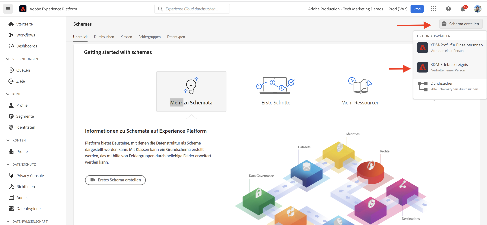
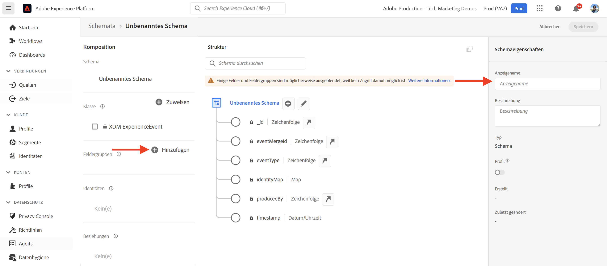
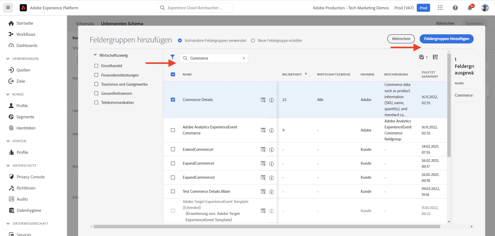
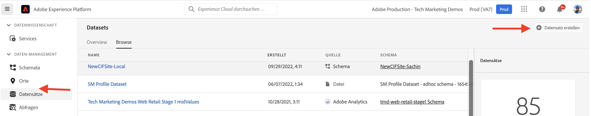
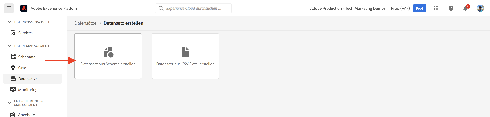
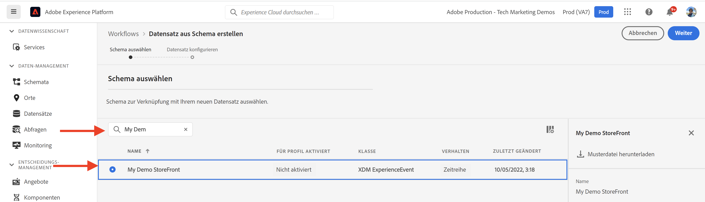
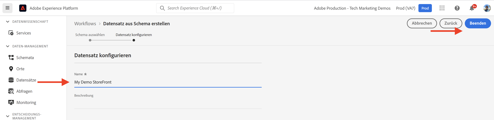
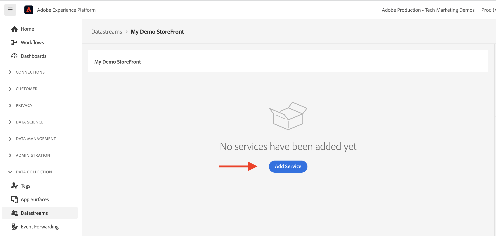
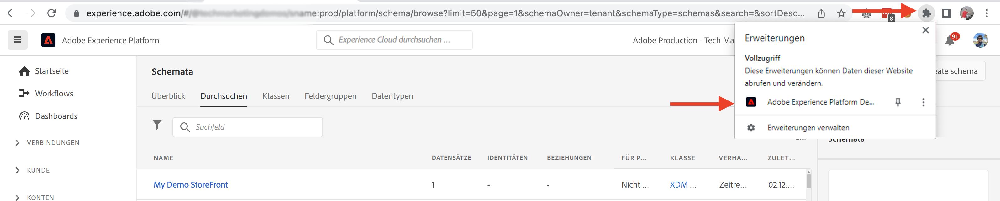

# AEM-CIF-Kernkomponenten und Adobe Experience Platform-Integration {#aem-cif-aep-integration}

Die [Commerce Integration Framework (CIF)](https://github.com/adobe/aem-core-cif-components) Kernkomponenten bieten eine nahtlose Integration mit [Adobe Experience Platform](https://experienceleague.adobe.com/docs/experience-platform/landing/platform-overview.html?lang=en) Weiterleiten von Storefront-Ereignissen und deren Daten aus Client-seitigen Interaktionen, z. B. __zum Warenkorb hinzufügen__.

Die [CIF-Kernkomponenten AEM](https://github.com/adobe/aem-core-cif-components) Das Projekt stellt eine JavaScript-Bibliothek mit dem Namen [Adobe Experience Platform-Connector für Adobe Commerce](https://github.com/adobe/aem-core-cif-components/tree/master/extensions/experience-platform-connector) um Ereignisdaten aus Ihrem Commerce-Storefront zu erfassen. Diese Ereignisdaten werden an die Experience Platform gesendet, in der sie in anderen Adobe Experience Cloud-Produkten wie Adobe Analytics und Adobe Target zum Erstellen eines 360-Grad-Profils verwendet werden, das eine Journey abdeckt. Durch die Verbindung von Commerce-Daten mit anderen Produkten in der Adobe Experience Cloud können Sie Aufgaben wie die Analyse des Benutzerverhaltens auf Ihrer Site, AB-Tests und die Erstellung personalisierter Kampagnen durchführen.

Weitere Informationen zum [Experience Platform Data Collection](https://experienceleague.adobe.com/docs/experience-platform/collection/home.html) Suite von Technologien, mit denen Sie Kundenerlebnisdaten aus clientseitigen Quellen erfassen können.

## Senden `addToCart` Ereignisdaten in Experience Platform {#send-addtocart-to-aep}

Die folgenden Schritte zeigen, wie Sie die `addToCart` Ereignisdaten von AEM gerenderten Produktseiten an die Experience Platform mithilfe des CIF - Experience Platform Connector. Mithilfe der Browsererweiterung &quot;Adobe Experience Platform Debugger&quot;können Sie die gesendeten Daten testen und überprüfen.


## Voraussetzungen {#prerequisites}

Sie müssen eine lokale Entwicklungsumgebung verwenden, um diese Demo abzuschließen. Dazu gehört eine laufende Instanz von AEM, die konfiguriert und mit einer Adobe Commerce-Instanz verbunden ist. Überprüfen Sie die Anforderungen und Schritte zum [Einrichten einer lokalen Entwicklungsumgebung mit dem AEM as Cloud Service SDK](../develop.md).

Sie benötigen außerdem Zugriff auf [Adobe Experience Platform](https://experienceleague.adobe.com/docs/experience-platform/landing/platform-ui/ui-guide.html) und Berechtigungen zum Erstellen des Schemas, Datensatzes und Datastreams für die Datenerfassung. Weitere Informationen finden Sie unter [Berechtigungsverwaltung](https://experienceleague.adobe.com/docs/experience-platform/collection/permissions.html).

## as a Cloud Service Einrichtung AEM Commerce {#aem-setup}

Arbeiten __AEM Commerce as a Cloud Service__ die lokale Umgebung mit dem erforderlichen Code und der erforderlichen Konfiguration, führen Sie die folgenden Schritte aus.

### Lokales Setup

Befolgen Sie die [Lokale Einrichtung](https://experienceleague.adobe.com/docs/experience-manager-cloud-service/content/content-and-commerce/storefront/developing/develop.html?#local-setup) Schritte, um eine funktionierende AEM Commerce-as a Cloud Service Umgebung zu erhalten.

### Projekt-Setup

Befolgen Sie die [AEM Projektarchetyp](https://experienceleague.adobe.com/docs/experience-manager-cloud-service/content/content-and-commerce/storefront/developing/develop.html?#project) Schritte zum Erstellen eines brandneuen AEM Commerce (CIF)-Projekts.

>[!TIP]
>
>Im folgenden Beispiel trägt das AEM Commerce-Projekt den Namen: `My Demo Storefront`Sie können jedoch Ihren eigenen Projektnamen auswählen.


Erstellen Sie das neu erstellte AEM Commerce-Projekt und stellen Sie es im lokalen AEM SDK bereit, indem Sie den folgenden Befehl im Stammverzeichnis des Projekts ausführen.

```bash
$ mvn clean install -PautoInstallSinglePackage
```

Lokal bereitgestellt `My Demo StoreFront` Commerce-Site mit Standardcode und Standardinhalt sieht wie folgt aus:


### Connector-Abhängigkeiten von Peregrine und CIF-AEP installieren

Um die Ereignisdaten aus den Kategorie- und Produktseiten dieser AEM Commerce-Site zu erfassen und zu senden, müssen Sie den Schlüssel installieren `npm` in `ui.frontend` -Modul des AEM Commerce-Projekts.

Navigieren Sie zum `ui.frontend` und installieren Sie die erforderlichen Pakete, indem Sie die folgenden Befehle über die Befehlszeile ausführen.

```bash
npm i --save lodash.get@^4.4.2 lodash.set@^4.3.2
npm i --save apollo-cache-persist@^0.1.1
npm i --save redux-thunk@~2.3.0
npm i --save @adobe/apollo-link-mutation-queue@~1.1.0
npm i --save @magento/peregrine@~12.5.0
npm i --save @adobe/aem-core-cif-react-components --force
npm i --save-dev @magento/babel-preset-peregrine@~1.2.1
npm i --save @adobe/aem-core-cif-experience-platform-connector --force
```

>[!IMPORTANT]
>
>Die `--force` Das -Argument ist manchmal erforderlich als [PWA Studio](https://developer.adobe.com/commerce/pwa-studio/) restriktiv gegenüber den unterstützten Peer-Abhängigkeiten ist. Normalerweise sollte dies keine Probleme verursachen.


### Maven für die Verwendung konfigurieren `--force` argument

Im Rahmen des Maven-Build-Prozesses wird die npm-bereinigte Installation (mithilfe von `npm ci`) ausgelöst wird. Dies erfordert auch die `--force` -Argument.

Navigieren Sie zur POM-Stammdatei des Projekts. `pom.xml` und suchen Sie nach `<id>npm ci</id>` Ausführungsblock. Aktualisieren Sie den Block so, dass er wie folgt aussieht:

```xml
<execution>
    <id>npm ci</id>
    <goals>
    <goal>npm</goal>
    </goals>
    <configuration>
    <arguments>ci --force</arguments>
    </configuration>
</execution>
```

### Babel-Konfigurationsformat ändern

Aus der Standardeinstellung wechseln `.babelrc` Dateirelatives Konfigurationsdateiformat `babel.config.js` Format. Dies ist ein projektübergreifendes Konfigurationsformat, in dem die Plug-ins und Vorgaben auf die `node_module` mit größerer Kontrolle.

1. Navigieren Sie zum `ui.frontend` -Modul und löschen Sie die vorhandene `.babelrc` -Datei.

1. Erstellen Sie eine `babel.config.js` -Datei, die die `peregrine` voreingestellt.

   ```javascript
   const peregrine = require('@magento/babel-preset-peregrine');
   
   module.exports = (api, opts = {}) => {
       const config = {
           ...peregrine(api, opts),
           sourceType: 'unambiguous'
       } 
   
       config.plugins = config.plugins.filter(plugin => plugin !== 'react-refresh/babel');
   
       return config;
   }
   ```

### Webpack für die Verwendung von Babel konfigurieren

So übertragen Sie die JavaScript-Dateien mit dem Babel-Lader (`babel-loader`) und Webpack, müssen Sie die `webpack.common.js` -Datei.

Navigieren Sie zum `ui.frontend` und aktualisieren Sie die `webpack.common.js` -Datei, um die folgende Regel in der `module` Eigenschaftswert:

```javascript
{
    test: /\.jsx?$/,
    exclude: /node_modules\/(?!@magento\/)/,
    loader: 'babel-loader'
}
```

### Konfigurieren des Apollo-Clients

Die [Apollo Client](https://www.apollographql.com/docs/react/) wird verwendet, um sowohl lokale als auch Remote-Daten mit GraphQL zu verwalten. Außerdem werden die Ergebnisse von GraphQL-Abfragen in einem lokalen, normalisierten Arbeitsspeichercache gespeichert.

Für [`InMemoryCache`](https://www.apollographql.com/docs/react/caching/cache-configuration/) Um effektiv zu arbeiten, benötigen Sie eine `possibleTypes.js` -Datei. Informationen zum Generieren dieser Datei finden Sie unter [Automatische Generierung von möglichen Typen](https://www.apollographql.com/docs/react/data/fragments/#generating-possibletypes-automatically). Siehe auch [PWA Studio-Referenzimplementierung](https://github.com/magento/pwa-studio/blob/1977f38305ff6c0e2b23a9da7beb0b2f69758bed/packages/pwa-buildpack/lib/Utilities/graphQL.js#L106-L120) und ein Beispiel für eine [`possibleTypes.js`](../assets/aep-integration/possibleTypes.js) -Datei.


1. Navigieren Sie zum `ui.frontend` und speichern Sie die Datei als `./src/main/possibleTypes.js`

1. Aktualisieren Sie die `webpack.common.js` -Datei `DefinePlugin` -Abschnitt, um die erforderlichen statischen Variablen während der Build-Zeit zu ersetzen.

   ```javascript
   const { DefinePlugin } = require('webpack');
   const { POSSIBLE_TYPES } = require('./src/main/possibleTypes');
   
   ...
   
   plugins: [
       ...
       new DefinePlugin({
           'process.env.USE_STORE_CODE_IN_URL': false,
           POSSIBLE_TYPES
       })
   ]
   ```

### Initialisieren der Kernkomponenten Peregrine und CIF

Um die React-basierten Peregrine- und CIF-Kernkomponenten zu initialisieren, erstellen Sie die erforderliche Konfiguration und JavaScript-Dateien.

1. Navigieren Sie zum `ui.frontend` und erstellen Sie den folgenden Ordner: `src/main/webpack/components/commerce/App`

1. Erstellen Sie eine `config.js` mit folgendem Inhalt:

   ```javascript
   // get and parse the CIF store configuration from the <head>
   const storeConfigEl = document.querySelector('meta[name="store-config"]');
   const storeConfig = storeConfigEl ? JSON.parse(storeConfigEl.content) : {};
   
   // the following global variables are needed for some of the peregrine features
   window.STORE_VIEW_CODE = storeConfig.storeView || 'default';
   window.AVAILABLE_STORE_VIEWS = [
       {
           code: window.STORE_VIEW_CODE,
           base_currency_code: 'USD',
           default_display_currency_code: 'USD',
           id: 1,
           locale: 'en',
           secure_base_media_url: '',
           store_name: 'My Demo StoreFront'
       }
   ];
   window.STORE_NAME = window.STORE_VIEW_CODE;
   window.DEFAULT_COUNTRY_CODE = 'en';
   
   export default {
       storeView: window.STORE_VIEW_CODE,
       graphqlEndpoint: storeConfig.graphqlEndpoint,
       // Can be GET or POST. When selecting GET, this applies to cache-able GraphQL query requests only.
       // Mutations will always be executed as POST requests.
       graphqlMethod: storeConfig.graphqlMethod,
       headers: storeConfig.headers,
   
       mountingPoints: {
           // TODO: define the application specific mount points as they may be used by <Portal> and <PortalPlacer>
       },
       pagePaths: {
           // TODO: define the application specific paths/urls as they may be used by the components
           baseUrl: storeConfig.storeRootUrl
       },
       eventsCollector: {
           // Enable the Experience Platform Connector and define the org and datastream to use
           aep: {
               orgId: // TODO: add your orgId
               datastreamId: // TODO: add your datastreamId
           }
       }
   };
   ```

   >[!IMPORTANT]
   >
   >Vielleicht kennen Sie bereits die [`config.js`](https://github.com/adobe/aem-cif-guides-venia/blob/main/ui.frontend/src/main/components/App/config.js) Datei aus __AEM Guides - CIF Venia Project__, müssen Sie einige Änderungen an dieser Datei vornehmen. Überprüfen Sie zunächst alle __TODO__ Kommentare. Anschließend in der `eventsCollector` -Eigenschaft, suchen Sie die `eventsCollector > aed` -Objekt und aktualisieren Sie die `orgId` und `datastreamId` auf die richtigen Werte. [Weitere Informationen](./aep.md#add-aep-values-to-aem)

1. Erstellen Sie eine `App.js` -Datei mit folgendem Inhalt. Diese Datei ähnelt einer typischen React-App-Startpunktdatei und enthält React- und benutzerdefinierte Hooks sowie die Verwendung von ReactContext, um die Experience Platform-Integration zu erleichtern.

   ```javascript
   import config from './config';
   
   import React, { useEffect } from 'react';
   import ReactDOM from 'react-dom';
   import { IntlProvider } from 'react-intl';
   import { BrowserRouter as Router } from 'react-router-dom';
   import { combineReducers, createStore } from 'redux';
   import { Provider as ReduxProvider } from 'react-redux';
   import { createHttpLink, ApolloProvider } from '@apollo/client';
   import { ConfigContextProvider, useCustomUrlEvent, useReferrerEvent, usePageEvent, useDataLayerEvents, useAddToCartEvent } from '@adobe/aem-core-cif-react-components';
   import { EventCollectorContextProvider, useEventCollectorContext } from '@adobe/aem-core-cif-experience-platform-connector';
   import { useAdapter } from '@magento/peregrine/lib/talons/Adapter/useAdapter';
   import { customFetchToShrinkQuery } from '@magento/peregrine/lib/Apollo/links';
   import { BrowserPersistence } from '@magento/peregrine/lib/util';
   import { default as PeregrineContextProvider } from '@magento/peregrine/lib/PeregrineContextProvider';
   import { enhancer, reducers } from '@magento/peregrine/lib/store';
   
   const storage = new BrowserPersistence();
   const store = createStore(combineReducers(reducers), enhancer);
   
   storage.setItem('store_view_code', config.storeView);
   
   const App = () => {
       const [{ sdk: mse }] = useEventCollectorContext();
   
       // trigger page-level events
       useCustomUrlEvent({ mse });
       useReferrerEvent({ mse });
       usePageEvent({ mse });
       // listen for add-to-cart events and enable forwarding to the magento storefront events sdk
       useAddToCartEvent(({ mse }));
       // enable CIF specific event forwarding to the Adobe Client Data Layer
       useDataLayerEvents();
   
       useEffect(() => {
           // implement a proper marketing opt-in, for demo purpose we hard-set the consent cookie
           if (document.cookie.indexOf('mg_dnt') < 0) {
               document.cookie += '; mg_dnt=track';
           }
       }, []);
   
       // TODO: use the App to create Portals and PortalPlaceholders to mount the CIF / Peregrine components to the server side rendered markup
       return <></>;
   };
   
   const AppContext = ({ children }) => {
       const { storeView, graphqlEndpoint, graphqlMethod = 'POST', headers = {}, eventsCollector } = config;
       const { apolloProps } = useAdapter({
           apiUrl: new URL(graphqlEndpoint, window.location.origin).toString(),
           configureLinks: (links, apiBase) =>
               // reconfigure the HTTP link to use the configured graphqlEndpoint, graphqlMethod and storeView header
   
               links.set('HTTP', createHttpLink({
                   fetch: customFetchToShrinkQuery,
                   useGETForQueries: graphqlMethod !== 'POST',
                   uri: apiBase,
                   headers: { ...headers, 'Store': storeView }
               }))
       });
   
       return (
           <ApolloProvider {...apolloProps}>
               <IntlProvider locale='en' messages={{}}>
                   <ConfigContextProvider config={config}>
                       <ReduxProvider store={store}>
                           <PeregrineContextProvider>
                               <EventCollectorContextProvider {...eventsCollector}>
                                   {children}
                               </EventCollectorContextProvider>
                           </PeregrineContextProvider>
                       </ReduxProvider>
                   </ConfigContextProvider>
               </IntlProvider>
           </ApolloProvider>
       );
   };
   
   window.onload = async () => {
       const root = document.createElement('div');
       document.body.appendChild(root);
   
       ReactDOM.render(
           <Router>
               <AppContext>
                   <App />
               </AppContext>
           </Router>,
           root
       );
   };
   ```

   Die `EventCollectorContext` exportiert den ReactContext, der:

   - lädt die Bibliothek commerce-events-sdk und commerce-events-collection ,
   - initialisiert sie mit einer bestimmten Konfiguration für Experience Platform und/oder ACDS
   - abonniert alle Ereignisse von Peregrine und leitet sie an das Ereignis-SDK weiter

   Sie können die Implementierungsdetails der `EventCollectorContext` [here](https://github.com/adobe/aem-core-cif-components/blob/3d4e44d81fff2f398fd2376d24f7b7019f20b31b/extensions/experience-platform-connector/src/events-collector/EventCollectorContext.js).

### Erstellen und Bereitstellen des aktualisierten AEM

Um sicherzustellen, dass die oben genannten Änderungen an Paketinstallation, Code und Konfiguration korrekt sind, erstellen Sie das aktualisierte AEM Commerce-Projekt neu und stellen Sie es mithilfe des folgenden Maven-Befehls bereit: `$ mvn clean install -PautoInstallSinglePackage`.

## Einrichtung der Experience Platform {#aep-setup}

Führen Sie die folgenden Schritte aus, um die Ereignisdaten aus den AEM Commerce-Seiten wie Kategorie und Produkt zu empfangen und zu speichern:

>[!AVAILABILITY]
>
>Stellen Sie sicher, dass Sie Teil der richtigen __Produktprofile__ under __Adobe Experience Platform__ und __Adobe Experience Platform-Datenerfassung__. Arbeiten Sie bei Bedarf mit Ihrem Systemadministrator zusammen, um zu erstellen, zu aktualisieren oder zuzuweisen. __Produktprofile__ unter [Admin Console](https://adminconsole.adobe.com/).

### Schema mit Commerce-Feldergruppe erstellen

Um die Struktur für Commerce-Ereignisdaten zu definieren, müssen Sie ein Experience-Datenmodell (XDM)-Schema erstellen. Ein Schema ist ein Regelsatz, der die Datenstruktur und das Datenformat darstellt und validiert.

1. Navigieren Sie im Browser zum __Adobe Experience Platform__ Produkt-Homepage. Beispiel: <https://experience.adobe.com/#/@YOUR-ORG-NAME/sname:prod/platform/home>.

1. Suchen Sie die __Schemas__ im linken Navigationsbereich auf die Schaltfläche __Schema erstellen__ Schaltfläche oben rechts und wählen Sie __XDM ExperienceEvent__.

   

1. Benennen Sie Ihr Schema mit __Schemaeigenschaften > Anzeigename__ und fügen Sie mithilfe des  __Komposition > Feldergruppen > Hinzufügen__ Schaltfläche.

   

1. Im __Feldergruppen hinzufügen__ Dialogfeld, suchen Sie nach `Commerce`, wählen Sie die __Commerce-Details__ und klicken Sie auf __Feldergruppen hinzufügen__.

   


>[!TIP]
>
>Siehe [Grundlagen der Schemakomposition](https://experienceleague.adobe.com/docs/experience-platform/xdm/schema/composition.html) für weitere Informationen.

### Datensatz erstellen

Um die Ereignisdaten zu speichern, müssen Sie einen Datensatz erstellen, der der Schemadefinition entspricht. Ein Datensatz ist ein Speicher- und Verwaltungskonstrukt für eine Sammlung von Daten, normalerweise eine Tabelle, die ein Schema (Spalten) und Felder (Zeilen) enthält.

1. Navigieren Sie im Browser zum __Adobe Experience Platform__ Produkt-Homepage. Beispiel: <https://experience.adobe.com/#/@YOUR-ORG-NAME/sname:prod/platform/home>.

1. Suchen Sie die __Datensätze__ im linken Navigationsbereich auf und klicken Sie auf das __Datensatz erstellen__ Schaltfläche oben rechts.

   

1. Wählen Sie auf der neuen Seite __Datensatz aus Schema erstellen__ Karte.

   

- Auf der neuen Seite __Suchen und Auswählen__ das Schema, das Sie im vorherigen Schritt erstellt haben, und klicken Sie auf __Nächste__ Schaltfläche.

   

1. Benennen Sie Ihren Datensatz mit dem __Datensatz konfigurieren > Name__ und klicken Sie auf __Beenden__ Schaltfläche.

   

>[!TIP]
>
>Siehe [Datensätze - Übersicht](https://experienceleague.adobe.com/docs/experience-platform/catalog/datasets/overview.html) für weitere Informationen.


### Datenspeicher erstellen

Führen Sie die folgenden Schritte aus, um einen Datastream in der Experience Platform zu erstellen.

1. Navigieren Sie im Browser zum __Adobe Experience Platform__ Produkt-Homepage. Beispiel: <https://experience.adobe.com/#/@YOUR-ORG-NAME/sname:prod/platform/home>.

1. Suchen Sie die __Datenspeicher__ im linken Navigationsbereich auf und klicken Sie auf das __Neuer Datenspeicher__ Schaltfläche oben rechts.

   

1. Benennen Sie Ihren Datastream mit dem __Name__ erforderliches Feld. Unter dem __Ereignisschema__ ein, wählen Sie das neu erstellte Schema aus und klicken Sie auf __Speichern__.

   

1. Öffnen Sie den neu erstellten Datenspeicher und klicken Sie auf __Dienst hinzufügen__.

   

1. Unter dem __Diensleistung__ ein, wählen Sie die __Adobe Experience Platform__ -Option. under __Ereignis-Datensatz__ das Feld, wählen Sie den Datensatznamen aus dem vorherigen Schritt aus und klicken Sie auf __Speichern__.

   

>[!TIP]
>
>Siehe [Übersicht über Datenspeicher](https://experienceleague.adobe.com/docs/experience-platform/edge/datastreams/overview.html) für weitere Informationen.

## Hinzufügen des Datenspeicherwerts in AEM Commerce-Konfiguration {#add-aep-values-to-aem}

Nach Abschluss der oben genannten Experience Platform-Einrichtung sollten Sie `datastreamId` in der linken Leiste der Datenspeicherdetails und `orgId` in der oberen rechten Ecke der __Profilbild > Kontoinformationen > Benutzerinformationen__ modal.


1. Im AEM Commerce-Projekt `ui.frontend` -Modul, aktualisieren Sie die `config.js` -Datei und insbesondere die `eventsCollector > aep` Objekteigenschaften.

1. Erstellen und Bereitstellen des aktualisierten AEM Commerce-Projekts


## Trigger `addToCart` Ereignis und Überprüfung der Datenerfassung {#event-trigger-verify}

Die oben genannten Schritte führen die Einrichtung von AEM Commerce und Experience Platform durch. Sie können jetzt einen Trigger `addToCart` -Ereignis eintreten und die Datenerfassung mit dem Experience Platform-Debugger und -Datensatz überprüfen __Metriken und Diagramme__ in der Produktoberfläche ein-/ausschalten.

Um das Ereignis Trigger, können Sie AEM Autor oder den Veröffentlichungsdienst in Ihrer lokalen Einrichtung verwenden. Verwenden Sie für dieses Beispiel AEM Autor, indem Sie sich bei Ihrem Konto anmelden.

1. Wählen Sie auf der Seite Sites die __My Demo StoreFront > us > en__ Seite und klicken Sie auf __Bearbeiten__ in der oberen Aktionsleiste.

1. Klicken Sie in der oberen Aktionsleiste auf __Als veröffentlicht anzeigen__ und klicken Sie dann in der Navigation der Storefront auf eine beliebige bevorzugte Kategorie.

1. Klicken Sie auf eine beliebige Produktkarte im __Produktseite__, wählen Sie __Farbe, Größe__ um die __Zum Warenkorb hinzufügen__ Schaltfläche.


1. Öffnen Sie die __Adobe Experience Platform Debugger__ Erweiterung aus dem Bedienfeld der Browsererweiterung und wählen Sie __Experience Platform Wed SDK__ in der linken Leiste.

   


1. Kehren Sie zu __Produktseite__ und klicken Sie auf __Zum Warenkorb hinzufügen__ Schaltfläche. Dadurch werden Daten an die Experience Platform gesendet. Die __Adobe Experience Platform Debugger__ -Erweiterung zeigt die Ereignisdetails an.

   


1. Navigieren Sie in der Experience Platform-Produktoberfläche zum __Datensätze > My Demo StoreFront__ unter __Datensatzaktivität__ Registerkarte. Wenn die Variable __Metriken und Diagramme__ -Umschalter aktiviert ist, werden die Ereignisdatenstatistiken angezeigt.

   


## Implementierungsdetails {#implementation-details}

Die [CIF Experience Platform Connector](https://github.com/adobe/aem-core-cif-components/tree/master/extensions/experience-platform-connector) basiert auf dem [Experience Platform Connector für Adobe Commerce](https://marketplace.magento.com/magento-experience-platform-connector.html), der Teil der [PWA Studio](https://developer.adobe.com/commerce/pwa-studio/) Projekt.

Mit dem PWA Studio-Projekt können Sie Progressive Web Application (PWA) Storefronts erstellen, die von Adobe Commerce oder Magento Open Source unterstützt werden. Das Projekt enthält auch eine Komponentenbibliothek mit dem Namen [Peregrin](https://developer.adobe.com/commerce/pwa-studio/api/peregrine/) für das Hinzufügen von Logik zu visuellen Komponenten. Die [Peregrin Library](https://developer.adobe.com/commerce/pwa-studio/api/peregrine/) stellt auch die benutzerdefinierten React-Hooks bereit, die von [Experience Platform Connector](https://github.com/adobe/aem-core-cif-components/tree/master/extensions/experience-platform-connector) zur nahtlosen Integration in Experience Platform.


## Unterstützte Ereignisse {#supported-events}

Ab sofort werden die folgenden Ereignisse unterstützt:

__Erlebnis-XDM-Ereignisse:__

1. Zum Warenkorb hinzufügen (AEM)
1. Seite anzeigen (AEM)
1. Produkt anzeigen (AEM)
1. Suchanfrage gesendet (AEM)
1. Erhalt der Suchantwort (AEM)

Wann [Peregrine-Komponenten](https://developer.adobe.com/commerce/pwa-studio/guides/packages/peregrine/) werden im AEM Commerce-Projekt wiederverwendet:

__Erlebnis-XDM-Ereignisse:__

1. Aus Warenkorb entfernen
1. Offener Warenkorb
1. Warenkorb anzeigen
1. Sofortiger Kauf
1. Checkout starten
1. Vollständiger Kasse

__Profil-XDM-Ereignisse:__

1. Anmelden
1. Konto erstellen
1. Konto bearbeiten


## Zusätzliche Ressourcen {#additional-resources}

Weitere Informationen finden Sie in den folgenden Ressourcen:

- [PWA Studio](https://developer.adobe.com/commerce/pwa-studio/)
- [Übersicht über den Experience Platform Connector](https://experienceleague.adobe.com/docs/commerce-merchant-services/experience-platform-connector/overview.html)
- [Experience Platform Connector-Ereignisse](https://experienceleague.adobe.com/docs/commerce-merchant-services/experience-platform-connector/event-forwarding/events.html)
- [Übersicht über Adobe Experience Platform](https://experienceleague.adobe.com/docs/experience-platform/landing/home.html)
