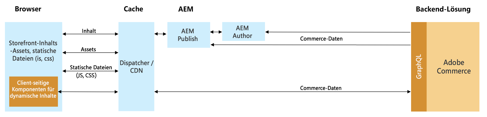
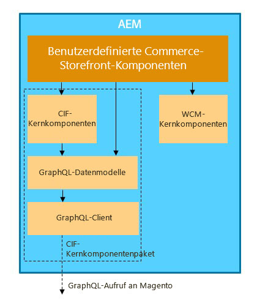

# Integration von AEM und Adobe Commerce mithilfe des Commerce Integration Framework {#aem-framework}

Adobe Experience Manager und Adobe Commerce werden über das Commerce Integration Framework (CIF) nahtlos integriert. CIF ermöglicht AEM direkten Zugriff auf und die direkte Kommunikation mit der Commerce-Instanz mithilfe der [GraphQL-APIs](https://devdocs.magento.com/guides/v2.4/graphql/) von Adobe Commerce.

>[!NOTE]
>
> Zur Unterstützung der GraphQL-API ist mindestens die Version 2.3.5 erforderlich. Bestimmte Funktionen werden nur von neueren Versionen oder nur von der Adobe Commerce-Edition unterstützt.

>[!NOTE]
>
>GraphQL wird derzeit in zwei (separaten) Szenarios in Adobe Experience Manager (AEM) as a Cloud Service verwendet:
>
>* In diesem Szenario, in dem CIF über GraphQL mit Commerce kommuniziert.
>* [AEM-Inhaltsfragmente arbeiten mit der AEM-GraphQL-API (einer auf GraphQL basierenden benutzerdefinierten Implementierung) zusammen, um strukturierte Inhalte für die Verwendung in Ihren Programmen bereitzustellen](/help/headless/graphql-api/content-fragments.md).

## Architekturüberblick {#overview}

Die Gesamtarchitektur sieht wie folgt aus:

CIF unterstützt Server-seitige und Client-seitige Kommunikationsmuster.
Server-seitige APIs werden mithilfe des integrierten, generischen [GraphQL-Clients](https://github.com/adobe/commerce-cif-graphql-client) in Kombination mit einem [Satz generierter Datenmodelle](https://github.com/adobe/commerce-cif-magento-graphql) für das Commerce-GraphQL-Schema implementiert. Außerdem können alle GraphQL-Abfragen oder Mutationen im GQL-Format verwendet werden.

Bei Client-seitigen Komponenten, die mit [React](https://reactjs.org/) erstellt werden, kommt der [Apollo-Client](https://www.apollographql.com/docs/react/) zum Einsatz.

## Architektur mit den AEM CIF-Kernkomponenten {#cif-core-components}

[AEM CIF-Kernkomponenten](https://github.com/adobe/aem-core-cif-components) folgen sehr ähnlichen Design-Mustern und Best Practices wie die [AEM WCM-Kernkomponenten](https://github.com/adobe/aem-core-wcm-components).

Die Geschäftslogik und Backend-Kommunikation mit Adobe Commerce für die AEM CIF-Kernkomponenten werden in Sling-Modellen implementiert. Falls es notwendig ist, diese Logik an projektspezifische Anforderungen anzupassen, kann das Delegationsmuster für Sling-Modelle verwendet werden.

>[!TIP]
>
>Die Seite [Anpassen von AEM CIF-Kernkomponenten](../customizing/customize-cif-components.md) enthält ein detailliertes Beispiel und Best Practices zur Anpassung von CIF-Kernkomponenten.

Innerhalb von Projekten können AEM CIF-Kernkomponenten und benutzerdefinierte Projektkomponenten den konfigurierten Client für einen mit einer AEM-Seite verknüpften Adobe Commerce-Store über eine Sling-kontextsensible Konfiguration abrufen.

## Suchen {#search}

CIF bietet eine vordefinierte [Kernkomponente für die Suche](https://www.aemcomponents.dev/content/core-components-examples/library/commerce/search.html), die ein Server-seitiges gerendertes Sucherlebnis basierend auf der [Commerce GraphQL-API](https://developer.adobe.com/commerce/webapi/graphql/) darstellt. Commerce-Kundinnen und -Kunden haben die Möglichkeit, stattdessen die [Live-Suche](https://experienceleague.adobe.com/docs/commerce-merchant-services/live-search/guide-overview.html?lang=de) zu verwenden. Mehr über die Integration der CIF-Live-Suche erfahren Sie unter diesem [Link](/help/commerce-cloud/integrating/live-search-plp.md).

