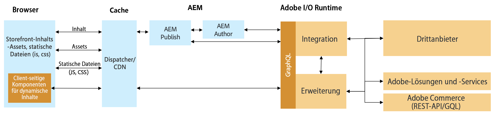

# Integration von AEM und Drittanbieter-Commerce mithilfe des Commerce Integration Framework {#aem-third-party}

Die Integration von Lösungen außerhalb von Adobe Commerce ist ein häufiges Szenario für CIF. Drittanbieterlösungen mit verschiedenen APIs und Schemas werden über eine Integrationsebene verbunden.

## Architektur {#architecture}

Die Gesamtarchitektur sieht wie folgt aus:

Der Zweck dieser Integrationsebene ist es, APIs und Schemata von Drittanbietern auf die unterstützten Adobe Commerce-GraphQL-APIs und -Schemata außerhalb von Experience Manager abzubilden. Dank dieser Kapselung können die Integrationslogik und -systeme aktualisiert werden, ohne den Code in Experience Manager zu ändern.

## Lösungsanforderungen für eine Integration

Da Experience Manager Daten bei Bedarf abruft, sind für den Produktkatalog Echtzeit-APIs erforderlich.

>[!TIP]
>
>Wenn keine Echtzeit-APIs verfügbar sind, sollte für die Integration ein externer Produkt-Cache mit APIs verwendet werden. Zum Beispiel [Adobe Commerce Open Source](https://business.adobe.com/de/products/magento/open-source.html).

Es ist nicht erforderlich, das vollständige GraphQL-Schema zu implementieren, sondern nur die Objekte des Schemas, um die gewünschten Anwendungsfälle zu ermöglichen.

## Backend-Anwendungsfälle

CIF erweitert Experience Manager mit Echtzeit-Produktkatalogzugriff und Tools für das Erlebnis-Management. Diese nahtlose Integration ermöglicht es Autoren, bei Bedarf über eingebettete Benutzeroberflächen auf Commerce-Daten zuzugreifen, ohne den Inhaltskontext verlassen zu müssen.

Die Integrationen von Produktkatalog-APIs sind erforderlich, um diese Anwendungsfälle zu erschließen.

## Frontend-Anwendungsfälle

[AEM CIF-Kernkomponenten](https://github.com/adobe/aem-core-cif-components) rufen Daten über die CIF-unterstützten Adobe Commerce-APIs ab und tauschen diese aus. Um Komponenten wiederzuverwenden, müssen die entsprechenden APIs implementiert werden.

Die Empfehlung für leistungskritische Client-seitige Komponenten besteht darin, direkt mit der Drittanbieterlösung zu kommunizieren, um Latenz zu vermeiden.

## Entwickeln einer Integration {#develop-integration}

Adobe empfiehlt die Verwendung von [Adobe Developer Runtime](https://developer.adobe.com/runtime/) für die Integrationsebene. Es ist im CIF-Add-on für Drittanbieter enthalten. Da sie mit einem Microservice-artigen Ansatz arbeitet, ist sie gut geeignet, einfach mehrere Lösungen zu integrieren.

Die [Referenzimplementierung](https://github.com/adobe/commerce-cif-graphql-integration-reference) ist ein guter Ausgangspunkt für die Erstellung der Integration in Ihre Commerce-Lösung. Sie unterstützt zwar GraphQL, kann aber auch mit jeder anderen Art von API wie REST integriert werden.

Diese Integrationsebene ist nicht erforderlich, wenn eine Drittanbieterebene verfügbar ist (z. B. Mulesoft) oder die Integration auf der Drittanbieterlösung aufgebaut wird.

## Vorkonfigurierte Connectoren {#connectors}

Connectoren bieten einen guten Ausgangspunkt für Projekte. Sie enthalten eine spezifische Verbindung für Commerce-Lösungen und eine standardmäßige API-Zuordnung. Diese Connectoren werden von Drittanbietern erstellt und nicht von Adobe gepflegt. Wenden Sie sich an die jeweilige Partnerin bzw. den Partner, wenn Sie Informationen dazu wünschen.

* [SAP Commerce](https://github.com/diconium/commerce-cif-graphql-integration-hybris), erstellt von Diconium
* [Commercetools](https://github.com/diconium/commerce-cif-graphql-integration-commercetool), erstellt von Diconium

>[!TIP]
>
>Obwohl Connectoren in Projekten helfen, die Commerce-Integration zu beschleunigen, sind sie nicht Plug-and-Play. Enterprise Commerce-Lösungen sind stark angepasst und erfordern eine benutzerdefinierte Integration. Es sind gute Kenntnisse der Commerce-Plattform, der Adobe Commerce GraphQL-Schemata und von Adobe I/O Runtime erforderlich.
