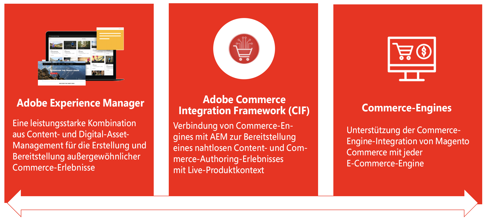
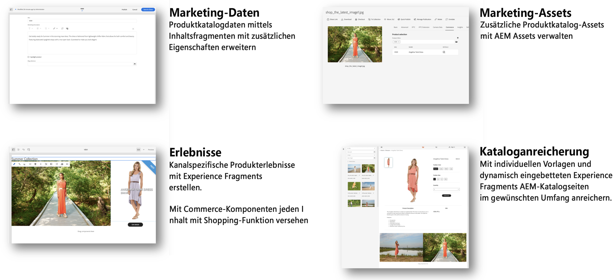

# Inhalt und Handel {#content-commerce}

Mit Adobe Experience Manager-Inhalten und -Commerce können Marken schneller skalieren und innovativ sein, um Commerce-Erlebnisse zu differenzieren und beschleunigte Online-Ausgaben zu erfassen. AEM Content and Commerce kombiniert die interaktiven, Omnichannel- und personalisierten Erlebnisse im Experience Manager mit einer beliebigen Anzahl von Commerce-Lösungen, um in allen Bereichen des Einkaufs-Journey-Programms differenzierte Erlebnisse zu bieten, die Wertschöpfungszeit zu verkürzen und höhere Konversionsraten zu erzielen.

## So helfen Inhalte und Commerce Kunden beim Erfolg

Angesichts der stetig steigenden Kundenerwartungen an Online-Commerce-Erlebnisse werden Marken gezwungen, differenzierte Erlebnisse und schnellere Bereitstellung von mehr Inhalten bereitzustellen. Die Implementierung einer Content-Management-Plattform erfordert jedoch häufig hohe Zeit- und Budgetinvestitionen in die Entwicklung von grundlegenden Elementen wie benutzerdefinierten Komponenten und Authoring-Tools und führt zu Kosten bei Wartung und Upgrades. Experience Manager Sites bietet Content and Commerce als Add-On-Modul für Experience Manager als Cloud Service, das vordefinierte Commerce-Kernkomponenten, Authoring-Tools und eine Referenz-Storefront bereitstellt, um die Live-Schaltung zu beschleunigen, eine nahtlose Teamzusammenarbeit zu ermöglichen und Konversionen zu fördern.

Marken können Experience Manager mit Adobe Commerce, einem Bestandteil von Adobe Experience Cloud, sowie mit jeder beliebigen Commerce-Engine integrieren. Mit Experience Manager Content und Commerce können Marken:

* Schnellere Skalierung und Innovation
* Personalisieren von Erlebnissen zur Förderung der Konvertierung
* einmal erstellen und überall veröffentlichen
* Anreicherung und Differenzierung von Erlebnissen für Kunden
* Optimieren des Authoring mit Commerce-Datenzugriff

## Einführung AEM Commerce Integration Framework (CIF) {#cif-intro}

Da diese Projekte mit der Komplexität der Integration einer Commerce-Lösung zu tun haben. Eine Commerce-Lösung kann eine beliebige Lösung sein, von einer kommerziellen Lösung wie der Adobe Commerce Cloud bis hin zu einer Reihe von benutzerdefinierten Commerce-Services. Die Integration hängt in hohem Maße von den Anwendungsfällen und dem Ökosystem ab. Er berührt in der Regel verschiedene Orte und kommt in vielen verschiedenen Geschmacksrichtungen vor:

* Integration eines komplexen und dynamischen Ökosystems (z. B. Produktkataloge)
* Unternehmen müssen Produktinhalte mit ihrem eigenen Lebenszyklus effizient und kanalübergreifend verwalten
* Erstellen komplexer und personalisierter Journey für verschiedene Köpfe
* Fähigkeit, sich schnell anzupassen und Innovationen am Back- und Front-End zu entwickeln
* Betrieb einer skalierbaren und stabilen E2E-Infrastruktur, die für Spitzenleistung entwickelt wurde (Flash Sale, Black Friday, ...). Dazu gehören die einheitliche Suche und die Cache-Verwaltung.

Diese Komplexität eröffnet die Tür zu potenziellen Fehlerquellen, erhöhter TCO, Verzögerungen und einer geringeren Wertschöpfung. Diese Gründe haben zur Entwicklung des Commerce Integration Framework (CIF) geführt, das ein Add-on für den Experience Manager ist. CIF erweitert den Experience Manager mit Commerce-Funktionen und standardisiert die Integration mit einer Commerce-Engine. Das Ergebnis ist eine zukunftssichere, stabile und skalierbare Lösung mit niedrigerer TCO. Es ermöglicht technische und geschäftliche Innovationen mit agilen Tools und nahtlos integrierten Funktionen, um ansprechende Commerce-Erlebnisse zu erstellen.

## CIF unterstützt Kunden seit 2013 erfolgreich

Mit mehr als 200 Kunden hat sich CIF als erfolgreicher Bestandteil eines erfolgreichen Content &amp; Commerce-Projekts etabliert. Dies ist für IT und Unternehmen heute und in der Zukunft von Nutzen. Neuere Kundenprojekte beschreiben CIF als &quot;großen Beschleuniger und einen riesigen Zeitersparnis mit viel Wert&quot;.

## Vorteile des CIF {#cif-benefits}

CIF bietet vordefinierte Commerce-Kernkomponenten, die den Bedarf an benutzerdefiniertem Code reduzieren und die Markteinführungszeit für Marken verkürzen. Alle Kernkomponenten sind vorkonfiguriert in die clientseitige Datenschicht von Adobe integriert, um Kundenprofile wie z. B. das einheitliche Profil zu hydrieren. Dieses Profil erfasst detailliert das Verhalten eines Besuchers, mit dem die Journey in Echtzeit vorhergesagt und personalisiert werden kann.

Das CIF-Add-on integriert Produktkontext in Experience Manager und bietet Authoring-Tools wie eine Produktkonsole und Produkt-/Kategorieauswahl, mit denen Marketing-Experten Shop-fähige Erlebnisse in Experience Manager erstellen und bereitstellen können, ohne auf den Entwickler angewiesen zu sein. Zu den Vorteilen zählen:

### Erlebnisse

Leistungsstarke CIF-Tools in AEM ermöglichen es Erstellern von Inhalten, rasch umfassende und personalisierte Commerce-Erlebnisse auf skalierbare und Bereitstellungsunabhängige Weise zu erstellen, um Geschäftsmöglichkeiten optimal zu nutzen.

### Time-To-Value (TTV)

Beschleunigt die Projektentwicklung mit [AEM Kernkomponenten](https://www.aemcomponents.dev/), [AEM Venia-Referenz-Storefront](https://github.com/adobe/aem-cif-guides-venia), [AEM Projektarchetyp](https://docs.adobe.com/content/help/de-DE/experience-manager-core-components/using/developing/archetype/overview.html) und Integrationsmustern für PWA (Headless Content &amp; Commerce).

CIF ist für kontinuierliche Innovation mit einem immer aktuellen Add-on konzipiert, das es Kunden ermöglicht, auf neue und verbesserte Funktionen zuzugreifen.

### Integrationen

Verbinden Sie Ihr Ökosystem (z. B. Commerce-Lösung) mit dem Experience Cloud mithilfe von [Adobe I/O Runtime](https://www.adobe.io/apis/experienceplatform/runtime.html), einer auf Microservice basierenden serverlosen APIs und der Referenzimplementierung [CIF](https://github.com/adobe/commerce-cif-graphql-integration-reference).

## Bewährte Muster und Best Practices

CIF unterstützt Kunden mit standardisierten Integrationsmustern, die auf Best Practices basieren. Dies hilft Kunden, heute erfolgreich zu sein, ist flexibel, mit dem Kunden zu wachsen und sich an zukünftige Anforderungen anzupassen:

* Beseitigt typische Probleme bei Produktkatalog-Integrationen, die auftreten können. Beispiele:
   * Leistungsprobleme mit erhöhtem Katalogvolumen oder erhöhter Komplexität
   * Kein Zugriff auf statierte Daten
   * Bedarf an Echtzeit-Produktdaten und -Erlebnissen
* Eine wachsende digitale Reife führt zu einem Bedarf an Erfahrungsmanagement. CIF verfügt über Funktionen für das Produkterlebnis-Management, die ohne zusätzlichen IT-Aufwand schrittweise integriert werden können.
* Bereit für Omnichannel: CIF unterstützt eine Vielzahl von Touchpoint-Technologien (Server-seitig, Hybrid, Client-seitig) mit Mustern, Beschleunigern und Kernkomponenten.
