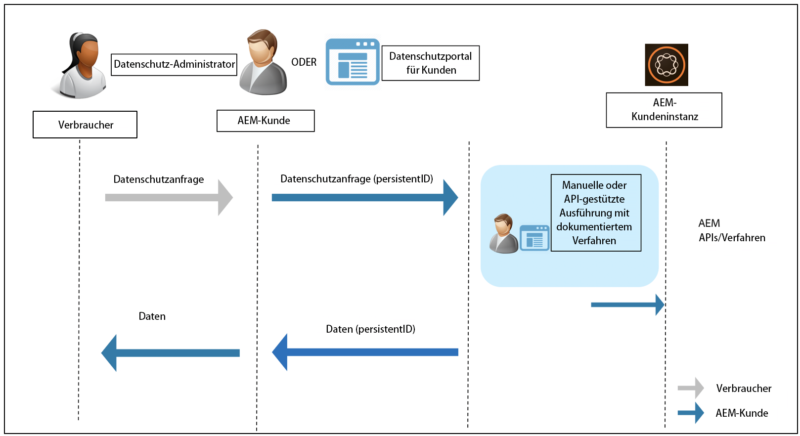

# Befolgung der Datenschutzbestimmungen durch Adobe Experience Manager as a Cloud Service {#aem-readiness-for-data-protection-and-data-privacy-regulations}

>[!WARNING]
>
>Der Inhalt dieses Dokuments stellt keine Rechtsberatung dar und ist nicht als Ersatz für Rechtsberatung gedacht.
>
>Wenden Sie sich an die Rechtsabteilung Ihres Unternehmens, um Ratschläge zu Datenschutzbestimmungen zu erhalten.

>[!NOTE]
>
>Weitere Informationen über die Reaktionen von Adobe auf Datenschutzprobleme und was diese Reaktionen für Sie als Adobe-Kundin bzw. -Kunde bedeuten, finden Sie im [Datenschutzzentrum von Adobe](https://www.adobe.com/de/privacy.html).

Um Adobe-Kundinnen und -Kunden bei der Einhaltung dieser Bestimmungen zu unterstützen, stellt Adobe allen Admins für den Schutz von Kundendaten und AEM-Admins eine Dokumentation und Verfahren (mit APIs, sofern verfügbar) zur Verfügung:

* Die Dokumentation hilft Admins beim Umgang mit Datenschutz und Datenschutzanfragen.
* Mit den dokumentierten Verfahren können Kundinnen und Kunden die Regulierungsanforderungen entweder manuell oder mit API-Aufrufen (sofern verfügbar) über ein externes Portal oder einen externen Service erfüllen.

>[!CAUTION]
>
>Die hier dokumentierten Details sind auf Adobe Experience Manager as a Cloud Service beschränkt.
>
>Bei Daten aus einem anderen On-Demand-Service von Adobe und den damit verbundenen Datenschutzanfragen müssen Maßnahmen für den betreffenden Service ergriffen werden.
>
>Weitere Informationen finden Sie im [Datenschutzzentrum von Adobe](https://www.adobe.com/de/privacy.html).

## Einführung {#introduction}

Die Instanzen von Adobe Experience Manager as a Cloud Service und die darauf ausgeführten Anwendungen liegen in der Verantwortung der Adobe-Kundinnen und -Kunden und werden von ihnen betrieben.

Daher ist das Einhalten von Datenschutzbestimmungen wie der DSGVO, des CCPA und anderen größtenteils Sache der Kundinnen und Kunden.

Zur Einführung sei darauf hingewiesen, dass die Datenschutzbestimmungen neue Regeln beinhalten, die von den folgenden Rollen befolgt werden müssen:

* Unternehmens-Entitäten (CCPA) und/oder Datenverantwortliche (DSGVO)

* Dienstleister (CCPA) und/oder Auftragsverarbeiter (DSGVO)

Die wichtigsten Bestimmungen dieser Verordnungen sind:

1. Erweiterte Definition personenbezogener Daten, um alle eindeutigen Kennungen einzuschließen; wie in direkt und indirekt identifizierbaren Daten.

2. Verschärfte Anforderungen an das Einverständnis.

3. Verstärkter Fokus auf Löschrechte (Datenlöschung).

4. Opt-out vom Verkauf von Daten.

Für Adobe Experience Manager as a Cloud Service:

* Die Instanzen und die darauf ausgeführten Anwendungen liegen in der Verantwortung unserer Kunden und werden von ihnen betrieben.

   * Verantwortung bedeutet effektiv, dass die regulatorischen Rollen kundenseitig verwaltet werden, darunter Unternehmens-Entitäten und Dienstleister, Datenverantwortliche und Auftragsverarbeiter.

   * Der Adobe Experience Platform Privacy Service ist nicht Teil des Workflows für AEM, wie in der folgenden Abbildung dargestellt.

* AEM umfasst Dokumentationen und Verfahren für den Datenschutzadministrator und/oder AEM-Administrator des Kunden, die Datenschutzanfragen manuell oder über APIs (sofern verfügbar) zu bearbeiten.

* Es wurde kein neuer Service und keine neue Benutzeroberfläche hinzugefügt.

   * Stattdessen werden Verfahren und APIs für die Verwendung durch die Benutzeroberflächen/Portale von Kunden dokumentiert, die Datenschutzanfragen bearbeiten.

* AEM enthält keine vorkonfigurieren Tools zur Unterstützung des Workflows für Datenschutzanfragen.

   * Adobe stellt Datenschutz-Admins und/oder AEM-Admins auf Kundenseite Dokumentationen und Verfahren zur Verfügung, mit denen sie Anfragen im Zusammenhang mit den Datenschutzbestimmungen manuell bearbeiten können.

Adobe bietet Verfahren für die Bearbeitung von Datenschutzanfragen im Zusammenhang mit Zugriff, Löschen und Opt-out für Adobe Experience Manager as a Cloud Service. In einigen Fällen sind APIs verfügbar, die von einem auf Kundenseite entwickelten Portal oder von Skripten aufgerufen werden können, um die Automatisierung zu unterstützen.

Die folgende Abbildung zeigt, wie ein Workflow für Datenschutzanfragen aussehen könnte (unter Verwendung von Adobe Experience Manager 6.5):

## Befolgung der Vorschriften durch Adobe Experience Manager as a Cloud Service {#aem-as-a-cloud-service-and-regulatory-readiness}

In den folgenden Abschnitten finden Sie die Dokumentation zu Bestimmungen für einzelne Produktbereiche von AEM as a Cloud Service.

## Adobe Experience Manager as a Cloud Service Foundation {#aem-foundation}

Siehe [AEM Foundation – Einhaltung von Datenschutzbestimmungen](/help/compliance/data-privacy-and-protection-readiness/foundation-readiness.md).

## Adobe Experience Manager as a Cloud Service Sites {#aem-sites}

Siehe [AEM Sites – Einhaltung von Datenschutzbestimmungen](/help/compliance/data-privacy-and-protection-readiness/sites-readiness.md)

## Integration von Adobe Experience Manager as a Cloud Service mit Adobe Target und Adobe Analytics {#aem-integration-with-adobe-target-adobe-analytics}

Integrationen von Adobe Experience Manager as a Cloud Service mit Adobe Target und Adobe Analytics werden mit datenschutzfähigen Services (z. B. DSGVO) implementiert. In AEM werden keine personenbezogenen Daten von Adobe Target oder Adobe Analytics in Bezug auf die Integrationen gespeichert.
Weitere Informationen finden Sie unter:

* [Adobe Target – Datenschutzübersicht](https://experienceleague.adobe.com/docs/target-dev/developer/implementation/privacy/cmp-privacy-and-general-data-protection-regulation.html?lang=de)

* [Adobe Analytics-Datenschutz-Workflow](https://experienceleague.adobe.com/docs/analytics/admin/admin-tools/data-governance/an-gdpr-workflow.html?lang=de)
