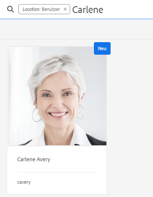
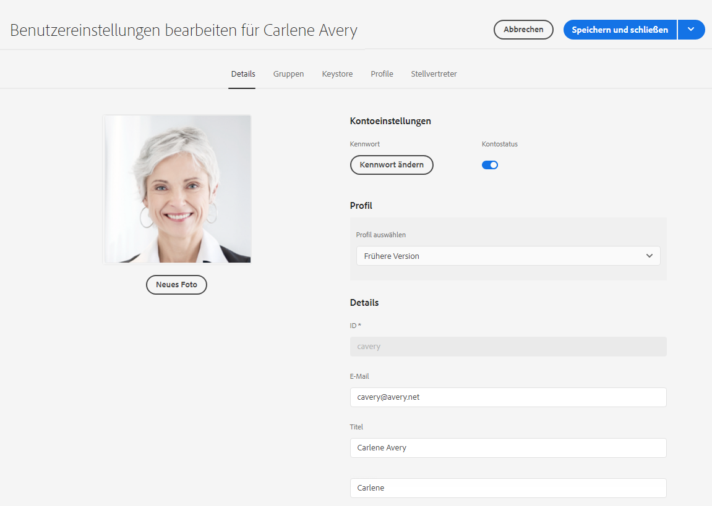
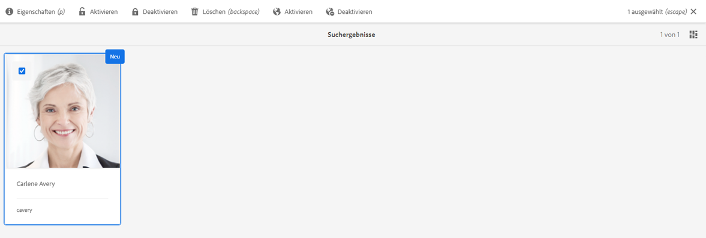
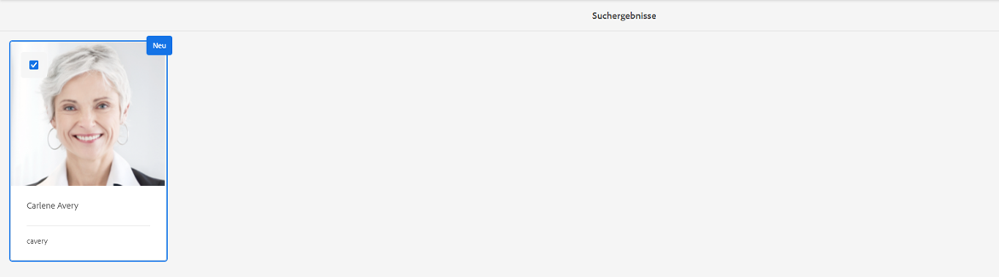

# Adobe Experience Manager as a Cloud Service Foundation – Einhaltung von Datenschutzbestimmungen {#aem-foundation-readiness-for-data-protection-and-data-privacy-regulations}

>[!WARNING]
>
>Der Inhalt dieses Dokuments stellt keine Rechtsberatung dar und ist nicht als Ersatz für Rechtsberatung gedacht.
>
>Wenden Sie sich an die Rechtsabteilung Ihres Unternehmens, um Ratschläge zu Datenschutzbestimmungen zu erhalten.

>[!NOTE]
>
>Weitere Informationen über die Reaktion der Adobe auf Datenschutzprobleme und deren Bedeutung für Sie als Adobe finden Sie unter [Datenschutzzentrum der Adobe](https://www.adobe.com/de/privacy.html).

## AEM Foundation – Unterstützung für Datenschutz {#aem-foundation-data-privacy-and-protection-support}

Auf AEM Foundation-Ebene werden personenbezogene Daten im Benutzerprofil gespeichert. Daher wird in diesem Artikel hauptsächlich beschrieben, wie Sie auf Benutzerprofile zugreifen und diese löschen können, damit Sie die Zugriffs- bzw. Löschanfragen bearbeiten können.

## Zugreifen auf Benutzerprofile {#accessing-a-user-profile}

### Manuelle Schritte {#manual-steps}

1. Öffnen Sie die Konsole für die Benutzerverwaltung, indem Sie zu **[!UICONTROL Tools > Sicherheit > Benutzer]** gehen oder die Seite `https://<serveraddress>:<serverport>/security/users.html` direkt aufrufen.

<!--
   
-->

1. Suchen Sie dann den jeweiligen Benutzer, indem Sie dessen Name in der Suchleiste oben auf der Seite eingeben:

   

1. Klicken Sie nun auf das Benutzerprofil, um es zu öffnen, und rufen Sie die Registerkarte **[!UICONTROL Details]** auf.

   

### -HTTP-API {#http-api}

Wie bereits erwähnt, stellt Adobe APIs für den Zugriff auf Benutzerdaten bereit, um die Automatisierung zu erleichtern. Es stehen verschiedene Arten von APIs zur Verfügung:

**UserProperties-API**

```shell
curl -u user:password http://localhost:4502/libs/granite/security/search/profile.userproperties.json\?authId\=cavery
```

**Sling-API**

**Ermitteln der Benutzerstartseite:**

```xml
curl -g -u user:password 'http://localhost:4502/libs/granite/security/search/authorizables.json?query={"condition":[{"named":"cavery"}]}'
     {"authorizables":[{"type":"user","authorizableId_xss":"cavery","authorizableId":"cavery","name_xss":"Carlene Avery","name":"Carlene Avery","home":"/home/users/we-retail/DSCP-athB1NYLBXvdTuN"}],"total":1}
```

**Abrufen von Benutzerdaten:**

Verwenden Sie dazu den Knotenpfad der über den vorangegangenen Befehl ausgegebenen Home-Eigenschaft der JSON-Payload:

```shell
curl -u user:password  'http://localhost:4502/home/users/we-retail/DSCP-athB1NYLBXvdTuN/profile.-1.json'
```

```shell
curl -u user:password  'http://localhost:4502/home/users/we-retail/DSCP-athB1NYLBXvdTuN/profiles.-1.json'
```

## Deaktivieren von Benutzern und Löschen der zugehörigen Profile {#disabling-a-user-and-deleting-the-associated-profiles}

### Deaktivieren von Benutzern {#disable-user}

1. Öffnen Sie die Konsole für die Benutzerverwaltung und suchen Sie nach dem entsprechenden Benutzer, wie oben beschrieben.
2. Bewegen Sie den Mauszeiger über den Benutzer und klicken Sie auf das Auswahlsymbol. Das Profil wird grau dargestellt und zeigt an, dass es ausgewählt ist.

3. Klicken Sie im oberen Menü auf **Deaktivieren** So deaktivieren (deaktivieren) Sie den Benutzer:

   

4. Bestätigen Sie abschließend die Aktion.

   Die Benutzeroberfläche zeigt an, dass das Benutzerkonto deaktiviert wurde, indem es ausgegraut wurde und der Profilkarte eine Sperre hinzufügt:

   

### Löschen von Benutzerprofilinformationen {#delete-user-profile-information}

>[!NOTE]
>
>Für AEM as a Cloud Service gibt es in der Benutzeroberfläche kein manuelles Verfahren zum Löschen eines Benutzerprofils, da auf CRXDE nicht zugegriffen werden kann.

### HTTP-API {#http-api-1}

Die folgenden Verfahren verwenden die `curl` Befehlszeilen-Tool, um zu veranschaulichen, wie der Benutzer mit der **[!UICONTROL Höhle]** `userId` und löschen Sie die Profile des Benutzers, die am Standardspeicherort verfügbar sind.

**Ermitteln der Benutzerstartseite:**

```shell
curl -g -u user:password 'http://localhost:4502/libs/granite/security/search/authorizables.json?query={"condition":[{"named":"cavery"}]}'
     {"authorizables":[{"type":"user","authorizableId_xss":"cavery","authorizableId":"cavery","name_xss":"Carlene Avery","name":"Carlene Avery","home":"/home/users/we-retail/DSCP-athB1NYLBXvdTuN"}],"total":1}
```

**Deaktivieren des Benutzers:**

Verwenden Sie dazu den Knotenpfad der über den vorangegangenen Befehl ausgegebenen Home-Eigenschaft der JSON-Payload:

```shell
curl -X POST -u user:password -FdisableUser="describe the reasons for disabling this user (Data Privacy in this case)" 'http://localhost:4502/home/users/we-retail/DSCP-athB1NYLBXvdTuN.rw.userprops.html'
```

**Löschen von Benutzerprofilen**

Verwenden Sie dazu den Knotenpfad der Home-Eigenschaft der JSON-Payload, der über den Befehl zur Ermittlung der Benutzerstartseite ausgegeben wurde, sowie die bekannten vorkonfigurierten Speicherorte des Profilknotens:

```shell
curl -X POST -u user:password -H "Accept: application/json,**/**;q=0.9" -d ':operation=delete' 'http://localhost:4502/home/users/we-retail/DSCP-athB1NYLBXvdTuN/profile'
```

```shell
curl -X POST -u user:password -H "Accept: application/json,**/**;q=0.9" -d ':operation=delete' 'http://localhost:4502/home/users/we-retail/DSCP-athB1NYLBXvdTuN/profile'
```
