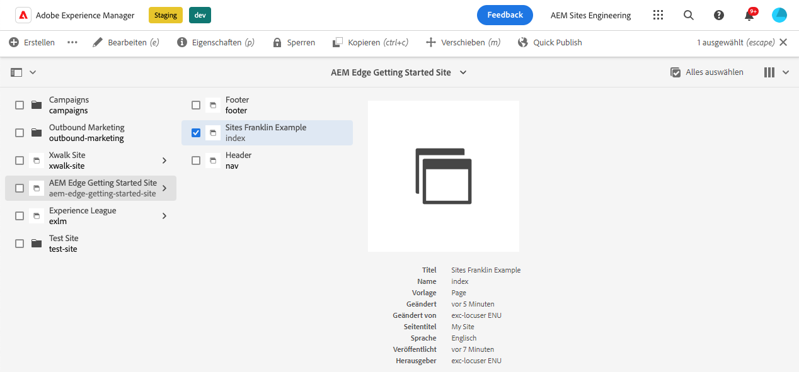
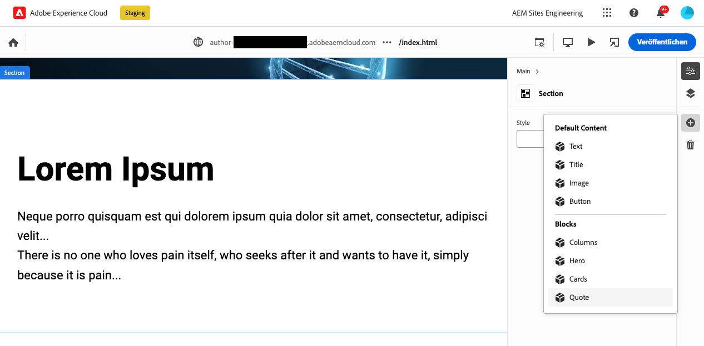
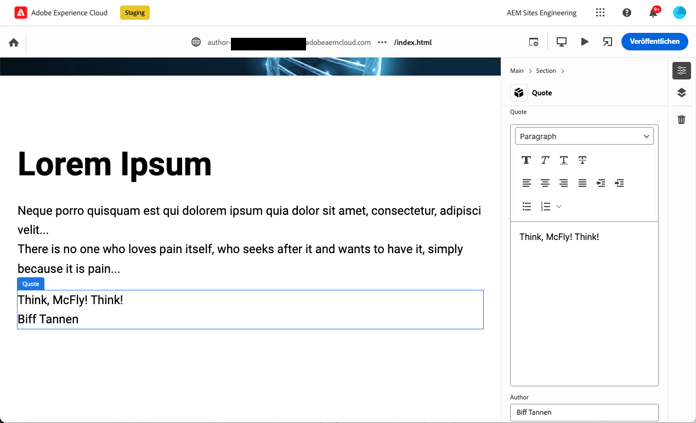
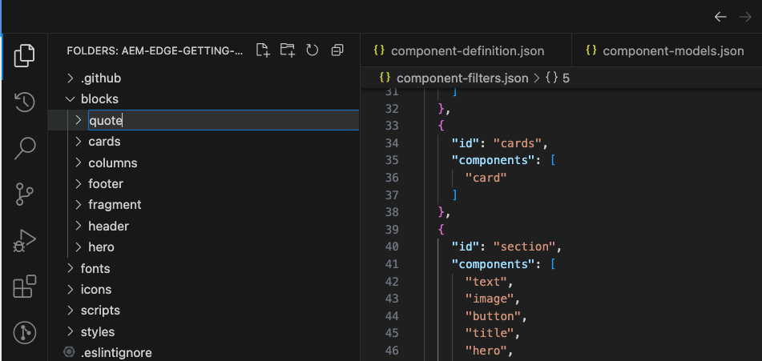
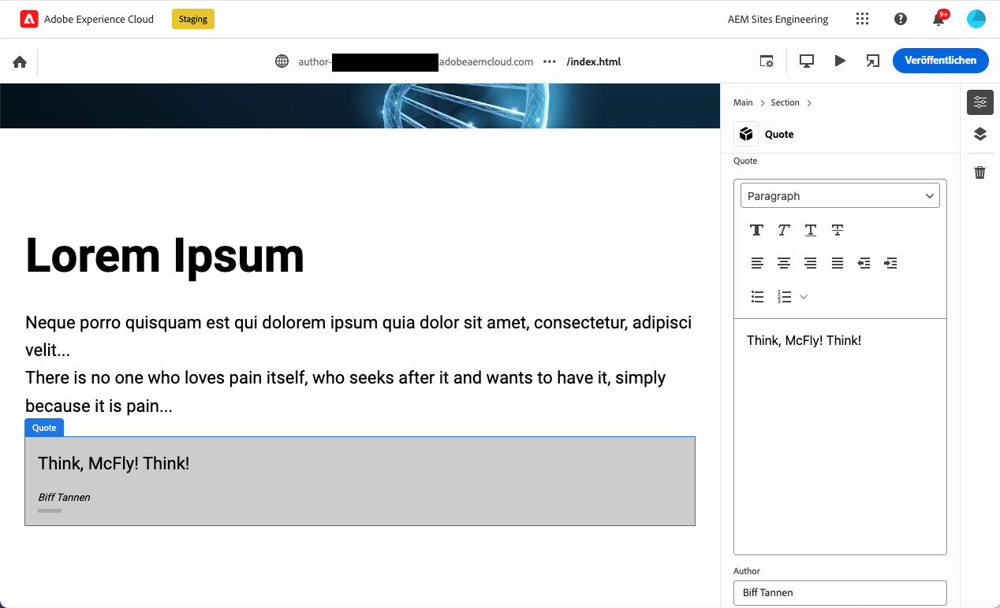

# Erstellen von für den universellen Editor instrumentierten Blöcken {#create-block}

Erfahren Sie, wie Sie Blöcke erstellen, die für den universellen Editor im AEM-Authoring mit Edge Delivery Services instrumentiert sind.

## Voraussetzungen {#prerequisites}

Diese Anleitung enthält schrittweise Anweisungen zum Erstellen von Blöcken, die für den universellen Editor beim AEM-Authoring mit Edge Delivery Services instrumentiert sind. Dies umfasst das Hinzufügen von Komponenten, das Laden von Komponentendefinitionen im universellen Editor, das Veröffentlichen von Seiten, das Implementieren von Blockdekorationen und -stilen, das Übertragen der Änderungen in die Produktion und die Überprüfung dieser Änderungen. Nach Abschluss dieser Anleitung können Sie einen neuen Block für Ihr eigenes Projekt erstellen und bereitstellen.

Diese Anleitung setzt Kenntnisse über AEM-Authoring-Projekte mit Edge Delivery Services sowie über den universellen Editor voraus. Bevor Sie beginnen, sollten Sie bereits Zugriff auf Edge Delivery Services haben und mit den zugehörigen Grundlagen vertraut sein. Das heißt:

Sie haben das [Edge Delivery Services-Tutorial](/help/edge/developer/tutorial.md) abgeschlossen.
* Sie haben Zugriff auf eine [AEM Cloud Service-Sandbox](/help/implementing/cloud-manager/getting-access-to-aem-in-cloud/introduction-sandbox-programs.md).
* Sie haben den [universellen Editor in derselben Sandbox-Umgebung aktiviert](/help/implementing/universal-editor/getting-started.md).
* Sie haben das [Erste-Schritte-Handbuch für Entwickelnde zum AEM-Authoring mit Edge Delivery Services](/help/edge/aem-authoring/edge-dev-getting-started.md) durchgearbeitet.

Diese Anleitung baut auf der Arbeit auf, die im Rahmen des [Erste-Schritte-Handbuchs für Entwickelnde zum AEM-Authoring mit Edge Delivery Services](/help/edge/aem-authoring/edge-dev-getting-started.md) durchgeführt wurde.

## Hinzufügen eines neuen Blocks zu Ihrem Projekt {#add-block}

In dieser Anleitung erstellen Sie einen Block, um ein einprägsames Zitat auf Ihrer Seite zu rendern.

Um dieses Beispiel zu vereinfachen, werden alle Änderungen an der `main`-Verzweigung des Projekt-Repositorys durchgeführt. Selbstverständlich [sollten Sie für Ihr eigentliches Projekt Best Practices für die Entwicklung befolgen](https://www.aem.live/docs/dev-collab-and-good-practices). Entwickeln Sie hierzu in einer anderen Verzweigung und überprüfen Sie alle Änderungen über Pull-Anfragen, bevor Sie diese mit `main` zusammenführen.

Adobe empfiehlt, Blöcke in drei Phasen zu entwickeln:

1. Erstellen Sie die Definition und das Modell für den Block, überprüfen Sie ihn und übertragen Sie ihn in die Produktion.
1. Erstellen Sie Inhalt mit dem neuen Block.
1. Implementieren Sie Dekoration und Stile für den neuen Block.

Im folgenden Beispiel für ein Zitat wird dieser Ansatz angewendet.

### Erstellen einer Blockdefinition und eines Modells {#create-block-model}

1. Klonen Sie das GitHub-Projekt lokal, das Sie im [Erste-Schritte-Handbuch für Entwickelnde zum AEM-Authoring mit Edge Delivery Services](/help/edge/aem-authoring/edge-dev-getting-started.md) erstellt haben, und öffnen Sie es in einem Editor Ihrer Wahl.

   * Zur Veranschaulichung wird hier Microsoft-Code verwendet.

   

1. Bearbeiten Sie die Datei `component-definition.json` im Stammverzeichnis des Projekts, fügen Sie die folgende Definition für Ihren neuen Zitatblock hinzu und speichern Sie die Datei.

   ```json
   {
     "title": "Quote",
     "id": "quote",
     "plugins": {
       "xwalk": {
         "page": {
           "resourceType": "core/franklin/components/block/v1/block",
           "template": {
             "name": "Quote",
             "model": "quote",
             "quote": "<p>Think, McFly! Think!</p>",
             "author": "Biff Tannen"
           }
         }
       }
     }
   }
   ```

   

1. Bearbeiten Sie die Datei `component-models.json` im Stammverzeichnis des Projekts, fügen Sie die folgende [Modelldefinition](/help/implementing/universal-editor/field-types.md#model-structure) für Ihren neuen Zitatblock hinzu und speichern Sie die Datei.

   * Weitere Informationen zu wichtigen Aspekten beim Erstellen von Inhaltsmodellen finden Sie unter [Inhaltsmodellierung beim AEM-Authoring mit Edge Delivery Services](/help/edge/aem-authoring/content-modeling.md).

   ```json
   {
     "id": "quote",
     "fields": [
        {
          "component": "text-area",
          "name": "quote",
          "value": "",
          "label": "Quote",
          "valueType": "string"
        },
        {
          "component": "text-input",
          "valueType": "string",
          "name": "author",
          "label": "Author",
          "value": ""
        }
      ]
   }
   ```

   

1. Bearbeiten Sie die Datei `component-filters.json` im Stammverzeichnis des Projekts, fügen Sie den Zitatblock zur [Filterdefinition](/help/implementing/universal-editor/customizing.md#filtering-components) hinzu, damit der Block zu einem beliebigen Abschnitt hinzugefügt werden kann, und speichern Sie die Datei.

   ```json
   {
     "id": "section",
     "components": [
       "text",
       "image",
       "button",
       "title",
       "hero",
       "cards",
       "columns",
       "quote"
      ]
   }
   ```

   

1. Übertragen Sie diese Änderungen mithilfe von Git in Ihre `main`-Verzweigung.

   * Die Übertragung auf `main` dient nur zur Veranschaulichung. [Folgen Sie den Best Practices](https://www.aem.live/docs/dev-collab-and-good-practices) und verwenden Sie eine Pull-Anfrage für die tatsächliche Projektarbeit.

### Erstellen von Inhalten mit dem Block {#create-content}

Nachdem Ihr standardmäßiger Zitatblock definiert und in das Beispielprojekt übertragen wurde, können Sie einer vorhandenen Seite einen Zitatblock hinzufügen.

1. Melden Sie sich in einem Browser bei AEM as a Cloud Service an. Navigieren Sie [mithilfe der Sites-Konsole](/help/sites-cloud/authoring/basic-handling.md) zu der Site, die Sie im [Erste-Schritte-Handbuch für Entwickelnde zum AEM-Authoring mit Edge Delivery Services](/help/edge/aem-authoring/edge-dev-getting-started.md) erstellt haben, und wählen Sie eine Seite aus.

   * In diesem Fall wird `index` zur Veranschaulichung verwendet.

   

1. Tippen oder klicken Sie in der Symbolleiste der Konsole auf **Bearbeiten**. Daraufhin wird der universelle Editor geöffnet.

   * Zum Laden der Seite müssen Sie ggf. auf **Anmelden mit Adobe** tippen oder klicken, um sich im universellen Editor bei AEM zu authentifizieren.

1. Wählen Sie im universellen Editor einen Abschnitt aus. Tippen oder klicken Sie in der Eigenschaftenleiste auf das Symbol **Hinzufügen** und wählen Sie dann Ihren neuen **Zitatblock** aus dem Menü aus.

   * Das Symbol **Hinzufügen** ist ein Pluszeichen.
   * Sie erkennen, dass Sie einen Abschnitt ausgewählt haben, wenn die blaue Umrandung des ausgewählten Objekts eine Registerkarte namens **Abschnitt** aufweist.
   * Wenn Sie in diesem Beispiel etwas oberhalb der Überschrift **Lorem Ipsum** tippen oder klicken, wird ein Abschnitt mit der Überschrift und dem „lorem ipsum“-Text ausgewählt.

   

1. Die Seite wird neu geladen und der Zitatblock wird am unteren Rand des ausgewählten Abschnitts hinzugefügt, wobei der Standardinhalt in der Datei `component-definitions.json` angegeben ist.

   * Der Zitatblock kann wie jeder andere Block entweder direkt oder in der Eigenschaftenleiste ausgewählt und bearbeitet werden.
   * Die Stile werden in einem weiteren Schritt angewendet.

   

1. Wenn Sie mit dem Inhalt Ihres Zitats zufrieden sind, können Sie die Seite veröffentlichen, indem Sie in der Symbolleiste des universellen Editors auf die Schaltfläche **Veröffentlichen** tippen oder klicken.

1. Stellen Sie sicher, dass der Inhalt veröffentlicht wurde. Navigieren Sie hierzu zur veröffentlichten Seite.  Der Link sieht ungefähr so aus: `https://<branch>--<repo>--<owner>.hlx.page`

   

### Anwenden von Stilen auf den Block {#style-block}

Nachdem Sie nun über einen funktionierenden Zitatblock verfügen, können Sie ihn mit Stilen versehen.

1. Kehren Sie zum Editor für Ihr Projekt zurück.

1. Erstellen Sie einen Ordner `quote`unter dem Ordner `blocks`. 

   

1. Fügen Sie im neuen `quote`-Ordner eine Datei `quote.js` hinzu, um die Blockdekoration zu implementieren, indem Sie das folgende JavaScript hinzufügen und die Datei speichern.

   ```javascript
   export default function decorate(block) {
     const [quoteWrapper] = block.children;
   
     const blockquote = document.createElement('blockquote');
     blockquote.textContent = quoteWrapper.textContent.trim();
     quoteWrapper.replaceChildren(blockquote);
   }
   ```

   


1. Fügen Sie im `quote`-Ordner eine Datei `quote.css` hinzu, um den Stil für den Block zu definieren, indem Sie den folgenden CSS-Code hinzufügen und die Datei speichern.

   ```css
   .block.quote {
       background-color: #ccc;
       padding: 0 0 24px;
       display: flex;
       flex-direction: column;
       margin: 1rem 0;
   }
   
   .block.quote blockquote {
       margin: 16px;
       text-indent: 0;
   }
   
   .block.quote > div:last-child > div {
       margin: 0 16px;
       font-size: small;
       font-style: italic;
       position: relative;
   }
   
   .block.quote > div:last-child > div::after {
       content: "";
       display: block;
       position: absolute;
       left: 0;
       bottom: -8px;
       height: 5px;
       width: 30px;
       background-color: darkgray;
   }
   ```

   

1. Übertragen Sie diese Änderungen mithilfe von Git auf Ihre `main`-Verzweigung.

   * Die Übertragung auf `main` dient nur zur Veranschaulichung. [Folgen Sie den Best Practices](https://www.aem.live/docs/dev-collab-and-good-practices) und verwenden Sie eine Pull-Anfrage für die tatsächliche Projektarbeit.

1. Kehren Sie zur Browser-Registerkarte des universellen Editors zurück, wo Sie die Seite Ihres Projekts bearbeitet haben, und laden Sie die Seite neu, um den formatierten Block anzuzeigen.

1. Sehen Sie sich den nun formatierten Zitatblock auf der Seite an.

   

1. Stellen Sie sicher, dass die Änderungen in die Produktion übertragen wurden. Navigieren Sie hierzu zur veröffentlichten Seite navigieren. Der Link sieht ungefähr wie folgt aus: `https://<branch>--<repo>--<owner>.hlx.page`

   

Herzlichen Glückwunsch! Sie verfügen nun über einen voll funktionierenden und formatierten Zitatblock. Sie können dieses Beispiel als Grundlage zur Erstellung Ihrer eigenen projektspezifischen Blöcke verwenden.

## Verwenden anderer Arbeitsverzweigungen {#other-branches}

In dieser Anleitung erfolgte die Übertragung der Änderungen der Einfachheit halber direkt auf die `main`-Verzweigung. Zum Experimentieren in einem Beispiel-Repository ist dies normalerweise kein Problem. Für die eigentliche Projektarbeit [sollten Sie den Best Practices für die Entwicklung folgen](https://www.aem.live/docs/dev-collab-and-good-practices). Entwickeln Sie hierzu in einer anderen Verzweigung und überprüfen Sie alle Änderungen über Pull-Anfragen, bevor Sie diese mit `main` zusammenführen.

Wenn Sie sich nicht in der `main`-Verzweigung entwickeln, können Sie `?ref=<branch>` in der Speicherortleiste des universellen Editors anfügen, um die Seite von Ihrer Verzweigung zu laden. `<branch>` ist der Name der Verzweigung, wie er auch für die Vorschau Ihres Projekts oder Live-URLs verwendet wird, z. B. `https://<branch>--<repo>--<owner>.hlx.page`.

Die Veröffentlichung von Inhalten mit einem neuen Modell wird nur unterstützt, wenn das Modell mit der `main`-Verzweigung zusammengeführt wird.

## Nächste Schritte {#next-steps}

Nachdem Sie nun wissen, wie man Bausteine erstellt, ist es wichtig zu verstehen, wie man Inhalte auf semantische Weise modelliert, um ein schlankes Entwicklererlebnis zu erhalten.

Lesen Sie das Dokument [Inhaltsmodellierung beim AEM-Authoring mit Edge Delivery Services-Projekten](/help/edge/aem-authoring/content-modeling.md), um zu erfahren, wie die Inhaltsmodellierung beim AEM-Authoring mit Edge Delivery Services-Projekten funktioniert.

>[!TIP]
>
>Eine End-to-End-Anleitung zum Erstellen eines neuen Edge Delivery Services-Projekts, das für AEM Authoring mit AEM as a Cloud Service als Inhaltsquelle aktiviert ist, finden Sie in [diesem AEM GEMs-Webinar.](https://experienceleague.adobe.com/de/docs/events/experience-manager-gems-recordings/gems2024/aem-authoring-and-edge-delivery)

