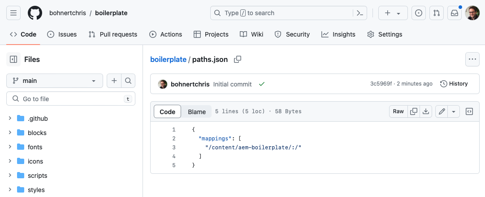
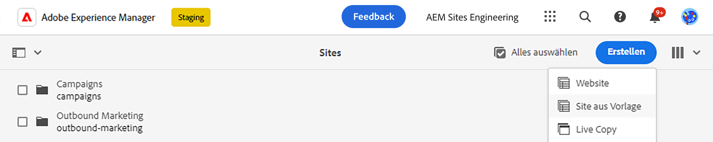
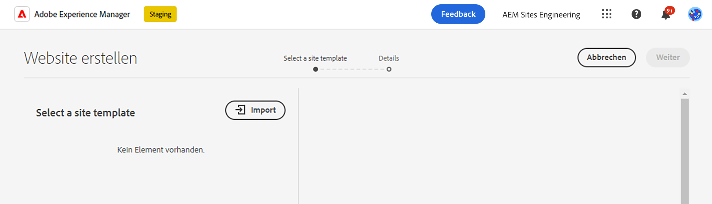
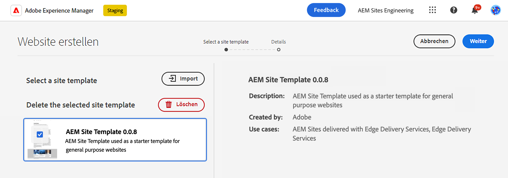
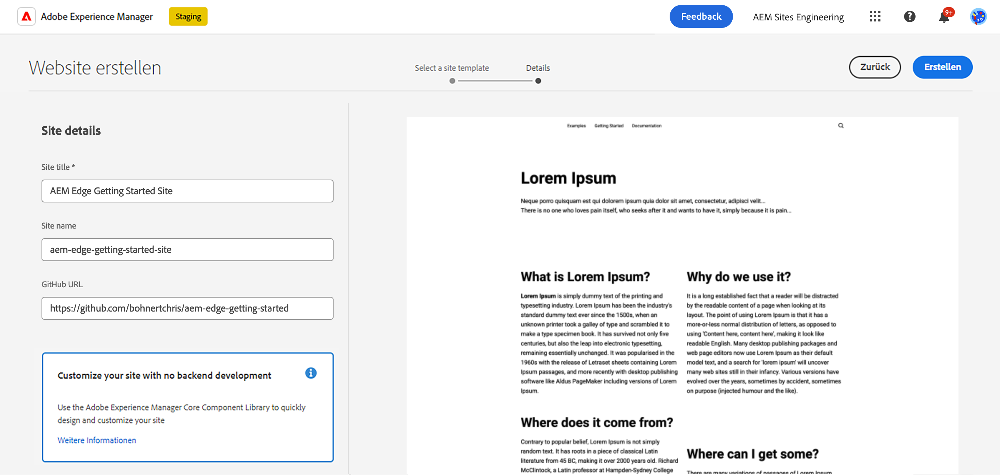
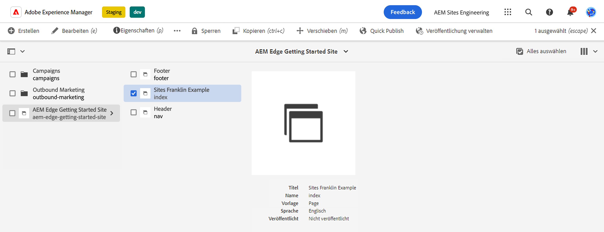
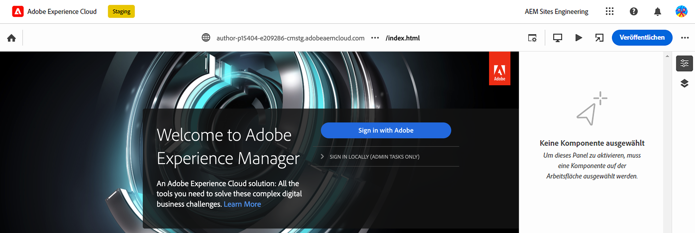
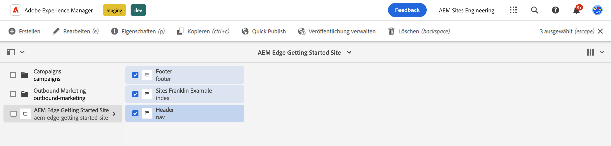

# Erste-Schritte-Handbuch für Entwickelnde zum AEM-Authoring mit Edge Delivery Services {#edge-dev-getting-started}

In diesem Handbuch erfahren Sie, wie Sie mit einer neuen Adobe Experience Manager-Site arbeiten, die Edge Delivery Services und den universellen Editor für die Inhaltserstellung verwendet.

## Voraussetzungen {#prerequisites}

Bevor Sie mit diesem Handbuch beginnen, sollten Sie bereits mit den Grundlagen der Edge Delivery Services vertraut sein und Zugriff auf diese haben. Hierzu zählt u. a. Folgendes:

* Sie haben das [Edge Delivery Services-Tutorial](/help/edge/developer/tutorial.md) abgeschlossen.
* Sie haben Zugriff auf eine [AEM Cloud Service-Sandbox](/help/implementing/cloud-manager/getting-access-to-aem-in-cloud/introduction-sandbox-programs.md).
* Sie haben den [universellen Editor in derselben Sandbox-Umgebung aktiviert](/help/implementing/universal-editor/getting-started.md).

## Auswählen des geeigneten Editors {#editor-choice}

AEM bietet zwei verschiedene Inhaltseditoren, deren Auswahl von Ihrer Situation abhängig ist.

* **Universeller Editor**: Dies sollte die Standardauswahl für neue Sites sein.
* **AEM-Seiteneditor**: Dies sollte für eine bestehende AEM Sites-Migration in Edge Delivery Services ausgewählt werden.

Dieses Handbuch konzentriert sich auf AEM-Projekte für Edge Delivery Services, die den universellen Editor verwenden. Siehe Dokument . [Verwenden von Edge Delivery Services mit AEM](/help/edge/using.md) für weitere Informationen zur Auswahl des richtigen Editors und zur Migration vorhandener AEM Sites zu Edge Delivery Services.

## Grundlegende Konzepte bei der Entwicklung für Edge Delivery Services {#core-concepts}

Edge Delivery Services basiert auf dem Bausteinkonzept. AEM verfügt über eine umfassende Bibliothek vordefinierter Bausteine, die entsprechend Ihren Projektanforderungen erweitert werden können. Der Code für Edge Delivery Services-Projekte wird in GitHub verwaltet.

### Bausteine {#blocks}

Bausteine sind der grundlegendste Teil einer Seite, die von Edge Delivery Services bereitgestellt wird. Ein Baustein kapselt Stile und den Code, der eine logische Komponente einer Inhaltsseite steuert.

AEM stellt Standardbausteine als Teil des Produkts in der Projektvorlage bereit. Zu diesen Bausteinen gehören Überschrift, Text, Bilder, Links, Listen usw.

>[!TIP]
>
>Weitere Einzelheiten zu Bausteinen und zur Entwicklung für Edge Delivery Services finden Sie im [Abschnitt Build](/help/edge/developer/block-collection.md) der Edge Delivery Services-Dokumentation.

### Edge Delivery Services und GitHub {#github-edge}

Edge Delivery nutzt GitHub, damit Sie Code direkt über ihr GitHub-Repository verwalten und bereitstellen können. 

Ihre Autoren können Inhalte entweder mit dokumentbasiertem Authoring oder mit AEM mit dem universellen Editor erstellen. Entwicklerinnen und Entwickler können die Funktionalität Ihrer Site anpassen, indem sie CSS und JavaScript in GitHub verwenden, unabhängig davon, wie die Autorinnen und Autoren ihre Inhalte erstellen.

Websites werden automatisch für jede Ihrer Verzweigungen erstellt, von der Inhaltsvorschau bis zur Produktion. Jede Ressource, die Sie in Ihr GitHub-Repository einfügen, steht auf Ihrer Website ohne Erstellungsprozess zur Verfügung.

>[!TIP]
>
>Weitere Einzelheiten zu Bausteinen und zur Entwicklung für Edge Delivery Services finden Sie im [Abschnitt Build](/help/edge/developer/block-collection.md) der Edge Delivery Services-Dokumentation.

## Erste Schritte mit AEM Authoring und Edge Delivery Services {#getting-started}

Sobald Sie die [Voraussetzungen](#prerequisites) erfüllt und sich für [die Verwendung des universellen Editors entschieden haben,](#editor-choice) können Sie mit Ihrem eigenen Projekt beginnen.

### Erstellen Ihres GitHub-Projekts {#create-github-project}

Zunächst müssen Sie ein neues Projekt auf GitHub erstellen, das auf der Adobe-Vorlage basiert.

1. Navigieren Sie zu [`https://github.com/adobe-rnd/aem-boilerplate-xwalk`](https://github.com/adobe-rnd/aem-boilerplate-xwalk), klicken Sie auf **Diese Vorlage verwenden** und wählen Sie **Neues Repository erstellen**.

   * Sie müssen bei GitHub angemeldet sein, um diese Option sehen zu können.

   

1. Das Repository wird Ihnen standardmäßig zugewiesen. Ändern Sie dies bei Bedarf, geben Sie einen Repository-Namen und eine Beschreibung ein und klicken Sie auf **Repository erstellen**.

   

1. Navigieren Sie auf einer neuen Registerkarte im selben Browser zu [`https://github.com/apps/aem-code-sync`](https://github.com/apps/aem-code-sync) und klicken Sie auf **Konfigurieren**.

   

1. Klicken Sie auf **Konfigurieren** für die Organisation, in der Sie Ihr neues Repository im vorherigen Schritt erstellt haben.

   

1. Wählen Sie auf der GitHub-Seite zur AEM-Code-Synchronisierung unter **Repository-Zugriff** die Option **Nur Repositorys auswählen**, wählen Sie das Repository aus, das Sie im vorherigen Schritt erstellt haben, und klicken Sie dann auf **Speichern**.

   

1. Nachdem die AEM-Code-Synchronisierung installiert wurde, erhalten Sie einen Bestätigungsbildschirm. Kehren Sie zur Browser-Registerkarte Ihres neuen Repositorys zurück.

   

1. Klicken Sie auf die Datei `fstab.yaml`, um sie zu öffnen, und dann auf das Symbol **Diese Datei bearbeiten**, um sie zu bearbeiten.

   

1. Bearbeiten Sie die Datei `fstab.yaml`, um den Bereitstellungspunkt Ihres Projekts zu aktualisieren. Ersetzen Sie die standardmäßige Google Docs-URL durch die URL Ihrer AEM as a Cloud Service-Authoring-Instanz und klicken Sie auf **Änderungen übergeben...**.

   * `https://<aem-author>/bin/franklin.delivery/<owner>/<repository>/main`
   * Durch Änderung des Bereitstellungspunkts werden die Edge Delivery Services darüber informiert, wo der Inhalt der Site gefunden werden soll.

   

1. Fügen Sie nach Bedarf eine Commit-Nachricht hinzu und klicken Sie auf **Änderungen übergeben**, wodurch sie direkt an die `main`-Verzweigung übergeben werden.

   

1. Kehren Sie zum Stammverzeichnis Ihres Repositorys zurück und klicken Sie auf `paths.json` und dann auf das Symbol **Diese Datei bearbeiten**.

   

1. Die Standardzuordnung verwendet den Namen des Repositorys. Aktualisieren Sie die Standardzuordnung entsprechend den Anforderungen für Ihr Projekt mit `/content/<site-name>/:/` und klicken **Zusage von Änderungen...**.

   * Stellen Sie Ihren eigenen `<site-name>` bereit. Sie werden ihn in einem späteren Schritt benötigen.
   * Die Zuordnungen teilen Edge Delivery Services mit, wie der Inhalt in Ihrem AEM Repository der Site-URL zugeordnet werden soll.

   

1. Fügen Sie nach Bedarf eine Commit-Nachricht hinzu und klicken Sie auf **Änderungen übergeben**, wodurch sie direkt an die `main`-Verzweigung übergeben werden.

   

### Erstellen und Bearbeiten einer neuen AEM-Site {#create-aem-site}

Nachdem Sie nun über ein GitHub-Projekt verfügen, müssen Sie eine neue AEM-Site erstellen, die vom Projekt verwendet werden kann.

>[!NOTE]
>
>Um Ihre Site mit dem universellen Editor zu bearbeiten, müssen Sie einen Chromium-basierten Browser nutzen.

1. Fordern Sie über Ihren [Projekt-Slack-Kanal](/help/edge/docs/slack.md) die neueste Site-Vorlage zum AEM-Authoring mit Edge Delivery Services von Adobe Engineering an.

1. Melden Sie sich bei Ihrer AEM as a Cloud Service-Authoring-Instanz an, navigieren Sie zur Sites-Konsole und tippen oder klicken Sie auf **Erstellen** > **Site aus Vorlage**.

   

1. Klicken Sie auf der Registerkarte **Site-Vorlage auswählen** des Assistenten zum Erstellen von Sites auf die Schaltfläche **Importieren**, um eine neue Vorlage zu importieren.

   

1. Laden Sie die von Adobe Engineering bereitgestellte Site-Vorlage zum AEM-Authoring mit Edge Delivery Services hoch.

1. Nach dem Import wird die Vorlage im Assistenten angezeigt. Tippen oder klicken Sie, um sie auszuwählen, und tippen oder klicken Sie dann auf **Weiter**.

   

1. Füllen Sie die folgenden Felder aus und tippen oder klicken Sie auf **Erstellen**.

   * **Site-Titel**: Fügen Sie einen beschreibenden Titel für die Site hinzu.
   * **Site-Name**: Verwenden Sie den `<site-name>`, den Sie im [vorherigen Schritt](#create-github-project) definiert haben.
   * **GitHub-URL**: Verwenden Sie die URL des GitHub-Projekts, das Sie im vorherigen Schritt erstellt haben.

   

1. AEM bestätigt die Site-Erstellung mit einem Dialogfeld. Tippen oder klicken Sie zum Quittieren auf **OK**.

   

1. Navigieren Sie in der Sites-Konsole zur Datei `index.html` der neu erstellten Site und tippen oder klicken Sie in der Symbolleiste auf **Bearbeiten**.

   

1. Der universelle Editor wird auf einer neuen Registerkarte geöffnet. Ggf. müssen Sie zur Authentifizierung auf **Anmelden mit Adobe** tippen oder klicken, um Ihre Seite bearbeiten zu können.

   

Sie können Ihre Site nun mit dem universellen Editor bearbeiten. Weitere Informationen finden Sie in der [Dokumentation für den universellen Editor](/help/sites-cloud/authoring/universal-editor/authoring.md).

### Veröffentlichen Ihrer neuen Site {#publishing}

Sobald Sie Ihre neue Site mit dem universellen Editor fertig bearbeitet haben, können Sie Ihre Inhalte veröffentlichen.

1. Wählen Sie in der Sites-Konsole alle Seiten aus, die Sie für Ihre neue Site erstellt haben, und tippen oder klicken Sie in der Symbolleiste auf **Quick Publish**.

   

1. Tippen oder klicken Sie im Bestätigungsdialogfeld auf **Veröffentlichen**, um den Prozess zu starten.

   

1. Öffnen Sie in demselben Browser eine neue Registerkarte und navigieren Sie zur URL Ihrer neuen Site.

   * `https://main--<site-name>--<owner>.hlx.page`

1. Sehen Sie sich Ihren veröffentlichten Inhalt an.

   

## Nächste Schritte {#next-steps}

Nachdem Sie nun ein AEM Authoring mit Edge Delivery Services-Projekten haben, können Sie Ihre eigenen Bausteine erstellen und gestalten.

Weitere Informationen finden Sie in der Anleitung [Erstellen von für den universellen Editor instrumentierten Blöcken](/help/edge/aem-authoring/create-block.md).

>[!TIP]
>
>Eine durchgängige Anleitung zum Erstellen eines neuen Edge Delivery Services-Projekts, das für AEM Authoring mit AEM als Inhaltsquelle aktiviert ist, finden Sie unter [Dieses AEM GEMs-Webinar.](https://experienceleague.adobe.com/en/docs/events/experience-manager-gems-recordings/gems2024/aem-authoring-and-edge-delivery)
