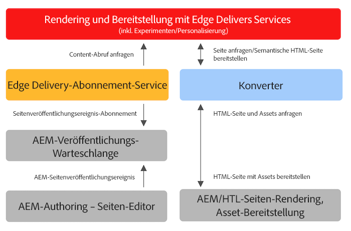

# Verwenden von Edge Delivery Services mit vorhandenen AEM-Projekten {#existing-projects}

Sie müssen nicht warten, dass ein neues AEM-Projekt von Edge Delivery Services profitiert. Sie können Edge Delivery Services in Ihr vorhandenes AEM-Projekt integrieren, damit Sie sofort die Leistungssteigerung nutzen können.

## Einschränkungen des AEM-Seiteneditors {#page-editor}

Vor der Einführung von Edge Delivery Services wurden die in AEM verwalteten Inhalte mit dem AEM-Seiteneditor bearbeitet. Wenn Ihr Projekt vor der Einführung von Edge Delivery Services begonnen hat, ist es fast sicher, dass Sie den Seiteneditor verwenden.

Der AEM-Seiteneditor funktioniert nur mit [AEM-Komponenten](/help/implementing/developing/components/overview.md) wie z. B. [Kernkomponenten.](https://experienceleague.adobe.com/docs/experience-manager-core-components/using/introduction.html?lang=de) Diese Komponenten sind mit Edge Delivery Services inkompatibel. Daher sind zwei Phasen erforderlich, um Edge Delivery Services in einem vorhandenen AEM-Projekt einzuführen:

* [Phase 1: Frontend ersetzen](#replace-front-end)
* [Phase 2: Zum universellen Editor wechseln](#switch-ue)

## Phase 1: Frontend ersetzen {#replace-front-end}

In Phase 1 können Sie weiterhin Ihre vorhandene Site-Struktur, die Komponenten und die Authoring-Tools von AEM verwenden. Das Website-Rendering wird mithilfe von Bausteinen mit JavaScript und CSS neu erstellt und über Edge Delivery Services bereitgestellt.

Lesen Sie den [Build-Abschnitt](/help/edge/developer/block-collection.md) in der Edge Delivery Services-Dokumentation, um weitere Informationen zu Bausteinen und zur Entwicklung für Edge Delivery Services zu finden.

Ein Converter in App Builder ist erforderlich, um die von AEM gerenderte HTML-Ausgabe zu konvertieren und an Edge Delivery Services zu senden.

In Phase 2 wird der Prozess abgeschlossen, indem die Technologieüberschneidung beseitigt wird: AEM-Kernkomponenten mit HTL und Java in der AEM-Autoreninstanz, JS-basierte Bausteine in Edge Delivery und ein nodeJS-basierter Converter.

## Phase 2: Zum universellen Editor wechseln {#switch-ue}

In dieser Phase wird der AEM-Seiteneditor durch den universellen Editor ersetzt. Da der universelle Editor direkt mit Bausteinen arbeiten kann, sind die AEM-Kernkomponenten und der Converter nicht mehr erforderlich.
