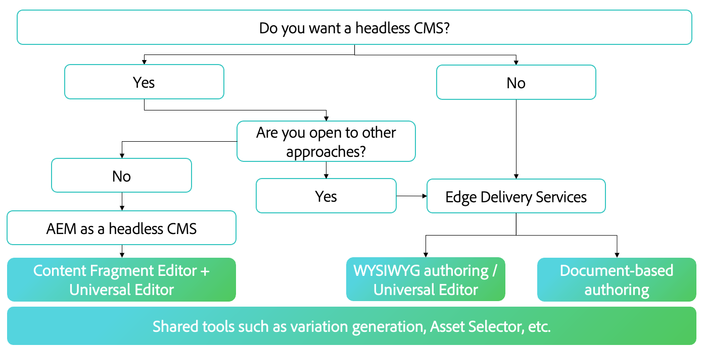

# Auswählen einer Authoring-Methode {#authoring-methods}

Erfahren Sie mehr über wichtige Aspekte bezüglich der Entscheidung darüber, wie Sie Ihre Inhalte in AEM erstellen, um Sie bei der bestmöglichen Entscheidung für Ihre Inhaltsautorinnen und -autoren zu unterstützen.

## Überblick über die Erwägungen {#overview}

Die Flexibilität von AEM stellt sicher, dass Ihre Authoring-Anforderungen abgedeckt werden, unabhängig davon, ob Sie sich für dokumentenbasiertes Authoring oder WYSIWYG-Authoring entscheiden. Beachten Sie die folgenden Fakten zu Beginn Ihrer Überlegungen.

* **Beziehen Sie stets Ihre Inhaltsautorinnen und Inhaltsautoren in die Entscheidung mit ein.** – Ihre Inhaltsautorinnen und Inhaltsautoren sind Ihre Fachkräfte und ihre Einblicke sind von entscheidender Bedeutung.
* **Es können mehrere Authoring-Methoden implementiert werden.** – Obwohl Adobe empfiehlt, einfach zu beginnen und die Komplexität erst mit steigenden Anforderungen zu erhöhen, können mehrere Authoring-Methoden in einem Projekt zusammen verwendet werden.
* **Sie können Ihre Authoring-Methode jederzeit nachträglich ändern.** – Ihre Entscheidungen sind nicht entgültig. Die automatisierten Migrations-Tools von Adobe ermöglichen einen direkten Wechsel von einer Methode zur anderen.
* **Sie müssen sich nicht schon vor der Implementierung entscheiden, sondern können dies im Rahmen der Implementierung tun.** – AEM ist ein einheitliches Produkt, daher muss diese wichtige Entscheidung nicht Teil der Vertragsverhandlungen sein. Wenn Sie AEM erwerben, erhalten Sie alles. Diese Entscheidung wird vielmehr während der Implementierung getroffen.

Adobe kann Ihnen dabei helfen, die für Ihre Anforderungen beste(n) Methode(n) im Rahmen der Implementierung zu ermitteln.

## Es gibt keine allgemeine Lösung {#one-size}

Jede Implementierung von AEM hat eigene Workflows und Ziele. Ein Projekt kann ein einfaches Authoring-Modell mit Inhaltsautorinnen und Inhaltsautoren umfassen, die für ihre eigenen Veröffentlichungen verantwortlich sind. Dagegen könnte ein anderes Projekt ein komplexes Netzwerk von Mitwirkenden und Validierungen umfassen.

Verschiedene Projekte können unterschiedliche (und mehrere) Anwendungsfälle haben.

Adobe ist sich dessen bewusst und bietet daher keinen Universalansatz an. AEM ist Ihre zentrale Lösung, die unterschiedliche Ansätze für die Inhaltsbereitstellung und Inhaltserstellung bietet, die Ihren Anforderungen am besten gerecht werden.

Um den besten Ansatz zu ermitteln, müssen Sie vier Aspekte berücksichtigen.

1. [Haben Sie eine Präferenz für die Inhaltsbereitstellung?](#content-delivery)
1. [Haben Sie eine Präferenz für die Inhaltserstellung?](#content-authoring)
1. [Wie lautet Ihr Projektziel?](#project-goals)
1. [Welche Herausforderungen bei der Inhaltserstellung stehen Ihnen heute bevor?](#authoring-challenges)

## Präferenzen für Inhaltsbereitstellung {#content-delivery}

Ihre erste Überlegung sollte sein, wie Sie Ihre Inhalte bereitstellen möchten. Edge Delivery Services bietet blitzschnelle Sites, aber vielleicht liegt Ihr Fokus auf der Headless-Bereitstellung. Die folgende Entscheidungsstruktur kann Ihnen bei der Erwägung Ihrer Optionen helfen.

Dies kann Ihnen bei der Entscheidung helfen, ob Sie Folgendes benötigen:

* [AEM als Headless-CMS](/help/headless/introduction.md) mit dem Inhaltsfragmenteditor und/oder dem universellen Editor.
* AEM Edge Delivery Services mit der [dokumentenbasierten Bearbeitung](/help/edge/docs/authoring.md) oder dem [WYSIWYG-Authoring mit dem universellen Editor](/help/edge/wysiwyg-authoring/authoring.md).

## Präferenzen für die Inhaltserstellung {#content-authoring}

Als Nächstes sollten Sie überlegen, wie Sie Ihren Inhalt erstellen möchten. Die folgende Entscheidungsstruktur kann Ihnen bei der Erwägung Ihrer Optionen helfen.

Dies kann Ihnen bei der Entscheidung helfen, ob Sie Folgendes benötigen:

* AEM Edge Delivery Services mit der [dokumentenbasierten Bearbeitung](/help/edge/docs/authoring.md).
* [WYSIWYG-Authoring mit dem universellen Editor](/help/edge/wysiwyg-authoring/authoring.md).

## Projektziele {#project-goals}

Wie sähe eine erfolgreiche Inhaltserstellung für Sie aus? Wie definieren Sie Erfolg für Ihr Projekt?

* Vielleicht müssen Sie es mehr Personen ermöglichen, Inhalte zu erstellen, aber Sie möchten Schulungen für ein neues Tool-Set vermeiden. (Denken Sie an dokumentenbasiertes Authoring.)
* Vielleicht müssen Sie die Menge an Inhalten, die Sie generieren, erhöhen. (Denken Sie an dokumentenbasiertes Authoring.)
* Vielleicht müssen Sie sich auf das visuelle Inhalts-Layout konzentrieren, aber den Bedarf an Programmierkenntnissen minimieren. (Denken Sie an WYSIWYG-Authoring.)

Klar formulierte Projektziele zu Beginn Ihrer Implementierung helfen Ihnen dabei, eine fundierte Entscheidung bezüglich Ihrer Authoring-Methode zu treffen.

## Herausforderungen bei der Inhaltserstellung {#authoring-challenges}

Berücksichtigen Sie abschließend die spezifischen Herausforderungen, vor denen Sie heute bei der Inhaltserstellung stehen.

* Möglicherweise sind Sie aufgrund von Inhalten, die außerhalb Ihres CMS erstellt wurden und dann importiert oder kopiert und eingefügt werden müssen, mit Doppelarbeit konfrontiert. (Denken Sie an dokumentenbasiertes Authoring.)
* Möglicherweise müssen Sie die erforderliche Zeit zum Schulen von Autorinnen und Autoren in der Verwendung eines CMS verkürzen. (Denken Sie an dokumentenbasiertes Authoring.)
* Vielleicht müssen Ihre Autorinnen und Autoren das visuelle Layout Ihres Inhalts häufig bearbeiten, was ständige Unterstützung von Entwickelnden erfordert. (Denken Sie an WYSIWYG-Authoring.)
