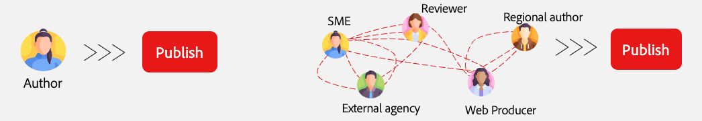

# Auswählen einer Authoring-Methode {#authoring-methods}

Wichtige Überlegungen bei der Entscheidung darüber, wie Sie Ihre Inhalte in AEM erstellen, um Sie bei der bestmöglichen Entscheidung für Ihre Inhaltsautoren zu unterstützen.

## Überblick über Aspekte {#overview}

AEM Flexibilität stellt sicher, dass Ihre Authoring-Anforderungen abgedeckt werden, unabhängig davon, ob Sie für dokumentbasiertes Authoring oder WYSIWYG-Authoring entscheiden. Beachten Sie die folgenden Fakten zu Beginn Ihrer Überlegungen.

* **Nehmen Sie stets Ihre Inhaltsautoren in die Entscheidung auf.** - Ihre Inhaltsautoren sind Ihre Experten und ihre Einblicke sind von entscheidender Bedeutung.
* **Es können mehrere Authoring-Methoden implementiert werden.** - Obwohl Adobe empfiehlt, bei Bedarf einfach zu beginnen und die Komplexität zu überlagern, können mehrere Authoring-Methoden in einem Projekt zusammenarbeiten.
* **Sie können Ihre Authoring-Methode immer nach dem Faktum ändern.** - Was immer Sie sich dazu entscheiden, nicht gesperrt zu sein. Der Wechsel von einer Methode zur anderen erfolgt mithilfe von automatisierten Migrationswerkzeugen von Adobe direkt nach vorn.
* **Sie dürfen nicht vor der Implementierung entscheiden, sondern im Rahmen der Implementierung.** - AEM ist ein einheitliches Produkt, daher muss diese wichtige Entscheidung nicht Teil der Vertragsverhandlungen sein. Wenn du AEM kaufst, bekommst du alle. Vielmehr handelt es sich um eine Entscheidung während der Implementierung.

Mit Adobe können Sie bestimmen, welche Methode (oder Methoden) Ihren Anforderungen im Rahmen der Implementierung am besten entspricht.

## Eine Größe passt nicht alle {#one-size}

Jede Implementierung von AEM hat eigene Workflows und Ziele. Ein Projekt kann ein einfaches Authoring-Modell mit Inhaltsautoren umfassen, die für ihre eigenen Veröffentlichungen verantwortlich sind. Ein anderes könnte ein komplexes Netzwerk von Mitwirkenden und Validierungen haben.

Verschiedene Projekte können unterschiedliche (und mehrere) Anwendungsfälle haben.

Adobe versteht dies und bietet daher keinen einheitlichen Ansatz. AEM ist Ihre einzige Lösung, die unterschiedliche Ansätze für die Inhaltsbereitstellung und Inhaltserstellung bietet, die Ihren Anforderungen am besten gerecht werden.

Um den besten Ansatz zu bestimmen, müssen Sie vier Elemente berücksichtigen.

1. [Haben Sie eine Voreinstellung für die Inhaltsbereitstellung?](#content-delivery)
1. [Haben Sie eine Voreinstellung für die Inhaltserstellung?](#content-authoring)
1. [Welches ist Ihr Projektziel?](#project-goals)
1. [Welche Herausforderungen für die Inhaltserstellung stehen Ihnen heute bevor?](#authoring-challenges)

## Voreinstellungen zur Inhaltsbereitstellung {#content-delivery}

Ihre erste Überlegung sollte sein, wie Sie Ihre Inhalte bereitstellen möchten. Edge Delivery Services bietet blitzschnelle Websites, aber vielleicht liegt Ihr Fokus auf der Headless-Bereitstellung. Die folgende Entscheidungsstruktur kann Ihnen bei der Erwägung Ihrer Optionen helfen.

So können Sie entscheiden, ob Sie Folgendes benötigen:

* [AEM als Headless-CMS](/help/headless/introduction.md) mit dem Inhaltsfragment-Editor und/oder Universal Editor.
* AEM Edge Delivery Services, die die [dokumentbasierte Bearbeitung](/help/edge/docs/authoring.md) oder das [WYSIWYG-Authoring mit dem universellen Editor verwenden.](/help/edge/wysiwyg-authoring/authoring.md)

## Einstellungen zur Inhaltserstellung {#content-authoring}

Als Nächstes sollten Sie überlegen, wie Sie Ihren Inhalt erstellen möchten. Die folgende Entscheidungsstruktur kann Ihnen bei der Erwägung Ihrer Optionen helfen.

So können Sie entscheiden, ob Sie Folgendes benötigen:

* AEM von Edge Delivery Services, die die [document-basierte Bearbeitung verwenden.](/help/edge/docs/authoring.md)
* [WYSIWYG-Authoring mit dem universellen Editor.](/help/edge/wysiwyg-authoring/authoring.md)

## Projektziele {#project-goals}

Wie sieht der Authoring-Erfolg für Sie aus? Wie definieren Sie Erfolg für Ihr Projekt?

* Vielleicht müssen Sie mehr Personen in die Lage versetzen, Inhalte zu erstellen, aber Sie möchten das Training für ein neues Tool-Set vermeiden. (Dokumentenbasiertes Authoring.)
* Vielleicht müssen Sie die Menge an Inhalt, den Sie generieren, erhöhen. (Dokumentenbasiertes Authoring.)
* Vielleicht müssen Sie sich auf das visuelle Inhaltslayout konzentrieren, aber den Bedarf an kodiertem Wissen minimieren. (Denken Sie an WYSIWYG-Authoring.)

Klar formulierte Projektziele zu Beginn Ihrer Implementierung helfen Ihnen dabei, eine fundierte Entscheidung über Ihre Authoring-Methode zu treffen.

## Authoring - Herausforderungen {#authoring-challenges}

Berücksichtigen Sie abschließend die spezifischen Herausforderungen, vor denen Sie heute bei der Inhaltserstellung stehen.

* Vielleicht haben Sie es mit einer Duplizierung von Inhalten zu tun, die außerhalb Ihres CMS erstellt wurden und dann importiert oder kopiert und eingefügt werden müssen. (Dokumentenbasiertes Authoring.)
* Möglicherweise müssen Sie die erforderlichen Schulungsautoren für die Verwendung eines CMS kürzen. (Dokumentenbasiertes Authoring.)
* Vielleicht müssen Ihre Autoren das visuelle Layout Ihres Inhalts häufig bearbeiten, was ständige Unterstützung von Entwicklern erfordert. (Denken Sie an WYSIWYG-Authoring.)
