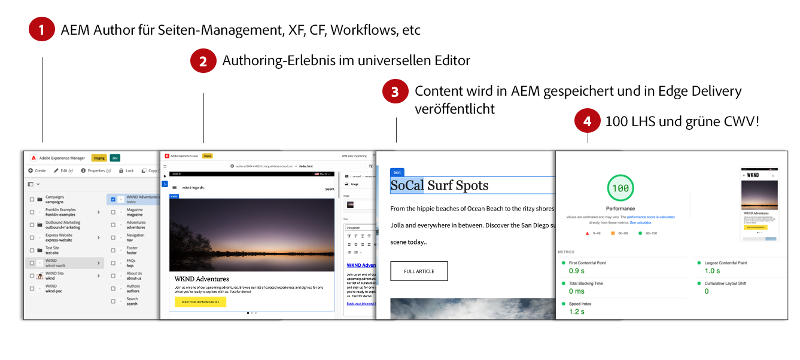

# Inhaltserstellung für Edge Delivery Services {#authoring-edge}

Mit Edge Delivery Services ist das Authoring einfach, schnell und flexibel. Sie haben zwei Optionen zum Erstellen von Inhalten für Edge Delivery Services:

* [Dokumentenbasiertes Authoring](#document-based) - wie Microsoft Word- oder Google-Dokumente
* [Universal Editor](#universal-editor) - Eine moderne Benutzeroberfläche für die Bearbeitung von Inhalten in AEM

## Dokumentenbasierte Bearbeitung {#document-based}

Beim dokumentbasierten Authoring können Sie mit verschiedenen Quellen wie Microsoft Word und Google Docs arbeiten. Dokumente aus diesen Quellen werden zu Seiten auf Ihrer Website. Überschriften, Listen, Bilder, Schriftelemente und Videos können von der ursprünglichen Quelle auf Ihre Website übertragen werden. Sie können Metadaten für SEO-Zwecke hinzufügen oder Blöcke verwenden, um mit strukturierten Inhalten zu arbeiten und Funktionen hinzuzufügen.

Weitere Informationen zum dokumentbasierten Authoring finden Sie unter [Dieses Dokument finden Sie in der Edge Delivery Services-Dokumentation.](/help/edge/docs/authoring.md)

## Authoring mit universellen Editoren {#universal-editor}

Bei der Verwendung von Edge Delivery Services mit AEM as a Cloud Service ist es die grundlegendste Tatsache zu verstehen, dass der von Ihnen erstellte Inhalt in AEM as a Cloud Service beibehalten wird.

1. [Die AEM Authoring-Umgebung](/help/sites-cloud/authoring/quick-start.md) wird für das Content Management verwendet, z. B. zum Erstellen neuer Seiten, Experience Fragments, Inhaltsfragmente usw.
   * Alle Funktionen von AEM sind verfügbar, wie Workflows, MSM, Übersetzung, Launches usw.
1. [Der Universal Editor](/help/sites-cloud/authoring/universal-editor/authoring.md) wird verwendet, um den in AEM verwalteten Inhalt zu erstellen.
   * Der Universal Editor bietet eine neue und moderne Benutzeroberfläche für die Inhaltserstellung.
   * Zum Authoring rendert AEM die HTML, schließt jedoch die Skripte, Stile, Symbole und andere Ressourcen von Edge Delivery Services ein.
   * Obwohl der universelle Editor verwendet wird, bleiben alle Änderungen AEM.
   * Der universelle Editor ist noch nicht auf Funktionsparität mit dem AEM-Seiten-Editor ausgelegt und einige AEM Funktionen sind im universellen Editor möglicherweise nicht verfügbar.
1. Inhalte, die Sie mit dem universellen Editor erstellen und AEM beibehalten, werden in Edge Delivery Services veröffentlicht.
   * Der Inhalt bleibt in AEM gespeichert.
   * AEM rendert semantische HTML, die für die Aufnahme benötigt wird.
   * Inhalte werden in Edge Delivery Services veröffentlicht.
1. [Edge Delivery Services](/help/edge/developer/keeping-it-100.md) 100% Lighthouse-Wert sicherstellen.

Blöcke sind grundlegende Komponenten einer Seite, die von Edge Delivery Services bereitgestellt wird. Autoren können aus Standardblöcken wählen, die standardmäßig von Adobe bereitgestellt werden, oder aus Bausteinen, die von Ihren Entwicklern für Ihr Projekt angepasst wurden.

Der universelle Editor bietet eine moderne und intuitive Benutzeroberfläche für die Bearbeitung von Inhalten durch Drag-and-Drop von Bausteinen.

Details zu den Bausteinen können dann in der Leiste Eigenschaften konfiguriert werden.

Weitere Informationen zum Authoring mit dem universellen Editor finden Sie im Dokument [Inhaltserstellung mit dem universellen Editor.](/help/sites-cloud/authoring/universal-editor/authoring.md)

Lesen Sie hierzu [Erste Schritte für Entwickelnde für AEM Authoring mit Edge Delivery Services](/help/edge/edge-dev-getting-started.md), um zu erfahren, wie Sie Ihr eigenes Projekt mit AEM und Edge Delivery Services erstellen können.

## Erste Schritte {#how-to-get-started}

Wenden Sie sich an Ihren Adobe-Support-Mitarbeiter, um Zugriff auf diese Funktion zu erhalten.
