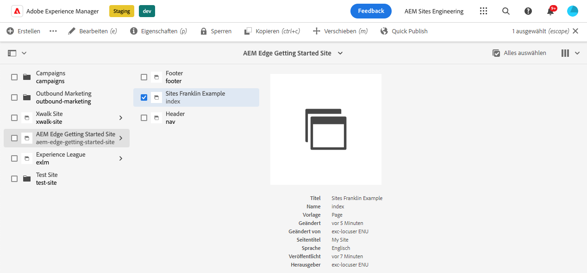
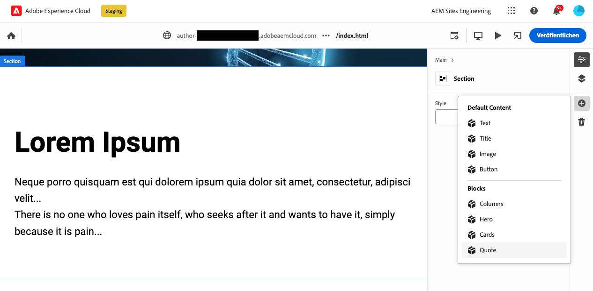
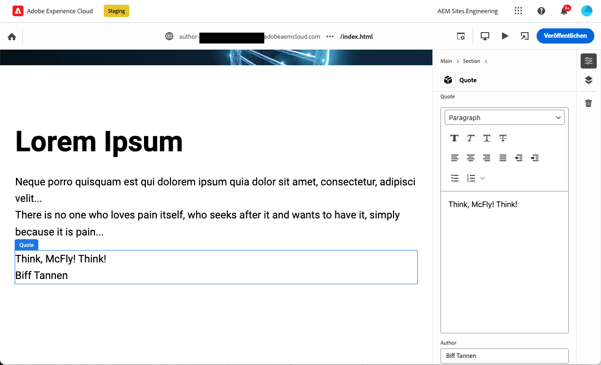
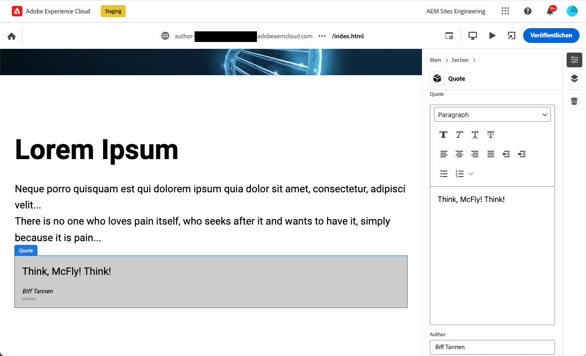

# Erstellen von für die Verwendung mit dem universellen Editor instrumentierten Bausteinen {#create-block}

Erfahren Sie, wie Sie Bausteine erstellen, die für die Verwendung mit dem universellen Editor bei AEM Authoring mit Edge Delivery Services-Projekten instrumentiert sind.

{{aem-authoring-edge-early-access}}

## Voraussetzungen {#prerequisites}

Dieses Handbuch enthält eine schrittweise Anleitung zum Erstellen von Bausteinen, die für den universellen Editor bei AEM Authoring mit Edge Delivery Services-Projekten instrumentiert wurden. Es umfasst das Hinzufügen von Komponenten, das Laden von Komponentendefinitionen im universellen Editor, das Veröffentlichen von Seiten, das Implementieren von Blockdekorationen und -stilen, das Übertragen der Änderungen in die Produktion und die Überprüfung dieser Änderungen. Nach Abschluss dieses Handbuchs können Sie einen neuen Baustein für Ihr eigenes Projekt erstellen und bereitstellen.

Dieser Leitfaden erfordert unbedingt vorhandene Kenntnisse über AEM Authoring mit Edge Delivery Services-Projekten sowie den universellen Editor. Bevor Sie mit diesem Handbuch beginnen, sollten Sie bereits Zugriff auf Edge Delivery Services haben und mit den Grundlagen vertraut sein, darunter:

* Sie haben die [Tutorial zum Edge-Bereitstellungsdienst.](/help/edge/developer/tutorial.md)
* Sie haben Zugriff auf eine [AEM Cloud Service-Sandbox.](/help/implementing/cloud-manager/getting-access-to-aem-in-cloud/introduction-sandbox-programs.md)
* Sie haben [den universellen Editor in derselben Sandbox-Umgebung aktiviert hat.](/help/implementing/universal-editor/getting-started.md)
* Sie haben die [Erste Schritte für Entwickler für AEM Authoring mit Edge Delivery Services](/help/edge/edge-dev-getting-started.md) Handbuch.

Dieser Leitfaden baut auf der Arbeit auf, die im [Erste Schritte für Entwickler für AEM Authoring mit Edge Delivery Services](/help/edge/edge-dev-getting-started.md) Handbuch.

## Hinzufügen eines neuen Bausteins zu Ihrem Projekt {#add-block}

In diesem Handbuch erstellen Sie einen Block, um ein unvergessliches Zitat auf Ihrer Seite zu rendern.

Um dieses Beispiel zu vereinfachen, werden alle Änderungen am `main` Verzweigung des Projekt-Repositorys. Natürlich für Ihr Projekt, [Sie sollten Best Practices für die Entwicklung befolgen](https://www.aem.live/docs/dev-collab-and-good-practices) durch Entwicklung in einer anderen Verzweigung und Überprüfung aller Änderungen über Pull-Anforderungen, bevor Sie zu `main`.

Adobe empfiehlt, Blöcke in drei Phasen zu entwickeln:

1. Erstellen Sie die Definition und das Modell für den Baustein, überprüfen Sie ihn und bringen Sie ihn in die Produktion.
1. Erstellen Sie Inhalt mit dem neuen Baustein.
1. Implementieren Sie die Dekoration und Stile für den neuen Block.

Im folgenden Beispiel eines Anführungszeichens wird dieser Ansatz verwendet.

### Erstellen einer Blockdefinition und eines Modells {#create-block-model}

1. Lokales Klonen des GitHub-Projekts, das Sie im [Erste Schritte für Entwickler für AEM Authoring mit Edge Delivery Services](/help/edge/edge-dev-getting-started.md) und öffnen Sie sie in einem Editor Ihrer Wahl.

   * Microsoft-Code wird hier zur Veranschaulichung verwendet.

   

1. Bearbeiten Sie die `component-definition.json` -Datei im Stammverzeichnis des Projekts, fügen Sie die folgende Definition für Ihren neuen Anführungsblock hinzu und speichern Sie die -Datei.

   ```json
   {
     "title": "Quote",
     "id": "quote",
     "plugins": {
       "xwalk": {
         "page": {
           "resourceType": "core/franklin/components/block/v1/block",
           "template": {
             "name": "Quote",
             "model": "quote",
             "quote": "<p>Think, McFly! Think!</p>",
             "author": "Biff Tannen"
           }
         }
       }
     }
   }
   ```

   

1. Bearbeiten Sie die `component-models.json` Datei im Stammverzeichnis des Projekts und fügen Sie Folgendes hinzu: [Modelldefinition](/help/implementing/universal-editor/field-types.md#model-structure) für Ihren neuen Anführungsblock und speichern Sie die Datei.

   * Lesen Sie das Dokument . [Inhaltsmodellierung für AEM Authoring mit Edge Delivery Services-Projekten](/help/edge/content-modeling.md) für weitere Informationen darüber, was beim Erstellen von Inhaltsmodellen zu beachten ist.

   ```json
   {
     "id": "quote",
     "fields": [
        {
          "component": "text-area",
          "name": "quote",
          "value": "",
          "label": "Quote",
          "valueType": "string"
        },
        {
          "component": "text-input",
          "valueType": "string",
          "name": "author",
          "label": "Author",
          "value": ""
        }
      ]
   }
   ```

   

1. Bearbeiten Sie die `component-filters.json` -Datei im Stammverzeichnis des Projekts und fügen Sie den Anführungszeichenblock zum [Filterdefinition](/help/implementing/universal-editor/customizing.md#filtering-components) , damit der Block zu einem beliebigen Abschnitt hinzugefügt werden kann, und speichern Sie die Datei.

   ```json
   {
     "id": "section",
     "components": [
       "text",
       "image",
       "button",
       "title",
       "hero",
       "cards",
       "columns",
       "quote"
      ]
   }
   ```

   

1. Übertragen Sie diese Änderungen mithilfe von Git auf Ihre `main` -Verzweigung.

   * Verpflichtung zu `main` dient nur zu Veranschaulichungszwecken. [Best Practices befolgen](https://www.aem.live/docs/dev-collab-and-good-practices) und verwenden eine Pull-Anforderung für die tatsächliche Projektarbeit.

### Erstellen von Inhalten mit dem Block {#create-content}

Nachdem Ihr einfacher Anführungsblock definiert und in das Beispielprojekt übertragen wurde, können Sie einer vorhandenen Seite einen Anführungsblock hinzufügen.

1. Melden Sie sich in einem Browser bei AEM as a Cloud Service an. [Verwenden der Sites-Konsole,](/help/sites-cloud/authoring/basic-handling.md) Navigieren Sie zu der Site, die Sie in der [Erste Schritte für Entwickler für AEM Authoring mit Edge Delivery Services](/help/edge/edge-dev-getting-started.md) und wählen Sie eine Seite aus.

   * In diesem Fall `index` wird zu Veranschaulichungszwecken verwendet.

   

1. Tippen oder klicken **Bearbeiten** in der Symbolleiste der Konsole angezeigt und der universelle Editor geöffnet.

   * Um die Seite zu laden, müssen Sie möglicherweise auf **Anmelden mit Adobe** , um sich im universellen Editor bei AEM zu authentifizieren.

1. Wählen Sie im universellen Editor einen Abschnitt aus. Tippen oder klicken Sie in der Eigenschaftenleiste auf die **Hinzufügen** und wählen Sie dann Ihre neue **Anführungszeichen** aus dem Menü.

   * Die **Hinzufügen** -Symbol ist ein Pluszeichen.
   * Sie wissen, dass Sie einen Abschnitt ausgewählt haben, wenn der blaue Umriss des ausgewählten Objekts eine Registerkarte mit der Bezeichnung **Abschnitt**.
   * Tippen oder klicken Sie in diesem Beispiel etwas über dem **Lorem Ipsum** Überschrift wählt einen Abschnitt aus, der die Überschrift und den lorem ipsum text enthält.

   

1. Die Seite wird neu geladen und der Anführungsblock wird am unteren Rand des ausgewählten Abschnitts hinzugefügt, wobei der Standardinhalt im `component-definitions.json` -Datei.

   * Der Anführungsbaustein kann wie jeder andere Baustein entweder direkt im Kontext oder in der Eigenschaftenleiste ausgewählt und bearbeitet werden.
   * Die Formatierung wird in einem weiteren Schritt angewendet.

   

1. Wenn Sie mit dem Inhalt Ihres Angebots zufrieden sind, können Sie die Seite veröffentlichen, indem Sie auf die **Veröffentlichen** in der Symbolleiste des universellen Editors

1. Stellen Sie sicher, dass der Inhalt veröffentlicht wurde, indem Sie zur veröffentlichten Seite navigieren. Der Link ähnelt dem `https://<branch>--<repo>--<owner>.hlx.page`

   

### Gestalten Sie den Block {#style-block}

Nachdem Sie nun über einen funktionierenden Anführungsblock verfügen, können Sie ihn mit Stilen versehen.

1. Kehren Sie zum Editor für Ihr Projekt zurück.

1. Erstellen Sie eine `quote` Ordner unter `blocks` Ordner.

   

1. Im neuen `quote` Ordner, fügen Sie einen `quote.js` -Datei, um die Blockdekoration zu implementieren, indem Sie das folgende JavaScript hinzufügen und die -Datei speichern.

   ```javascript
   export default function decorate(block) {
     const [quoteWrapper] = block.children;
   
     const blockquote = document.createElement('blockquote');
     blockquote.textContent = quoteWrapper.textContent.trim();
     quoteWrapper.replaceChildren(blockquote);
   }
   ```

   


1. Im `quote` Ordner, fügen Sie einen `quote.css` -Datei, um die Formatierung für den Baustein zu definieren, indem Sie den folgenden CSS-Code hinzufügen und die Datei speichern.

   ```css
   .block.quote {
       background-color: #ccc;
       padding: 0 0 24px;
       display: flex;
       flex-direction: column;
       margin: 1rem 0;
   }
   
   .block.quote blockquote {
       margin: 16px;
       text-indent: 0;
   }
   
   .block.quote > div:last-child > div {
       margin: 0 16px;
       font-size: small;
       font-style: italic;
       position: relative;
   }
   
   .block.quote > div:last-child > div::after {
       content: "";
       display: block;
       position: absolute;
       left: 0;
       bottom: -8px;
       height: 5px;
       width: 30px;
       background-color: darkgray;
   }
   ```

   

1. Übertragen Sie diese Änderungen mithilfe von Git auf Ihre `main` -Verzweigung.

   * Verpflichtung zu `main` dient nur zu Veranschaulichungszwecken. [Best Practices befolgen](https://www.aem.live/docs/dev-collab-and-good-practices) und verwenden eine Pull-Anforderung für die tatsächliche Projektarbeit.

1. Kehren Sie zur Registerkarte &quot;Browser&quot;des universellen Editors zurück, auf der Sie die Seite Ihres Projekts bearbeitet haben, und laden Sie die Seite neu, um den formatierten Block anzuzeigen.

1. Sehen Sie sich den jetzt formatierten Anführungsblock auf der Seite an.

   

1. Stellen Sie sicher, dass die Änderungen an die Produktion gesendet wurden, indem Sie zur veröffentlichten Seite navigieren. Der Link ähnelt dem `https://<branch>--<repo>--<owner>.hlx.page`

   

Herzlichen Glückwunsch! Jetzt haben Sie einen voll funktionierenden und formatierten Anführungsblock. Sie können dieses Beispiel als Grundlage für die Erstellung Ihrer eigenen projektspezifischen Blöcke verwenden.

## Verwenden anderer Arbeitsverzweigungen {#other-branches}

In diesem Handbuch wurden Sie direkt zu `main` Zweig um der Einfachheit willen. Für Experimente in einem Beispiel-Repository ist dies normalerweise kein Problem. Für die eigentliche Projektarbeit, [Sie sollten Best Practices für die Entwicklung befolgen](https://www.aem.live/docs/dev-collab-and-good-practices) durch Entwicklung in einer anderen Verzweigung und Überprüfung aller Änderungen über Pull-Anforderungen, bevor Sie zu `main`.

Wenn Sie sich nicht auf der `main` -Verzweigung, können Sie `?ref=<branch>` in der Navigationsleiste des universellen Editors , um die Seite von Ihrer Verzweigung zu laden. `<branch>` ist der Name der Verzweigung, wie er für die Vorschau Ihres Projekts oder Live-URLs verwendet wird, z. B. `https://<branch>--<repo>--<owner>.hlx.page`.

Das Veröffentlichen von Inhalten mit einem neuen Modell wird nur unterstützt, wenn das Modell mit der `main` -Verzweigung.
