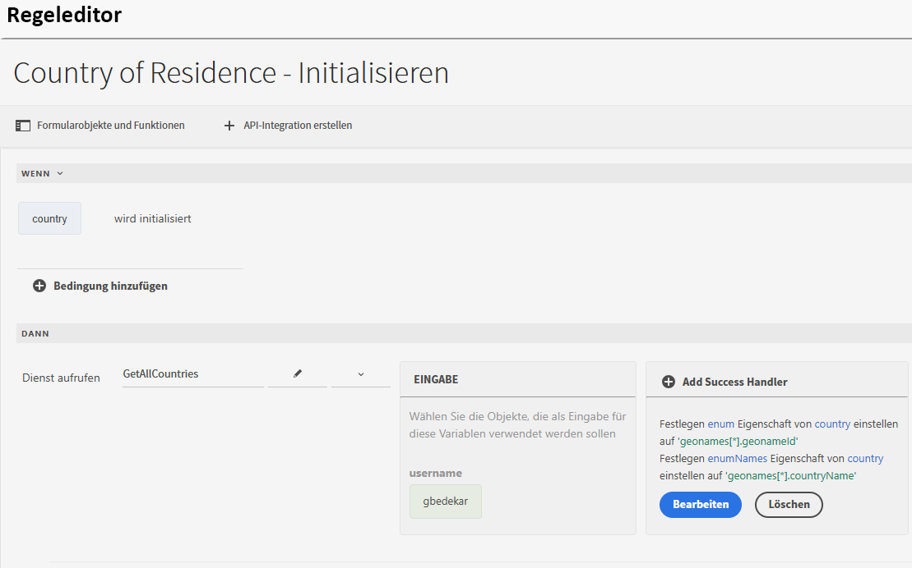
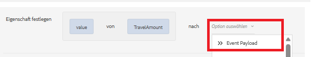
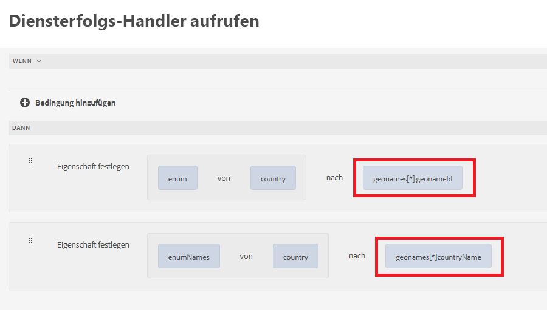
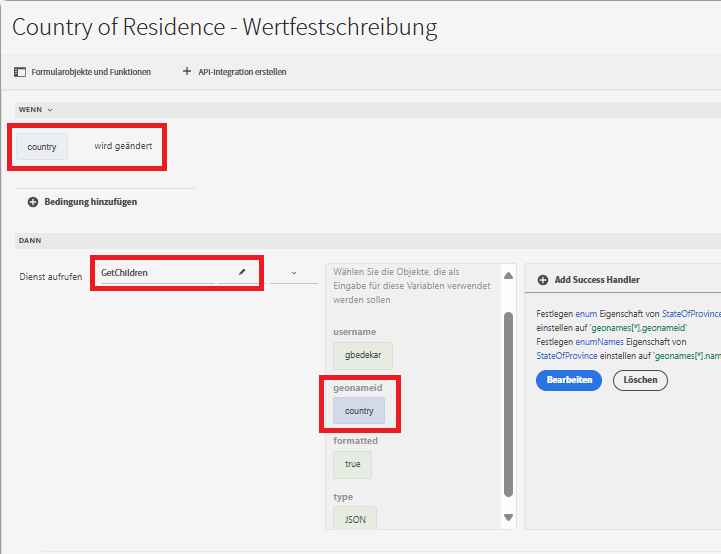
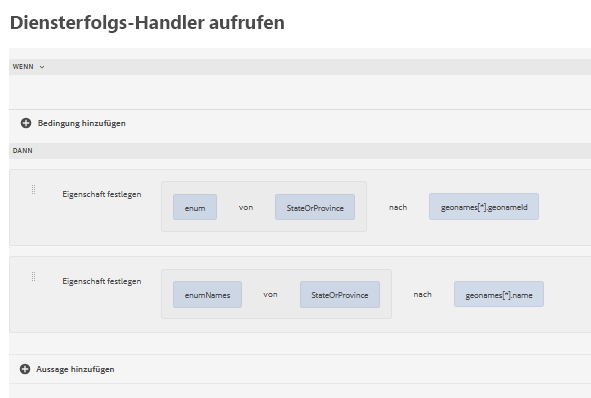

# Erstellen des Formulars mit dem universellen Editor

Erstellen Sie das folgende Formular mit dem universellen Editor. Das Formular enthält drei Dropdown-Listen, deren Werte mithilfe der API-Integration ausgefüllt werden.

## Wohnsitzland

Bei der Initialisierung wird die Dropdown-Liste für das Wohnsitzland mit den Ergebnissen des API-Aufrufs ausgefüllt.

## Erfolgs-Handler

Der Erfolgs-Handler wurde so definiert, dass „enum“ und „enumNames“ der Dropdown-Liste für das Land auf die entsprechenden Werten aus dem Array „geonames“ festgelegt werden. Das Array „geonames“ ist unter der Option „Ereignis-Payload“ verfügbar.

## Abrufen untergeordneter Werte

Die Dropdown-Liste für die Region oder Provinz wird ausgefüllt, wenn Benutzende eine Auswahl in der Dropdown-Liste für das Wohnsitzland treffen. Die dem ausgewählten Land zugeordnete geonameId wird als Eingabeparameter an die GetChildren-API-Integration übergeben.

Der Erfolgs-Handler wurde so definiert, dass „enum“ und „enumNames“ des Dropdown-Felds „StateOrProvince“ festgelegt werden.

Wenn die Region oder Provinz ausgewählt ist, können Sie die Dropdown-Liste für die Stadt nach dem oben genannten Muster ausfüllen, das zum Ausfüllen der Dropdown-Liste für die Region oder Provinz verwendet wird.