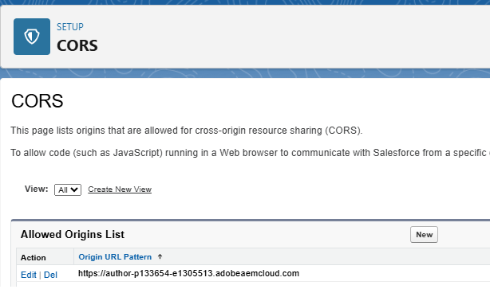
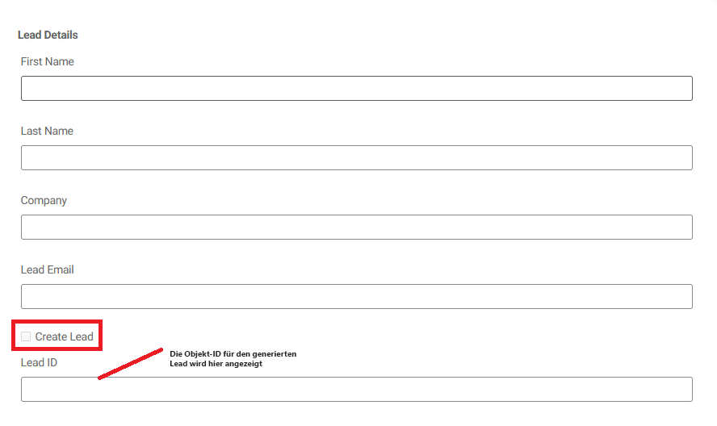
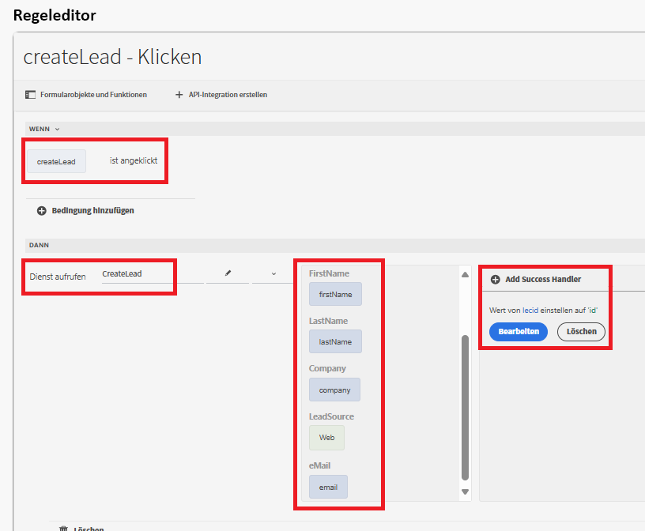

# Erstellen eines Salesforce Lead-Objekts mithilfe der API-Integration

In diesem Anwendungsbeispiel wird erläutert, wie Sie in Salesforce ein Lead-Objekt mithilfe der API-Integration erstellen. Am Ende dieses Prozesses können Sie:

Eine [verbundene App in Salesforce](https://help.salesforce.com/s/articleView?id=platform.ev_relay_create_connected_app.htm&type=5) einrichten, um sicheren API-Zugriff zu ermöglichen.

CORS (Cross-Origin Resource Sharing) konfigurieren, damit in einem Webbrowser ausgeführter Code (z. B. JavaScript) mit Salesforce von einem bestimmten Ursprung kommunizieren kann. Fügen Sie den Ursprung der Zulassungsliste hinzu, wie unten dargestellt.



## Einstellungen für verbundene Apps

Die folgenden Einstellungen werden in der verbundenen App verwendet. Sie können die OAuth-Bereiche je nach Ihren Anforderungen zuweisen.


## Erstellen einer API-Integration

| Name | Wert |
|--------------------------------|------------------|
| API-URL | https://`<your-domain>`d.my.salesforce.com/services/data/v32.0/sobjects/Lead |
| Client-ID | Spezifisch für Ihre verbundene App |
| Client-Geheimnis | Spezifisch für Ihre verbundene App |
| OAuth-URL | https://login.salesforce.com/services/oauth2/authorize |
| URL des Zugriffs-Tokens | https://`<your-domain>`/services/oauth2/token |
| URL für aktualisiertes Token | https://`<your-domain>`/services/oauth2/token |
| Autorisierungsumfang | api chatter_api full id openid refresh_token visualforce web |
| Autorisierungs-Header | Autorisierungsträger |


## Eingabe- und Ausgabeparameter

Definieren Sie die Eingabeparameter für den API-Aufruf und ordnen Sie die Ausgabeparameter mithilfe der folgenden JSON zu.

```json
{
    "id": "00QKY000001LyJR2A0",
    "success": true
}
```


## Erstellen eines Formulars

Erstellen Sie ein einfaches adaptives Formular mit dem universellen Editor, um die Details zum Lead-Objekt wie unten gezeigt zu erfassen.


Verwalten Sie das Klickereignis im Kontrollkästchen „Lead erstellen“ mithilfe des Regeleditors. Ordnen Sie die Eingabeparameter wie unten dargestellt den Werten der entsprechenden Formularobjekte zu. Die ID des neu erstellten Lead-Objekts wird im TextField-Objekt `leadid` angezeigt.


## Testen der Integration

- Zeigen Sie eine Vorschau des Formulars an.
- Geben Sie einige aussagekräftige Werte ein.
- Aktivieren Sie das Kontrollkästchen `Create Lead`, um den API-Aufruf auszulösen.
- Die Lead-ID des neu erstellten Lead-Objekts wird im Textfeld `Lead ID` angezeigt.
