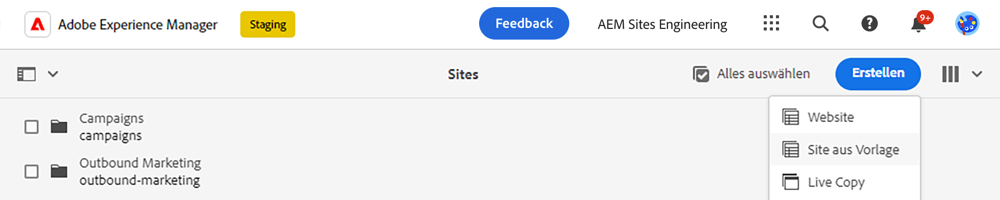
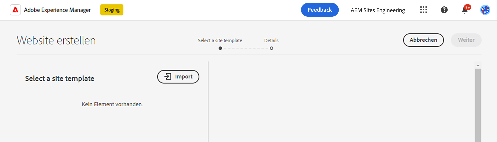
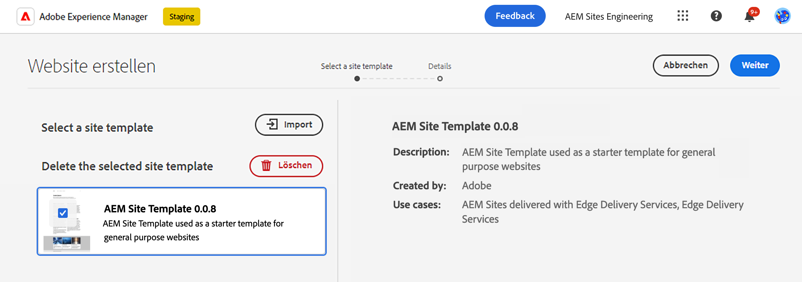
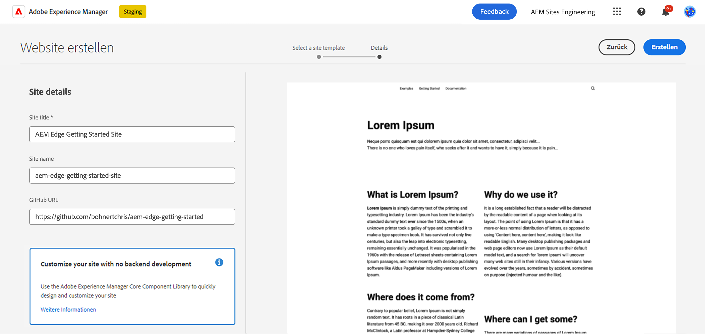
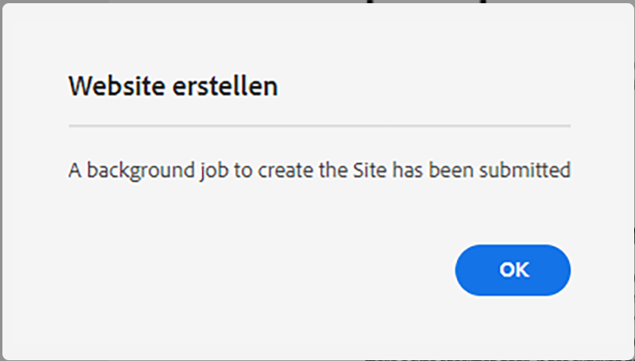
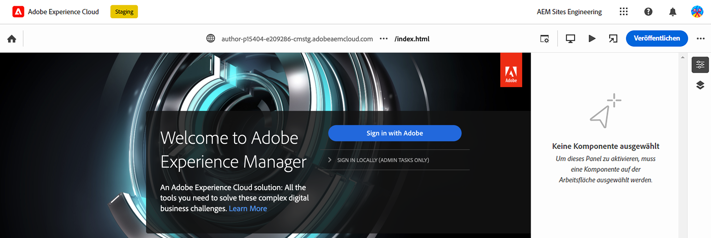
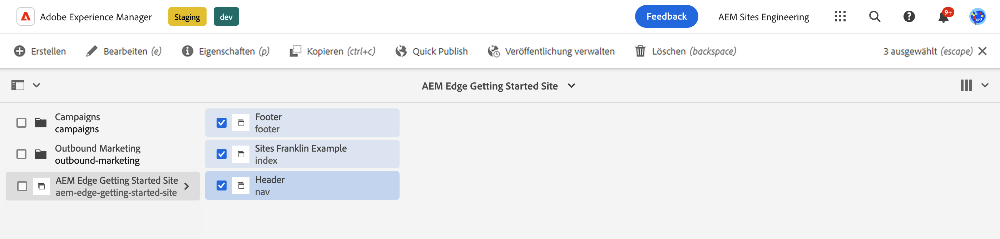
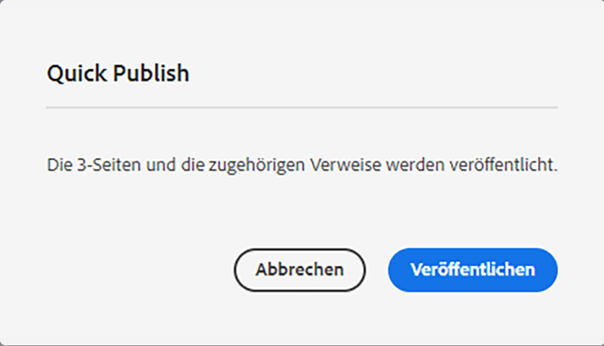

# AEM Authoring mit Edge Delivery Services {#edge-dev-getting-started}

In diesem Handbuch erfahren Sie, wie Sie mit einer neuen Adobe Experience Manager-Site arbeiten, die Edge Delivery Services und den universellen Editor für die Inhaltserstellung verwendet.

{{aem-authoring-edge-early-access}}

## Voraussetzungen {#prerequisites}

Bevor Sie mit diesem Handbuch beginnen, sollten Sie bereits mit den Grundlagen von vertraut sein und Zugriff auf Edge Delivery Services haben, darunter:

* Sie haben die [Tutorial zum Edge-Bereitstellungsdienst.](/help/edge/developer/tutorial.md)
* Sie haben Zugriff auf eine [AEM Cloud Service-Sandbox.](/help/implementing/cloud-manager/getting-access-to-aem-in-cloud/introduction-sandbox-programs.md)
* Sie haben [den universellen Editor in derselben Sandbox-Umgebung aktiviert hat.](/help/implementing/universal-editor/getting-started.md)

## Wählen Sie den rechten Editor aus {#editor-choice}

AEM bietet zwei verschiedene Inhaltseditoren, deren Auswahl von Ihrer Situation abhängig ist.

* **Universal Editor** - Dies sollte die Standardauswahl für neue Sites sein.
* **AEM Seiten-Editor** - Dies sollte für eine bestehende AEM Sites-Migration zu Edge Delivery Services ausgewählt werden.

Dieses Handbuch konzentriert sich auf AEM Projekte für Edge Delivery Services, die den universellen Editor verwenden. Siehe Dokument . [Entwickeln für Edge Delivery Services](/help/edge/developing.md) für weitere Informationen zur Auswahl des richtigen Editors und zur Migration vorhandener AEM Sites zu Edge Delivery Services.

## Erste Schritte mit AEM Authoring und Edge Delivery Services {#getting-started}

Sobald du dich erfüllt hast [Voraussetzungen](#prerequisites) und [die Wahl der Verwendung des universellen Editors,](#editor-choice) können Sie mit Ihrem eigenen Projekt beginnen.

### Erstellen Ihres GitHub-Projekts {#create-github-project}

Zunächst müssen Sie ein neues Projekt auf GitHub erstellen, das auf der Adobe-Vorlage basiert.

1. Navigieren Sie zu [`https://github.com/adobe-rnd/aem-boilerplate-xwalk`](https://github.com/adobe-rnd/aem-boilerplate-xwalk) und klicken Sie auf **Verwenden Sie diese Vorlage** und wählen **Neues Repository erstellen**.

   * Sie müssen bei GitHub angemeldet sein, um diese Option sehen zu können.

   

1. Standardmäßig wird Ihnen das Repository zugewiesen. Ändern Sie dies bei Bedarf, geben Sie einen Repository-Namen und eine Beschreibung ein und klicken Sie auf **Repository erstellen**.

   

1. Navigieren Sie in einer neuen Registerkarte im selben Browser zu [`https://github.com/apps/aem-code-sync`](https://github.com/apps/aem-code-sync) und klicken **Konfigurieren**.

   

1. Klicks **Konfigurieren** für die Organisation, in der Sie Ihr neues Repository im vorherigen Schritt erstellt haben.

   

1. Auf der GitHub-Seite zur AEM Codesynchronisierung unter **Repository-Zugriff** auswählen **Nur Repositorys auswählen**, wählen Sie das Repository aus, das Sie im vorherigen Schritt erstellt haben, und klicken Sie dann auf **Speichern**.

   

1. Nachdem AEM Codesynchronisierung installiert wurde, erhalten Sie einen Bestätigungsbildschirm. Kehren Sie zur Browser-Registerkarte Ihres neuen Repositorys zurück.

   

1. Klicken Sie auf `fstab.yaml` -Datei, um sie zu öffnen, und dann **Diese Datei bearbeiten** -Symbol, um sie zu bearbeiten.

   

1. Bearbeiten Sie die `fstab.yaml` -Datei, um den Bereitstellungspunkt Ihres Projekts zu aktualisieren. Ersetzen Sie die standardmäßige Google Docs-URL durch die URL Ihrer AEM as a Cloud Service Authoring-Instanz und klicken Sie auf **Zusage von Änderungen...**.

   * `https://<aem-author>/bin/franklin.delivery/<owner>/<repository>/main`
   * Durch Änderung des Bereitstellungspunkts werden die Edge Delivery Services darüber informiert, wo der Inhalt der Site gefunden werden soll.

   

1. Fügen Sie nach Bedarf eine Commit-Nachricht hinzu und klicken Sie auf **Zusagen von Änderungen**, die sie direkt an die `main` -Verzweigung.

   

1. Kehren Sie zum Stammverzeichnis Ihres Repositorys zurück und klicken Sie auf `paths.yaml` und dann **Diese Datei bearbeiten** Symbol.

   

1. Ersetzen Sie die Standardzuordnungen durch `/content/<site-name>/:/` und klicken **Zusage von Änderungen...**.

   * Eigene Bereitstellung `<site-name>`. Sie werden es in einem späteren Schritt benötigen.
   * Die Zuordnungen teilen Edge Delivery Services mit, wie der Inhalt in Ihrem AEM Repository der Site-URL zugeordnet werden kann.

   

1. Fügen Sie nach Bedarf eine Commit-Nachricht hinzu und klicken Sie auf **Zusagen von Änderungen**, die sie direkt an die `main` -Verzweigung.

   

### Erstellen und Bearbeiten einer neuen AEM {#create-aem-site}

Nachdem Sie nun über ein GitHub-Projekt verfügen, müssen Sie eine neue AEM-Site erstellen, die das Projekt verwenden kann.

>[!NOTE]
>
>Um Ihre Site mit dem universellen Editor zu bearbeiten, müssen Sie einen Chromium-basierten Browser verwenden.

1. Fordern Sie die neueste AEM Authoring mit Edge Delivery Services-Site-Vorlage von Adobe Engineering über Ihre [Projekt-Slack-Kanal.](/help/edge/docs/slack.md)

1. Melden Sie sich bei Ihrer AEM as a Cloud Service Authoring-Instanz an, navigieren Sie zur Sites-Konsole und tippen oder klicken Sie auf **Erstellen** -> **Site aus Vorlage**.

   

1. Im **Auswählen einer Site-Vorlage** auf der Registerkarte des Assistenten zum Erstellen der Site klicken Sie auf die **Import** -Schaltfläche, um eine neue Vorlage zu importieren.

   

1. Laden Sie die Website-Vorlage AEM Authoring mit Edge Delivery Services hoch, die Ihnen von Adobe Engineering bereitgestellt wird.

1. Nach dem Import wird die Vorlage im Assistenten angezeigt. Tippen oder klicken Sie, um es auszuwählen, und tippen oder klicken Sie dann auf **Nächste**.

   

1. Geben Sie die folgenden Felder ein und tippen oder klicken Sie auf **Erstellen**.

   * **Site-Titel** - Fügen Sie einen beschreibenden Titel für die Site hinzu.
   * **Site-Titel** - Verwenden Sie die `<site-name>` die Sie in der Variablen [vorherigen Schritt.](#create-github-project)
   * **GitHub-URL** - Verwenden Sie die URL des GitHub-Projekts, das Sie im vorherigen Schritt erstellt haben.

   

1. AEM bestätigt die Site-Erstellung mit einem Dialogfeld. Tippen oder klicken **OK** zu entlassen.

   

1. Navigieren Sie in der Sites-Konsole zum `index.html` der neu erstellten Site und tippen oder klicken Sie auf **Bearbeiten** in der Symbolleiste.

   

1. Der universelle Editor wird in einer neuen Registerkarte geöffnet. Möglicherweise müssen Sie auf oder auf **Anmelden mit Adobe** zum Authentifizieren, um Ihre Seite zu bearbeiten.

   

Sie können Ihre Site jetzt mit dem universellen Editor bearbeiten. Siehe [Dokumentation zum universellen Editor](/help/sites-cloud/authoring/universal-editor/authoring.md) für weitere Informationen.

### Veröffentlichen Ihrer neuen Site {#publishing}

Sobald Sie mit der Bearbeitung Ihrer neuen Website mit dem universellen Editor fertig sind, können Sie Ihre Inhalte veröffentlichen.

1. Wählen Sie in der Sites-Konsole alle Seiten aus, die Sie für Ihre neue Site erstellt haben, und tippen oder klicken Sie auf **Quick publish** in der Symbolleiste.

   

1. Tippen oder klicken **Veröffentlichen** im Bestätigungsdialogfeld, um den Prozess zu starten.

   

1. Öffnen Sie eine neue Registerkarte im selben Browser und navigieren Sie zur URL Ihrer neuen Site.

   * `https://main--<site-name>--<owner>.hlx.page`

1. Anzeigen der veröffentlichten Inhalte

   

## Nächste Schritte {#next-steps}

Jetzt, da Sie ein AEM mit dem Edge Delivery Services-Projekt haben, können Sie Ihre eigenen Bausteine erstellen und gestalten.

Weitere Informationen finden Sie im Handbuch [Erstellen von für die Verwendung mit dem universellen Editor instrumentierten Bausteinen](/help/edge/create-block.md) für weitere Informationen.
