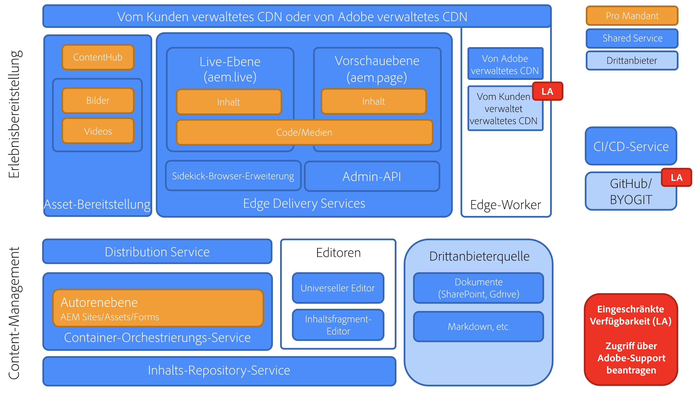

# Überblick über Edge Delivery Services {#edge-delivery-services}

## Was ist Edge Delivery Services? {#what-is-edge}

Edge Delivery Services ist ein modernes Framework zur Inhaltsbereitstellung, das die Erstellung und Bereitstellung von Websites neu definiert und Geschwindigkeit, einfache Bedienung und Skalierbarkeit optimiert. Es ist ein zentraler Bestandteil von Adobe Experience Manager und ermöglicht schnellere digitale Erlebnisse, indem das Rendering und die Bereitstellung Benutzenden am Rand des Netzwerks nähergebracht werden.

Es ist kein Ersatz für ein Content Delivery Network (CDN), sondern lässt sich nahtlos in Ihr eigenes CDN oder das enthaltene [von Adobe verwaltete CDN](/help/implementing/dispatcher/cdn.md) integrieren.

>[!TIP]
>
>**Wollen Sie sofort beginnen?**
>
>Wenn Sie sofort praktische Erfahrungen sammeln möchten, können Sie in weniger als 30 Minuten Ihr eigenes Edge Delivery Services-Projekt mit AEM-Authoring starten, indem Sie [sich das Tutorial auf aem.live ansehen.](https://www.aem.live/developer/ue-tutorial)

## Gründe für Edge Delivery Services {#why-edge}

### Erhöhen von Auffindbarkeit und Traffic {#increase-traffic}

Edge Delivery-Websites sind für Suchmaschinen (SEO) und generative Engines (GEO) für LLMs optimiert. Dies gewährleistet eine hohe Sichtbarkeit und Auffindbarkeit auf allen vorhandenen und kommenden Quellen für organischen Traffic. Die **auf Leistung ausgelegte End-to-End-Architektur** sorgt für ein ansprechendes Kundenerlebnis, das sich positiv auf die Interaktion auswirkt.

### Effizienz in der Entwicklung {#developer-efficientcy}

Live-Schaltung in Tagen und Wochen statt Monaten und Jahren. Edge Delivery bietet alle Tools, die **moderne Web-Entwicklende** lieben: GitHub, lokale Entwicklung mit automatischem Neuladen, Leistung und einfache Bedienung. Gleichzeitig werden Komplikationen vermieden, da kein Transpilieren, keine Bundler, keine Konfigurationen sowie kein zusätzlicher Aufwand notwendig sind.

Aufgrund der einfachen Bedienung von Edge Delivery müssen Sie keine komplizierten Frameworks, Tools oder Prozesse verwenden. Es eignet sich daher ideal für die Erstellung von KI-Code. Verwenden Sie einfaches HTML, modernes CSS und Vanilla JavaScript, um außergewöhnliche Erlebnisse schneller als je zuvor zu erstellen. Konzentrieren Sie sich auf die Arbeit und verbringen Sie weniger Zeit mit Schulungen und dem Kennenlernen neuer Tools.

Edge Delivery ermöglicht es allen Entwickelnden, einen Lighthouse-Wert von 100 zu erreichen.

### Unterstützung mehrerer Inhaltsquellen {#multiple-content-sources}

Inhalte aus verschiedenen Lösungen können direkt mit Edge Delivery integriert werden, **einschließlich aller vorhandenen AEM-Instanzen**. Autorinnen und Autoren können **Inhalte aus jedem System wie SharePoint in Edge Delivery verwalten und dort veröffentlichen**, um mit bereits bekannten Tools schneller Ergebnisse zu erzielen.

### Zusammensetzbare Architektur {#composable-architeture}

Ob Headless oder Headful, Sie können die richtigen Inhalte im richtigen Format bereitstellen und die richtige Dekoration hinzufügen, um die Inhalte so zu gestalten, dass sie in jedem Kanal auffallen.

## Funktionsweise {#how-does-it-work}

Edge Delivery Services ist ein zusammenstellbarer Satz von Services, der eine hohe Flexibilität bei der Erstellung von Inhalten auf Ihrer Website ermöglicht. Er ersetzt AEM Publish/Dispatcher und die herkömmliche Methode zum Erstellen von Erlebnissen mit AEM-Kernkomponenten durch eine Multi-Cloud-SaaS-Lösung und einen reinen Frontend-Entwicklungsansatz.

Edge Delivery Services nutzt GitHub, damit Sie Code direkt über ihr GitHub-Repository verwalten und bereitstellen können. Neue Inhalte werden sofort und ohne Neuerstellungsprozess hinzugefügt.

## Authoring {#authoring}

### Kontextbezogenes Bearbeiten {#in-context-editing}

[Der universelle Editor](/help/implementing/universal-editor/introduction.md) ist ein anpassbarer, zentraler WYSIWYG-Ort (What You See Is What You Get), an dem Sie Inhalte live und kontextbezogen mit einer visuellen Vorschau bearbeiten können.

* Mit AEM-Authoring und dem universellen Editor erhöhen Sie die Autoreneffizienz, sowohl im Headless- als auch im Headful-Kontext.
* Sie können die umfassenden Content-Management-Funktionen von AEM nutzen, einschließlich Workflow und Governance.
* Sie können zahlreiche Erweiterungspunkte nutzen, um Ihre eigenen Prozesse und Integrationen zu unterstützen.
* Die Funktionalität Ihrer Site kann mithilfe von CSS und JavaScript in GitHub entwickelt werden.

### Dokumentenbasierte Bearbeitung {#document-based-editing}

[Ein weiterer Ansatz ist das dokumentbasierte Authoring](https://www.aem.live/docs/authoring), bei dem Inhalte als Dokumente verwaltet werden. Microsoft Word ist eine beliebte Wahl, da viele Unternehmen bei der anfänglichen Inhaltserstellung mit SharePoint arbeiten. Es ist nicht erforderlich, sich mit einem neuen Tool vertraut zu machen und das Veröffentlichen von Inhalten direkt aus SharePoint und Word beseitigt die Notwendigkeit, Inhalte kopieren und in AEM einfügen zu müssen. Kundinnen und Kunden ohne SharePoint können auch Google Drive als Alternative verwenden.

## Operational Telemetry {#telemetry}

Adobe Experience Manager verwendet [Operational Telemetry](https://www.aem.live/docs/operational-telemetry), um Betriebsdaten zu erfassen, die unbedingt erforderlich sind, um Funktions- und Leistungsprobleme an Adobe Experience Manager-gestützten Sites zu ermitteln und zu beheben. Daten von Operational Telemetry können zur Diagnose von Leistungsproblemen und zur Messung der Effektivität von Experimenten verwendet werden. Operational Telemetry hält Vorgaben zum Datenschutz der Besucherinnen und Besucher durch [Sampling](https://www.aem.live/docs/operational-telemetry#operational-telemetry-data-is-sampled) ein (nur ein kleiner Teil aller Seitenansichten wird überwacht) sowie durch [den sorgfältigen Ausschluss aller personenbezogener Daten](https://www.aem.live/docs/operational-telemetry#what-data-is-being-collected) (Personally Identifiable Information, PII).

## Erste Schritte {#start-exploring}

Erste Schritte mit AEM-Authoring mit dem universellen Editor und Edge Delivery Services:

* Dokumentation zu Edge Delivery Services [Edge Delivery Services](https://www.aem.live)
* Einen Überblick über das AEM-Authoring mit dem universellen Editor finden Sie im Dokument zum [AEM-Authoring für Edge Delivery Services](https://www.aem.live/docs/aem-authoring) in der Dokumentation zu aem.live.
* Eine Entwicklungsübersicht finden Sie im Dokument zum [Tutorial zu den ersten Schritten für Entwickelnde mit dem universellen Editor](https://www.aem.live/developer/ue-tutorial) in der Dokumentation zu aem.live.

## Edge Delivery Services und andere Adobe Experience Cloud-Produkte {#edge-other-products}

Edge Delivery Services sind Teil von Adobe Experience Manager. Daher können Edge Delivery Services und AEM Sites gemeinsam in derselben Domain vorhanden sein, was häufig bei größeren Websites der Fall ist. Darüber hinaus können Ihre AEM Sites-Seiten nahtlos Inhalte von Edge Delivery Services nutzen, und auch umgekehrt ist das möglich.

Sie können Edge Delivery Services auch zusammen mit [Adobe Target](https://www.aem.live/developer/target-integration) und [Launch](https://experienceleague.adobe.com/de/docs/experience-platform/tags/home) verwenden.

## So erhalten Sie Hilfe von Adobe {#getting-help}

Adobe bietet drei Ebenen zur Unterstützung bei der Nutzung von Edge Delivery Services:

* Interaktion mit [Community-Ressourcen](#community-resources) für allgemeine Anfragen,
* Zugriff auf Ihren [Kanal für die Produktzusammenarbeit](#collaboration-channel) für spezifische Fragen,
* [Erstellen eines Support-Tickets](#support-ticket), um schwerwiegende und kritische Probleme **im Rahmen der vertraglichen Support-SLA** zu beheben.

### Zugreifen auf Community-Ressourcen {#community-resources}

Adobe setzt sich dafür ein, Ihnen die bestmögliche Community-Interaktion und -Unterstützung für Edge Delivery Services sowie AEM-basiertes Authoring mit dem universellen Editor und dokumentenbasiertes Authoring zu bieten.

* Beteiligen Sie sich an der [Experience League-Community](https://adobe.ly/3Q6kTKl), um Fragen zu stellen, Feedback zu teilen, Diskussionen einzuleiten, Unterstützung von Adobe- und AEM-Fachleuten und -Champions zu erhalten und in Echtzeit mit Gleichgesinnten in Kontakt zu treten. 
* Schließen Sie sich unserem [Discord-Kanal](https://discord.gg/aem-live) an, einer lockereren Plattform für Echtzeitinteraktionen und schnellen Ideenaustausch.

### Einreichen eines Support-Tickets {#support-ticket}

{{support-ticket}}
