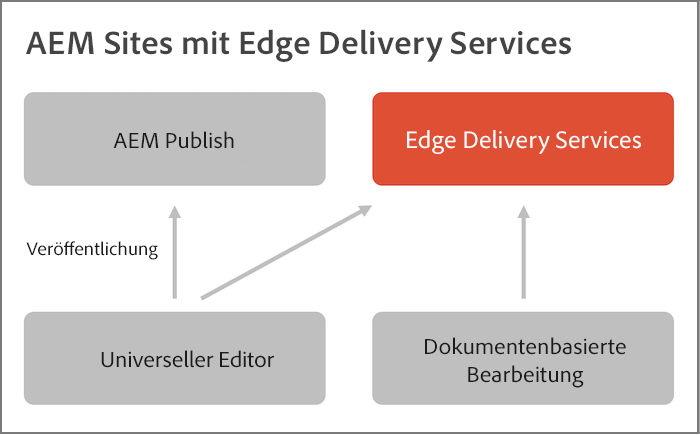

# Überblick über Edge Delivery Services {#edge-delivery-services}

Mit Edge Delivery Services bietet AEM außergewöhnliche Erlebnisse, die Interaktionen und Konversionen fördern. Zu diesem Zweck liefert AEM wirkungsvolle Erlebnisse, die schnell erstellt und weiterentwickelt werden können. Edge Delivery Services ist ein zusammenstellbarer Satz von Diensten, der eine schnelle Entwicklungsumgebung ermöglicht, in der Autorinnen und Autoren schnell aktualisieren und veröffentlichen können und neue Sites schnell live geschaltet werden können. Sie können mit Edge Delivery Services die Konversion verbessern, Kosten reduzieren und extreme Inhaltsgeschwindigkeiten erzielen.

Mithilfe von Edge Delivery Services können Sie:

* Erstellen Sie schnelle Sites mit einem perfekten Lighthouse-Score und überwachen Sie die Leistung Ihrer Site kontinuierlich durch operative Telemetrie.
* die Autoreneffizienz durch Entkopplung von Inhaltsquellen erhöhen. standardmäßig sowohl AEM-Authoring mit dem universellen Editor als auch dokumentbasiertes Authoring verwenden. Sie können also mit mehreren Inhaltsquellen an derselben Website arbeiten.
* ein integriertes Experimentierungs-Framework verwenden, das die schnelle Testerstellung, Ausführung ohne Leistungseinbußen und schnelle Freigabe für die Ermittlung eines Testgewinners ermöglicht.

>[!TIP]
>
>**Willst du sofort mit anpacken?**
>
>Wenn Sie sofort praktische Erfahrungen sammeln möchten, können Sie in weniger als 30 Minuten Ihr eigenes Edge Delivery Services-Projekt mit AEM-Authoring starten, [ Sie sich das Tutorial auf aem.live ansehen](https://www.aem.live/developer/ue-tutorial)

## Agile Reaktion auf Geschäftsanforderungen {#agile-reaction}

Als einer der langjährigen, anerkannten Branchenführer weiß Adobe, wie wichtig es ist, für die Kundschaft neue, aussagekräftige Inhalte schnell erstellen und veröffentlichen zu können. Gängige Herausforderungen bei der Skalierung der Inhaltserstellung sind auf dem Markt deutlich hervorgetreten. Dazu zählen u. a. Folgende:

1. **Die Nachfrage nach Inhalten nimmt weiter zu.**
   * Es müssen neue Inhaltsautorinnen und Inhaltsautoren gefunden werden, um diese Nachfrage zu erfüllen.
   * Das Verfahren zur Inhaltserstellung muss im gesamten Unternehmen effektiv skalierbar sein.
   * Autorinnen und Autoren müssen schnell auf sich ändernde Trends reagieren können.
1. **Es besteht ein Bedarf an Omni-Channel-Inhalten.**
   * Eine Layout-Steuerung ist unabhängig von der Inhaltsbereitstellung erforderlich.
   * Autorinnen und Autoren müssen die Möglichkeit haben, das Layout der Inhalte direkt zu ändern.
1. **Der Druck nimmt zu, den ROI bei Inhalten zu steigern.**
   * Autorinnen und Autoren müssen selbst die Möglichkeit haben, die von ihnen erstellten Inhalte zu optimieren.

Diese Trends haben sich branchenübergreifend etabliert. Die individuellen Anforderungen sind jedoch unweigerlich von Projekt zu Projekt unterschiedlich. Das Ziel jedes Edge Delivery Services-Projekts besteht darin, die Lösung zu finden, die für Ihre Benutzenden funktioniert.

1. **Legen Sie den Schwerpunkt auf die Wertschöpfung und nicht auf Funktionen.** – Ermitteln Sie den am besten optimierten Workflow für Ihre Autorinnen und Autoren, anstatt sich in den umfangreichen Funktionen von AEM zu verlieren.
1. **Nutzen Sie die Flexibilität von AEM.** – AEM-Funktionen müssen nicht separat von anderen genutzt werden. Verwenden Sie die Funktionen, die Sie für den jeweiligen Anwendungsfall benötigen.
1. **Nutzen Sie das Know-how Ihrer Autorinnen und Autoren.** – Nehmen Sie echte Inhaltsautorinnen und Inhaltsautoren von Anfang an in das Projekt auf. So stellen Sie sicher, dass Sie diesen den benötigten Wert bereitstellen, indem Sie die jeweils sinnvollsten Funktionen implementieren.

Wenn Sie sich auf die Wertschöpfung für Ihre Autorinnen und Autoren konzentrieren, kann Ihr Edge Delivery Services-Projekt den modernen Anforderungen der Branche gerecht werden, denen sich Ihre Inhaltserstellenden gegenübersehen. Außerdem können dadurch schnell Inhalte bereitgestellt werden, die Ihre Kundschaft begeistern.

## Flexible Authoring-Tools für Ihre Inhaltserstellenden {#overview}

Edge Delivery Services ist ein zusammenstellbarer Satz von Services, der eine hohe Flexibilität bei der Erstellung von Inhalten auf Ihrer Website ermöglicht. Sie können sowohl [AEM-Content-Management](/help/sites-cloud/authoring/author-publish.md) und Content-Authoring mit dem [universellen Editor](/help/sites-cloud/authoring/universal-editor/authoring.md) als auch [dokumentenbasiertes Authoring](https://www.aem.live/docs/authoring) verwenden.

Das folgende Diagramm zeigt, wie Sie Inhalte in Microsoft Word (dokumentenbasiertes Authoring) bearbeiten und mit dem universellen Editor neben dem AEM-Content-Authoring in Edge Delivery Services veröffentlichen können.

Edge Delivery Services nutzt GitHub, damit Sie Code direkt über ihr GitHub-Repository verwalten und bereitstellen können. Neue Inhalte werden sofort und ohne Neuerstellungsprozess hinzugefügt.

### AEM-Authoring mit dem universellen Editor{#wysiwyg-authoring}

Der universelle Editor ist ein anpassbarer, zentraler WYSIWYG-Ort (What you see is what you get), an dem Sie Inhalte live und kontextbezogen mit einer visuellen Vorschau bearbeiten können.

* Mit AEM-Authoring mit dem universellen Editor erhöhen Sie die Autoreneffizienz, sowohl im Headless- als auch im Headful-Kontext.
* Sie können die umfassenden Content-Management-Funktionen von AEM nutzen, einschließlich Workflow und Governance.
* Nutzen Sie zahlreiche Erweiterungspunkte, um Ihre eigenen Prozesse und Integrationen zu unterstützen.
* Die Funktionalität Ihrer Site kann mithilfe von CSS und JavaScript in GitHub entwickelt werden.

Erste Schritte mit AEM-Authoring mit dem universellen Editor und Edge Delivery Services:

* Einen Überblick über das AEM-Authoring mit dem universellen Editor finden Sie im Dokument zum [AEM-Authoring für Edge Delivery Services](https://www.aem.live/docs/aem-authoring) in der Dokumentation zu aem.live.
* Eine Entwicklungsübersicht finden Sie im Dokument zum [Tutorial zu den ersten Schritten für Entwickelnde mit dem universellen Editor](https://www.aem.live/developer/ue-tutorial) in der Dokumentation zu aem.live.

### Dokumentenbasiertes Authoring {#document-based}

Beim dokumentenbasierten Authoring können Sie Inhalte direkt aus Microsoft Word- oder Google-Dokumenten verwenden. Diese Quellen werden dann zu Seiten auf Ihrer Website. Überschriften, Listen, Bilder und Schriftelemente können von der ursprünglichen Quelle auf die Website übertragen werden.

* Beim dokumentenbasierten Authoring kann jede Marketing-Fachkraft Inhalte schnell mit bekannten Authoring-Tools (Microsoft Word, Google Docs usw.) erstellen.
* Die Inhaltserstellung wird optimiert, da Authoring, Überprüfung und Publishing direkt in den Quelldokumenten erfolgen können.
* Durch den Einsatz bekannter Tools ist für Inhaltsautorinnen und Inhaltsautoren kein Onboarding erforderlich, sodass sich die Inhaltsgeschwindigkeit erhöht.
* Die Funktionalität Ihrer Site kann mithilfe von CSS und JavaScript in GitHub entwickelt werden.

Weitere Informationen finden Sie in der Dokumentation zum dokumentenbasierten Authoring:

* Weitere Informationen zu den ersten Schritten mit Edge Delivery finden Sie im [Abschnitt „Build“ der Dokumentation zu aem.live.](https://www.aem.live/docs/#build)
* Informationen zum Erstellen und Veröffentlichen von Inhalten mithilfe von Edge Delivery finden Sie im [Abschnitt „Publish“ der Dokumentation zu aem.live.](https://www.aem.live/docs/authoring)
* Informationen dazu, wie Sie Ihr Website-Projekt ordnungsgemäß starten, finden Sie im [Abschnitt „Launch“ der Dokumentation zu aem.live.](https://www.aem.live/docs/#launch)

### Auswählen der Authoring-Methode {#authoring-method}

Die Flexibilität von AEM stellt sicher, dass Ihre Authoring-Anforderungen abgedeckt werden. Adobe kann Ihnen dabei helfen, die für Ihre Anforderungen beste(n) Methode(n) zu ermitteln.

* Beziehen Sie stets Ihre Inhaltsautorinnen und Inhaltsautoren in die Entscheidung mit ein.
* Es können mehrere Authoring-Methoden implementiert werden.
* Sie können Ihre Authoring-Methode jederzeit nachträglich ändern.
* Sie müssen sich nicht schon vor der Implementierung entscheiden, sondern können dies im Rahmen der Implementierung tun.

## Edge Delivery Services und andere Adobe Experience Cloud-Produkte {#edge-other-products}

Edge Delivery Services sind Teil von Adobe Experience Manager. Daher können Edge Delivery Services und AEM Sites gemeinsam in derselben Domain vorhanden sein, was häufig bei größeren Websites der Fall ist. Darüber hinaus können Ihre AEM Sites-Seiten nahtlos Inhalte von Edge Delivery Services nutzen, und auch umgekehrt ist das möglich.

Im Dokument zum [Tutorial zu den ersten Schritten für Entwickelnde mit dem universellen Editor](https://www.aem.live/developer/ue-tutorial) in der Dokumentation zu aem.live erfahren Sie, wie Sie Ihr eigenes Projekt mit AEM und Edge Delivery Services erstellen können.

Sie können Edge Delivery Services auch mit [Adobe Target](https://www.aem.live/developer/target-integration), [Operational Telemetry](https://www.aem.live/developer/rum) verwenden, um die Nutzung und Leistung Ihrer Sites zu diagnostizieren, und [Launch.](https://experienceleague.adobe.com/de/docs/experience-platform/tags/home)

## So erhalten Sie Hilfe von Adobe {#getting-help}

Adobe bietet drei Kanäle, um Ihnen mit Edge Delivery Services zu helfen:

* Interaktion mit [Community-Ressourcen](#community-resources) für allgemeine Anfragen,
* Zugriff auf Ihren [Kanal für die Produktzusammenarbeit](#collaboration-channel) für spezifische Fragen,
* [Einreichen eines Support-Tickets](#support-ticket) zur Lösung wichtiger und kritischer Probleme.

### Zugreifen auf Community-Ressourcen {#community-resources}

Adobe setzt sich dafür ein, Ihnen die bestmögliche Community-Interaktion und -Unterstützung für Edge Delivery Services sowie AEM-basiertes Authoring mit dem universellen Editor und dokumentenbasiertes Authoring zu bieten.

* Beteiligen Sie sich an der [Experience League-Community](https://adobe.ly/3Q6kTKl), um Fragen zu stellen, Feedback zu teilen, Diskussionen einzuleiten, Unterstützung von Adobe- und AEM-Fachleuten und -Champions zu erhalten und in Echtzeit mit Gleichgesinnten in Kontakt zu treten. 
* Schließen Sie sich unserem [Discord-Kanal](https://discord.gg/aem-live) an, einer lockereren Plattform für Echtzeitinteraktionen und schnellen Ideenaustausch.

### Zugriff auf Ihren Kanal für die Produktzusammenarbeit {#collaboration-channel}

Angesichts des Nutzens des Kanals zur direkten Kommunikation mit Benutzenden wird für alle AEM-Projekte beim Start ein Slack-Kanal eingerichtet, um für eine bessere Geschwindigkeit zu sorgen sowie wichtige Aktualisierungen und skalierte Berichte zur Erlebnisqualität zu ermöglichen. Sie erhalten eine Einladung von Adobe, einem speziell für Ihre Organisation eingerichteten Slack-Kanal beizutreten.

Weitere Informationen finden Sie im Dokument [Verwenden des Slack-Bots](https://www.aem.live/docs/slack).

Sie können über Ihren bereitgestellten Kanal zur Produktzusammenarbeit mit Adobe-Produkt-Teams interagieren, um Antworten bezüglich der Produktnutzung oder Best Practices zu erhalten. Für Konversationen über den Kanal für die Produktzusammenarbeit gelten keine Vorgaben für Service-Levels (SLTs).

### Einreichen eines Support-Tickets {#support-ticket}

{{support-ticket}}
