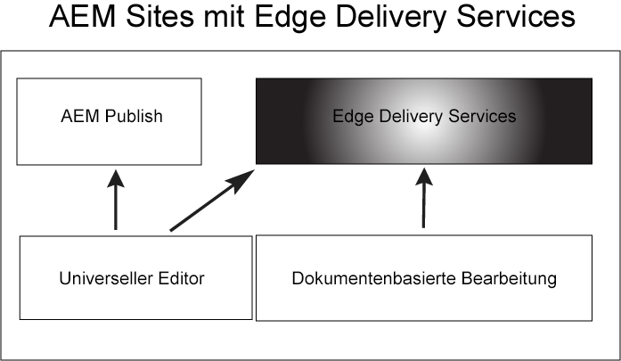

# Erste Schritte mit Edge Delivery Services {#getstart-edge}

Mit Edge Delivery Services bietet AEM außergewöhnliche Erlebnisse, die Interaktionen und Konversionen fördern. AEM bietet dazu wirkungsvolle Erlebnisse, die schnell erstellt und weiterentwickelt werden können. Es handelt sich dabei um einen zusammenstellbaren Satz von Diensten, die eine schnelle Entwicklungsumgebung ermöglichen, in der Autoren schnell aktualisieren und veröffentlichen können und neue Sites schnell gestartet werden. So können Sie mit Edge Delivery Services die Konversion verbessern, Kosten reduzieren und extreme Content Velocity erzielen.

Durch Nutzung der Edge-Bereitstellung können Sie:

* Erstellen Sie schnelle Sites mit einem perfekten Lighthouse-Score und überwachen Sie Ihre Site-Leistung kontinuierlich durch reale Benutzerüberwachung (RUM).
* Erhöhen Sie die Autoreneffizienz durch Entkopplung von Inhaltsquellen. Standardmäßig können Sie sowohl AEM Authoring als auch dokumentbasiertes Authoring verwenden. Daher können Sie mit mehreren Inhaltsquellen auf derselben Website arbeiten.
* Verwenden Sie ein integriertes Experimentierungs-Framework, das die schnelle Testerstellung, Ausführung ohne Leistungseinbußen und schnelle Freigabe für die Produktion eines Testgewinners ermöglicht.

## Funktionsweise der Edge-Bereitstellung {#edge-works}

Das folgende Diagramm zeigt, wie Sie Inhalte in Microsoft Word (dokumentbasierte Bearbeitung) bearbeiten und in der Edge-Bereitstellung veröffentlichen können. Es zeigt auch die traditionelle AEM Veröffentlichungsmethode mit den verschiedenen Editoren.

Die Edge-Bereitstellung ist ein zusammenstellbarer Satz von Diensten, der eine hohe Flexibilität bei der Erstellung von Inhalten auf Ihrer Website ermöglicht. Wie bereits erwähnt, können Sie beide [AEM Authoring](https://experienceleague.adobe.com/docs/experience-manager-cloud-service/content/sites/authoring/getting-started/concepts.html) und [Dokumentenbasiertes Authoring](https://www.hlx.live/docs/authoring).

Sie können beispielsweise Inhalte direkt aus Microsoft Word- oder Google-Dokumenten verwenden. Das bedeutet, dass Dokumente aus diesen Quellen Seiten auf Ihrer Website werden können. Darüber hinaus können Überschriften, Listen, Bilder und Schriftelemente von der ursprünglichen Quelle auf die Website übertragen werden. Der neue Inhalt wird sofort ohne Neuerstellungsprozess hinzugefügt.

Die Edge-Bereitstellung nutzt GitHub, damit Kunden Code direkt über ihr GitHub-Repository verwalten und bereitstellen können. Sie können beispielsweise Inhalte entweder in Google Docs oder Microsoft Word schreiben und die Funktionalität Ihrer Site kann mithilfe von CSS und JavaScript in GitHub entwickelt werden. Wenn Sie bereit sind, können Sie die Sidekick-Browsererweiterung verwenden, um Inhaltsaktualisierungen in der Vorschau anzuzeigen und zu veröffentlichen.

Weitere Informationen:

* Weitere Informationen zu den ersten Schritten mit der Edge-Bereitstellung finden Sie unter [Build](https://www.hlx.live/docs/#build) Abschnitt der Edge-Versanddokumentation.
* Informationen zum Erstellen und Veröffentlichen von Inhalten mithilfe der Edge-Bereitstellung finden Sie in der [Abschnitt &quot;Veröffentlichen&quot;](https://www.hlx.live/docs/authoring).
* Informationen dazu, wie Sie Ihr Website-Projekt ordnungsgemäß starten, finden Sie unter [Launch-Abschnitt](https://www.hlx.live/docs/#launch).

## Edge Delivery Services und andere Adobe Experience Cloud-Produkte {#edge-other-products}

Edge Delivery Services sind Teil von Adobe Experience Manager und als solche können auch Edge-Bereitstellungs- und AEM-Sites in derselben Domäne vorhanden sein. Dies ist ein häufiger Anwendungsfall für größere Websites. Darüber hinaus können Inhalte aus der Edge-Bereitstellung einfach in Ihren AEM Sites-Seiten verwendet werden und umgekehrt.

Sie können Edge Delivery Services auch in Kombination mit Adobe Target, Analytics und Launch verwenden.

## Zugriff auf Edge Delivery Services erhalten {#getting-access}

Die ersten Schritte mit Edge Delivery Services sind einfach. Beginnen Sie mit den Anweisungen [Erste Schritte - Tutorial für Entwickler](https://www.hlx.live/developer/tutorial).

## Abrufen der Hilfe von Adobe {#adobe-gethelp}

Sie können über Ihren bereitgestellten Kanal zur Produktzusammenarbeit mit Adobe-Produktteams interagieren (weitere Informationen finden Sie unten), um Fragen zur Produktnutzung oder zu Best Practices zu beantworten. Bitte beachten Sie, dass den Unterhaltungen über den Kanal für die Produktzusammenarbeit keine Service Level Terme (SLT) zugeordnet sind. Wenn ein Produktproblem zusätzliche Untersuchungen und Fehlerbehebungen erfordert und Antwort-SLTs erfüllen muss, können Sie ein Support-Ticket senden, das auf Folgendes folgt: [Support-Prozess](https://experienceleague.adobe.com/?lang=de&amp;support-tab=home#support).

Adobe bietet drei Kanäle, um Ihnen bei Edge Delivery Services zu helfen:

* Interaktion mit Community-Ressourcen für allgemeine Anfragen
* Zugriff auf Ihren Produktkollaborationskanal für bestimmte Fragen
* Support-Ticket zur Lösung wichtiger und kritischer Probleme protokollieren

### Auf Community-Ressourcen zugreifen {#community-resource}

Adobe verfügt über zwei Community-Ressourcen, die Ihnen bei der Edge-Bereitstellung helfen. [Experience League Community](https://adobe.ly/3Q6kTKl) und [Dispatch-Kanal](https://discord.gg/aem-live).

### Zugriff auf Ihren Produktkollaborationskanal {#collab-channel}

Angesichts des Nutzens des direkten Kommunikationskanals mit den Kunden werden alle AEM Kunden beim Start einen Slack-Kanal einrichten, um Geschwindigkeit, wichtige Aktualisierungen und skalierte Berichte zur Erlebnisqualität zu erhalten. Sie erhalten eine Einladung von Adobe, einem unternehmensspezifischen Slack-Kanal beizutreten.

Weitere Informationen finden Sie unter [Verwenden des Slack Bots](https://www.hlx.live/docs/slack) für weitere Details.

### Protokollieren eines Support-Tickets {#support-ticket}

Schritte zum Protokollieren eines Support-Tickets über die Admin Console:

1. Hinzufügen **Edge-Bereitstellung** im Titel des Tickets.
2. Geben Sie in der Beschreibung bitte die folgenden Details an:

   * URL der Live-Website. Beispiel: [www.mydomain.com].
   * URL der Ursprungs-Website (.hlx-URL).

## Wie geht es weiter {#whats-next}

Lesen Sie zunächst den nächsten Artikel: [Verwenden von Edge Delivery Services](/help/edge/using.md).

## Nützliche Ressourcen {#useful-resources}

Weitere Informationen zu Edge Delivery Services finden Sie im Abschnitt [Dokumentation zu Edge Delivery Services](https://www.hlx.live/docs/).
