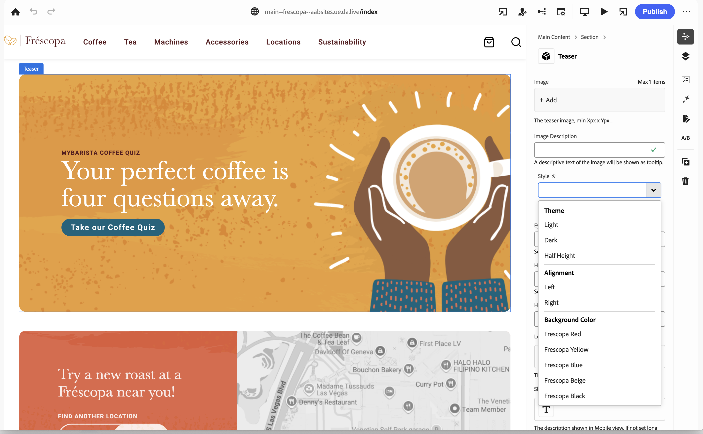

# Überblick über Edge Delivery Services {#edge-delivery-services}

Mit Edge Delivery Services bietet AEM außergewöhnliche Erlebnisse, die Interaktionen und Konversionen fördern. Zu diesem Zweck liefert AEM wirkungsvolle Erlebnisse, die schnell erstellt und weiterentwickelt werden können. Edge Delivery Services ist ein zusammenstellbarer Satz von Diensten, der eine schnelle Entwicklungsumgebung ermöglicht, in der Autorinnen und Autoren schnell aktualisieren und veröffentlichen können und neue Sites schnell live geschaltet werden können. Sie können mit Edge Delivery Services die Konversion verbessern, Kosten reduzieren und extreme Inhaltsgeschwindigkeiten erzielen.

Mithilfe von Edge Delivery Services können Sie:

* schnell Sites mit einem perfekten Lighthouse-Score erstellen und Ihre Site-Leistung kontinuierlich durch Real Use Monitoring (RUM) überwachen.
* die Autoreneffizienz durch Entkopplung von Inhaltsquellen erhöhen. Standardmäßig können Sie sowohl WYSIWYG als auch document-basiertes Authoring verwenden. Sie können also mit mehreren Inhaltsquellen an derselben Website arbeiten.
* ein integriertes Experimentierungs-Framework verwenden, das die schnelle Testerstellung, Ausführung ohne Leistungseinbußen und schnelle Freigabe für die Ermittlung eines Testgewinners ermöglicht.

## Agile Reaktion auf Geschäftsanforderungen {#agile-reaction}

Als langjähriger anerkannter Branchenführer weiß Adobe, wie wichtig es ist, schnell neue, aussagekräftige Inhalte für Ihre Kunden erstellen und veröffentlichen zu können. Auf dem Markt wurden die gemeinsamen Herausforderungen bei der Skalierung der Inhaltserstellung deutlich gemacht, darunter:

1. **Die Nachfrage nach Inhalten steigt weiter.**
   * Es ist erforderlich, neue Inhaltsautoren zu entsperren, um diese Anforderung zu erfüllen.
   * Der Inhaltserstellungsprozess muss geschäftlich effektiv skaliert werden.
   * Autoren müssen schnell auf sich ändernde Trends reagieren können.
1. **Es ist ein Bedarf an kanalübergreifenden Inhalten.**
   * Die Layout-Steuerung ist unabhängig von der Inhaltsbereitstellung erforderlich.
   * Autoren müssen die Möglichkeit haben, das Inhaltslayout direkt zu ändern.
1. **Der Druck wächst, um den ROI bei Inhalten zu steigern.**
   * Autoren selbst benötigen die Möglichkeit, die von ihnen erstellten Inhalte zu optimieren.

Diese Trends haben sich in der Branche bewährt. Die individuellen Anforderungen variieren jedoch unweigerlich von Projekt zu Projekt. Das Ziel jedes Edge Delivery Services-Projekts besteht darin, die Lösung zu finden, die für Ihre Benutzer funktioniert.

1. **Fokus auf Wert anstelle von Funktionen.** - Bestimmen Sie den am besten optimierten Arbeitsablauf für Ihre Autoren, anstatt sich in AEM umfangreichen Funktionssatz zu verlieren.
1. **Nutzen Sie AEM Flexibilität.** - AEM Funktionen müssen nicht in einem Vakuum verwendet werden. Verwenden Sie die Funktionen, die Sie für jeden Anwendungsfall benötigen.
1. **Nutzen Sie das Know-how Ihres Autors.** - Nehmen Sie echte Inhaltsautoren von Anfang an in das Projekt auf, um sicherzustellen, dass Sie den benötigten Wert bereitstellen, indem Sie die Funktionen implementieren, die sinnvoll sind.

Indem Sie sich auf die Wertschöpfung Ihrer Autoren konzentrieren, kann Ihr Edge Delivery Services-Projekt den modernen Anforderungen der Branche gerecht werden, denen sich Ihre Inhaltsersteller gegenübersehen, und Inhalte bereitstellen, die Ihre Kunden schnell begeistern.

## Flexible Authoring-Tools für Ihre Inhaltsersteller {#overview}

Edge Delivery Services ist ein zusammenstellbarer Satz von Diensten, der eine hohe Flexibilität bei der Erstellung von Inhalten auf Ihrer Website ermöglicht. Sie können sowohl das [AEM-Content-Management](https://experienceleague.adobe.com/docs/experience-manager-cloud-service/content/sites/authoring/getting-started/concepts.html?lang=de) und WYSIWYG-Authoring mit dem [universellen Editor](/help/sites-cloud/authoring/universal-editor/authoring.md) als auch das [dokumentenbasierte Authoring](https://www.aem.live/docs/authoring) verwenden.

Das folgende Diagramm zeigt, wie Sie Inhalte in Microsoft Word (dokumentenbasiertes Authoring) bearbeiten und mit Edge Delivery Services veröffentlichen können. Es zeigt auch die WYSIWYG-Bearbeitung mit dem universellen Editor.

Edge Delivery Services nutzt GitHub, damit Sie Code direkt über ihr GitHub-Repository verwalten und bereitstellen können. Neuer Inhalt wird sofort ohne Neuerstellungsprozess hinzugefügt.

### Dokumentenbasiertes Authoring {#document-based}

Beim dokumentbasierten Authoring können Sie Inhalte direkt aus Microsoft Word- oder Google-Dokumenten verwenden, sodass diese Quellen zu Seiten auf Ihrer Website werden. Überschriften, Listen, Bilder und Schriftelemente können von der ursprünglichen Quelle auf die Website übertragen werden.

* Beim dokumentbasierten Authoring ist jeder Marketing-Experte in der Lage, Inhalte schnell mit bekannten Authoring-Tools (Microsoft Word, Google Docs usw.) zu erstellen.
* Die Inhaltserstellung wird optimiert, indem das Authoring, Überprüfen und Veröffentlichen direkt in den Quelldokumenten ermöglicht wird.
* Da bekannte Tools verwendet werden, ist für Inhaltsautoren kein Onboarding erforderlich, wodurch die Geschwindigkeit des Inhalts erhöht wird.
* Die Funktionalität Ihrer Site kann mithilfe von CSS und JavaScript in GitHub entwickelt werden.

Weitere Informationen finden Sie in der dokumentbasierten Authoring-Dokumentation:

* Weitere Informationen zu den ersten Schritten mit Edge Delivery finden Sie im Abschnitt [Build](https://www.aem.live/docs/#build).
* Informationen zum Erstellen und Veröffentlichen von Inhalten mithilfe von Edge Delivery finden Sie im Abschnitt [Veröffentlichen](https://www.aem.live/docs/authoring).
* Informationen dazu, wie Sie Ihr Website-Projekt ordnungsgemäß starten, finden Sie im Abschnitt [Launch](https://www.aem.live/docs/#launch).

### WYSIWYG Authoring {#wysiwyg-authoring}

Das WYSIWYG-Authoring (What-you-see-is-what-you-get) nutzt den universellen Editor, einen anpassbaren Ort aus einer Hand, um Inhalte live und kontextbezogen mit einer visuellen Vorschau zu bearbeiten.

* Mit WYSIWYG-Authoring steigern Sie die Autoreneffizienz, egal ob Headless oder Headful.
* Sie können AEM umfassenden Content-Management-Funktionen nutzen, einschließlich Workflow und Governance.
* Nutzen Sie zahlreiche Erweiterungspunkte, um Ihre eigenen Prozesse und Integrationen zu unterstützen.
* Die Funktionalität Ihrer Site kann mithilfe von CSS und JavaScript in GitHub entwickelt werden.

Weitere Informationen finden Sie in der WYSIWYG-Authoring-Dokumentation:

* Einen Überblick über den universellen Editor und das WYSIWYG-Authoring finden Sie im Dokument [WYSIWYG Content Authoring für Edge Delivery Services](/help/edge/wysiwyg-authoring/authoring.md) .
* Eine Entwicklerübersicht finden Sie im Dokument [Erste Schritte für Entwickler bei der WYSIWYG-Bearbeitung mit Edge Delivery Services](/help/edge/wysiwyg-authoring/edge-dev-getting-started.md) .

### Auswählen Ihrer Authoring-Methode {#authoring-method}

AEM Flexibilität stellt sicher, dass Ihre Authoring-Anforderungen abgedeckt werden. Mit Adobe können Sie bestimmen, welche Methode (oder Methoden) Ihren Anforderungen am besten entspricht.

* Nehmen Sie stets Ihre Inhaltsautoren in die Entscheidung auf.
* Es können mehrere Authoring-Methoden implementiert werden.
* Sie können Ihre Authoring-Methode jederzeit nach dem Tatsachen ändern.
* Sie dürfen nicht vor der Implementierung entscheiden, sondern im Rahmen der Implementierung.

Weitere Informationen finden Sie im Dokument [Auswählen einer Bearbeitungsmethode](authoring-methods.md) .

## Edge Delivery Services und andere Adobe Experience Cloud-Produkte {#edge-other-products}

Edge Delivery Services sind Teil von Adobe Experience Manager, und insofern können sowohl Edge Delivery Services- als auch AEM-Sites auf derselben Domain vorhanden sein, was bei größeren Websites häufig der Fall ist. Darüber hinaus können Inhalte aus Edge Delivery Services einfach in Ihre AEM Sites-Seiten aufgenommen werden und umgekehrt.

Im [Erste-Schritte-Handbuch für Entwickelnde zum WYSIWYG-Authoring mit Edge Delivery Services](/help/edge/wysiwyg-authoring/edge-dev-getting-started.md) erfahren Sie, wie Sie Ihr eigenes Projekt mit AEM und Edge Delivery Services erstellen.

Sie können Edge Delivery Services auch mit [Adobe Target](https://www.aem.live/developer/target-integration), [Real Use Monitoring (RUM)](https://www.aem.live/developer/rum) zur Diagnose der Nutzung und Performance Ihrer Websites sowie mit [Adobe Experience Platform Launch](https://experienceleague.adobe.com/de/docs/experience-platform/tags/home) nutzen.

## Erste Schritte mit Edge Delivery Services {#getting-started}

Die ersten Schritte mit Edge Delivery Services sind einfach, wenn Sie das [Entwicklertutorial „Erste Schritte“](https://www.aem.live/developer/tutorial) befolgen.

## So erhalten Sie Hilfe von Adobe {#getting-help}

Adobe bietet drei Kanäle, um Ihnen mit Edge Delivery Services zu helfen:

* Interaktion mit [Community-Ressourcen](#community-resources) für allgemeine Anfragen,
* Zugriff auf Ihren [Kanal für die Produktzusammenarbeit](#collaboration-channel) für spezifische Fragen,
* [Einreichen eines Support-Tickets](#support-ticket) zur Lösung wichtiger und kritischer Probleme.

### Zugreifen auf Community-Ressourcen {#community-resources}

Adobe setzt sich dafür ein, Ihnen die bestmögliche Community-Interaktion und -Unterstützung für Edge Delivery Services sowie das WYSIWYG- und dokumentenbasierte Authoring zu bieten.

* Beteiligen Sie sich an der [Experience League-Community](https://adobe.ly/3Q6kTKl), um Fragen zu stellen, Feedback zu teilen, Diskussionen einzuleiten, Unterstützung von Adobe- und AEM-Fachleuten und -Champions zu erhalten und in Echtzeit mit Gleichgesinnten in Kontakt zu treten. 
* Schließen Sie sich unserem [Discord-Kanal](https://discord.gg/aem-live) an, einer lockereren Plattform für Echtzeitinteraktionen und schnellen Ideenaustausch.

### Zugriff auf Ihren Kanal für die Produktzusammenarbeit {#collaboration-channel}

Angesichts des Nutzens des Kanals zur direkten Kommunikation mit Benutzenden wird für alle AEM-Projekte beim Start ein Slack-Kanal eingerichtet, um für eine bessere Geschwindigkeit zu sorgen sowie wichtige Aktualisierungen und skalierte Berichte zur Erlebnisqualität zu ermöglichen. Sie erhalten eine Einladung von Adobe, einem speziell für Ihre Organisation eingerichteten Slack-Kanal beizutreten.

Weitere Informationen finden Sie im Dokument [Verwenden des Slack-Bots](https://www.aem.live/docs/slack).

Sie können über Ihren bereitgestellten Kanal zur Produktzusammenarbeit mit Adobe-Produkt-Teams interagieren, um Antworten bezüglich der Produktnutzung oder Best Practices zu erhalten. Für Konversationen über den Kanal für die Produktzusammenarbeit gelten keine Vorgaben für Service-Levels (SLTs).

### Einreichen eines Support-Tickets {#support-ticket}

Wenn ein Produktproblem zusätzliche Untersuchungen und Fehlerbehebungen erfordert und Antwort-SLTs erfüllen muss, können Sie ein Support-Ticket nach dem folgenden Verfahren über die Admin Console einreichen:

1. [Folgen Sie dem standardmäßigen Support-Prozess](https://experienceleague.adobe.com/?support-tab=home?lang=de#support) und erstellen Sie ein Ticket.
1. Fügen Sie **Edge Delivery** zum Titel des Tickets hinzu.
1. Geben Sie in der Beschreibung zusätzlich zur Problembeschreibung die folgenden Details an:

   * URL der Live-Website. Beispiel: `www.mydomain.com`.
   * URL der Ursprungs-Website (`.hlx`-URL).

## Wie geht es weiter {#whats-next}

Lesen Sie zunächst den Artikel: [Verwenden von Edge Delivery Services](/help/edge/using.md).
