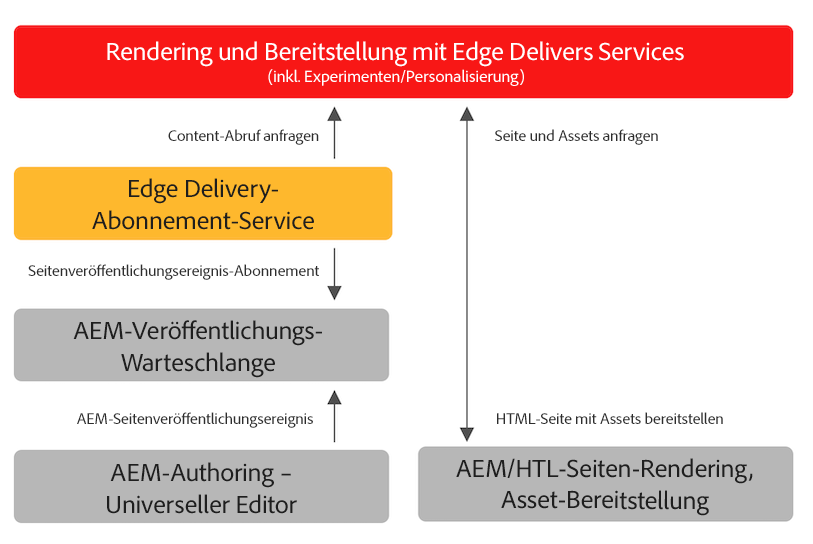

# Veröffentlichen von Inhalten für Edge Delivery Services {#publishing-edge}

Mit Edge Delivery Services ist die Veröffentlichung von Inhalten unabhängig von Ihrer Inhaltsquelle nahtlos:

* Dokumentbasierter Inhalt - Bitte lesen Sie [Abschnitt &quot;Veröffentlichen&quot;](https://www.aem.live/docs/#publish) der Edge Delivery Services-Dokumentation.
* AEM Inhalt - Bitte lesen Sie die unten stehenden Details.

## Veröffentlichungsfluss aus AEM {#publishing-flow}

Wenn Sie den universellen Editor verwenden, um AEM Inhalt zu erstellen, ist die Veröffentlichung so einfach wie das Klicken auf **Veröffentlichen** im universellen Editor. Lesen Sie das Dokument . [Veröffentlichen von Inhalten mit dem universellen Editor](/help/implementing/universal-editor/publishing.md)

Der Informationsfluss bei der Veröffentlichung sieht wie folgt aus. Sobald der Autor die Veröffentlichung startet, ist dieser Fluss automatisch und wird hier zu Informationszwecken dargestellt.

1. Der Inhaltsautor veröffentlicht AEM Inhalte im universellen Editor.
1. Ein Veröffentlichungsereignis wird an die Adobe-Pipeline-Warteschlange gesendet.
1. Der Edge Delivery Publish-Dienst leitet die relevanten Ereignisse an die Edge Delivery Admin-API weiter.
1. Edge Delivery ruft semantische HTML von AEM Author ab und erfasst sie.
1. AEM wird mit dem Veröffentlichungsstatus aktualisiert.

## Erste Schritte {#how-to-get-started}

Wenden Sie sich an Ihren Adobe-Support-Mitarbeiter, um Zugriff auf diese Funktion zu erhalten.
