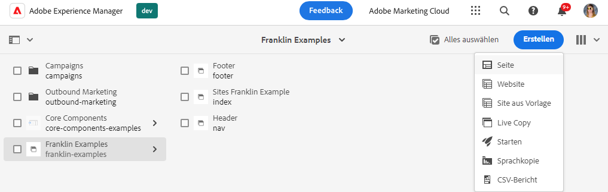
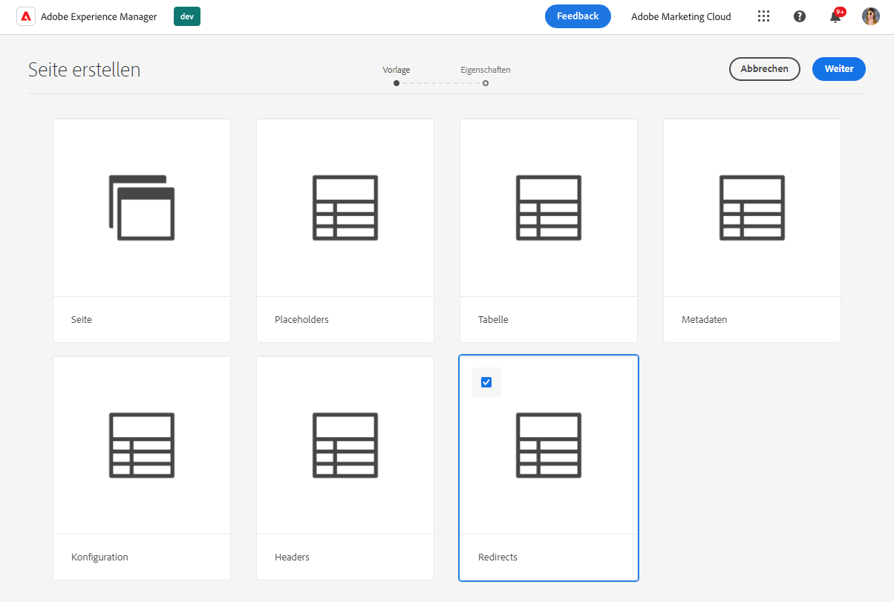
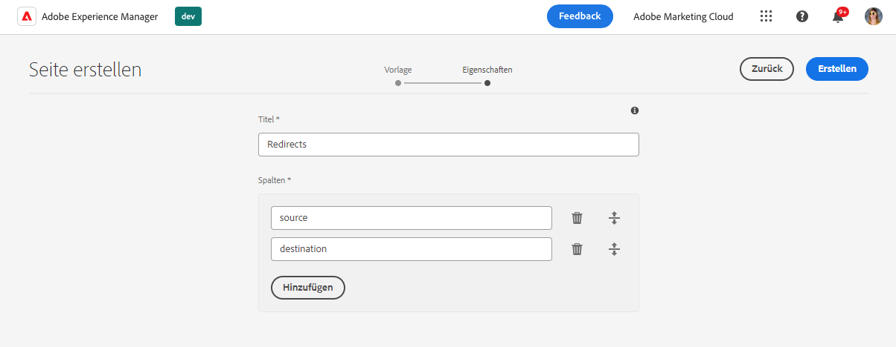
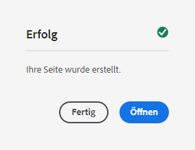
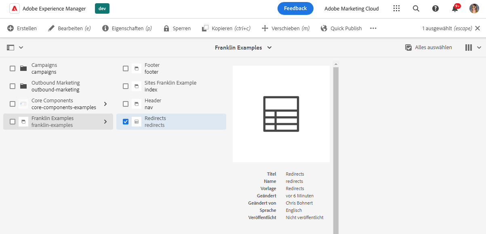
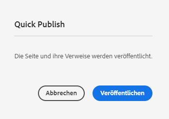
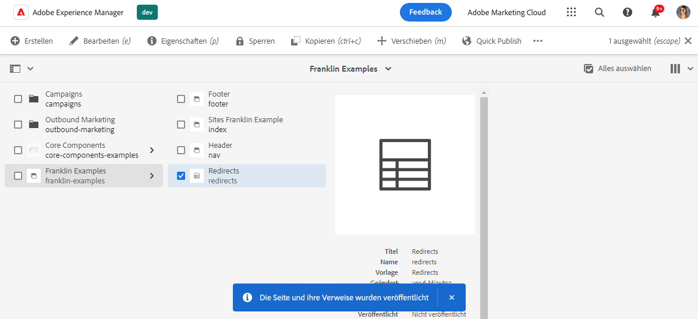
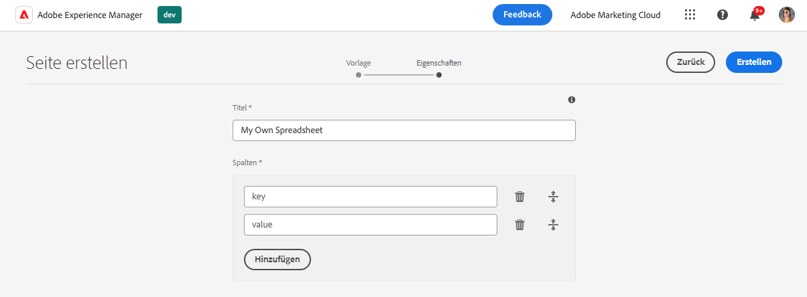

# Verwenden von Tabellen zur Verwaltung von Tabellendaten {#tabular-data}

Erfahren Sie, wie Sie mit Tabellen Tabellendaten für verschiedene Werte verwalten können, z. B. Metadaten und Umleitungen für Ihre AEM mit der Edge Delivery Services-Site.

{{aem-authoring-edge-early-access}}

## Anwendungsfälle {#use-cases}

Für alle AEM mit der Edge Delivery Services-Site müssen Listen mit Tabellendaten wie für Schlüssel-Wert-Mappings verwaltet werden. Dabei kann es sich um Listen mit vielen verschiedenen Werten handeln, z. B. Metadaten und Umleitungen. Mit den Edge Deliver Services können Sie solche tabellarischen Listen mithilfe eines intuitiven Tools verwalten: der Tabelle. AEM übersetzt diese Tabellen in JSON-Dateien, die von Ihrer Website oder Webanwendung einfach genutzt werden können.

Häufige Anwendungsfälle umfassen:

* [Platzhalter](/help/edge/docs/placeholders.md)
* [Metadaten](/help/edge/docs/bulk-metadata.md)
* [Kopfzeilen](/help/edge/docs/custom-headers.md)
* [Umleitungen](/help/edge/docs/redirects.md)
* [Konfigurationen](/help/edge/docs/setup-byo-cdn-push-invalidation.md) z. B. für CND-Setups

Darüber hinaus können Sie [Tabellen erstellen](#own-spreadsheet) einer beliebigen Struktur, um Zuordnungen für Ihre eigenen Zwecke zu speichern.

In diesem Dokument wird anhand des Beispiels für Umleitungen veranschaulicht, wie solche Tabellen erstellt werden. Einzelheiten zu den einzelnen Anwendungsfällen finden Sie in den zuvor verknüpften Themen in der Edge Delivery Services-Dokumentation .

>[!TIP]
>
>Weitere Informationen zur allgemeinen Funktionsweise von Arbeitsblättern mit Edge Delivery Services finden Sie im Dokument [Tabellen und JSON.](/help/edge/developer/spreadsheets.md)

>[!TIP]
>
>Tabellen sollten nur zur Verwaltung von Tabellendaten verwendet werden. Zum Speichern strukturierter Daten: [Sehen Sie sich AEM Headless-Funktionen an.](/help/headless/introduction.md)

## Voraussetzungen {#prerequisites}

Um Zuordnungen mithilfe von Tabellen in Ihrem AEM mit Edge Delivery Services-Projekt erstellen zu können, müssen Sie Ihre Site mit der neuesten Site-Vorlage erstellt haben.

Lesen Sie das Dokument . [Erste Schritte für Entwickler für AEM Authoring mit Edge Delivery Services](/help/edge/edge-dev-getting-started.md) für weitere Informationen.

## Erstellen einer Tabelle {#spreadsheet}

In diesem Beispiel erstellen Sie eine Tabelle, um Umleitungen für Ihre AEM mit der Edge Delivery Services-Site zu verwalten. Die gleichen Schritte gelten für [andere Tabellenarten](#other) die Sie erstellen möchten.

1. Melden Sie sich bei Ihrer AEM as a Cloud Service Authoring-Instanz an, navigieren Sie zum **Sites** und navigieren Sie zum Stamm der Site, für die eine Tabelle erforderlich ist. Tippen oder klicken **Erstellen** -> **Seite**.

   

1. Im **Vorlage** auf der Registerkarte des Assistenten zum Erstellen einer Seite tippen oder klicken Sie auf die **Umleitungen** Vorlage zum Auswählen und Tippen oder Klicken **Nächste**.

   

1. Die **Eigenschaften** -Registerkarte des Assistenten enthält die Standardwerte für die Umleitungs-Tabelle. Tippen oder klicken Sie auf **Erstellen**.

   * **Titel** - Lassen Sie diesen Wert unverändert.
   * **Spalten** - Die für Umleitungen erforderlichen Mindestspalten werden vorausgefüllt.
      * **source** - Die umzuleitende Seite
      * **Ziel** - Die Seite, zu der umgeleitet werden soll

   

1. Im **Erfolg** Dialogfeld, tippen oder klicken Sie **Öffnen**.

   

1. Eine neue Registerkarte wird geöffnet, wobei das Arbeitsblatt in einen Editor mit vordefiniertem **source** und **Ziel** Spalten. Um Ihre Umleitungen zu definieren, tippen oder klicken Sie auf die leere Zeile der **source** Spalte. Änderungen werden automatisch gespeichert, wenn Sie das Arbeitsblatt bearbeiten.

   

   * Die **source** relativ zur Domäne Ihrer Website ist, sodass nur der relative Pfad enthalten ist.
   * Die **Ziel** kann entweder eine vollständig qualifizierte URL sein, wenn Sie zu einer anderen Website umleiten, oder es kann sich um einen relativen Pfad handeln, wenn Sie innerhalb Ihrer eigenen Website eine Umleitung durchführen.
   * Verwenden Sie die Tabulatortaste, um den Fokus zur nächsten Zelle zu verschieben.
   * Der Editor fügt dem Arbeitsblatt bei Bedarf neue Zeilen hinzu.
   * Verwenden Sie zum Löschen oder Verschieben einer Zeile die **Löschen** -Symbol am Ende jeder Zeile und die Ziehpunkte am Anfang jeder Zeile.

1. Wenn Sie mit der Definition Ihrer Umleitungen fertig sind, schließen Sie die Registerkarte und kehren Sie zur **Sites** Konsole.

1. Tippen oder klicken Sie auf die Umleitungstabelle, die Sie in der Konsole erstellt haben, und tippen oder klicken Sie auf **Quick Publish** in der Aktionsleiste, um die Tabelle zu veröffentlichen.

   

1. Im **Quick Publish** Dialogfeld, tippen oder klicken Sie **Veröffentlichen**.

   

1. Ein Banner bestätigt die Veröffentlichung.

   

Die Umleitungs-Tabelle ist jetzt veröffentlicht und öffentlich zugänglich.

## Aktualisieren von paths.json {#paths-json}

Damit AEM die Daten in Ihrer Tabelle nutzen kann, müssen Sie zusätzlich die `paths.json` -Datei Ihres Projekts.

1. Öffnen Sie den Stammordner Ihres Projekts in GitHub.

1. Tippen oder klicken Sie auf `paths.json` -Datei, um ihre Details zu öffnen, und dann **Bearbeiten** Symbol.

   

1. Fügen Sie eine Zeile hinzu, um Ihr neues Arbeitsblatt einem `redirects.json` Ressource.

   ```json
   {
     "mappings": [
      "/content/<site-name>/:/",
      "/content/<site-name>/redirects:/redirects.json"
     ]
   }
   ```

1. Klicks **Zusage von Änderungen...** , um die Änderungen in `main`.

   * Bestätigen Sie entweder `main` oder erstellen Sie eine Pull-Anforderung gemäß Ihrem Prozess.

Sobald sich `paths.json` zusammengeführt werden, sind die Umleitungen für Ihre Site live.

## Andere Tabellenarten {#other}

Nachdem Sie nun wissen, wie Sie eine Umleitungs-Tabelle erstellen, können Sie einen beliebigen anderen Standardtyp für Tabellen erstellen:

* Platzhalter
* Metadaten
* Kopfzeilen
* Konfiguration

Führen Sie einfach die gleichen Schritte in den Abschnitten aus. [Tabelle erstellen](#spreadsheet) und [Aktualisieren von paths.json](#paths-json) und wählen Sie die entsprechende Vorlage aus und aktualisieren Sie die `paths.json` Datei entsprechend.

Darüber hinaus können Sie [Erstellen einer eigenen Tabelle](#own-spreadsheet) mit beliebigen Spalten für Ihre eigene Verwendung.

>[!NOTE]
>
>Es ist nicht erforderlich, eine Tabelle zu erstellen, um die Indizierung für AEM, die mit Edge Delivery Services-Projekten as a Cloud Service ist, zu verwalten.
>
>Wenn Sie eigene Indizes erstellen möchten, [folgen Sie dieser Dokumentation](https://www.aem.live/developer/indexing#setting-up-more-index-configurations) , um `helix-query.yaml` -Datei.

## Erstellen einer eigenen Tabelle {#own-spreadsheet}

1. Führen Sie dieselben Schritte im Abschnitt aus. [Erstellen Sie eine Tabelle.](#spreadsheet)

1. Wählen Sie bei der Auswahl der Vorlage **Tabellenblatt**.

1. Im **Eigenschaften** im Assistenten können Sie eigene Spalten hinzufügen.

   

   * Im **Spalten** Abschnitt, tippen oder klicken Sie **Hinzufügen** um eine neue Spalte hinzuzufügen.
   * Geben Sie einen Namen für die Spalte an.
   * Entfernen oder reorganisieren Sie die Spalten mit der **Löschen** und ziehen Sie Ziehpunkte.

1. Erstellen Sie das Arbeitsblatt und veröffentlichen Sie es gemäß den Anweisungen für das Umleitungs-Arbeitsblatt.

1. Fügen Sie der `paths.json` -Datei gemäß den Anweisungen für die Umleitungs-Tabelle.
