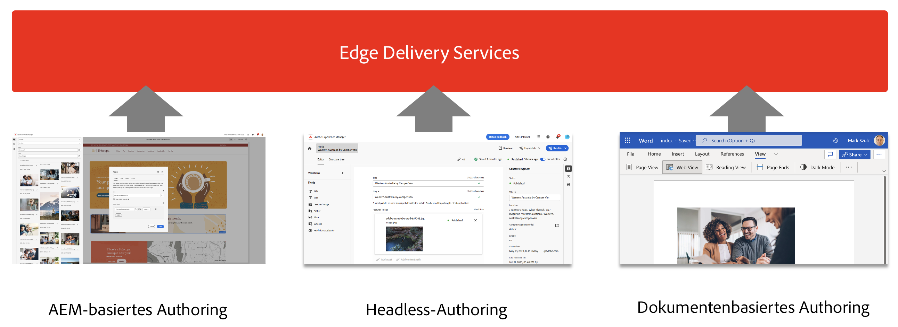
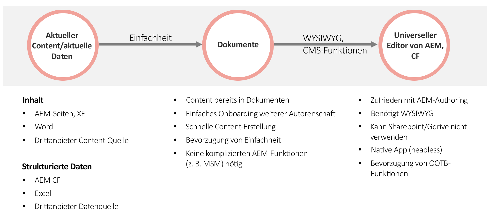

# Verwenden von Edge Delivery Services mit AEM {#using-edge}

Edge Delivery Services ist von der Inhaltsquelle entkoppelt und kann Inhalte aus verschiedenen Inhaltsquellen aufnehmen. Dies bedeutet, dass Sie mit mehreren Inhaltsquellen auf derselben Website unabhängig von der gewählten Quelle mit einer nahtlosen und optimierten Veröffentlichung arbeiten können.

Mit Edge Delivery Services können Sie schnelle Entwicklungsumgebungen erstellen, in denen Autorinnen und Autoren Inhalte schnell aktualisieren und veröffentlichen können und neue Sites schnell gestartet werden können. Es vergehen nur ein paar Sekunden von der Bearbeitung bis zur Anzeige des Inhalts im Internet.

Die Aufnahme aus mehreren Inhaltsquellen bietet den Benutzenden maximale Flexibilität. Adobe bietet Anleitungen zur Auswahl der Inhaltsquellen, die für Ihr Projekt am besten geeignet sind.

Es gibt Fälle, in denen die Inhaltsquelle vordefiniert ist oder aus anderen Gründen nicht flexibel ist (z. B. kann das Projekt nicht Sharepoint oder Google Drive verwenden). In vielen Fällen ist das Tool jedoch nicht vorbestimmt und es gibt mehrere Auswahlmöglichkeiten.

Das Leitprinzip von Adobe ist Einfachheit. Beginnen Sie mit dokumentbasiertem Authoring und fügen Sie bei Bedarf Komplexität hinzu. Wenn ein Tool-Wechsel erforderlich ist, deckt die Integration der Edge Delivery Services von AEM die Migration von Inhalten ab.

## Authoring {#authoring-edge}

Mit Edge Delivery Services ist das Authoring einfach, schnell und flexibel. Sie können wählen, ob Sie das dokumentenbasierte Authoring oder das WYSIWYG-Authoring mit dem universellen Editor verwenden möchten.

Weitere Informationen finden Sie im Dokument [Authoring-Inhalte für Edge Delivery Services](/help/edge/wysiwyg-authoring/authoring.md).

## Veröffentlichung {#publishing-edge}

Mit Edge Delivery Services erfolgt die Veröffentlichung von Inhalten unabhängig von Ihrer Inhaltsquelle nahtlos.

Weitere Informationen finden Sie im Dokument [Veröffentlichung von Inhalten für Edge Delivery Services](/help/edge/wysiwyg-authoring/publishing.md).

## Entwickeln {#developing-edge}

Edge Delivery Services basiert auf einem Bausteinkonzept. AEM verfügt über eine umfassende Bibliothek vordefinierter Bausteine, die entsprechend Ihren Projektanforderungen erweitert werden können. Der Code für Edge Delivery Services-Projekte wird in GitHub verwaltet.

Weitere Informationen finden Sie im Dokument [Erste-Schritte-Handbuch für Entwickelnde zum WYSIWYG-Authoring mit Edge Delivery Services](/help/edge/wysiwyg-authoring/edge-dev-getting-started.md).
