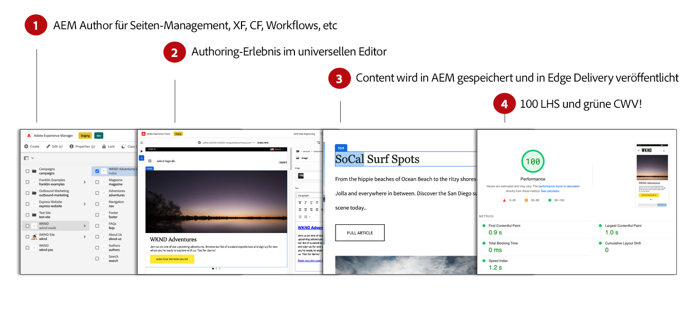
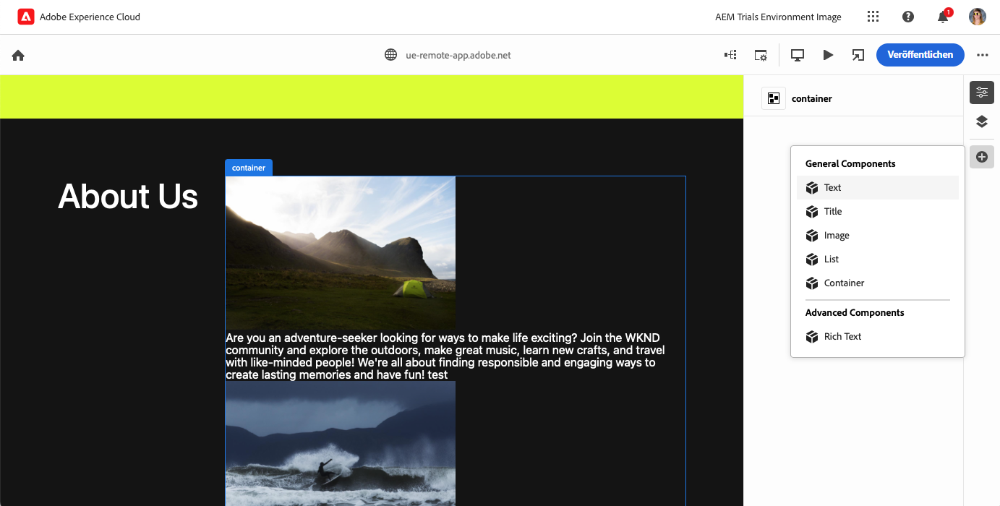

# WYSIWYG-Inhaltserstellung für Edge Delivery Services {#authoring-edge}

Mit Edge Delivery Services ist das Authoring einfach, schnell und flexibel. Sie haben zwei Optionen zum Erstellen von Inhalten für Edge Delivery Services:

* [Universeller Editor](#universal-editor) – Eine moderne WYSIWYG-Benutzeroberfläche („What you see is what you get“) für die Bearbeitung von Inhalten in AEM
* [Dokumentenbasiertes Authoring](#document-based) – wie Microsoft Word oder Google Docs

## Authoring mit dem universellen Editor {#universal-editor}

Bei der Verwendung von Edge Delivery Services mit AEM as a Cloud Service ist es die grundlegendste Tatsache zu verstehen, dass der von Ihnen erstellte Inhalt in AEM as a Cloud Service beibehalten wird.

1. [Die AEM Sites-Umgebung](/help/sites-cloud/authoring/quick-start.md) wird für das Content-Management verwendet, z. B. zum Erstellen neuer Seiten, Experience Fragments und Inhaltsfragmente.
   * Alle Funktionen von AEM sind verfügbar, wie Workflows, MSM, Übersetzung, Launches usw.
1. [Der universelle Editor](/help/sites-cloud/authoring/universal-editor/authoring.md) wird verwendet, um die in AEM verwalteten Inhalte zu erstellen.
   * Der universelle Editor bietet eine neue und moderne Benutzeroberfläche für das Content-Authoring.
   * Zum Authoring rendert AEM die HTML, schließt jedoch die Skripte, Stile, Symbole und andere Ressourcen von Edge Delivery Services mit ein.
   * Obwohl der universelle Editor verwendet wird, werden alle Änderungen in AEM persistiert.
   * Der universelle Editor ist noch nicht auf Funktionsparität mit dem AEM-Seiteneditor ausgelegt und einige AEM-Funktionen sind im universellen Editor möglicherweise nicht verfügbar.
1. Inhalte, die Sie mit dem universellen Editor erstellen und in AEM persistieren, werden in Edge Delivery Services veröffentlicht.
   * Die Inhalte bleiben in AEM gespeichert.
   * AEM rendert semantische HTML, die für die Aufnahme benötigt wird.
   * Inhalte werden mit Edge Delivery Services veröffentlicht.
1. [Edge Delivery Services](/help/edge/developer/keeping-it-100.md) gewährleisten eine 100%ige Lighthouse-Bewertung.

Bausteine sind grundlegende Komponenten einer Seite, die von Edge Delivery Services bereitgestellt wird. Autorinnen und Autoren können aus Standardbausteinen wählen, die standardmäßig von Adobe bereitgestellt werden, oder aus Bausteinen, die von Ihren Entwicklerinnen und Entwicklern für Ihr Projekt angepasst wurden.

Der universelle Editor bietet eine moderne und intuitive grafische Benutzeroberfläche für das Verfassen von Inhalten durch das Hinzufügen und Anordnen von Bausteinen.

Details zu den Bausteinen können dann im Bedienfeld „Eigenschaften“ konfiguriert werden.

Weitere Informationen zum Verfassen mit dem universellen Editor finden Sie im Dokument [Inhaltserstellung mit dem universellen Editor](/help/sites-cloud/authoring/universal-editor/authoring.md).

Lesen Sie hierzu das [Erste-Schritte-Handbuch für Entwickelnde für WYSIWYG-Authoring mit Edge Delivery Services](/help/edge/wysiwyg-authoring/edge-dev-getting-started.md), um zu erfahren, wie Sie Ihr eigenes Projekt mit AEM und Edge Delivery Services erstellen können.

## Zusätzliche Methoden für die Inhaltserstellung  {#authoring-methods}

WYSIWYG-Authoring ist ein leistungsstarkes und intuitives Tool für Inhaltsautorinnen und -autoren. Es gibt jedoch viele verschiedene Anwendungsfälle für das Authoring, weshalb AEM zusätzliche Authoring-Lösungen anbietet.

Weitere Informationen zu den von AEM angebotenen Authoring-Lösungen, einschließlich dokumentbasiertem Authoring und Headless, finden Sie im Dokument [Auswählen einer Authoring-Methode](/help/edge/authoring-methods.md).
