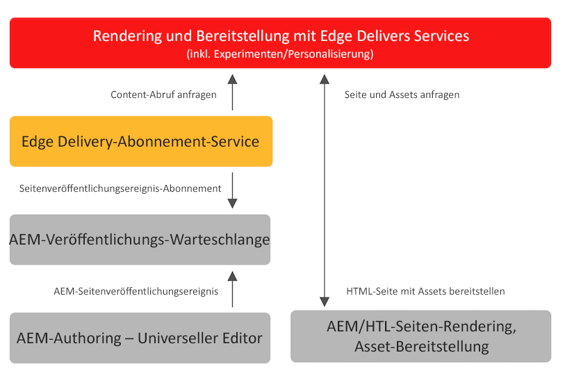

# Veröffentlichen von Inhalten für Edge Delivery Services {#publishing-edge}

Mit Edge Delivery Services erfolgt die Veröffentlichung von Inhalten unabhängig von Ihrer Inhaltsquelle nahtlos:

* Dokumentbasierter Inhalt: Weitere Informationen finden Sie in der Dokumentation zu Edge Delivery Services im Abschnitt [Veröffentlichen](/help/edge/docs/authoring.md).
* AEM-Inhalte: Weitere Informationen finden Sie nachstehend.

## Ablauf beim Veröffentlichen aus AEM {#publishing-flow}

Wenn Sie AEM-Inhalte mit dem universellen Editor erstellen, müssen Sie zum Veröffentlichen lediglich im universellen Editor auf **Veröffentlichen** klicken. Weitere Informationen finden Sie im Dokument [Veröffentlichen von Inhalten mit dem universellen Editor](/help/sites-cloud/authoring/universal-editor/publishing.md).

Der Informationsfluss beim Veröffentlichen sieht folgendermaße aus. Sobald der Autor oder die Autorin die Veröffentlichung startet, ist dieser Ablauf automatisch und wird hier zu Informationszwecken dargestellt.

>[!NOTE]
>
>Pro Tag sind maximal 5.000 Pfade zulässig, die über die Authoring-Benutzeroberfläche oder durch Workflows veröffentlicht werden. Integrationen, die zu Massenveröffentlichungen führen, werden nicht unterstützt. Wenn Ihr Projekt eine höhere Kapazität erfordert, schlagen Sie es bitte für das [VIP-Programm](https://www.aem.live/vip/intake) vor.

1. Der Inhaltsautor oder die Inhaltsautorin veröffentlicht AEM-Inhalte im universellen Editor.
1. Ein Veröffentlichungsereignis wird an die Adobe-Pipeline-Warteschlange übergeben.
1. Der Edge Delivery Services-Veröffentlichungs-Service leitet die relevanten Ereignisse an die Edge Delivery Services-Admin-API weiter.
1. Edge Delivery ruft semantische HTML aus AEM Author ab und erfasst sie.
1. AEM wird mit dem Veröffentlichungsstatus aktualisiert.

>[!NOTE]
>
>Standardmäßig ist die Edge Delivery Services-Admin-API nicht geschützt und kann verwendet werden, um ohne Authentifizierung Dokumente zu veröffentlichen oder die Veröffentlichung aufzuheben. Um die Authentifizierung für die Admin-API wie in [Konfigurieren der Authentifizierung für Autorinnen und Autoren](https://www.aem.live/docs/authentication-setup-authoring) dokumentiert zu konfigurieren, muss Ihr Projekt mit einem API_KEY ausgestattet sein, der Zugriff auf den Veröffentlichungsdienst gewährt. [Wenden Sie sich für weitere Anweisungen an das Adobe-Team auf Slack.](/help/edge/docs/slack.md)

