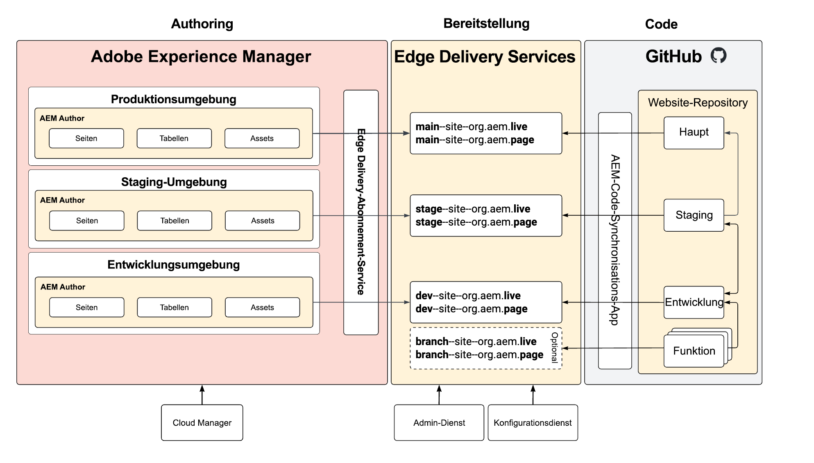

# Staging- und Produktionsumgebungen ohne Repo {#repoless-stage-prod}

Erfahren Sie, wie Sie mithilfe einer einzelnen Code-Basis auf reaktionsfreie Weise separate Sites für Ihre Staging- und Produktionsumgebungen einrichten.

## Überblick {#overview}

Sie können auch eine von Ihrer Staging-Umgebung getrennte Site für Ihre Produktionsumgebung einrichten. Die Einrichtung eines zweiten Standorts für eine separate Staging- und Produktionseinrichtung ähnelt der [Einrichtung für die Verwaltung mehrerer Standorte erforderlich](/help/edge/wysiwyg-authoring/repoless-msm.md). Tatsächlich kann sie bei Bedarf mit MSM-Site-Strukturen kombiniert werden.

In diesem Dokument wird ein typisches Beispiel für separate Staging- und Produktionsumgebungen verwendet. Sie können für jede gewünschte Umgebung separate Umgebungen erstellen.

## Voraussetzungen {#requirements}

Zum Konfigurieren reaktionsfähiger Staging- und Produktionsumgebungen müssen Sie zunächst die folgenden Aufgaben ausführen:

* In diesem Dokument wird davon ausgegangen, dass Sie bereits eine Site für Ihr Projekt auf der Grundlage des [Entwicklerhandbuchs Erste Schritte für das WYSIWYG-Authoring mit Edge Delivery Services&quot; erstellt haben](/help/edge/wysiwyg-authoring/edge-dev-getting-started.md)
* Sie müssen die [-Funktion bereits für Ihr Projekt aktiviert haben.](/help/edge/wysiwyg-authoring/repoless.md)

## Konfiguration {#configuration}

In diesem Dokument wird beschrieben, wie Sie mit derselben Code-Basis eine separate Produktions-Site für Ihr Projekt einrichten. Es wird von folgenden Annahmen ausgegangen.

* Die Staging-Site ist bereits eingerichtet und Sie möchten jetzt eine Konfiguration für die Produktions-Site erstellen.
* Die Inhaltsstruktur in AEM Authoring ist ähnlich.
* Dieselben Pfadzuordnungen werden für die Staging- und Produktionsumgebung verwendet.

In diesem Beispiel gehen wir davon aus, dass bereits eine Produktions-Site für das Projekt namens wknd erstellt wurde, dessen GitHub-Repository auch wknd heißt.

Es gibt zwei Schritte zum Konfigurieren einer separaten Produktions-Site.

1. [Erstellen Sie neue Edge Delivery Services-Sites für Ihre Produktionsumgebung](#create-edge-site).
1. [Aktualisieren der Cloud-Konfiguration in AEM für Ihre Produktions-Site](#update-cloud-configuration).

### Erstellen neuer Edge Delivery Services-Sites für Ihre Produktionsumgebung {#create-edge-site}

1. Rufen Sie Ihr Authentifizierungs-Token und das technische Konto für Ihr Programm ab.
   * Lesen Sie das Dokument **Wiederverwenden von Code über Sites hinweg**, um Details zum [Abrufen Ihres Zugriffs-Tokens](/help/edge/wysiwyg-authoring/repoless.md#access-token) und zum [technischen Konto](/help/edge/wysiwyg-authoring/repoless.md#access-control) für Ihr Programm zu erhalten.
1. Erstellen Sie eine neue Site, indem Sie den folgenden Aufruf an den Konfigurations-Service ausführen. Bitte beachten Sie:
   * Der Projektname in der POST-URL muss der neue Site-Name sein, den Sie erstellen. In diesem Beispiel ist es `wknd-prod`.
   * Die `code` sollte mit der für die anfängliche Projekterstellung verwendeten Konfiguration übereinstimmen.
   * Der `content` > `source` > `url` muss an den Namen der neuen Site angepasst werden, die Sie erstellen. In diesem Beispiel ist es `wknd-prod`.
   * D. h. der Site-Name in der POST-URL und der `content` > `source` > `url` müssen identisch sein.
   * Passen Sie den `admin` an, um die Benutzer zu definieren, die vollen administrativen Zugriff auf die Website haben sollen.
      * Es handelt sich um ein Array von E-Mail-Adressen.
      * Der Platzhalter `*` verwendet werden.
      * Weitere Informationen finden Sie [ Dokument „Konfigurieren der ](https://www.aem.live/docs/authentication-setup-authoring#default-roles) für Autoren“.

   ```text
   curl --request POST \
     --url https://admin.hlx.page/config/<your-github-org>/sites/wknd-prod.json \
     --header 'x-auth-token: <your-token>' \
     --header 'Content-Type: application/json' \
     --data '{
       "code": {
           "owner": "<your-github-org>",
           "repo": "wknd",
           "source": {
               "type": "github",
               "url": "https://github.com/<your-github-org>/wknd"
           }
       },
       "content": {
           "source": {
               "url": "https://author-p<programID>-e<environmentID>.adobeaemcloud.com/bin/franklin.delivery/<your-github-org>/wknd-prod/main",
               "type": "markup",
               "suffix": ".html"
           }
       },
       "access": {
           "admin": {
               "role": {
                   "admin": [
                       "<email>@<domain>.<tld>"
                   ],
                   "config_admin": [
                       "<tech-account-id>@techacct.adobe.com"
                   ]
               },
               "requireAuth": "auto"
           }
       }
   }'
   ```

1. Fügen Sie die Pfadzuordnung für Ihre neue Site hinzu, indem Sie den folgenden Aufruf an den Konfigurations-Service durchführen.

   ```text
   curl --request POST \
     --url https://admin.hlx.page/config/<your-github-org>/sites/wknd-prod/public.json \
     --header 'x-auth-token: <your-token>' \
     --header 'Content-Type: application/json' \
     --data '{
       "paths": {
           "mappings": [
               "/content/wknd/:/"
           ],
           "includes": [
               "/content/wknd/"
           ]
       }
   }'
   ```

Überprüfen Sie, ob die öffentliche Konfiguration Ihrer neuen Site funktioniert, indem Sie `https://main--wknd-prod--<your-github-org>.aem.page/config.json` aufrufen und den Inhalt der zurückgegebenen JSON-Datei überprüfen.

### Aktualisieren von Cloud-Konfigurationen in AEM für Ihre Produktions-Site {#update-cloud-configuration}

Ihre Produktions-AEM muss so konfiguriert sein, dass sie die neuen Edge Delivery-Sites verwendet, die Sie im vorherigen Abschnitt für eine dedizierte Produktions-Site erstellt haben. In diesem Beispiel muss der Inhalt unter `/content/wknd` in Ihrer Produktionsumgebung wissen, wie die von Ihnen erstellte `wknd-prod`-Site verwendet werden soll.

1. Melden Sie sich bei der AEM-Produktionsinstanz an und gehen Sie zu **Tools** -> **Cloud Services** -> **Edge Delivery Services-Konfiguration**.
1. Wählen Sie die Konfiguration aus, die automatisch für Ihr Projekt erstellt wurde.
1. Tippen oder klicken Sie **der Symbolleiste** Eigenschaften“.
1. Im Fenster **Edge Delivery Services** Konfiguration:
   * Geben Sie Ihre GitHub-Organisation im Feld **Organisation** an.
   * Ändern Sie den Site-Namen in den Namen der Site, die Sie im vorherigen Abschnitt erstellt haben. In diesem Fall wäre das `wknd-prod`.
   * Ändern Sie den Projekttyp in **aem.live mit repoless config setup**.
1. Tippen oder klicken Sie auf **Speichern und schließen**.

## Überprüfen des Setups {#verify}

Nachdem Sie nun alle erforderlichen Konfigurationsänderungen vorgenommen haben, überprüfen Sie, ob alles erwartungsgemäß funktioniert.

1. Melden Sie sich bei Ihrer AEM-Produktions-Autoreninstanz an.
1. Navigieren Sie zur **Sites**-Konsole, indem Sie zu **Navigation** -> **Sites** wechseln.
1. Wählen Sie eine Seite in Ihrer Site aus.
1. Tippen oder klicken Sie auf **Bearbeiten** in der Symbolleiste.
1. Stellen Sie sicher, dass die Seite im universellen Editor ordnungsgemäß gerendert wird und denselben Code wie den Stammordner Ihrer Site verwendet.
1. Nehmen Sie eine Änderung an der Seite vor und veröffentlichen Sie sie erneut.
1. Besuchen Sie Ihre neue Edge Delivery Services-Site für diese Seite unter `https://main--wknd-prod--<your-github-org>.aem.page`.

Wenn die von Ihnen vorgenommenen Änderungen angezeigt werden, funktioniert die Einrichtung Ihrer separaten Produktions-Site ordnungsgemäß.

## Verwendung {#usage}

Nachdem Sie Ihr Projekt mit responsiven Staging- und Produktionsumgebungen konfiguriert haben, können Sie den Code für sie unabhängig verwalten. Die folgende Abbildung zeigt die Beziehung der Inhalte in Ihren verschiedenen Umgebungen in AEM, Edge Delivery Services Sites und Ihren GitHub-Repositorys.


