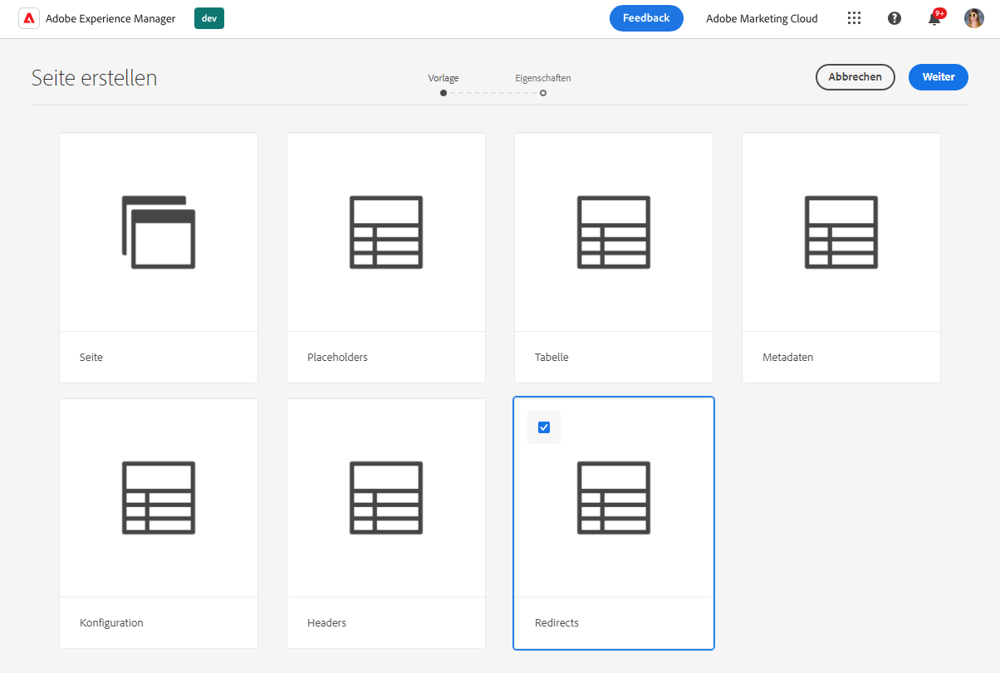
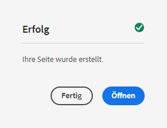
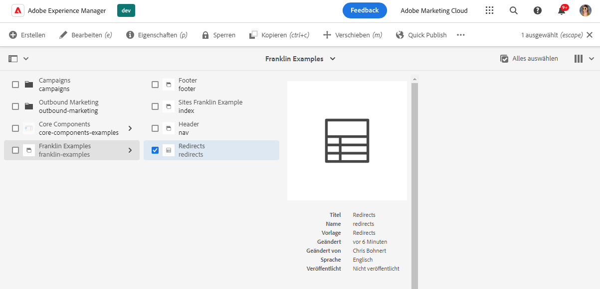
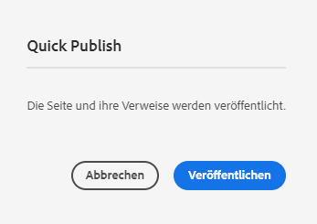
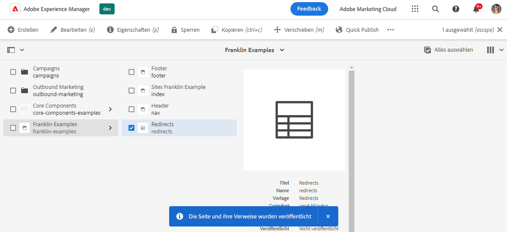
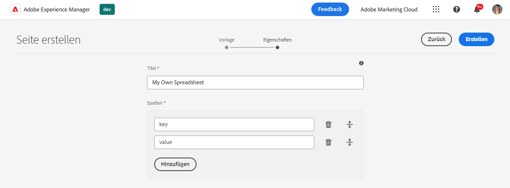

# Verwenden von Tabellen zur Verwaltung von Tabellendaten {#tabular-data}

Erfahren Sie, wie Sie Tabellen zur Verwaltung von Tabellendaten für verschiedene Werte verwenden können, z. B. Metadaten und Umleitungen für Ihre AEM-Site mit Edge Delivery Services.

## Anwendungsfälle {#use-cases}

Für alle AEM-Sites mit Edge Delivery Services müssen Listen mit Tabellendaten verwaltet werden, z. B. für Schlüssel-Wert-Zuordnungen. Dabei kann es sich um Listen mit vielen verschiedenen Werten handeln, z. B. Metadaten und Umleitungen. Mit Edge Delivery Services können Sie solche tabellarischen Listen mithilfe eines intuitiven Tools verwalten: der Kalkulationstabelle. AEM übersetzt diese Tabellen in JSON-Dateien, die von Ihrer Website oder Web-Anwendung einfach genutzt werden können.

Häufige Anwendungsfälle umfassen:

* [Platzhalter](/help/edge/docs/placeholders.md)
* [Metadaten](/help/edge/docs/bulk-metadata.md)
* [Kopfzeilen](/help/edge/docs/custom-headers.md)
* [Umleitungen](/help/edge/docs/redirects.md)
* [Konfigurationen](/help/edge/docs/setup-byo-cdn-push-invalidation.md) z. B. für CND-Setups

Darüber hinaus können Sie [Tabellen mit einer beliebigen Struktur erstellen](#own-spreadsheet), um Zuordnungen für Ihre eigenen Zwecke zu speichern.

In diesem Dokument wird anhand des Beispiels für Umleitungen veranschaulicht, wie solche Tabellen erstellt werden. Einzelheiten zu den einzelnen Anwendungsfällen finden Sie in den zuvor verknüpften Themen in der Dokumentation zu Edge Delivery Services.

>[!TIP]
>
>Weitere Informationen zur allgemeinen Funktionsweise von Tabellen mit Edge Delivery Services finden Sie unter [Tabellen und JSON](/help/edge/developer/spreadsheets.md).

>[!TIP]
>
>Kalkulationstabellen sollten nur zur Verwaltung von Tabellendaten verwendet werden. [Sehen Sie sich die Funktionen von AEM Headless](/help/headless/introduction.md) zum Speichern strukturierter Daten an.

## Voraussetzungen {#prerequisites}

Um Zuordnungen mithilfe von Kalkulationstabellen in Ihrem AEM-Projekt mit Edge Delivery Services erstellen zu können, müssen Sie Ihre Site mit der neuesten Site-Vorlage erstellt haben.

Weitere Informationen finden Sie im Dokument [Erste-Schritte-Handbuch für Entwickelnde zum WYSIWYG-Authoring mit Edge Delivery Services](/help/edge/wysiwyg-authoring/edge-dev-getting-started.md).

## Erstellen einer Kalkulationstabelle {#spreadsheet}

In diesem Beispiel erstellen Sie eine Kalkulationstabelle, um Umleitungen für Ihre AEM-Site mit Edge Delivery Services zu verwalten. Die gleichen Schritte gelten für [andere Tabellenarten](#other), die Sie erstellen möchten.

1. Melden Sie sich bei Ihrer AEM as a Cloud Service-Authoring-Instanz an, navigieren Sie zur **Sites**-Konsole und navigieren Sie zum Stamm der Site, für die eine Kalkulationstabelle erforderlich ist. Tippen oder klicken Sie auf **Erstellen** > **Seite**.

   

1. Tippen oder klicken Sie auf der Registerkarte **Vorlage** des Assistenten zum Erstellen einer Seite auf die Vorlage **Umleitungen**, um diese auszuwählen, und tippen oder klicken Sie dann auf **Weiter**.

   

1. Die Registerkarte **Eigenschaften** des Assistenten zeigt die Standardwerte für die Umleitungstabelle. Tippen oder klicken Sie auf **Erstellen**.

   * **Titel** – Lassen Sie diesen Wert unverändert.
   * **Spalten** – Die mindestens für Umleitungen erforderlichen Spalten werden vorausgefüllt.
      * **Quelle** – Die umzuleitende Seite
      * **Ziel** – Die Seite, zu der umgeleitet werden soll

   

1. Tippen Sie im Dialogfeld **Erfolg** auf **Öffnen**.

   

1. Eine neue Registerkarte wird geöffnet, wobei die Tabelle in einen Editor mit den vordefinierten Spalten **Quelle** und **Ziel** geladen wird. Um Ihre Umleitungen zu definieren, tippen oder klicken Sie auf die leere Zeile der Spalte **Quelle**. Änderungen werden automatisch gespeichert, wenn Sie die Tabelle bearbeiten.

   

   * Die **Quelle** ist relativ zur Domain Ihrer Website, sodass nur der relative Pfad enthalten ist.
   * Das **Ziel** kann entweder eine vollständig qualifizierte URL sein, wenn Sie zu einer anderen Website umleiten, oder es kann sich um einen relativen Pfad handeln, wenn Sie innerhalb Ihrer eigenen Website eine Umleitung durchführen.
   * Verwenden Sie die Tabulatortaste, um den Fokus zur nächsten Zelle zu verschieben.
   * Der Editor fügt der Tabelle bei Bedarf neue Zeilen hinzu.
   * Verwenden Sie zum Löschen oder Verschieben einer Zeile das Symbol **Löschen** am Ende jeder Zeile bzw. die Ziehpunkte am Anfang jeder Zeile.

## Importieren von Tabellendaten {#importing}

Zusätzlich zur Bearbeitung von Tabellen im AEM-Seiteneditor können Sie auch Daten aus einer CSV-Datei importieren.

1. Wenn Sie Ihre Tabelle in AEM bearbeiten, tippen oder klicken Sie auf die Schaltfläche **Hochladen** oben links auf dem Bildschirm.
1. Wählen Sie in der Dropdown-Liste aus, wie Sie Ihre Daten importieren möchten.
   * **Dokument ersetzen**, um den Inhalt der gesamten Tabelle durch den Inhalt der hochzuladenden CSV-Datei zu ersetzen.
   * **An Dokument anhängen**, um die Daten der CSV-Datei, die Sie hochladen, an den Inhalt der vorhandenen Tabelle anzuhängen.
1. Wählen Sie im sich öffnenden Dialogfeld Ihre CSV-Datei aus und tippen oder klicken Sie dann auf **Öffnen**.

Ein Dialogfeld wird geöffnet, während der Import verarbeitet wird. Nach Abschluss des Vorgangs werden die Daten in der CSV-Datei zum Inhalt der Tabelle hinzugefügt bzw. ersetzen diesen. Wenn Fehler auftreten, wie z. B. eine nicht übereinstimmende Anzahl von Spalten, werden diese gemeldet, sodass Sie Ihre CSV-Datei korrigieren können.

>[!NOTE]
>
>* Die Überschriften in der CSV-Datei müssen genau mit den Spalten in der Tabelle übereinstimmen.
>* Durch den Import der gesamten CSV-Datei werden die Spaltenüberschriften nicht geändert, sondern nur die Inhaltszeilen.
>* Wenn Sie die Spalten aktualisieren müssen, müssen Sie dies im AEM-Seiteneditor tun, bevor Sie den Import der CSV-Datei durchführen.
>* Eine CSV-Datei darf zum Import nicht größer als 10 MB sein.

Abhängig von Ihrer Auswahl von `mode` können Sie Tabellen auch mit dem Befehl `create`, `replace` oder `append` unter Verwendung eines CSV- und cURL-Befehls ähnlich dem folgenden erstellen.

```text
curl --request POST \
  --url http://<aem-instance>/bin/asynccommand \
  --header 'content-type: multipart/form-data' \
  --form file=@/path/to/your.csv \
  --form spreadsheetPath=/content/<your-site>/<your-spreadsheet> \
  --form 'spreadsheetTitle=Your Spreadsheet' \
  --form cmd=spreadsheetImport \
  --form operation=asyncSpreadsheetImport \
  --form _charset_=utf-8 \
  --form mode=append
```

Der Aufruf gibt eine HTML-Seite mit Informationen zur Auftrags-ID zurück.

```text
Message | Job(Id:2024/9/18/15/27/5cb0cacc-585d-4176-b018-b684ad2dfd02_90) created successfully. Please check status at Async Job Status Navigation.
```

[Sie können die Konsole **Aufträge** verwenden](/help/operations/asynchronous-jobs.md), um den Status des Auftrags anzuzeigen, oder die zurückgegebene ID verwenden, um ihn abzufragen.

```text
https://<aem-instance>/bin/asynccommand?optype=JOBINF&jobid=2024/10/24/14/1/8da63f9e-066b-4134-95c9-21a9c57836a5_1
```

## Veröffentlichen einer Kalkulationstabelle paths.json {#paths-json}

Damit AEM die Daten in Ihrer Tabelle veröffentlichen kann, müssen Sie zusätzlich die Datei `paths.json` Ihres Projekts aktualisieren.

1. Öffnen Sie den Stamm Ihres Projekts in GitHub.

1. Tippen oder klicken Sie auf die Datei `paths.json`, um ihre Details zu öffnen, und dann auf das Symbol **Bearbeiten**.

   

1. Fügen Sie eine Zeile hinzu, um Ihre neue Datei einer Ressource `redirects.json` zuzuordnen.

   ```json
   {
     "mappings": [
      "/content/<site-name>/:/",
      "/content/<site-name>/redirects:/redirects.json"
     ]
   }
   ```

   >[!NOTE]
   >
   >Dieser Eintrag in `paths.json` basiert auf dem Beispiel der Erstellung von Umleitungen mithilfe tabellarischer Daten. Aktualisieren Sie den Pfad entsprechend dem [Typ der Tabelle, die Sie erstellen](#other).

1. Klicken Sie auf **Änderungen bestätigen…**, um die Änderungen an `main` zu speichern.

   * Bestätigen Sie entweder für `main` oder erstellen Sie eine Abruf-Anforderung gemäß Ihrem Prozess.

1. Wenn Sie mit der Definition Ihrer Umleitungen fertig sind und die Pfadzuordnung aktualisiert haben, kehren Sie zur **Sites**-Konsole zurück.

1. Tippen oder klicken Sie auf die Umleitungstabelle, die Sie in der Konsole erstellt haben, und tippen oder klicken Sie dann auf **Quick Publish** in der Aktionsleiste, um die Tabelle zu veröffentlichen.

   

1. Tippen oder klicken Sie im Dialogfeld **Quick Publish** auf **Veröffentlichen**.

   

1. Ein Banner bestätigt die Veröffentlichung.

   

Die Umleitungstabelle ist jetzt veröffentlicht und öffentlich zugänglich.

>[!TIP]
>
>Weitere Informationen zu Pfadzuordnungen finden Sie unter [Pfadzuordnung für Edge Delivery Services](/help/edge/wysiwyg-authoring/path-mapping.md).

## Andere Tabellenarten {#other}

Nachdem Sie nun wissen, wie Sie eine Umleitungstabelle erstellen, können Sie einen beliebigen anderen Standardtyp für Tabellen erstellen:

* [Platzhalter](https://www.aem.live/docs/placeholders)
* [Metadaten](https://www.aem.live/docs/bulk-metadata)
* [Header](https://www.aem.live/docs/custom-headers)
* [Konfiguration](https://www.aem.live/docs/configuration), z. B. zur [Cache-Invalidierung](https://www.aem.live/docs/byo-cdn-adobe-managed#setup-push-invalidation)
* [Taxonomie](/help/edge/wysiwyg-authoring/taxonomy.md)

Führen Sie einfach die gleichen Schritte in den Abschnitten [Erstellen einer Tabelle](#spreadsheet) und [Aktualisieren von paths.json](#paths-json) aus, wählen Sie die entsprechende Vorlage aus und aktualisieren Sie die Datei `paths.json` entsprechend.

Stellen Sie für [Konfiguration](https://www.aem.live/docs/configuration), [Kopfzeilen](https://www.aem.live/docs/custom-headers) und [Metadaten](https://www.aem.live/docs/bulk-metadata) sicher, dass Sie eine Zuordnung hinzufügen, um sie an ihren Standardspeicherorten zu veröffentlichen:

* Konfiguration: `/.helix/config.json`
* Kopfzeilen: `/.helix/headers.json`
* Metadaten: `/metadata.json`
* Taxonomie: Weitere Informationen finden Sie im Dokument [Verwalten von Taxonomiedaten](/help/edge/wysiwyg-authoring/taxonomy.md).

Darüber hinaus können Sie [Ihre eigene Kalkulationstabelle erstellen](#own-spreadsheet), mit beliebigen Spalten für Ihre eigene Verwendung.

>[!NOTE]
>
>Sie müssen keine Tabelle erstellen, um die Indizierung für AEM as a Cloud Service-Projekte mit Edge Delivery Services zu verwalten.
>
>Wenn Sie eigene Indizes erstellen möchten, [folgen Sie dieser Dokumentation](https://www.aem.live/developer/indexing#setting-up-more-index-configurations), um Ihre eigene Datei `helix-query.yaml` zu erstellen.

## Erstellen einer eigenen Tabelle {#own-spreadsheet}

1. Führen Sie dieselben Schritte im Abschnitt [Erstellen einer Tabelle](#spreadsheet) aus.

1. Wählen Sie bei der Auswahl der Vorlage **Tabelle** aus.

1. Auf der Registerkarte **Eigenschaften** des Assistenten können Sie eigene Spalten hinzufügen.

   

   * Tippen oder klicken Sie im Abschnitt **Spalten** auf **Hinzufügen**, um eine neue Spalte hinzuzufügen.
   * Geben Sie einen Namen für die Spalte an.
   * Entfernen oder reorganisieren Sie die Spalten mit dem **Löschen**-Symbol bzw. dem Ziehpunkt-Symbol.

1. Erstellen Sie die Tabelle und veröffentlichen Sie sie gemäß den Anweisungen für die Umleitungstabelle.

1. Fügen Sie der Datei `paths.json` gemäß den Anweisungen für die Umleitungstabelle eine Zuordnung hinzu.

