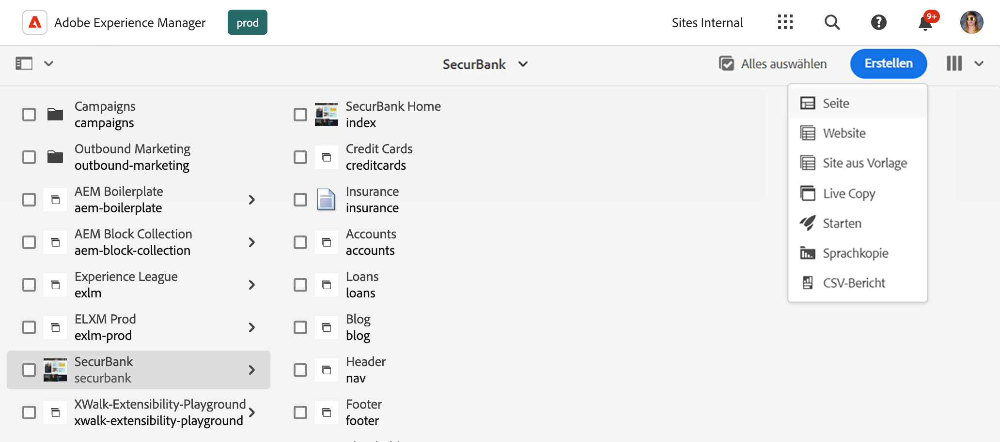
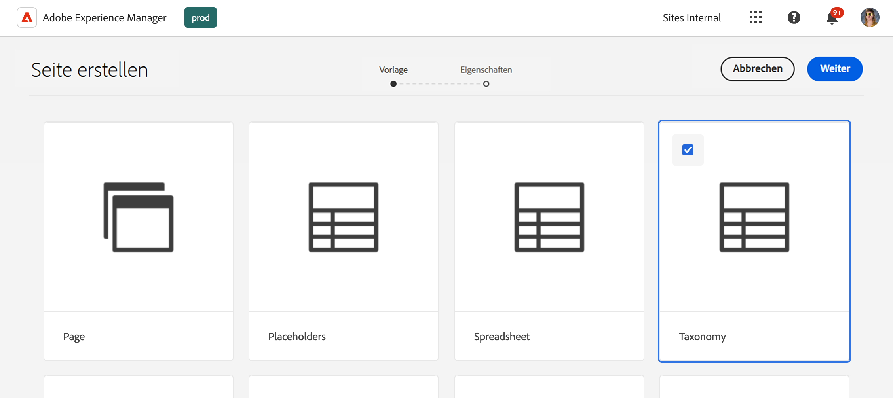
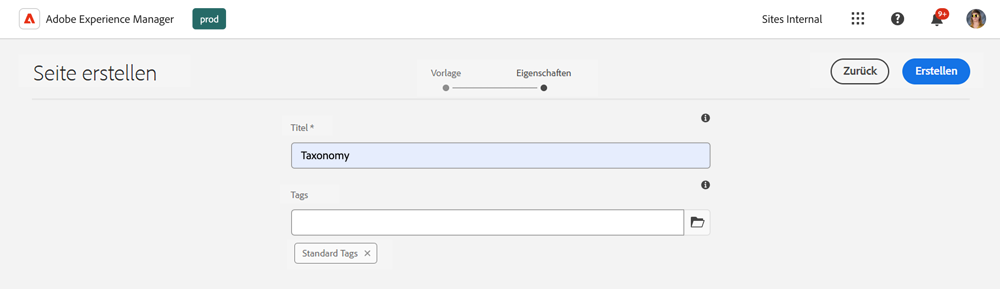
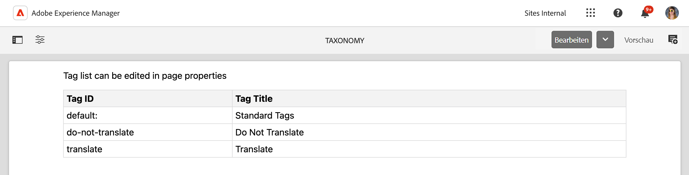
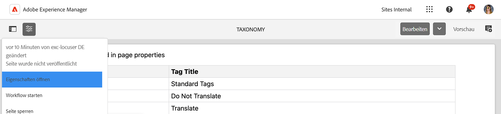
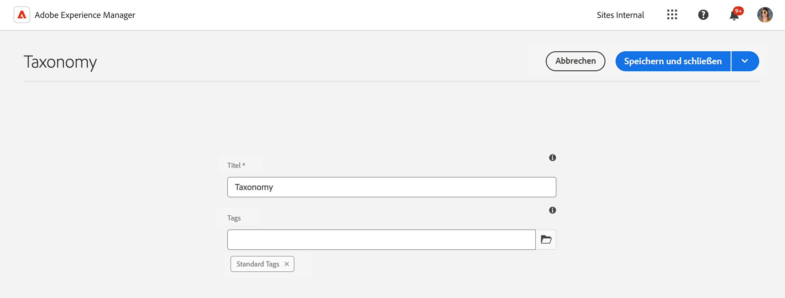

# Verwalten von Taxonomiedaten {#managing-taxonomy-data}

Erfahren Sie, wie Sie Taxonomiedaten für die Verwendung von Tags mit Ihren AEM mit Edge Delivery Services-Sites verwalten.

## Einführung {#introduction}

Tagging ist eine wichtige Funktion, mit der Sie Ihre Seiten organisieren und verwalten können. Mit der [Tagging-Konsole](/help/sites-cloud/administering/tags.md#tagging-console) in AEM können Sie eine umfangreiche Taxonomie von Tags erstellen, um Ihre Seiten zu organisieren.

Diese Tags sind nicht nur für Sie und Ihre Autorenschaft bei der Organisation Ihrer Inhalte nützlich, sondern möglicherweise auch für Ihre Leserinnen und Leser. Tags und ihre Taxonomie können in Komponenten auf der Seite verwendet werden, um Ihren Leserinnen und Lesern beim Navigieren durch Ihre Inhalte zu helfen.

Der universelle Editor funktioniert nur mit den IDs Ihrer Tags. Durch Erstellung einer Taxonomieseite für Ihre Inhalte stellen Sie die Beschreibungen dieser Tags in allen Sprachen für den universellen Editor bereit, damit diese Informationen beim Rendern von Inhalten verwendet werden können.

## Erstellen einer Taxonomieseite {#creating}

Eine Taxonomie wird wie [jede andere Seite in AEM](/help/sites-cloud/authoring/sites-console/creating-pages.md) erstellt.

1. Navigieren Sie zur Konsole [**Sites**](/help/sites-cloud/authoring/sites-console/introduction.md).

1. Wählen Sie den Ort aus, an dem Ihre Taxonomie erstellt werden soll.

1. Tippen oder klicken Sie auf **Erstellen** > **Seite**.

   

1. Wählen Sie auf der Registerkarte **Vorlage** des Assistenten **Seite erstellen** die Vorlage **Taxonomie** aus und tippen oder klicken Sie auf **Weiter**.

   

1. Geben Sie auf der Registerkarte **Eigenschaften** des Assistenten **Seite erstellen** einen aussagekräftigen **Titel** für die Seite ein und verwenden Sie im Feld **Tags** die [Tag-Auswahl](/help/sites-cloud/authoring/sites-console/tags.md), um die Tags oder Namespaces auszuwählen, die in Ihre Taxonomie eingeschlossen werden sollen.

   

1. Tippen oder klicken Sie auf **Erstellen**.

Die Taxonomieseite wird erstellt. Tippen oder klicken Sie im Dialogfeld **Erfolg** auf **Fertig**, um die Meldung zu schließen, oder auf **Öffnen**, um die Seite im [Seiteneditor](/help/sites-cloud/authoring/page-editor/introduction.md) zu bearbeiten.

Notieren Sie sich den Namen der resultierenden Taxonomieseite (er wird noch in den folgenden Schritten gebraucht).

## Bearbeiten einer Taxonomieseite {#editing}

Sie beginnen mit der Bearbeitung einer Taxonomieseite wie bei jeder anderen Seite in AEM.

1. Navigieren Sie zur Konsole [**Sites**](/help/sites-cloud/authoring/sites-console/introduction.md).

1. Wählen Sie die Taxonomie aus, die bearbeitet werden soll.

1. Tippen oder klicken Sie in der Aktionsleiste auf **Bearbeiten**.

1. Der Seiteneditor wird mit der Taxonomie geöffnet.

   * Die Taxonomieseite ist im Seiteneditor schreibgeschützt.

   

1. Tippen oder klicken Sie in der Symbolleiste auf das Symbol **Seiteninformationen** und wählen Sie **Eigenschaften öffnen** aus.

   

1. Im Fenster **Seiteneigenschaften** können Sie den Namen der Seite und mithilfe der Tag-Auswahl die in Ihrer Taxonomie enthaltenen Tags und Namespaces aktualisieren.

   

1. Tippen oder klicken Sie auf **Speichern und schließen**.

Die im Seiteneditor angezeigte Seite ist schreibgeschützt, da der Inhalt der Taxonomie automatisch anhand der ausgewählten Tags und Namespaces generiert wird. Sie dienen als eine Art Filter für die automatische Generierung des Inhalts der Taxonomie. Daher gibt es keinen Grund, die Seite direkt im Editor zu bearbeiten.

AEM aktualisiert den Inhalt der Taxonomieseite automatisch, wenn Sie die zugrunde liegenden Tags und Namespaces aktualisieren. Sie müssen die Taxonomie jedoch nach jeder Änderung [erneut veröffentlichen](#publishing), um diese Änderungen Ihren Benutzenden zur Verfügung zu stellen.

## Aktualisieren von „paths.json“ für die Taxonomieveröffentlichung {#paths-json}

Wie beim [Verwalten und Veröffentlichen von Tabellendaten für Ihre Edge Delivery Services-Site](/help/edge/wysiwyg-authoring/tabular-data.md) müssen Sie die Datei `paths.json` Ihres Projekts aktualisieren, um eine Veröffentlichung Ihrer Taxonomiedaten zu ermöglichen.

1. Öffnen Sie den Stamm Ihres Projekts in GitHub.

1. Tippen oder klicken Sie auf die Datei `paths.json`, um ihre Details zu öffnen, und dann auf das Symbol **Bearbeiten**.

   

1. Fügen Sie eine Zeile hinzu, um Ihre neue Taxonomie einer `.json`-Ressource zuzuordnen.

   ```json
   {
     "mappings": [
      "/content/<site-name>/:/",
      "/content/<site-name>/<taxonomy-page-name>:/<taxonomy-json-name>.json"
     ]
   }
   ```

   * `<taxonomy-page-name>` muss mit dem Namen [der von Ihnen erstellten Taxonomieseite übereinstimmen](#creating).
   * `<taxonomy-json-name>` kann ein beliebiger gültiger Name sein.

1. Klicken Sie auf **Änderungen bestätigen…**, um die Änderungen an `main` zu speichern.

   * Bestätigen Sie entweder für `main` oder erstellen Sie eine Abruf-Anforderung gemäß Ihrem Prozess.

Dieser Vorgang muss nur einmal pro Taxonomieseite durchgeführt werden. Danach können Sie Ihre Taxonomie veröffentlichen.

>[!TIP]
>
>Weitere Informationen zu Pfadzuordnungen finden Sie unter [Pfadzuordnung für Edge Delivery Services](/help/edge/wysiwyg-authoring/path-mapping.md).

## Veröffentlichen einer Taxonomie {#publishing}

Eine Taxonomie steht dem universellen Editor oder Ihren Benutzenden erst nach deren Veröffentlichung zur Verfügung.

Taxonomieseiten werden wie jede andere Seite durch [Verwendung der Symbole **Quick Publish** oder **Veröffentlichung verwalten** der Symbolleiste veröffentlicht](/help/sites-cloud/authoring/sites-console/publishing-pages.md).

Sie müssen Ihre Taxonomieseite jedes Mal erneut veröffentlichen, wenn Sie:

* die Seite bearbeiten,
* die in Ihrer Taxonomieseite enthaltenen Tags und Namespaces bearbeiten oder neue hinzufügen.

Wenn Sie eine neue Taxonomieseite erstellen, müssen Sie zunächst [der Datei `paths.json` in Ihrem Projekt eine Zuordnung hinzufügen](#paths-json).

## Zugreifen auf Taxonomieinformationen {#accessing}

Sobald Ihre Taxonomie veröffentlicht wurde, können ihre Informationen vom universellen Editor genutzt und für Ihre Benutzenden sichtbar gemacht werden.

Sie können auf die Taxonomie als JSON-Daten unter der folgenden Adresse zugreifen:

`https://<branch>--<repository>--<owner>.aem.page/<taxonomy-json-name>.json`

Verwenden Sie den `<taxonomy-json-name>`, den Sie beim [Zuordnen Ihrer Taxonomie zur Datei `paths.json` in Ihrem Projekt definiert haben](#paths-json). Die Taxonomiedaten werden wie im folgenden Beispiel als JSON-Daten zurückgegeben.

```json
{
  "total": 3,
  "offset": 0,
  "limit": 3,
  "data": [
    {
      "tag": "default:",
      "title": "Standard Tags"
    },
    {
      "tag": "do-not-translate",
      "title": "Do Not Translate"
    },
    {
      "tag": "translate",
      "title": "Translate"
    }
  ],
  "columns": [
    "tag",
    "title"
  ],
  ":type": "sheet"
}
```

Diese JSON-Daten werden automatisch aktualisiert, wenn Sie die Taxonomie aktualisieren und erneut veröffentlichen. Ihre Anwendung kann für Ihre Benutzenden programmgesteuert auf diese Informationen zugreifen.

[Wenn Sie Tags in mehreren Sprachen verwalten](/help/sites-cloud/administering/tags.md#managing-tags-in-different-languages), können Sie auf diese Sprachen zugreifen, indem Sie den ISO2-Sprach-Code als Wert eines `sheet=`-Parameters übergeben.

## Freilegen zusätzlicher Tag-Eigenschaften {#additional-properties}

Standardmäßig enthält Ihre Taxonomie `tag`- und `title`-Werte, wie [im vorherigen Beispiel](#accessing) gezeigt. Sie können Ihre Taxonomie so konfigurieren, dass zusätzliche Tag-Eigenschaften freigelegt werden. In diesem Beispiel legen wir die Tag-Beschreibung frei.

1. Wählen Sie über die Sites-Konsole die von Ihnen erstellte Taxonomie aus.
1. Tippen oder klicken Sie in der Symbolleiste auf das Symbol **Eigenschaften**.
1. Tippen oder klicken Sie im Abschnitt **Zusätzliche Eigenschaften** auf **Hinzufügen**, um ein Feld hinzuzufügen.
1. Geben Sie in das neue Feld den JRC-Eigenschaftsnamen ein, der freigelegt werden soll. Geben Sie in diesem Fall `jcr:description` als Tag-Beschreibung ein.
1. Tippen oder klicken Sie auf **Speichern und schließen**.
1. Tippen oder klicken Sie bei weiterhin ausgewählter Taxonomie in der Symbolleiste auf **Quick Publish**.

[Wenn Sie auf Ihre Taxonomie zugreifen](#accessing), wird nun die Tag-Beschreibung (oder die Eigenschaft, die freigelegt werden soll) in die JSON-Datei aufgenommen.

```json
{
  "total": 3,
  "offset": 0,
  "limit": 3,
  "data": [
    {
      "tag": "default:",
      "title": "Standard Tags",
      "jcr:description": "These are the standard tags"
    },
    {
      "tag": "do-not-translate",
      "title": "Do Not Translate",
      "jcr:description": "Tag to mark pages that should not be translated"
    },
    {
      "tag": "translate",
      "title": "Translate",
      "jcr:description": "Tag to mark pages that should be translated"
    }
  ],
  "columns": [
    "tag",
    "title",
    "jcr:description"
  ],
  ":type": "sheet"
}
```
