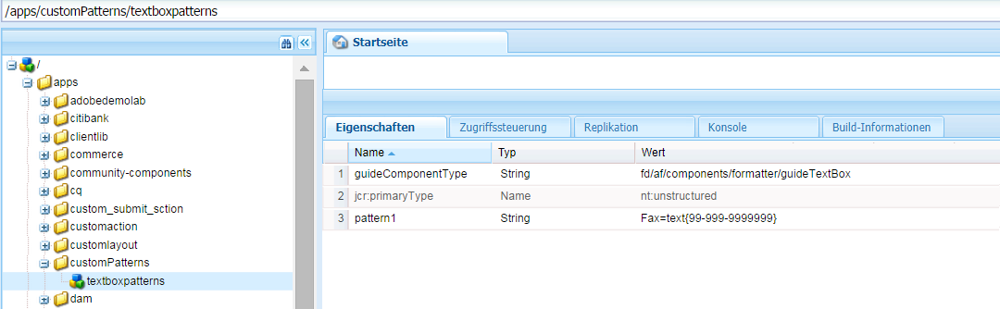

# Adaptive Formularausdrücke {#adaptive-form-expressions}

Adaptive Formulare bieten Endbenutzenden mit Kenntnissen in dynamischer Skripterstellung ein optimiertes und vereinfachtes Ausfüllen von Formularen. Sie können so Ausdrücke zum Hinzufügen verschiedener Verhaltensweisen schreiben, wie etwa für dynamisch ein-/ausgeblendete Felder und Panels. Außerdem können Sie auch berechnete Felder oder Überprüfungslogik hinzufügen, Felder als schreibgeschützt festlegen und vieles mehr. Das dynamische Verhalten basiert auf den vom Benutzer eingegebenen oder vorab eingetragenen Daten.

JavaScript™ ist die Sprache, in der Ausdrücke in adaptiven Formularen geschrieben sind. Alle Ausdrücke sind gültige JavaScript™-Ausdrücke und nutzen Skriptmodell-APIs für adaptive Formulare. Diese Ausdrücke geben Werte bestimmter Typen zurück. Eine vollständige Liste der Klassen, Ereignisse, Objekte und öffentlichen APIs für adaptive Formulare finden Sie in der [JavaScript™ Library API-Referenz für adaptive Formulare](https://helpx.adobe.com/de/experience-manager/6-5/forms/javascript-api/index.html).

## Best Practices für das Schreiben von Ausdrücken {#best-practices-for-writing-expressions}

* Beim Schreiben von Ausdrücken können Sie den Namen des Felds oder Bereichs verwenden, um auf Felder bzw. Bereiche zuzugreifen. Für den Zugriff auf den Wert eines Felds verwenden Sie die Werteigenschaft. Beispiel: `field1.value`
* Verwenden Sie im gesamten Formular eindeutige Namen für Felder und Panels. Auf diese Weise können Sie mögliche Konflikte mit beim Schreiben von Ausdrücken verwendeten Feldnamen vermeiden.
* Beim Schreiben von mehrzeiligen Ausdrücken, müssen Sie ein Semikolon verwenden, um eine Anweisung zu beenden.

## Empfohlene Vorgehensweisen für Ausdrücke in Verbindung mit Wiederholungsbereichen {#best-practices-for-expressions-involving-repeating-panel}

Wiederholungsbereiche sind Instanzen eines Bereichs, die mithilfe einer Skripterstellungs-API oder vorausgefüllter Daten dynamisch hinzugefügt oder entfernt werden. <!--  For detailed information about using repeating panel, see [creating forms with repeatable sections](creating-forms-repeatable-sections.md). -->

* Öffnen Sie zum Erstellen eines Wiederholungsbereichs im Bereichsdialogfeld die Einstellungen und legen Sie den Wert des Felds für die maximale Anzahl auf einen Wert größer als 1 fest.
* Der Wert für die minimale Anzahl der Panel-Wiederholungen kann eins oder höher sein. Er darf jedoch nicht über dem Wert für die maximale Anzahl liegen.
* Wenn sich ein Ausdruck auf ein Feld eines sich wiederholenden Panels bezieht, werden die Feldnamen im Ausdruck in das nächstgelegene der sich wiederholenden Elemente aufgelöst.
* Um Berechnungen für Wiederholungsfelder zu vereinfachen, bieten adaptive Formulare einige spezielle Funktionen an, wie „sum“, „count“, „min“, „max“, „filter“ und viele mehr. Eine vollständige Liste der Funktionen finden Sie unter [JavaScript™ Library API-Referenz für adaptive Formulare](https://helpx.adobe.com/de/aem-forms/6/javascript-api/af.html).
* Es gibt folgende APIs zum Manipulieren von Instanzen von Wiederholungsfeldern:

   * Zum Hinzufügen einer Bereichsinstanz: `panel1.instanceManager.addInstance()`
   * Zum Abrufen eines Bereichswiederholungsindexes: `panel1.instanceIndex`
   * Zum Abrufen des „instanceManager“ eines Bereichs: `_panel1 or panel1.instanceManager`
   * Zum Entfernen einer Instanz eines Bereichs: `_panel1.removeInstance(panel1.instanceIndex)`

## Ausdruckstypen {#expression-types}

In adaptiven Formularen können Sie Ausdrücke schreiben, um Verhaltensweisen hinzuzufügen, wie etwa dynamisch eingeblendete oder ausgeblendete Felder und Bereiche. Sie können auch Ausdrücke schreiben, um berechnete Felder hinzuzufügen, Felder als schreibgeschützt festzulegen, Überprüfungslogik hinzuzufügen und vieles mehr. Adaptive Formulare unterstützen folgende Ausdrücke:

* **[Ausdrücke für den Zugriff](#access-expression-enablement-expression)**: Zum Aktivieren/Deaktivieren eines Felds.
* **[Ausdrücke für die Berechnung](#calculate-expression)**: Zum automatischen Berechnen des Werts eines Felds.
* **[Ausdruck für ein Klickereignis](#click-expression)**: Zum Verarbeiten von Aktionen beim Klicken auf eine Schaltfläche.
* **[Initialisierungsskript](#initialization-script):** Zum Durchführen einer Aktion beim Initialisieren eines Felds.
* **[Optionsausdruck](#options-expression)**: Zum dynamischen Ausfüllen einer Dropdown-Liste
* **[Ausdruck für die Zusammenfassung](#summary)**: Zum dynamischen Berechnen des Titels eines Akkordeons.
* **[Ausdrücke für die Überprüfung](#validate-expression)**: Zum Überprüfen eines Felds.
* **[Skript zum Bestätigen von Werten](#value-commit-script):** Zum Ändern der Komponenten eines Formulars, nachdem der Wert eines Felds geändert wurde.
* **[Ausdruck für die Sichtbarkeit](#visibility-expression)**: Zum Steuern der Sichtbarkeit eines Felds oder Bereichs.
* **[Ausdruck für den Abschluss von Schritten](#step-completion-expression)**: Um zu vermeiden, dass ein Benutzer in einem Assistenten zum nächsten Schritt wechselt.

### Ausdruck für den Zugriff (Ausdruck für die Aktivierung) {#access-expression-enablement-expression}

Mit dem Ausdruck für den Zugriff können Sie ein Feld aktivieren oder deaktivieren. Wenn der Ausdruck den Wert eines Felds verwendet, wird der Ausdruck erneut ausgelöst, sobald der Wert des Felds sich ändert.

**Gilt für**: Felder.

**Rückgabetyp**: Der Ausdruck gibt einen booleschen Wert zurück, der den Aktivierungsstatus des Felds wiedergibt. **true** bedeutet, dass das Feld aktiviert ist, und **false**, dass das Feld deaktiviert ist.

**Beispiel**: Wenn ein Feld nur dann aktiviert sein soll, wenn der Wert von **field1** auf **X** eingestellt ist, lautet der Ausdruck für den Zugriff wie folgt: `field1.value == "X"`

### Ausdruck für Berechnungen {#calculate-expression}

Der Ausdruck für Berechnungen wird verwendet, um den Wert eines Felds unter Verwendung eines Ausdrucks automatisch zu berechnen. Normalerweise verwendet ein solcher Ausdruck die Werteigenschaft anderer Felder. Beispiel: `field2.value + field3.value`. Sobald sich der Wert von `field2` oder `field3` ändert, wird der Ausdruck erneut ausgelöst und der Wert neu berechnet.

**Gilt für**: Felder.

**Rückgabetyp**: Der Ausdruck gibt einen Wert zurück, der mit dem Feld kompatibel ist, in dem das Ausdrucksergebnis angezeigt wird (z. B. eine Dezimalzahl).

**Beispiel**: Zum Anzeigen der Summe zweier Felder in **field1** lautet der Berechnungsausdruck wie folgt:
`field2.value + field3.value`

### Ausdruck für ein Klickereignis {#click-expression}

Der Ausdruck für ein Klickereignis verarbeitet die Aktionen, die beim Klicken auf eine Schaltfläche durchgeführt werden. GuideBridge bietet standardmäßig APIs zum Ausführen verschiedener Funktionen wie Senden und Validieren, die zusammen mit dem Ausdruck für ein Klickereignis verwendet werden. Eine vollständige Liste der APIs finden Sie in den [GuideBridge-APIs](https://helpx.adobe.com/de/aem-forms/6/javascript-api/GuideBridge.html).

**Gilt für**: Felder mit Schaltfläche

**Rückgabetyp**: Der Ausdruck für ein Klickereignis gibt keinen Wert zurück. Wenn ein Ausdruck einen Wert zurückgibt, wird dieser Wert ignoriert.

**Beispiel**: Zum Ausfüllen eines Textfelds **textbox1** beim Klicken auf eine Schaltfläche mit dem Wert **AEM Forms** lautet der Ausdruck für ein Klickereignis wie folgt: `textbox1.value="AEM Forms"`

### Initialisierungsskript {#initialization-script}

Das Initialisierungsskript wird ausgelöst, wenn ein adaptives Formular initialisiert wird. Je nach Szenario verhält sich das Initialisierungsskript wie folgt:

* Wenn ein adaptives Formular ohne vorausgefüllte Daten dargestellt wird, wird das Initialisierungsskript nach der Initialisierung des Formulars ausgeführt.
* Wenn ein adaptives Formular mit vorausgefüllten Daten dargestellt wird, wird das Skript ausgeführt, nachdem die Daten vorab eingetragen wurden.
* Wenn eine serverseitige erneute Überprüfung eines adaptiven Formulars ausgelöst wird, wird das Initialisierungsskript ausgeführt.

**Gilt für:** Felder und Bedienfelder

**Rückgabetyp**: Der Ausdruck für das Initialisierungsskript gibt keinen Wert zurück. Wenn ein Ausdruck einen Wert zurückgibt, wird dieser Wert ignoriert.

**Beispiel**: Damit in einem Szenario mit vorausgefüllten Daten Felder, deren Wert als null gespeichert ist, mit dem Standardwert `'Adaptive Forms'` aufgefüllt werden, lautet der Ausdruck für das Initialisierungsskript wie folgt:
`if(this.value==null) this.value='Adaptive Forms';`

### Ausdruck für Optionen {#options-expression}

Der Ausdruck für Optionen wird zum dynamischen Ausfüllen von Optionen in einem Dropdown-Listenfeld verwendet.

**Gilt für**: Dropdown-Listenfelder

**Rückgabetyp**: Der Optionsausdruck gibt ein Array von Zeichenfolgenwerten zurück. Jeder Wert kann eine einfache Zeichenfolge sein, z. B. **Male**, oder in einer Zeichenfolge als Schlüsselwertpaar vorliegen, z. B. **1=Male**

**Beispiel**: Wenn Sie den Wert eines Felds basierend auf dem Wert eines anderen Felds ausfüllen möchten, geben Sie einen einfachen Optionsausdruck an. Beispiel: Um ein Feld **Anzahl der Kinder** basierend auf dem Wert **Familienstand** eines anderen Felds auszufüllen, lautet der Ausdruck wie folgt:

**`marital_status.value == "married" ? ["1=One", "2=two"] : ["0=Zero"]`.**

Sobald sich der Wert des Felds **marital_status** ändert, wird der Ausdruck erneut ausgelöst. Sie können die Dropdown-Liste auch über einen REST-Dienst auffüllen. <!-- For detailed information, see [Dynamically populating dropdowns](dynamically-populate-dropdowns.md). -->

### Zusammenfassungsausdruck {#summary}

Der Zusammenfassungsausdruck berechnet dynamisch den Titel eines untergeordneten Panels eines Panels mit Akkordeon-Layout. Sie können den Zusammenfassungsausdruck in einer Regel angeben, die ein Formularfeld oder eine benutzerdefinierte Logik zum Auswerten des Titels verwendet. Der Ausdruck wird ausgeführt, wenn das Formular initialisiert wird. Wenn Sie ein Formular vorausfüllen, wird der Ausdruck ausgeführt, nachdem die Daten vorab ausgefüllt wurden oder wenn sich der Wert von abhängigen Feldern ändert, die in dem Ausdruck verwendet werden.

Der Zusammenfassungsausdruck wird in der Regel für das Wiederholen von untergeordneten Elementen eines Akkordeon-Layout-Bedienfelds verwendet, um einen aussagekräftigen Titel für jedes untergeordnete Bedienfeld zur Verfügung zu stellen.

**Gilt für**: Bedienfelder, die direkt untergeordnete Elemente eines Bedienfelds sind, deren Layout als Akkordeon konfiguriert ist.

**Rückgabetyp**: Der Ausdruck gibt eine Zeichenfolge zurück, die zum Titel des Akkordeons wird.

**Beispiel:** „Kontonummer: “ + textbox1.value

### Ausdruck für die Überprüfung {#validate-expression}

Der Ausdruck für die Überprüfung wird zur Überprüfung der Felder unter Verwendung des entsprechenden Ausdrucks verwendet. Normalerweise verwenden solche Ausdrücke reguläre Ausdrücke zusammen mit dem Feldwert, um ein Feld zu überprüfen. Bei jeder Änderung am Wert des Felds wird der Ausdruck erneut ausgelöst und der Überprüfungsstatus des Felds erneut berechnet.

**Gilt für**: Felder.

**Rückgabetyp**: Der Ausdruck gibt einen booleschen Wert zurück, der den Überprüfungsstatus des Felds wiedergibt. Der Wert **false** bedeutet, dass das Feld ungültig ist, und **true** bedeutet, dass das Feld gültig ist.
**Beispiel**: Für ein Feld, das eine britische Postleitzahl enthalten soll, lautet der Ausdruck für die Überprüfung wie folgt:

(**this.value** &amp;&amp; `this.value.match(/^(GIR 0AA|[A-Z]{1,2}\d[A-Z0-9]? ?[0-9][A-Z]{2}\s*)$/i) == null) ? false : true`

Wenn im vorstehenden Beispiel der nicht leere Wert mit dem Muster nicht übereinstimmt, gibt der Ausdruck **false** zurück und zeigt damit an, dass das Feld nicht gültig ist.

>[!NOTE]
>
>Wenn Sie einen Überprüfungsausdruck für ein nicht obligatorisches oder ein obligatorisches Feld eingeben, wird der Ausdruck unabhängig vom Sichtbarkeitsstatus des Felds bewertet. Um die Validierung für die ausgeblendeten Felder zu stoppen, setzen Sie die Eigenschaft „validationsDisabled“ im Initialisierungsskript oder im Skript zum Bestätigen von Werten auf „true“. Beispiel: `this.validationsDisabled=true`

### Skript zum Bestätigen von Werten {#value-commit-script}

Das Skript zum Bestätigen von Werten wird in folgenden Fällen ausgelöst:

* Eine Benutzerin oder ein Benutzer ändert den Wert eines Felds in der Benutzeroberfläche.
* Der Wert eines Felds ändert sich programmgesteuert aufgrund von Änderungen in einem anderen Feld.

**Gilt für**: Felder.

**Rückgabetyp**: Der Ausdruck für das Skript zum Bestätigen von Werten gibt keinen Wert zurück. Wenn ein Ausdruck einen Wert zurückgibt, wird dieser Wert ignoriert.

**Beispiel**: Um kleingeschriebene Buchstaben nach Eingabe in das Feld zu Großbuchstaben zu ändern, sieht der Ausdruck für das Bestätigen von Werten wie folgt aus:
`this.value=this.value.toUpperCase()`

>[!NOTE]
>
>Sie können die Ausführung des Skripts zum Bestätigen von Werten deaktivieren, wenn der Wert eines Felds programmgesteuert geändert wird. Navigieren Sie dazu zu https://&#39;[server]:[port]&#39;/system/console/configMgr und ändern Sie **Adaptive Formularversion für die Kompatibilität** zu **AEM Forms 6.1**. Dann wird das Skript zum Bestätigen von Werten nur ausgeführt, wenn die Benutzerin oder der Benutzer den Wert des Felds in der Benutzeroberfläche ändert.

### Ausdruck für die Sichtbarkeit {#visibility-expression}

Der Ausdruck für die Sichtbarkeit wird verwendet, um die Sichtbarkeit des Felds/Panels zu steuern. Normalerweise verwendet der Ausdruck für die Sichtbarkeit die Werteigenschaft eines Felds und wird erneut ausgelöst, sobald sich dieser Wert ändert.

**Gilt für**: Felder und Fenster

**Rückgabetyp**: Der Ausdruck gibt einen booleschen Wert zurück, der den Sichtbarkeitsstatus des Felds/Fensters wiedergibt. **false** bedeutet, dass das Feld oder das Fenster nicht sichtbar ist, und „true“ bedeutet, dass das Feld oder das Fenster sichtbar ist.

**Beispiel**: Für einen Bereich, der nur sichtbar sein soll, wenn der Wert von **field1** auf **Male** festgelegt ist, lautet der Ausdruck für die Sichtbarkeit wie folgt: `field1.value == "Male"`

### Ausdruck zum Abschluss von Schritten {#step-completion-expression}

Der Ausdruck zum Abschluss von Schritten wird verwendet, um zu verhindern, dass Benutzende zum nächsten Schritt in einem Assistenten-Layout gehen. Diese Ausdrücke werden verwendet, wenn Bedienfelder über ein Assistenten-Layout verfügen (Formulare mit mehreren Schritten, die jeweils einen Schritt zeigen). Der Benutzer kann nur dann in den nächsten Schritt, Bereich oder Unterabschnitt wechseln, wenn im aktuellen Abschnitt alle erforderlichen Werte eingetragen wurden und gültig sind.

**Gilt für**: Panels mit Layout der Elemente im Stil eines Assistenten.

**Rückgabetyp**: Der Ausdruck gibt einen booleschen Wert zurück, der den Gültigkeitsstatus des aktuellen Panels wiedergibt. **True** bedeutet, dass der aktuelle Bereich gültig ist und der Benutzer zum nächsten Fenster navigieren kann.

**Beispiel**: In einem Formular mit verschiedenen Panels wird das aktuelle Panel vor der Navigation zum nächsten Panel validiert. In solchen Fällen werden die Ausdrücke zum Abschluss von Schritten verwendet. Im Allgemeinen verwenden diese Ausdrücke die GuideBridge-Validierungs-API. Beispiel für einen Ausdruck zum Abschluss von Schritten:
`window.guideBridge.validate([],this.panel.navigationContext.currentItem.somExpression)`

## Überprüfungen in adaptiven Formularen {#validations-in-adaptive-form}

Es gibt mehrere Methoden zum Hinzufügen von Feldüberprüfungen zu einem adaptiven Formular. Wenn einem Feld eine Überprüfung hinzugefügt wird, bedeutet **True**, dass der in das Feld eingegebene Wert gültig ist. **False** bedeutet, dass der Wert ungültig ist. Wenn Sie durch Drücken der Tabulatortaste in ein Feld springen oder ein Feld verlassen, wird die Fehlermeldung nicht generiert.

Es gibt folgende Methoden zum Hinzufügen von Validierungen zu Feldern:

### Erforderlich {#required}

Um eine Komponente als obligatorisch festzulegen, können Sie im Dialogfeld **Bearbeiten** der Komponente die Option **Titel und Text > Erforderlich** auswählen. Sie können auch die entsprechende erforderliche Meldung hinzufügen (optional).

### Überprüfungsmuster {#validation-patterns}

Für ein Feld stehen mehrere Überprüfungsmuster für den sofortigen Einsatz zur Verfügung. Suchen Sie zum Auswählen eines Überprüfungsmusters im Dialogfeld **Bearbeiten** der Komponente den Abschnitt **Muster** und wählen Sie **Muster** aus. Sie können im Textfeld **Muster** ein eigenes benutzerspezifisches Überprüfungsmuster erstellen. Als Überprüfungsstatus wird nur dann **True** zurückgegeben, wenn die eingegebenen Daten mit dem Überprüfungsmuster übereinstimmen. Andernfalls wird **False** zurückgegeben. <!-- To write your own custom validation pattern, see [Picture clause support for HTML5 forms](picture-clause-support.md). -->

### Ausdrücke für die Überprüfung {#validation-expressions}

Die Validierung eines Felds kann auch mithilfe von Ausdrücken für verschiedene Felder berechnet werden. Diese Ausdrücke werden in das Feld **Überprüfungsskript** der Registerkarte **Skript** des Dialogfelds **Bearbeiten** der Komponente geschrieben. Der Überprüfungsstatus eines Felds hängt davon ab, welchen Wert der Ausdruck zurückgibt. Informationen darüber, wie solche Ausdrücke geschrieben werden, finden Sie unter [Ausdruck für die Überprüfung](adaptive-form-expressions.md#p-validate-expression-p).

## Zusätzliche Informationen {#additional-information}

### Verwendung des Anzeigeformats für Felder {#using-field-display-format}

Das Anzeigeformat kann verwendet werden, um die Daten in verschiedenen Formaten anzuzeigen. Beispielsweise können Sie das Anzeigeformat verwenden, um eine Telefonnummer mit Bindestrichen darzustellen, eine Postleitzahl zu formatieren oder eine Datumsauswahl anzuzeigen. Diese Anzeigemuster können im Abschnitt **Muster** des Dialogfelds „Bearbeiten“ einer Komponente ausgewählt werden. Ähnlich wie bei den oben erwähnten Überprüfungsmustern können Sie benutzerspezifische Darstellungsmuster schreiben.

### GuideBridge – APIs und Ereignisse {#guidebridge-apis-and-events}

GuideBridge ist eine Sammlung von APIs, die für die Interaktion mit adaptiven Formularen im Speichermodell eines Browsers verwendet werden können. Eine ausführliche Einführung in die API, die Klassenmethoden, und die bereitgestellten Ereignisse in Guide Bridge finden Sie in der [JavaScript™ Library API-Referenz für adaptive Formulare](https://helpx.adobe.com/de/aem-forms/6/javascript-api/).

>[!NOTE]
>
>Es wird empfohlen, die GuideBridge-Ereignis-Listener nicht in Ausdrücken zu verwenden.

#### GuideBridge-Verwendung in verschiedenen Ausdrücken {#guidebridge-usage-in-various-expressions}

* Zum Zurücksetzen von Formularfeldern können Sie die `guideBridge.reset()`-API in dem Ausdruck für ein Klickereignis einer Schaltfläche auslösen. Ähnlich funktioniert eine Submit-API, die als ein Ausdruck für ein Klickereignis aufgerufen werden `guideBridge.submit()`.

* Sie können die `setFocus()`-API verwenden, um den Fokus auf verschiedene Felder oder Bereiche zu legen (der Bereichsfokus ist automatisch auf das erste Feld festgelegt). `setFocus()` bietet eine Vielzahl von Optionen für Navigationszwecke, z. B. für das Navigieren über Bereiche hinweg, das Durchlaufen zum vorigen/nächsten Element, das Festlegen des Fokus auf ein bestimmtes Feld und vieles mehr. Um beispielsweise in den nächsten Bereich zu wechseln, können Sie Folgendes verwenden: `guideBridge.setFocus(this.panel.somExpression, 'nextItem')`.

* Zum Validieren eines adaptiven Formulars oder seiner spezifischen Bereiche verwenden Sie `guideBridge.validate(errorList, somExpression).`

#### Verwenden von GuideBridge außerhalb von Ausdrücken  {#using-guidebridge-outside-expressions-nbsp}

Sie können die GuideBridge-APIs auch außerhalb von Ausdrücken verwenden. So können Sie die GuideBridge-API beispielsweise dazu verwenden, die Kommunikation zwischen der Seiten-HTML, in der das adaptive Formular integriert ist, und dem Formularmodell festzulegen. Darüber hinaus können Sie den Wert festlegen, der aus einem übergeordneten Element des iFrame kommt, in dem das Formular integriert ist.

Zum Verwenden der GuideBridge-API im oben erwähnten Beispiel erfassen Sie eine Instanz von GuideBridge. Zum Erfassen einer Instanz überwachen Sie das `bridgeInitializeStart`-Ereignis eines `window`-Objekts:

```javascript
window.addEventListener("bridgeInitializeStart", function(evnt) {

     // get hold of the guideBridge object

     var gb = evnt.detail.guideBridge;

     //wait for the completion of AF

     gb.connect(function (){

        //this function is called after Adaptive Form is initialized

     })

})
```

>[!NOTE]
>
>In AEM empfiehlt es sich, den Code in eine clientLib zu schreiben und dann in Ihre Seite einzufügen (header.jsp oder footer.jsp der Seite).

Um GuideBridge nach Initialisierung des Formulars zu verwenden (das `bridgeInitializeComplete`-Ereignis wird gesendet), rufen Sie die GuideBridge-Instanz mit `window.guideBridge` auf. Sie können den GuideBridge-Initialisierungsstatus mithilfe der `guideBride.isConnected`-API überprüfen.

#### GuideBridge-Ereignisse {#guidebridge-events}

GuideBridge stellt auch bestimmte Ereignisse für externe Skripte auf der Hosting-Seite bereit. Externe Skripte können diese Ereignisse überwachen und verschiedene Vorgänge ausführen. Wenn sich beispielsweise der Benutzername in einem Formular ändert, ändert sich auch der in der Kopfzeile der Seite angezeigte Name. Ausführliche Informationen zu solchen Ereignissen finden Sie in der [JavaScript™ Library API-Referenz für adaptive Formulare](https://helpx.adobe.com/de/aem-forms/6/javascript-api/GuideBridge.html)

Verwenden Sie den folgenden Code, um Handler zu registrieren:

```javascript
guideBridge.on("elementValueChanged", function (event, data)  {

      // execute some logic when value of a field is changed

});
```

### Erstellen benutzerdefinierter Muster für ein Feld {#creating-custom-patterns-for-a-field}

Wie oben erwähnt, ermöglichen es adaptive Formulare Autoren, Überprüfungsmuster oder Anzeigeformate anzugeben. Zuzüglich zu den Mustern aus dem Lieferumfang können Sie auch wiederverwendbare benutzerspezifische Muster für eine Komponente eines adaptiven Formulars definieren. Beispiel: Sie können ein Textfeld oder ein numerisches Feld definieren. Einmal definiert, können Sie diese Muster in allen Formularen für einen bestimmten Typ von Komponente verwenden. Beispiel: Sie können ein benutzerspezifisches Muster für ein Textfeld erstellen und es in den Textfeldern in ihren adaptiven Formularen verwenden. Sie können das benutzerspezifische Muster auswählen, indem Sie im Dialogfeld „Bearbeiten“ einer Komponente auf den Abschnitt „Muster“ zugreifen. <!-- For details about Pattern definition or format, see [Picture clause support for HTML5 forms](picture-clause-support.md).-->

Führen Sie die folgenden Schritte durch, um ein benutzerspezifisches Muster für einen bestimmten Feldtyp zu erstellen und es dann für alle Felder desselben Typs wiederzuverwenden:

1. Navigieren Sie in Ihrer Autoreninstanz zu CRXDE Lite.
1. Erstellen Sie einen Ordner, um Ihre benutzerdefinierten Muster zu speichern. Erstellen Sie im Verzeichnis /apps einen Knoten des Typs „sling:folder. Beispiel: Erstellen Sie einen Knoten mit dem Namen `customPatterns`. Erstellen Sie unter diesem Knoten einen weiteren Knoten des Typs `nt:unstructed` und geben Sie ihm den Namen `textboxpatterns`. Dieser Knoten enthält verschiedene benutzerdefinierte Muster, die Sie hinzufügen möchten.
1. Öffnen Sie die Registerkarte „Eigenschaften“ des erstellten Knotens. Beispiel: Öffnen Sie die Registerkarte „Eigenschaften“ von `textboxpatterns`. Fügen Sie diesem Knoten die Eigenschaft `guideComponentType` hinzu und legen Sie ihren Wert auf *fd/af/components/formatter/guideTextBox* fest.

1. Der Wert dieser Eigenschaft variiert je nach dem Feld, für das Sie die Muster definieren möchten. Bei numerischen Feldern lautet der Wert der Eigenschaft `guideComponentType` *fd/af/components/formatter/guideNumericBox*. Der Wert für das Feld „Datepicker“ lautet *fd/af/components/formatter/guideDatepicker*.
&grave;&grave;
1. Sie können ein benutzerspezifisches Muster hinzufügen, indem Sie dem Knoten `textboxpatterns` eine Eigenschaft zuweisen. Fügen Sie eine Eigenschaft mit einem Namen (z. B. `pattern1`) hinzu und legen Sie ihren Wert auf das Muster fest, das Sie hinzufügen möchten. Beispiel: Fügen Sie eine Eigenschaft `pattern1` mit dem Wert „Fax=text{99-999-9999999}“ hinzu. Das Muster ist für alle Textfelder verfügbar, die Sie in adaptiven Formularen verwenden.

   

   Erstellen benutzerspezifischer Muster
