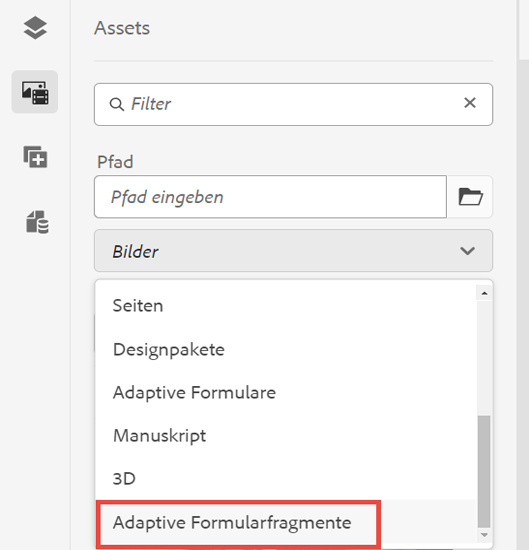

# Erstellen und Verwenden adaptiver Forms-Fragmente in einem adaptiven Formular basierend auf Kernkomponenten {#adaptive-form-fragments}

| Version | Artikel-Link |
| -------- | ---------------------------- |
| AEM as a Cloud Service | Dieser Artikel |
| AEM 6.5 | [Hier klicken](https://experienceleague.adobe.com/docs/experience-manager-65/forms/adaptive-forms-basic-authoring/adaptive-form-fragments.html?lang=de) |

Während jedes Formular für einen bestimmten Zweck entwickelt wurde, gibt es einige gängige Segmente in den meisten Formen, wie z. B. persönliche Angaben wie Name und Adresse, Familiendetails und Einkommensdetails. Formularentwicklerinnen und -entwickler müssen diese gängigen Segmente jedes Mal erstellen, wenn ein neues Formular erstellt wird.

Adaptive Formulare bieten einen praktischen Mechanismus, mit dem Formularsegmente wie ein Bedienfeld oder eine Gruppe von Feldern nur einmal erstellt und dann in adaptiven Formularen wiederverwendet werden können. Diese wiederverwendbaren und eigenständigen Segmente werden als &quot;Adaptive Formularfragmente&quot;bezeichnet.

Formularfragmente lassen sich nahtlos in mehrere Formulare integrieren, wodurch die Erstellung konsistenter und professionell aussehender Formulare optimiert wird. Formularfragmente sorgen für Wiederverwendbarkeit, Standardisierung und Markenkonsistenz durch die Funktion &quot;Einmal ändern und überall widerspiegeln&quot;. Erleben Sie mehr Wartbarkeit und Effizienz, da Aktualisierungen an einem Ort automatisch über alle Formulare hinweg übernommen werden, die diese Fragmente verwenden.

Sie können ein Fragment mehrmals zu einem Dokument hinzufügen und die Datenbindungseigenschaften seiner Komponenten verwenden, um es mit verschiedenen Datenquellen oder Schemata zu verknüpfen. Beispielsweise können Sie dasselbe Adressfragment für permanente, Kommunikations- und Abrechnungsadressen verwenden und es mit verschiedenen Feldern einer Datenquellen oder eines Schemas verbinden.

## Formularfragment erstellen {#create-a-fragment}

Sie können ein adaptives Formularfragment von Grund auf neu erstellen oder ein Bedienfeld in einem vorhandenen adaptiven Formular als Fragment speichern. So erstellen Sie ein Formularfragment:

1. Melden Sie sich bei Ihrer AEM Forms-Instanz unter https:// an.[*hostname*]:[*port*]/aem/forms.html
1. Klicken Sie auf **Erstellen > Adaptives Formularfragment**.
1. Geben Sie Titel, Namen, Beschreibung und Tags für das Fragment an. Stellen Sie sicher, dass Sie einen eindeutigen Namen für das Fragment angeben. Wenn bereits ein anderes Fragment mit demselben Namen vorhanden ist, kann das Fragment nicht erstellt werden.
1. Wählen Sie eine Formularvorlage aus. Sie können ein Formularfragment für Kernkomponenten-basierte adaptive Forms- oder Foundation-Komponenten-basierte adaptive Forms erstellen.
   * Um Formularfragmente für auf Kernkomponenten basierende Formulare zu erstellen, wählen Sie eine Vorlage auf Basis von Kernkomponenten aus.
   * Um Formularfragmente für auf Foundation-Komponenten basierende Formulare zu erstellen, wählen Sie eine Vorlage für Foundation-Komponenten aus. Beispiel: /libs/fd/af/templateForFragment/defaultFragmentTemplate.

   Wenn Sie Formularfragmente für Formulare erstellen, die auf Kernkomponenten basieren, verwenden Sie die Option Formulardesign auswählen , um ein Kernkomponenten-basiertes Design auszuwählen.

1. Klicken Sie, um die Registerkarte **Formularmodell** zu öffnen. Wählen Sie dann aus der Dropdown-Liste **Auswählen** eines der folgenden Fragmentmodelle:

   

   * **Keins**: Gibt an, dass das Fragment von Grund auf ohne Formularmodell erstellt werden soll.

     >[!NOTE]
     >
     > In Adaptive Forms, basierend auf Kernkomponenten, können Sie ein einzelnes Formularfragment mehrmals in einem Formular verwenden. Es unterstützt nicht-basierte und schemabasierte Formularfragmente.

   * **Schema**: Legt fest, dass das Fragment mit einem XML- oder JSON-Schema erstellt wird, das in AEM Forms hochgeladen wurde. Sie können ein XML- oder JSON-Schema als Formularmodell für das Fragment hochladen oder aus den verfügbaren Schemata auswählen. Wenn Sie ein XML-Schema auswählen, können Sie auch ein adaptives Formularfragment erstellen, indem Sie einen im ausgewählten Schema vorhandenen complexType aus dem **[!UICONTROL XML-Schema - komplexer Typ]** Dropdown-Feld. Wenn Sie ein JSON-Schema auswählen, können Sie auch ein adaptives Formularfragment erstellen, indem Sie eine Schemadefinition im ausgewählten Schema aus dem **[!UICONTROL JSON-Schemadefinitionen]** Dropdown-Feld.
   * **Formulardatenmodell**: Gibt an, dass das Fragment mithilfe eines Formulardatenmodells erstellt wird. Sie können ein adaptives Formularfragment erstellen, das auf nur einem Datenmodellobjekt in einem Formulardatenmodell basiert. Erweitern Sie die Dropdown-Liste Formulardatenmodelldefinitionen . Es listet alle Datenmodellobjekte im angegebenen Formulardatenmodell auf. Wählen Sie ein Datenmodellobjekt aus der Liste aus.

   

1. Klicken Sie auf **Erstellen** und dann auf **Öffnen**, um das Fragment mit einer Standardvorlage im Bearbeitungsmodus zu öffnen. Im Bearbeitungsmodus können Sie dem Fragment eine beliebige Komponente des adaptiven Formulars hinzufügen.

<!-- For information about Adaptive Form components, see [Introduction to authoring Adaptive Forms](../../forms/using/introduction-forms-authoring.md). --> Wenn Sie außerdem ein XML-Schema oder eine XDP-Formularvorlage als Formularmodell für Ihr Fragment ausgewählt haben, wird in der Inhaltssuche eine neue Registerkarte mit der Formularmodellhierarchie angezeigt. Damit können Sie Formularmodellelemente per Drag &amp; Drop auf das Fragment ziehen. Die hinzugefügten Formularmodellelemente werden in Formularkomponenten konvertiert, während die ursprünglichen Eigenschaften aus der zugehörigen XDP oder XSD beibehalten werden.

Sobald das auf einem Schema oder Formulardatenmodell basierende adaptive Formularfragment erstellt wurde, werden Formulardatenmodell oder Schemaelemente auf der Registerkarte Datenquellen des Inhaltsbrowsers im Editor für adaptive Formulare angezeigt. Sie können Formularmodellelemente per Drag &amp; Drop auf das Fragment ziehen. Die hinzugefügten Formularmodellelemente werden in Formularkomponenten konvertiert, wobei die ursprünglichen Eigenschaften aus dem zugehörigen Schema beibehalten werden.

## Hinzufügen eines Fragments zu einem adaptiven Formular {#insert-a-fragment-in-an-adaptive-form}

So fügen Sie einem adaptiven Formular ein adaptives Formularfragment hinzu:

1. Öffnen Sie das adaptive Formular im Bearbeitungsmodus.
1. Fügen Sie die **Adaptives Formularfragment** -Komponente in das Formular ein.
1. Klicken Sie auf **Assets** Inhaltsbrowser in der Seitenleiste. Wählen Sie im Asset-Browser unter den Pfaden die **Adaptive Formularfragmente** -Option. Je nach Formularmodell werden alle für Ihr Formular verfügbaren adaptiven Forms-Fragmente angezeigt.

   

1. Ziehen Sie ein adaptives Formularfragment per Drag-and-Drop in den **Adaptives Formularfragment** -Komponente in Ihrem adaptiven Formular.

   >[!NOTE]
   >
   >Das adaptive Formularfragment ist für das Authoring aus dem adaptiven Formular nicht aktiviert. Darüber hinaus ist es nicht möglich, ein XSD-basiertes Fragment in einem JSON-basierten adaptiven Formular oder ein JSON-basiertes Fragment in einem XSD-basierten Formular zu verwenden.

Das adaptive Formularfragment wird als Verweis auf das adaptive Formular hinzugefügt und bleibt mit dem eigenständigen adaptiven Formularfragment synchronisiert. Dies bedeutet, dass alle Änderungen am adaptiven Formularfragment über alle Instanzen hinweg gespiegelt werden, in denen das Fragment in Adaptive Forms integriert ist.

### Einbetten eines Fragments in ein adaptives Formular {#embed-a-fragment-in-adaptive-form}

Sie können ein adaptives Formularfragment in ein adaptives Formular einbetten, indem Sie auf  Symbol in der Symbolleiste des Bedienfelds des hinzugefügten Fragments

Das eingebettete Fragment ist nicht mehr mit dem eigenständigen Fragment verknüpft. Die Komponenten im eingebetteten Fragment können aus dem adaptiven Formular heraus bearbeitet werden.

<!-- 
## Configure fragment appearance {#configure-fragment-appearance}

Any fragment you insert in Adaptive Forms appears as a placeholder image. The placeholder displays titles of up to a maximum of ten child panels in the fragment. You can configure AEM Forms to show the complete fragment instead of the placeholder image.

Perform the following steps to show complete fragments in forms:

1. Go to AEM web console configuration page at https:[*host*]:[*port*]/system/console/configMgr.

1. Search and click **[!UICONTROL Adaptive Form and Interactive Communication Web Channel Configuration]** to open it in edit mode.
1. Disable **[!UICONTROL Enable Placeholder in place of Fragment]** checkbox to show complete fragments rather than the placeholder image.

-->

### Verwenden von Fragmenten innerhalb von Fragmenten {#using-fragments-within-fragments}

Sie können verschachtelte adaptive Formularfragmente erstellen, d. h. Sie können ein Fragment per Drag-and-Drop in ein anderes Fragment ziehen und eine verschachtelte Fragmentstruktur haben.

### Verwenden eines Formularfragments mehrmals in einem adaptiven Formular {#using-form-fragment-mutiple-times-in-af}

Sie können in einem adaptiven Formular mehrmals ein nicht-basiertes und ein schemabasiertes Formularfragment verwenden, um Daten für jedes Formularfragmentfeld eindeutig zu speichern. Sie können beispielsweise ein Adressformularfragment verwenden, um Adressdetails für permanente Kommunikation und die Darstellung lebender Adressen in einem Kreditantragsformular zu erfassen.

## Automatisches Zuordnen von Fragmenten für die Datenbindung {#auto-mapping-of-fragments-for-data-binding}

Wenn Sie ein adaptives Formularfragment mit einer XFA-Formularvorlage oder einem komplexen XSD-Typ erstellen und das Fragment in ein adaptives Formular ziehen, wird das XFA-Fragment oder der komplexe XSD-Typ automatisch durch das entsprechende adaptive Formularfragment ersetzt, dessen Fragmentmodellstamm dem XFA-Fragment oder komplexen XSD-Typ zugeordnet ist.

Das Fragment-Asset und dessen Bindungen können im Dialogfeld „Komponente bearbeiten“ geändert werden.

Sie können auch ein gebundenes adaptives Formularfragment aus der Bibliothek für adaptive Formularfragmente per Drag-and-Drop in AEM Inhaltssuche ziehen und die richtige Bindungsverweis aus dem Dialogfeld &quot;Komponente bearbeiten&quot;im Bereich für adaptive Formularfragmente bereitstellen.

## Verwalten von Fragmenten {#manage-fragments}

Mithilfe der AEM Forms-Benutzeroberfläche können Sie mehrere Vorgänge für adaptive Formularfragmente durchführen.

1. Rufen Sie `https://[hostname]/aem/forms.html` auf.

1. Klicks **Auswählen** Wählen Sie in der Symbolleiste der AEM Forms-Benutzeroberfläche ein adaptives Formularfragment aus. In der Symbolleiste werden die folgenden Vorgänge angezeigt, die Sie für das ausgewählte adaptive Formularfragment ausführen können.

<table>
 <tbody>
  <tr>
   <td>
<strong>Vorgang</strong>
 </td>
   <td>
<strong>Beschreibung</strong>
 </td>
  </tr>
  <tr>
   <td>
Bearbeiten
 </td>
   <td>
Öffnet das ausgewählte adaptive Formularfragment im Bearbeitungsmodus.    
 </td>
  </tr>
  <tr>
   <td>
Eigenschaften
 </td>
   <td>
Öffnet das Bedienfeld „Eigenschaften“. Im Bedienfeld „Eigenschaften“ können Sie Eigenschaften anzeigen und bearbeiten, eine Vorschau erstellen und ein Miniaturbild für das ausgewählte Fragment hochladen. Weitere Informationen finden Sie unter <a>Verwalten von Metadaten</a>.    
 </td>
  </tr>
  <tr>
   <td>
Kopieren
 </td>
   <td>
Kopiert das ausgewählte Fragment. Das Symbol „Einfügen“ wird in der Symbolleiste angezeigt.    
 </td>
  </tr>
  <tr>
   <td>
Download
 </td>
   <td>
Lädt das ausgewählte Fragment herunter.    
 </td>
  </tr>
  <tr>
   <td>
Vorschau
 </td>
   <td>
Enthält Optionen zum Anzeigen einer HTML- oder benutzerdefinierten Vorschau des Fragments durch Zusammenführen von Daten aus einer XML-Datei und dem Fragment. Weitere Informationen finden Sie unter <a>Erstellen einer Vorschau für ein Formular</a>.    
 </td>
  </tr>
  <tr>
   <td>
Review starten/verwalten
 </td>
   <td>
Initiieren und Verwalten einer Review des ausgewählten Fragments. Weitere Informationen finden Sie unter <a>Erstellen und Verwalten von Reviews</a>.    
 </td>
  </tr>
  <tr>
   <td>
Wörterbuch hinzufügen
 </td>
   <td>
Erzeugt ein Wörterbuch zum Lokalisieren des ausgewählten Fragments. Weitere Informationen finden Sie unter <a>Lokalisieren von Adaptive Forms</a>.    
 </td>
  </tr>
  <tr>
   <td>
Veröffentlichen/Veröffentlichung rückgängig machen
 </td>
   <td>
Veröffentlicht das ausgewählte Fragment bzw. macht die Veröffentlichung rückgängig.    
 </td>
  </tr>
  <tr>
   <td>
Löschen
 </td>
   <td>
Löscht das ausgewählte Fragment.    
 </td>
  </tr>
 </tbody>
</table>

## Wichtige Hinweise zum Arbeiten mit Fragmenten {#key-points-to-remember-when-working-with-fragments}

* Stellen Sie sicher, dass der Fragmentname eindeutig ist. Das Fragment kann nicht erstellt werden, wenn ein vorhandenes Fragment mit demselben Namen vorhanden ist.
* Wenn Sie in einem XDP-basierten adaptiven Formular ein Bedienfeld, das ein anderes XDP-Fragment enthält, als Fragment speichern, wird das daraus resultierende Fragment automatisch an das untergeordnete XDP-Fragment gebunden. Bei XSD-basierten adaptiven Formularen wird das resultierende Fragment an den Schemastamm gebunden.
* Wenn Sie ein adaptives Formularfragment erstellen, wird ein Fragmentknoten erstellt, der dem Knoten guideContainer für ein adaptives Formular in CRXDe Lite ähnelt.
* Ein Fragment in einem adaptiven Formular, das ein anderes Formulardatenmodell verwendet, wird nicht unterstützt. Zum Beispiel wird in einem XSD-basierten adaptiven Formular ein XDP-basiertes Fragment nicht unterstützt und umgekehrt.
* Adaptive Formularfragmente sind über die Registerkarte Adaptive Formularfragmente in AEM Inhaltssuche verfügbar.
* Alle Ausdrücke, Skripte oder Stile in einem eigenständigen adaptiven Formularfragment bleiben erhalten, wenn es als Verweis eingefügt oder in ein adaptives Formular eingebettet wird.
* Sie können ein adaptives Formularfragment, das als Referenz eingefügt wird, nicht in einem adaptiven Formular bearbeiten. Sie bearbeiten das eigenständige adaptive Formularfragment oder betten das Fragment im adaptiven Formular ein.
* Wenn Sie ein adaptives Formular veröffentlichen, müssen Sie die eigenständigen adaptiven Formularfragmente veröffentlichen, die als Verweis in das adaptive Formular eingefügt wurden.
* Wenn Sie ein aktualisiertes adaptives Formularfragment erneut veröffentlichen, werden die Änderungen in den veröffentlichten Instanzen des adaptiven Formulars übernommen, in denen das Fragment verwendet wird.
* Adaptive Formulare, die die Verify-Komponente enthalten, unterstützen keine anonymen Benutzer. Es wird außerdem nicht empfohlen, die Überprüfungskomponente in einem adaptiven Formularfragment zu verwenden.
* (**Nur Mac**) Um sicherzustellen, dass die Formularfragmentfunktionalität in allen Szenarien einwandfrei funktioniert, fügen Sie der Datei „/private/etc/hosts“ den folgenden Eintrag hinzu:
  `127.0.0.1 <Host machine>` **Hostcomputer**: Der Apple Mac-Computer, auf dem AEM Forms bereitgestellt wird.

## Referenzfragmente {#reference-fragments}

Referenzfragmente für adaptive Formulare, mit denen Sie Ihr Formular erstellen können, sind verfügbar.
<!-- For more information, see [Reference Fragments](../../forms/using/reference-adaptive-form-fragments.md). -->

## Siehe auch {#see-also}

{{see-also}}