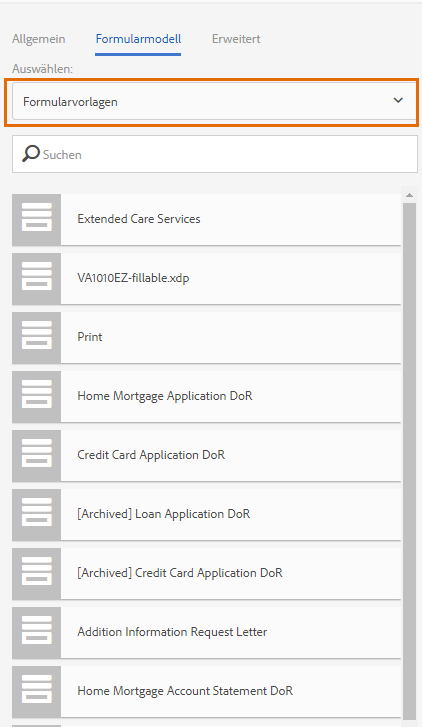
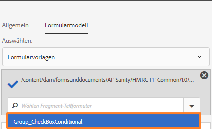
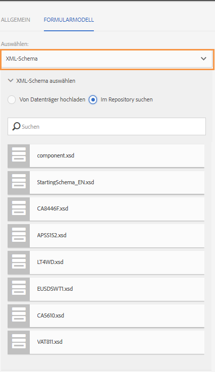
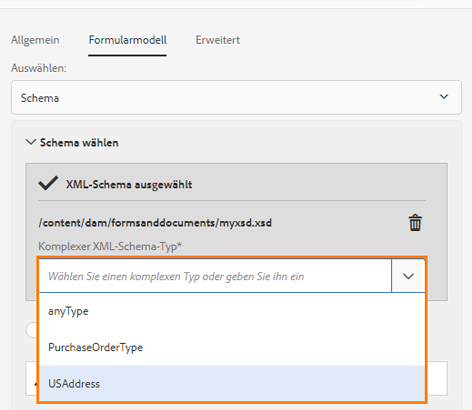
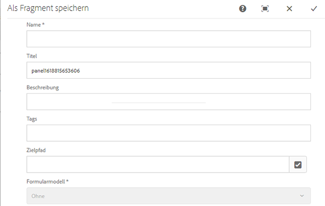
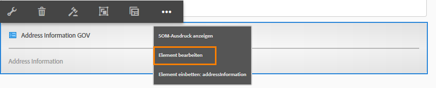
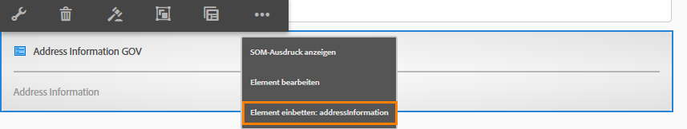

# Erstellen und Verwenden adaptiver Formularfragmente in einem adaptiven Formular  {#adaptive-form-fragments}

| Version | Artikel-Link |
| -------- | ---------------------------- |
| AEM as a Cloud Service (Foundation-Komponenten) | Dieser Artikel |
| AEM as a Cloud Service (Kernkomponenten) | [Hier klicken](/help/forms/adaptive-form-fragments-core-components.md) |
| AEM 6.5 | [Hier klicken](https://experienceleague.adobe.com/docs/experience-manager-65/forms/adaptive-forms-basic-authoring/adaptive-form-fragments.html?lang=de) |

Zwar wird jedes Formular für einen bestimmten Zweck entwickelt, doch enthalten die meisten Formulare einige gängige Elemente (z. B. für persönliche Angaben wie Name und Anschrift, Angaben zu Familienstand, Einkommen usw.). Formularentwicklerinnen und -entwickler müssen diese gängigen Segmente jedes Mal erstellen, wenn ein neues Formular erstellt wird. Adaptive Formulare bieten einen praktischen Mechanismus, mit dem Formularsegmente wie ein Bedienfeld oder eine Gruppe von Feldern nur einmal erstellt und dann in adaptiven Formularen wiederverwendet werden können. Diese wiederverwendbaren, unabhängigen Segmente werden als adaptive Formularfragmente bezeichnet.

## Erstellen eines Fragments {#create-a-fragment}

Sie können adaptive Formularfragmente von Grund auf neu erstellen oder einen Bereich in einem vorhandenen adaptiven Formular als Fragment speichern.

### Neuerstellen von Fragmenten {#create-fragment-from-scratch}

1. Melden Sie sich bei der Autoreninstanz von [!DNL AEM Forms] unter https://[*Hostname*]:[*Port*]/aem/forms.html an.
1. Klicken Sie auf **Erstellen > Adaptives Formularfragment**.
1. Geben Sie Titel, Name, Beschreibung und Tags für das Fragment an.

   >[!NOTE]
   >
   >Stellen Sie sicher, dass Sie einen eindeutigen Namen für das Fragment angeben. Wenn bereits ein anderes Fragment mit demselben Namen vorhanden ist, kann das Fragment nicht erstellt werden.

1. Klicken Sie, um die Registerkarte **Formularmodell** zu öffnen. Wählen Sie dann aus der Dropdown-Liste **Auswählen** eines der folgenden Fragmentmodelle:

   * **Keine**: Gibt an, dass das Fragment von Grund auf ohne Formularmodell erstellt werden soll.

     >[!NOTE]
     >
     > In Adaptive Forms können Sie ein einzelnes Formularfragment (basierend auf Kernkomponenten) mehrmals in einem Formular verwenden. Es unterstützt sowohl auf nichts basierende als auch schemabasierte Formularfragmente.

   * **Formularvorlage**: Das Fragment wird mithilfe einer XDP-Vorlage erstellt, die in [!DNL AEM Forms] hochgeladen wurde. Wählen Sie die entsprechende XDP-Vorlage als Formularmodell für das Fragment aus.

   

   Die Teilformulare, die als Fragmente in der ausgewählten Vorlage markiert sind, werden ebenfalls angezeigt. Sie können ein Teilformular für ein adaptives Formularfragment aus der Dropdown-Liste wählen.

   

   Außerdem können Sie ein adaptives Formularfragment aus Teilformularen erstellen, die nicht als Fragmente in der Formularvorlage markiert sind, indem Sie den SOM-Ausdruck für das Teilformular in der Dropdown-Liste angeben.

   * **XML-Schema**: Das Fragment wird mithilfe eines XML-Schemas erstellt, das in [!DNL AEM Forms] hochgeladen wurde. Sie können ein XML-Schema als Formularmodell hochladen oder aus den verfügbaren Schemas wählen.

   

   Sie können ein adaptives Formularfragment auch erstellen, indem Sie einen „complexType“ im ausgewählten Schema aus der Dropdown-Liste wählen.

   

1. Klicken Sie auf **Erstellen** und dann auf **Öffnen**, um das Fragment mit einer Standardvorlage im Bearbeitungsmodus zu öffnen.

Im Bearbeitungsmodus können Sie eine beliebige adaptive Formularkomponente aus dem AEM Sidekick auf das Fragment ziehen. <!-- For information about Adaptive Form components, see Introduction to authoring Adaptive Forms. -->

Wenn Sie außerdem ein XML-Schema oder eine XDP-Formularvorlage als Formularmodell für Ihr Fragment ausgewählt haben, wird in der Inhaltssuche eine neue Registerkarte mit der Formularmodellhierarchie angezeigt. Sie können dann Formularmodellelemente auf das Fragment ziehen. Die hinzugefügten Formularmodellelemente werden in Formularkomponenten konvertiert, wobei die ursprünglichen Eigenschaften des verbundenen XDP oder XSD beibehalten werden.

### Bereich als Fragment speichern {#save-panel-as-a-fragment}

1. Öffnen Sie ein adaptives Formular, das das Bedienfeld enthält, das Sie als adaptives Formularfragment speichern möchten.
1. Klicken Sie in der Symbolleiste des Bedienfelds auf **[!UICONTROL Als Fragment speichern]**. Das Dialogfeld „Als Fragment speichern“ wird geöffnet.

   >[!NOTE]
   >
   >Wenn das Panel, das Sie gerade als Fragment speichern, untergeordnete Panels umfasst, sind diese auch Teil des resultierenden Fragments.

1. Geben Sie im Dialogfeld für die Fragmenterstellung die folgenden Informationen an:

   * **Name**: Name des Fragments. Der Standardwert ist der Elementname des Panels. Dies ist ein Pflichtfeld.

     >[!NOTE]
     >
     >Stellen Sie sicher, dass Sie einen eindeutigen Namen für das Fragment angeben. Wenn bereits ein anderes Fragment mit demselben Namen vorhanden ist, kann das Fragment nicht erstellt werden.

   * **Titel**: Titel des Formulars. Der Standardwert ist der Titel des Bedienfelds.

   * **Beschreibung**: Beschreibung des Fragments.

   * **Tags**: Kennzeichnet Metadaten für das Fragment.

   * **Zielpfad**: Pfad zum Repository, in dem das Fragment gespeichert wird. Wenn Sie keinen Pfad angeben, wird ein Knoten mit dem Namen des Fragments neben dem Knoten erstellt, der das adaptive Formular enthält. Das Fragment wird in diesem Knoten gespeichert.

   * **Formularmodell**: Je nach Formularmodell für das adaptive Formular wird das **XML-Schema**, die **Formularvorlage** oder **Ohne** angezeigt. Dies ist ein Feld, das nicht bearbeitet werden kann.

   * **Fragmentmodellstamm**: Diese Option wird nur in XSD-basierten adaptiven Formularen angezeigt. Sie gibt den Stamm für das Fragmentmodell an. Sie können auch **/** oder den komplexen XSD-Typ aus der Dropdown-Liste auswählen. Sie können das Fragment nur in einem anderen adaptiven Formular wiederverwenden, wenn Sie den komplexen Typ als Fragmentmodellstamm auswählen.
Wenn Sie **/** als Fragmentmodellstamm auswählen, wird die vollständige XSD-Struktur vom Stamm in der Registerkarte für das Datenmodell des adaptiven Formulars angezeigt. Für den Fragmentmodellstamm eines komplexen Typs werden lediglich die untergeordneten Elemente des ausgewählten komplexen Typs in der Registerkarte des Datenmodells des adaptiven Formulars angezeigt.

   * **XSD-Ref**: Diese Option ist nur in XSD-basierten adaptiven Formularen verfügbar. Sie zeigt den Ort des XML-Schemas an.

   * **XDP-Ref**: Diese Option ist nur in XDP-basierten adaptiven Formularen verfügbar. Es wird der Speicherort der XDP-Vorlage angezeigt.

   

   Dialogfeld „Als Fragment speichern“.

1. Klicken Sie auf **OK**.

   Das Bedienfeld wird am angegebenen oder am Standardspeicherort im Repository gespeichert. In einem adaptiven Formular wird das Fenster durch einen Schnappschuss des Fragments ersetzt. Wie unten gezeigt, werden das Bedienfeld „Allgemeine Informationen“ und seine untergeordneten Bedienfelder, „Persönliche Informationen“ und „Adresse“, als Fragment gespeichert.

   Um das Fragment zu bearbeiten, klicken Sie in der Symbolleiste des Bedienfelds auf das Symbol **[!UICONTROL Element bearbeiten]**. Das Fragment wird auf einer neuen Registerkarte oder in einem neuen Fenster im Bearbeitungsmodus geöffnet.

   

## Arbeiten mit Fragmenten {#working-with-fragments}

### Konfigurieren des Erscheinungsbildes von Fragmenten {#configure-fragment-appearance}

Alle Fragmente, die Sie in adaptive Formulare einfügen, werden als Platzhalterbild angezeigt. Der Platzhalter zeigt die Titel von bis zu maximal zehn untergeordneten Bedienfeldern im Fragment an. Sie können [!DNL AEM Forms] so konfigurieren, dass das vollständige Fragment anstelle des Platzhalterbildes angezeigt wird.

Führen Sie die folgenden Schritte aus, um vollständige Fragmente in Formularen anzuzeigen:

1. Wechseln Sie zur Seite zur Konfiguration der AEM-Web-Konsole unter https://[*Host*]:[*Port*]/system/console/configMgr.

1. Suchen Sie nach **[!UICONTROL Konfigurations-Service für adaptive Formulare]** und klicken Sie darauf, um die Funktion im Bearbeitungsmodus zu öffnen.
1. Deaktivieren Sie das Kontrollkästchen **[!UICONTROL Platzhalter anstelle des Fragments aktivieren]**, um vollständige Fragmente anstelle des Platzhalterbildes anzuzeigen.

### Einfügen eines Fragments in ein adaptives Formular {#insert-a-fragment-in-an-adaptive-form}

Die adaptiven Formularfragmente, die Sie erstellen, werden auf der Registerkarte „Adaptive Formularfragmente“ der AEM-Inhaltssuche angezeigt. So fügen Sie ein adaptives Formularfragment in ein adaptives Formular ein:

1. Öffnen Sie das adaptive Formular, in das Sie ein adaptives Formularfragment einfügen möchten, im Bearbeitungsmodus.
1. Klicken Sie in der Seitenleiste auf **Assets** . Wählen Sie im Assets-Browser **Adaptive Formularfragmente** aus der Dropdown-Liste.

   Sie können auch alle adaptiven Formularfragmente anzeigen oder die Fragmente nach ihrem Formularmodell (Formularvorlage, XML-Schema oder Allgemein) filtern.

1. Ziehen Sie ein adaptives Formularfragment auf das adaptive Formular.

   >[!NOTE]
   >
   >Das adaptive Formularfragment kann nicht aus dem adaptiven Formular heraus erstellt werden. Darüber hinaus ist es nicht möglich, ein XSD-basiertes Fragment in einem JSON-basierten adaptiven Formular oder ein JSON-basiertes Fragment in einem XSD-basierten Formular zu verwenden.

Das adaptive Formularfragment wird als Verweis in das adaptive Formular eingefügt und mit dem eigenständigen adaptiven Formularfragment synchronisiert. Das bedeutet, dass Änderungen, die Sie am adaptiven Formularfragment vornehmen, in allen adaptiven Formularen, in denen das Fragment verwendet wird, widergespiegelt werden.

### Einbetten eines Fragments in ein adaptives Formular {#embed-a-fragment-in-adaptive-form}

Sie können ein adaptives Formularfragment in ein adaptives Formular einbetten, indem Sie in der Symbolleiste des hinzugefügten Fragments auf die Schaltfläche **Element einbetten: &lt;*fragmentName*>** klicken (siehe Beispielbild unten).

>[!NOTE]
>
>Das eingebettete Fragment ist nicht mehr mit dem eigenständigen Fragment verknüpft. Die Komponenten im eingebetteten Fragment können aus dem adaptiven Formular heraus bearbeitet werden.

### Verwenden von Fragmenten innerhalb von Fragmenten {#using-fragments-within-fragments}

Sie können verschachtelte adaptive Formularfragmente erstellen, d. h. ein Fragment in ein anderes Fragment ziehen, um eine verschachtelte Fragmentstruktur zu erstellen.

### Ändern von Fragmenten {#change-fragments}

Sie können ein adaptives Formularfragment ändern oder durch ein anderes ersetzen, indem Sie die Eigenschaft **Fragment-Asset auswählen** im Dialogfeld „Komponente bearbeiten“ eines adaptiven Formularfragments verwenden.

### Mehrfaches Verwenden eines Formularfragments in einem adaptiven Formular {#using-form-fragment-mutiple-times-in-af}

Sie können ein schemabasiertes Formularfragment mehrfach in einem adaptiven Formular verwenden, um Daten für jedes Formularfragmentfeld eindeutig zu speichern. Es ist beispielsweise möglich, ein Adressformularfragment zu verwenden, um Adressangaben zum ständigen Wohnsitz, zur Kommunikation und zum aktuellen Wohnsitz in einem Kreditantragsformular zu erfassen.

>[!NOTE]
>
> Wenn Sie nicht-basierte Formularfragmente mehrfach in einem adaptiven Formular verwenden, tritt ein Problem bei der Datensynchronisierung zwischen den Feldern der Fragmente auf. Sie können eine [Kernkomponente (basierend auf Formularfragmenten)](/help/forms/adaptive-form-fragments-core-components.md), die nicht an ein Formulardatenmodell (FDM) gebunden ist, mehrfach in einem Formular verwenden, ohne dass Probleme mit der Datensynchronisierung auftreten.

## Automatisches Zuordnen von Fragmenten für die Datenbindung {#auto-mapping-of-fragments-for-data-binding}

Wenn Sie ein adaptives Formularfragment mithilfe einer XFA-Formularvorlage oder eines komplexen XSD-Typs erstellen und es auf ein adaptives Formular ziehen, wird das XFA-Fragment bzw. der komplexe XSD-Typ automatisch durch das entsprechende adaptive Formularfragment ersetzt, dessen Fragmentmodellstamm dem XFA-Fragment bzw. komplexen XSD-Typ zugeordnet ist.

Das Fragment-Asset und dessen Bindungen können im Dialogfeld „Komponente bearbeiten“ geändert werden.

>[!NOTE]
>
>Sie können auch ein gebundenes adaptives Formularfragment aus der adaptiven Formularfragment-Bibliothek in der AEM-Inhaltssuche ziehen und den richtigen Bindungsverweis aus dem Dialogfeld „Komponente bearbeiten“ des Bereichs „Adaptives Formularfragment“ angeben.

## Verwalten von Fragmenten {#manage-fragments}

Sie können über die Benutzeroberfläche von [!DNL AEM Forms] mehrere Vorgänge mit adaptiven Formularfragmenten durchführen.

1. Rufen Sie `https://[hostname]:'port'/aem/forms.html` auf.

1. Klicken Sie in der Symbolleiste von [!DNL AEM Forms] auf **Auswählen** und wählen Sie ein adaptives Formularfragment aus. Die Symbolleiste enthält die folgenden Vorgänge, die Sie mit dem ausgewählten adaptiven Formularfragment durchführen können.

<table>
 <tbody>
  <tr>
   <td>
<strong>Vorgang</strong>
 </td>
   <td>
<strong>Beschreibung</strong>
 </td>
  </tr>
  <tr>
   <td>
Öffnen
 </td>
   <td>
Öffnet das adaptive Formularfragment im Bearbeitungsmodus.    
 </td>
  </tr>
  <tr>
   <td>
Eigenschaften anzeigen
 </td>
   <td>
Öffnet das Bedienfeld „Eigenschaften“. Im Bedienfeld „Eigenschaften“ können Sie Eigenschaften anzeigen und bearbeiten, eine Vorschau erstellen und ein Miniaturbild für das ausgewählte Fragment hochladen. Weitere Informationen finden Sie unter <a href="manage-form-metadata.md" target="_blank">Verwalten von Metadaten</a>.    
 </td>
  </tr>
  <tr>
   <td>
Kopieren
 </td>
   <td>
Kopiert das ausgewählte Fragment. Die Schaltfläche „Einfügen“ wird in der Symbolleiste angezeigt.    
 </td>
  </tr>
  <tr>
   <td>
Download
 </td>
   <td>
Lädt das ausgewählte Fragment herunter.    
 </td>
  </tr>
  <tr>
   <td>
Vorschau
 </td>
   <td>
Enthält Optionen zum Anzeigen einer HTML- oder benutzerdefinierten Vorschau des Fragments durch Zusammenführen von Daten aus einer XML-Datei und dem Fragment. <!-- For more information, see <a href="previewing-forms.md" target="_blank">Previewing a form</a>.    -->
 </td>
  </tr>
  <tr>
   <td>
Review starten/verwalten
 </td>
   <td>
Initiieren und Verwalten einer Review des ausgewählten Fragments. <!-- For more information, see <a href="create-reviews-forms.md" target="_blank">Creating and managing reviews</a>.    
 --> </td>
  </tr>
  <tr>
   <td>
Wörterbuch erstellen
 </td>
   <td>
Erzeugt ein Wörterbuch zum Lokalisieren des ausgewählten Fragments. <!-- For more information, see <a href="lazy-loading-adaptive-forms.md" target="_blank">Localizing Adaptive Forms</a>.    --> 
 </td>
  </tr>
  <tr>
   <td>
Veröffentlichen/Veröffentlichung rückgängig machen
 </td>
   <td>
Veröffentlicht das ausgewählte Fragment bzw. macht die Veröffentlichung rückgängig.    
 </td>
  </tr>
  <tr>
   <td>
Löschen
 </td>
   <td>
Löscht das ausgewählte Fragment.    
 </td>
  </tr>
 </tbody>
</table>

## Lokalisieren von adaptiven Formularen, die Fragmente enthalten {#localizing-adaptive-form-containing-fragments}

Zum Lokalisieren eines adaptiven Formulars, das adaptive Formularfragmente enthält, müssen die Fragmente und das Formular separat lokalisiert werden. Auf diese Weise muss ein Fragment nur einmal lokalisiert werden und kann dann später in mehreren adaptiven Formularen wiederverwendet werden.

>[!NOTE]
>
>Die Lokalisierungsschlüssel im Fragment werden nicht in der XLIFF-Datei für ein adaptives Formular angezeigt.

## Wichtige Hinweise zum Arbeiten mit Fragmenten {#key-points-to-remember-when-working-with-fragments}

* Stellen Sie sicher, dass der Fragmentname eindeutig ist. Das Fragment kann nicht erstellt werden, wenn ein vorhandenes Fragment mit demselben Namen vorhanden ist.
* Wenn Sie in einem XDP-basierten adaptiven Formular ein Bedienfeld, das ein anderes XDP-Fragment enthält, als Fragment speichern, wird das daraus resultierende Fragment automatisch an das untergeordnete XDP-Fragment gebunden. Bei XSD-basierten adaptiven Formularen wird das resultierende Fragment an den Schemastamm gebunden.
* Wenn Sie ein adaptives Formularfragment erstellen, wird ein Fragmentknoten erstellt, der dem Knoten „guideContainer“ für ein adaptives Formular in CRXDe Lite ähnelt.
* Ein Fragment, das ein anderes Formulardatenmodell (FDM) verwendet, wird in einem adaptiven Formular nicht unterstützt. Zum Beispiel wird in einem XSD-basierten adaptiven Formular ein XDP-basiertes Fragment nicht unterstützt und umgekehrt.
* Adaptive Formularfragmente sind in der AEM-Inhaltssuche auf der Registerkarte „Adaptive Formularfragmente“ verfügbar.
* Alle Ausdrücke, Skripts oder Stile in einem eigenständigen adaptiven Formularfragment bleiben erhalten, wenn es als Verweis eingefügt oder in ein adaptives Formular eingebettet wird.
* Adaptive Formularfragmente, die als Verweis eingefügt wurden, können nicht in einem adaptiven Formular bearbeitet werden. Sie bearbeiten stattdessen entweder das eigenständige adaptive Formularfragment oder betten das Fragment in das adaptive Formular ein.
* Wenn Sie ein adaptives Formular veröffentlichen, müssen Sie die eigenständigen adaptiven Formularfragmente veröffentlichen, die per Verweis in das adaptive Formular eingefügt wurden.
* Beim erneuten Veröffentlichen eines aktualisierten adaptiven Formularfragments werden die Änderungen in den veröffentlichten Instanzen des adaptiven Formulars, in denen das Fragment verwendet wird, wiedergegeben.
* Adaptive Formulare, die die Verify-Komponente enthalten, unterstützen keine anonymen Benutzer. Außerdem wird nicht empfohlen, die Verify-Komponente in einem adaptiven Formularfragment zu verwenden.
* (**Nur Mac**) Um sicherzustellen, dass die Formularfragmentfunktionalität in allen Szenarien einwandfrei funktioniert, fügen Sie der Datei „/private/etc/hosts“ den folgenden Eintrag hinzu:
  `127.0.0.1 <Host machine>` **Host-Computer**: Der Apple Mac-Computer, auf dem [!DNL AEM Forms] bereitgestellt wird.

<!--
## Reference Fragments {#reference-fragments}

Reference Adaptive Form Fragments that you can use to create your form are available. For more information, see [Reference Fragments](reference-adaptive-form-fragments.md).
-->

>[!MORELIKETHIS]
>
>* [Adaptive Formularfragmente in Kernkomponenten](/help/forms/adaptive-form-fragments-core-components.md)
