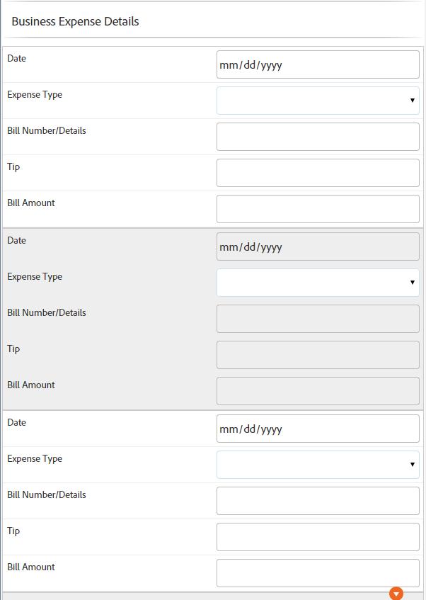

# Tabellen in einem adaptiven Formular {#tables-in-adaptive-forms}

>[!NOTE]
>
> Adobe empfiehlt, die modernen und erweiterbaren [Kernkomponenten](https://experienceleague.adobe.com/docs/experience-manager-core-components/using/adaptive-forms/introduction.html?lang=de) für die Datenerfassung zu verwenden, um [neue adaptive Formulare zu erstellen](/help/forms/creating-adaptive-form-core-components.md) oder [adaptive Formulare zu AEM Sites-Seiten hinzuzufügen](/help/forms/create-or-add-an-adaptive-form-to-aem-sites-page.md). Diese Komponenten stellen einen bedeutenden Fortschritt bei der Erstellung adaptiver Formulare dar und sorgen für beeindruckende Anwendererlebnisse. In diesem Artikel wird der ältere Ansatz zum Erstellen von adaptiven Formularen mithilfe von Foundation-Komponenten beschrieben.


| Version | Artikel-Link |
| -------- | ---------------------------- |
| AEM 6.5 | [Hier klicken](https://experienceleague.adobe.com/docs/experience-manager-65/forms/adaptive-forms-basic-authoring/adaptive-forms-tables.html?lang=de) |
| AEM as a Cloud Service | Dieser Artikel |


Die Verwendung von Tabellen ist eine effektive, vereinfachte und organisierte Methode zur Darstellung komplexer Daten. Es hilft Benutzenden, Informationen einfach zu identifizieren und Eingaben in einer geordneten Anordnung von Zeilen und Spalten bereitzustellen. Die meisten Formulare von Finanzdienstleistungen und Regierungsorganisationen erfordern große Datentabellen, um Zahlen zu setzen und Berechnungen durchzuführen.

AEM Forms bietet eine Tabellenkomponente im Komponenten-Browser in der Seitenleiste, mit der Sie Tabellen in adaptiven Formularen erstellen können. Zu den wichtigsten Funktionen gehören:

* Responsives Layout auf Mobilgeräten
* Konfigurierbare Zeilen und Spalten
* Dynamisches Hinzufügen und Löschen von Zeilen zur Laufzeit
* Kombinieren oder Zusammenführen und Aufteilen von Zellen
* Zugänglich für Bildschirmlesehilfen
* Benutzerdefiniertes Layout mit CSS
* Kompatibel und zugeordnet mit der XDP-Tabellenkomponente
* Unterstützung für das Hinzufügen von Zeilen oder Zellen mit komplexen XSD-Typelementen
* Zusammenführen von Daten aus einer XML-Datei

## Erstellen einer Tabelle {#create-a-table}

Zum Erstellen einer Tabelle ziehen Sie die Tabellenkomponente mittels Drag-and-Drop aus dem Komponenten-Browser in der Seitenleiste in das adaptive Formular. Standardmäßig enthält die Tabelle zwei Spalten und drei Zeilen, einschließlich der Zeile mit der Kopfzeile.


### Info zu Kopfzeilen- und Textzellen {#about-header-and-body-cells}

Die Kopfzeilenzellen sind Textfelder. Um den Titel für eine Kopfzeile zu ändern, klicken Sie mit der rechten Maustaste auf die Kopfzeilenzelle und klicken Sie auf **Bearbeiten**. Aktualisieren Sie im Dialogfeld „Bearbeiten“ die Bezeichnung im Feld **Wert** und klicken Sie auf **OK**.

Die Textzellen sind standardmäßig Textfelder. Sie können eine Textzelle durch eine beliebige andere in der Sidekick verfügbare adaptive Formularkomponente ersetzen (z. B. Ziffernfeld, Datumsauswahl oder Dropdown-Liste).

Beispiel: Die erste Textzeile in der folgenden Tabelle enthält ein Textfeld, eine Datumsauswahl und eine Dropdown-Liste.


Sie können zwei oder mehr Textzellen zusammenführen, indem Sie die zusammenzuführenden Zellen auswählen, mit der rechten Maustaste klicken und die Option **Zusammenführen** auswählen. Außerdem können Sie eine zusammengeführte Zelle aufteilen, indem Sie mit der rechten Maustaste darauf klicken und **Zellen teilen** auswählen.

### Hinzufügen, Löschen und Verschieben von Zeilen und Spalten {#add-delete-move-rows-and-columns}

Sie können eine Zeile oder Spalte hinzufügen und löschen sowie eine Zeile in einer Tabelle nach oben und unten verschieben.

#### Hinzufügen, Löschen oder Verschieben einer Zeile

Um eine Zeile hinzuzufügen, zu löschen oder zu verschieben, muss eine beliebige Zelle der Zeile angeklickt werden. Öffnen Sie den Inhalts-Browser  und wählen Sie die entsprechende Zeile aus. Die ausgewählte Zeile wird mit der Symbolleistenoption hervorgehoben, wo Sie auch die Zeile hinzufügen, löschen oder nach oben oder unten verschieben können.

* Der Vorgang **[!UICONTROL Nach oben]** bzw. **[!UICONTROL Nach unten]** verschiebt die ausgewählte Zeile nach oben bzw. nach unten.

* Der Vorgang **[!UICONTROL Spalte hinzufügen]** fügt eine Zeile unterhalb der ausgewählten Zeile hinzu.

* Der Vorgang **[!UICONTROL Spalte löschen]** löscht die ausgewählte Zeile.


Durch Doppelklicken auf die Zeile lassen sich Eigenschaften einer Zeile wie Name, Bindungsverweis, Wiederholungseinstellungen oder CSS-Klasse konfigurieren.


#### Hinzufügen oder Löschen einer Spalte

Um eine Spalte hinzuzufügen oder zu löschen, muss auf die Textzelle im Kopfzeilenbereich geklickt werden. Daraufhin wird eine Symbolleiste mit den Optionen zum Hinzufügen oder Löschen einer Spalte geöffnet:


>[!NOTE]
>
>Sie können zwar eine beliebige Anzahl von Zeilen zu einer Tabelle hinzufügen, die maximale Anzahl von Spalten, die Sie hinzufügen können, beträgt jedoch sechs. Außerdem können Sie die Kopfzeile nicht aus der Tabelle löschen.

### Hinzufügen einer Tabellenbeschreibung {#add-table-description}

Sie können der Tabelle eine Beschreibung hinzufügen, die erklärt, wie die Daten aufgebaut sind, damit sie von Bildschirmlesehilfen interpretiert und ausgelesen werden können. Hinzufügen der Beschreibung:

1. Wählen Sie die Tabelle und dann  aus, damit ihre Eigenschaften in der Seitenleiste angezeigt werden.
1. Geben Sie in der Registerkarte „Barrierefreiheit“ eine Zusammenfassung an.
1. Klicken Sie auf **Fertig**.

### Sortieren von Spalten in einer Tabelle {#sortcolumnstable}

Im adaptiven Formular können Sie die Daten in einer Tabelle nach einer beliebigen Spalte sortieren. Die Werte in der Spalte können in auf- oder absteigender Reihenfolge sortiert werden.

Die Sortierung kann auf Tabellenspalten angewendet werden, die Folgendes enthalten:

* Statischer Text
* Datenmodell-Objekteigenschaften
* Kombination von statischem Text und Datenmodell-Objekteigenschaften

Um eine Sortierung auf Tabellenspalten anzuwenden, müssen die Zellen der Tabellenspalten eine der folgenden Komponenten enthalten: Numerisches Feld, numerische Schritte, Datumseingabefeld, Datumsauswahl, Text oder Textfeld.

So aktivieren Sie die Sortierung:

1. Wählen Sie die Tabelle und dann  (Konfigurieren) aus. Sie können die Tabelle auch mithilfe des **Inhalts-Browsers** in der Seitenleiste der interaktiven Kommunikation auswählen.
1. Wählen Sie **Sortierung aktivieren** aus.
1. Wählen Sie  aus, um die Tabelleneigenschaften zu speichern. Die Sortiersymbole (Auf- und Ab-Pfeile) in Spaltenüberschriften zeigen an, dass die Sortierung aktiviert wurde.

   

1. Wechseln Sie in den **Vorschau**-Modus, um die Ausgabe anzuzeigen. Die Tabelle wird automatisch nach der ersten Spalte der Tabelle sortiert.
1. Klicken Sie auf die Spaltenüberschrift, um die Werte anhand dieser Spalte zu sortieren.

   Eine Spaltenüberschrift mit einem Pfeil nach oben zeigt an, dass die Tabelle anhand dieser Spalte sortiert ist. Außerdem werden die Werte in der Spalte in aufsteigender Reihenfolge angezeigt.

   

   Entsprechend bedeutet eine mit einem Abwärtspfeil versehene Spaltenüberschrift, dass die Werte in der Spalte in absteigender Reihenfolge angezeigt werden.

   Sie können im **Vorschau**-Modus auch Änderungen in der Tabelle vornehmen und dann erneut auf die Spaltenüberschrift klicken, um die Spaltenwerte zu sortieren.

## Die Spaltenbreite einer Tabelle einstellen {#set-column-width}

Führen Sie die folgenden Schritte aus, um die Spaltenbreite für eine Tabelle festzulegen:

1. Wählen Sie auf der Registerkarte **[!UICONTROL Inhalt]** die **[!UICONTROL Tabellenkomponente]** und tippen Sie auf das Symbol „Konfigurieren“ ().

1. Um die Proportionalbreite jeder Spalte der Tabelle festzulegen, müssen die jeweiligen Werte als durch Kommas getrennte Liste in das Feld **[!UICONTROL Spaltenbreite]** eingetragen werden. Beispiel: Für eine Tabelle mit 3 Spalten führt die Eingabe des Werts „2,4,6“ in das **[!UICONTROL Spaltenbreite]**-Feld dazu, dass die Spaltenbreite für die erste Spalte auf 2/12, für die zweite auf 4/12 und für die dritte auf 6/12 eingestellt wird. 2/12 als Spaltenbreite für die erste Spalte entspricht einem Sechstel der Tabellenbreite. Parallel dazu wird mit dem Wert 4/12 die Breite der zweiten Spalte auf ein Drittel der Tabellenbreite und mit 6/12 die Breite der dritten Spalte auf die Hälfte der Tabellenbreite eingestellt.

## Konfigurieren des Tabellenstils {#configure}

Sie können den Stil für eine Tabelle definieren, indem Sie den Stilmodus in der Seitensymbolleiste verwenden. Führen Sie die folgenden Schritte aus, um in den Stilmodus zu wechseln und den Tabellenstil zu bearbeiten

1. Wählen Sie in der Symbolleiste „Seite“, vor „Vorschau“,  > **Stil** aus.

1. Wählen Sie in der Seitenleiste die Tabelle und dann die Bearbeiten-Schaltfläche  aus.
Die Stileigenschaften werden in der Seitenleiste angezeigt.


>[!NOTE]
>
>Das Farbmuster für Kopf- und Textzeilen können Sie durch Änderung der Werte der [„less“-Variablen](https://lesscss.org//) anpassen. Weitere Informationen finden Sie unter [Designs in AEM Forms](/help/forms/themes.md).

## Dynamisches Hinzufügen oder Löschen einer Zeile {#add-or-delete-a-row-dynamically}

Tabellen unterstützen standardmäßig das dynamische Hinzufügen oder Löschen von Zeilen zur Laufzeit.

1. Wählen Sie eine Tabellenzeile und dann  aus.
1. Geben Sie auf der Registerkarte „Wiederholungseinstellungen“ die Mindest- und Höchstanzahl der Zeilen in der Tabelle an.
1. Klicken Sie auf **Fertig**.

Zur Laufzeit oder während der Vorschau werden die Schaltflächen **+** und  zum Hinzufügen bzw. Löschen einer Zeile angezeigt.


>[!NOTE]
>
>Das dynamische Hinzufügen und Löschen einer Zeile wird im Mobile-Layout „Kopfzeilen links“ nicht unterstützt.

## Ausdrücke in einer Tabelle {#expressions-in-a-table}

Mithilfe von Tabellen in adaptiven Formularen können Sie Ausdrücke in JavaScript schreiben, um Verhaltensweisen auszulösen (z. B. das Ein- bzw. Ausblenden einer Tabelle oder Zeile, das Addieren aller Zahlen und das Anzeigen der Summe in einer Zelle, das Aktivieren bzw. Deaktivieren einer Zelle, das Überprüfen der Benutzereingabe usw.). Diese Ausdrücke nutzen Skriptmodell-APIs für adaptive Formulare.

Während Tabellen und Zeilen nur Sichtbarkeitsausdrücke zur Steuerung ihrer Sichtbarkeit basierend auf dem von einem Ausdruck zurückgegebenen Wert unterstützen, unterstützen Zellen die folgenden Ausdrücke:

* **Initialisierungsskript**: Zum Durchführen einer Aktion beim Initialisieren eines Felds.
* **Skript zum Bestätigen von Werten**: Zum Ändern der Komponenten eines Formulars, nachdem der Wert eines Felds geändert wurde.

>[!NOTE]
>
>Wenn das XFA-Skript zum Ändern/Beenden auch auf dasselbe Feld angewendet wird, wird dieses Skript vor dem Skript zum Bestätigen von Werten ausgeführt.

* **Ausdrücke für die Berechnung**: Zum automatischen Berechnen des Werts eines Felds.
* **Ausdrücke für die Überprüfung**: Zum Überprüfen eines Felds.
* **Ausdrücke für den Zugriff**: Zum Aktivieren/Deaktivieren eines Felds.
* **Ausdruck für die Sichtbarkeit**: Zum Steuern der Sichtbarkeit eines Felds oder Bereichs.

Der Ausdruck für die Sichtbarkeit für eine Tabelle oder Zeile kann auf der Registerkarte „Bereichseigenschaften“ des entsprechenden Dialogfelds „Komponente bearbeiten“ definiert werden. Die Ausdrücke für eine Zelle können im entsprechenden Dialogfeld „Eigenschaften bearbeiten“ auf der Registerkarte „Skript“ definiert werden.

Eine vollständige Liste der Klassen, Ereignisse, Objekte und öffentlichen APIs für adaptive Formulare finden Sie unter [API-Referenz der JavaScript-Bibliothek für adaptive Formulare](https://helpx.adobe.com/de/experience-manager/6-5/forms/javascript-api/index.html).

## Layouts für Mobilgeräte {#mobile-layouts}

Tabellen in adaptiven Formularen eignen sich aufgrund ihres anpassungsfähigen und responsiven Layouts hervorragend für Mobilgeräte. AEM Forms stellt zwei Tabellenlayouts für Mobilgeräte zur Verfügung: „Kopfzeilen links“ und „Reduzierbare Spalten“.

Sie können ein Tabellenlayout für Mobilgeräte auf der Registerkarte „Stil“ im Dialogfeld „Komponente bearbeiten“ einer Tabelle konfigurieren.

### Kopfzeilen links {#headers-on-left}

Im Layout „Kopfzeilen links“ werden die Kopfzeilen in der Tabelle nach links verschoben, wobei nur eine Zelle mit einer Kopfzeile erscheint. Jede Zeile in diesem Layout wird als eigenständiger Abschnitt angezeigt. Die folgenden Abbildungen vergleichen eine Tabelle auf einem Desktop mit der auf einem Mobilgerät.


Desktopansicht einer Tabelle mit dem Layout „Kopfzeilen links“



Mobilgeräteansicht einer Tabelle mit dem Layout „Kopfzeilen links“

### Layout „Reduzierbare Spalten“  {#collapsible-columns-layout}

Im Layout „Reduzierbare Spalten“ werden die Spalten in der Tabelle je nach Gerätegröße ausgeblendet, um eine oder zwei Spalten anzuzeigen, während andere Spalten reduziert werden. Klicken Sie zum Anzeigen der anderen Spalten in der Tabelle auf das Symbol „Reduzieren/Erweitern“.

>[!NOTE]
>
>Das Layout „Reduzierbare Spalten“ ist zwar für Mobilgeräte optimiert, funktioniert aber auch auf Desktops, wenn die Breite nicht ausreicht, um alle Spalten in einer Tabelle anzuzeigen.

In den folgenden Abbildungen wird gezeigt, wie eine Tabelle mit reduzierten und erweiterten Spalten auf einem Mobilgerät aussieht.


Reduzierte Spalten einer Tabelle, wobei auf einem Mobilgerät nur zwei Spalten angezeigt werden


Erweiterte Spalte einer Tabelle auf einem Mobilgerät

## Zusammenführen von Daten in einer Tabelle {#merge-data-in-a-table}

Tabellen in adaptiven Formularen ermöglichen es Ihnen, die Tabelle zur Laufzeit mit Daten aus einer XML-Datei aufzufüllen. Die XML-Datendatei kann sich im lokalen Dateisystem des Computers befinden, auf dem der AEM Forms-Server ausgeführt wird, oder im CRX-Repository.

Zum Beispiel soll folgende Zusammenfassungstabelle für Banktransaktionen mit Daten aus einer XML-Datei gefüllt werden.


In diesem Beispiel wird die Elementnamen-Eigenschaft auf Folgendes festgelegt:

* Die Zeile: **Row1**
* Die Textzelle unter dem Transaktionsdatum: **tableItem1**
* Die Textzelle unter der Beschreibung: **tableItem2**
* Die Textzelle unter Transaktionstyp: **type**
* Die Textzelle unter dem Betrag in USD: **tableItem3**

Die XML-Datei, die Daten im folgenden Format enthält:

```xml
<?xml version="1.0" encoding="UTF-8"?><afData>
  <afUnboundData>
    <data>
 <typeSelect>0</typeSelect>
 <Row1>
      <tableItem1>2015-01-08</tableItem1>
      <tableItem2>Purchase laptop</tableItem2>
      <type>0</type>
      <tableItem3>12000</tableItem3>
 </Row1>
 <Row1>
      <tableItem1>2015-01-05</tableItem1>
      <tableItem2>Transport expense</tableItem2>
      <type>0</type>
      <tableItem3>120</tableItem3>
 </Row1>
 <Row1>
      <tableItem1>2014-01-08</tableItem1>
      <tableItem2>Laser printer</tableItem2>
      <type>0</type>
      <tableItem3>500</tableItem3>
 </Row1>
 <Row1>
      <tableItem1>2014-12-08</tableItem1>
      <tableItem2>Credit card payment</tableItem2>
      <type>0</type>
      <tableItem3>300</tableItem3>
 </Row1>
 <Row1>
      <tableItem1>2015-01-06</tableItem1>
      <tableItem2>Interest earnings</tableItem2>
      <type>1</type>
      <tableItem3>12000</tableItem3>
 </Row1>
 <Row1>
      <tableItem1>2015-01-05</tableItem1>
      <tableItem2>Payment from a client</tableItem2>
      <type>1</type>
      <tableItem3>500</tableItem3>
 </Row1>
 <Row1>
      <tableItem1>2015-01-08</tableItem1>
      <tableItem2>Food expense</tableItem2>
      <type>0</type>
      <tableItem3>120</tableItem3>
 </Row1>
 </data>
  </afUnboundData>
  <afBoundData>
    <data/>
  </afBoundData>
  <afBoundData/>
</afData>
```

In der XML-Beispieldatei werden die Daten für eine Zeile durch die `<Row1>`-Tags definiert, die den Elementnamen für die Zeile in der Tabelle festlegen. Innerhalb des `<Row1>`-Tags werden die Daten für die einzelnen Zellen innerhalb des Tags für dessen Elementnamen definiert (z. B. `<tableItem1>`, `<tableItem2>`, `<tableItem3>` und `<type>`).

Um diese Daten mit der Tabelle zur Laufzeit zusammenzuführen, muss das adaptive Formular, das die Tabelle enthält, auf den absoluten Pfad der XML-Datei zeigen. Dabei muss „wcmmode“ aktiviert sein. Beispiel: Wenn sich das adaptive Formular unter *https://localhost:4502/myForms/bankTransaction.html* und die XML-Datendatei unter *C:/myTransactions/bankSummary.xml* befinden, können Sie die Tabelle mit Daten unter folgender URL abrufen:

*https://localhost:4502/myForms/bankTransaction.html?dataRef=file:/// C:/myTransactions/bankSummary.xml&amp;wcmmode=disabled*


## Verwenden von XDP-Komponenten und komplexen XSD-Typen {#use-xdp-components-and-xsd-complex-types}

Wenn Sie ein adaptives Formular anhand einer XFA-Formularvorlage erstellt haben, sind die XFA-Elemente in der AEM-Inhaltssuche auf der Registerkarte „Datenmodell“ verfügbar. Sie können diese XFA-Elemente, einschließlich Tabellen, mittels Drag-and-Drop in das adaptive Formular ziehen.

Das XFA-Tabellenelement wird der Tabellenkomponente zugeordnet und funktioniert standardmäßig in adaptiven Formularen. Alle Eigenschaften und Funktionen der XDP-Tabelle werden beibehalten, wenn sie in ein adaptives Formular verschoben werden, und Sie können beliebige Vorgänge darauf ausführen, wie auch auf native adaptive Formulare. Beispiel: Wenn eine Zeile in einer XDP-Tabelle als wiederholbar gekennzeichnet ist, wird sie auch wiederholt, wenn sie in adaptiven Formularen eingefügt wird.

Darüber hinaus können Sie XDP-Teilformulare per Drag-and-Drop in die Tabelle einfügen, um eine neue Zeile hinzuzufügen. Beachten Sie jedoch, dass verschachtelte Teilformulare nicht eingefügt werden können.

>[!NOTE]
>
>Eine XDP-Tabelle ohne Kopfzeile wird nicht der Tabellenkomponente des adaptiven Formulars zugeordnet. Stattdessen wird sie der Panel-Komponente des adaptiven Formulars mit fließendem Layout zugeordnet. Wenn Sie außerdem eine verschachtelte Tabelle aus einem XDP einem adaptiven Formular hinzufügen, wird die äußere Tabelle in ein Bedienfeld konvertiert, während die innere Tabelle erhalten bleibt.

Darüber hinaus können Sie eine Gruppe von komplexen XSD-Typelementen ablegen, um eine Tabellenzeile zu erstellen. Eine neue Zeile wird direkt unterhalb der Zeile erstellt, in der Sie die Elemente abgelegt haben. Die Zellen, die mit den komplexen XSD-Typelementen erstellt wurden, behalten eine Bindungsreferenz zur XSD bei. Sie können auch eine Textzelle durch ein komplexes XSD-Typelement ersetzen, indem Sie das Element in die Zelle ablegen.

>[!NOTE]
>
>Die Anzahl der Elemente in einer XDP-Tabellenkomponente, einem Teilformular oder einem komplexen XSD-Typ darf die Anzahl der Zellen in einer Zeile nicht überschreiten. Sie können beispielsweise nicht vier Elemente in einer Zeile ablegen, die nur drei Zellen enthält. Dies führt zu einem Fehler.
>
>Wenn die Anzahl der Elemente geringer ist als die Anzahl der Zellen in einer Zeile, werden in der neuen Zeile zunächst Zellen auf der Grundlage der Elemente hinzugefügt, und dann werden die Standardzellen hinzugefügt, um die verbleibenden Zellen in der Zeile zu füllen. Wenn Sie beispielsweise eine Gruppe von drei Elementen in einer Zeile mit vier Zellen ablegen, basieren die ersten drei Zellen auf den abgelegten Elementen und die restliche Zelle ist die standardmäßige Tabellenzelle.

## Wichtige Aspekte {#key-considerations}

* Wenn Sie beim Erstellen einer XSD-basierten Tabelle Zeilen nach oben und unten verschieben, kommt es zu einem gewissen Datenverlust in der Daten-XML, die beim Absenden des Formulars erzeugt wird.
* Jeder Textzelle in einer Standardtabelle ist ein vordefinierter Elementname zugeordnet. Wenn Sie eine weitere Tabelle in dem adaptiven Formular hinzufügen, erhalten die Standardtextzellen in der neuen Tabelle denselben Elementnamen wie in der ersten Tabelle. In diesem Fall enthalten die Daten, die beim Übermitteln des Formulars generiert werden, nur Daten in den Standardtextzellen einer der Tabellen. Stellen Sie daher sicher, dass Sie die Elementnamen für Standardtextzellen umbenennen, um sie in allen Tabellen eindeutig zu halten und Datenverlust zu vermeiden.

  Gilt nur für die Standardtextzellen. Wenn Sie einer Tabelle weitere Zeilen oder Spalten hinzufügen, werden automatisch eindeutige Elementnamen für nicht standardmäßige Textzellen generiert.

## Siehe auch {#see-also}

{{see-also}}

