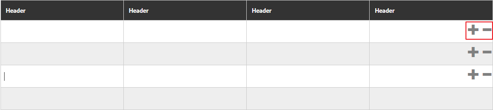

# Tabellen in adaptiven Formularen {#tables-in-adaptive-forms}

Der Einsatz von Tabellen ist eine effektive, vereinfachte und geordnete Möglichkeit zur Darstellung komplexer Daten. Sie helfen Benutzern beim Identifizieren der Daten, die in Zeilen und Spalten angeordnet sind. Die meisten Formulare aus Finanzdienstleistungen und Behörden erfordern große Datentabellen zum Anzeigen von Zahlen und Durchführen von Berechnungen.

[!DNL AEM Forms] stellt eine Komponente „Tabelle“ im Komponenten-Browser in der Seitenleiste bereit, mit der Sie Tabellen in adaptiven Formularen erstellen können. Unter anderem sind folgende wichtige Funktionen verfügbar:

* Responsive Layout für Mobilgeräte
* Konfigurierbare Zeilen und Spalten
* Dynamisches Hinzufügen und Löschen von Zeilen zur Laufzeit
* Kombinieren oder Zusammenführen und Teilen von Zellen
* Unterstützung von Bildschirmlesehilfen
* Benutzerdefiniertes Layout mit CSS
* Kompatibel und zugeordnet mit der XDP-Tabellenkomponente
* Unterstützung für das Hinzufügen von Zeilen oder Zellen mit komplexen XSD-Typelementen
* Zusammenführen von Daten aus einer XML-Datei

## Erstellen einer Tabelle {#create-a-table}

Zum Erstellen einer Tabelle ziehen Sie die Komponente „Tabelle“ mittels Drag-and-Drop aus dem Komponenten-Browser in der Seitenleiste in das adaptive Formular. Standardmäßig enthält die Tabelle zwei Spalten und drei Zeilen, einschließlich der Zeile mit der Kopfzeile.


### Info zu Kopfzeilen- und Textzellen {#about-header-and-body-cells}

Die Kopfzeilenzellen sind Textfelder. Zum Ändern der Beschriftung einer Überschriftenzelle klicken Sie mit der rechten Maustaste auf die Überschriftenzelle und wählen Sie im Kontextmenü die Option **Bearbeiten**. Aktualisieren Sie im Dialogfeld „Statischen Text bearbeiten“ die Beschriftung im Feld **Wert** und klicken Sie auf **OK**.

Die Textzellen sind standardmäßig Textfelder. Sie können eine Textzelle durch eine beliebige andere in der Seitenleiste verfügbare adaptive Formularkomponente ersetzen (z. B. Ziffernfeld, Datumsauswahl oder Dropdown-Liste).

Beispiel: Die erste Textzeile in der folgenden Tabelle enthält ein Textfeld, eine Datumsauswahl und eine Dropdown-Liste.


Sie können zwei oder mehr Textzellen zusammenführen, indem Sie die gewünschten Zellen auswählen, mit der rechten Maustaste klicken, und im Kontextmenü die Option **Zusammenführen** wählen. Außerdem können Sie eine zusammengeführte Zelle teilen, indem Sie mit der rechten Maustaste darauf klicken und im Kontextmenü die Option **Zellen teilen** wählen.

### Hinzufügen, Löschen und Verschieben von Zeilen und Spalten {#add-delete-move-rows-and-columns}

Sie können eine Zeile oder Spalte hinzufügen bzw. löschen sowie eine Zeile in einer Tabelle nach oben bzw. nach unten verschieben.

Um eine Zeile bzw. Spalte hinzuzufügen oder zu löschen oder eine Zeile zu verschieben, klicken Sie auf eine beliebige Zelle in der Zeile bzw. Spalte. Eine Dropdown-Liste wird jeweils am oberen Rand der Spalte und links neben der Zeile angezeigt. Die obere Liste enthält Optionen zum Hinzufügen bzw. Löschen der Spalte, die Liste links Optionen zum Hinzufügen, Löschen und Verschieben der Zeile.

* Der Vorgang „Hinzufügen“ fügt eine Zeile unterhalb bzw. eine Spalte rechts von der ausgewählten Zeile bzw. Spalte hinzu.
* Der Vorgang „Löschen“ löscht die ausgewählte Zeile bzw. Spalte.
* Der Vorgang „Nach oben“ bzw. „Nach unten“ verschiebt die ausgewählte Zeile nach oben bzw. nach unten.

Die Dropdown-Liste für die Zeile enthält auch die Option „Bearbeiten“ zum Bearbeiten von Zeileneigenschaften, Einstellungen und Stiloptionen.


>[!NOTE]
>
>* Sie können zwar eine beliebige Anzahl von Zeilen einer Tabelle hinzufügen, aber nur maximal sechs Spalten. Die Überschriftzeile der Tabelle kann nicht gelöscht werden.
>
>* Die automatisierte Konvertierung eines PDF-Formulars in ein adaptives Formular kann Tabellen ohne Kopfzeilen erstellen. In Tabellen ohne Kopfzeilen können Sie Spalten hinzufügen und löschen. Solchen Tabellen werden ausgeblendete Kopfzeilen hinzugefügt, damit Sie Spalten hinzufügen und löschen können. Diese Kopfzeilen sind beim Erstellen sichtbar, bleiben aber im veröffentlichten Formular ausgeblendet.


### Hinzufügen einer Tabellenbeschreibung {#add-table-description}

Sie können der Tabelle eine Beschreibung hinzufügen, die erklärt, wie die Daten aufgebaut sind, damit sie von Bildschirmlesehilfen interpretiert und ausgelesen werden können. Hinzufügen der Beschreibung:

1. Wählen Sie die Tabelle aus und tippen Sie auf , damit ihre Eigenschaften in der Seitenleiste angezeigt werden.
1. Geben Sie auf der Registerkarte „Ein-/Ausgabehilfe“ die Zusammenfassung ein.
1. Klicken Sie auf **Fertig**.

### Sortieren von Spalten in einer Tabelle {#sortcolumnstable}

Sie können Daten auf Grundlage einer beliebigen Spalte in einer Tabelle im adaptiven Formular sortieren. Die Werte in der Spalte können in auf- oder absteigender Reihenfolge sortiert werden.

Die Sortierung kann auf Tabellenspalten angewendet werden, die Folgendes enthalten:

* Statischer Text
* Datenmodell-Objekteigenschaften
* Kombination von statischem Text und Datenmodell-Objekteigenschaften

Um eine Sortierung auf Tabellenspalten anzuwenden, müssen die Zellen der Tabellenspalten eine der folgenden Komponenten enthalten: Numerisches Feld, numerische Schritte, Datumseingabefeld, Datumsauswahl, Text oder Textfeld.

So aktivieren Sie die Sortierung:

1. Wählen Sie die Tabelle aus und tippen Sie auf  (Konfigurieren). Sie können die Tabelle auch mithilfe des **Inhalt**-Browsers in der Seitenleiste der interaktiven Kommunikation auswählen.
1. Wählen Sie **Sortierung aktivieren** aus.
1. Tippen Sie auf , um die Tabelleneigenschaften zu speichern. Die Sortiersymbole (Auf- und Ab-Pfeile) in Spaltenüberschriften zeigen an, dass die Sortierung aktiviert wurde.

   

1. Wechseln Sie in den **Vorschau**-Modus, um die Ausgabe anzuzeigen. Die Tabelle wird automatisch nach der ersten Spalte der Tabelle sortiert.
1. Klicken Sie auf die Spaltenüberschrift, um die Werte anhand dieser Spalte zu sortieren.

   Eine Spaltenüberschrift mit einem Pfeil nach oben zeigt an, dass die Tabelle anhand dieser Spalte sortiert ist. Außerdem werden die Werte in der Spalte in aufsteigender Reihenfolge angezeigt.

   

   Entsprechend bedeutet eine mit einem Abwärtspfeil versehene Spaltenüberschrift, dass die Werte in der Spalte in absteigender Reihenfolge angezeigt werden.

   Sie können im **Vorschau**-Modus auch Änderungen in der Tabelle vornehmen und dann erneut auf die Spaltenüberschrift klicken, um die Spaltenwerte zu sortieren.

## Konfigurieren des Tabellenstils {#configure}

Sie können den Stil für eine Tabelle definieren, indem Sie den Stilmodus in der Seitensymbolleiste verwenden. Führen Sie die folgenden Schritte aus, um zum Stilmodus zu wechseln und den Stil der Tabelle zu bearbeiten:

1. Tippen Sie in der Symbolleiste „Seite“ vor „Vorschau“ auf  > **Stil**.

1. Wählen Sie in der Seitenleiste die Tabelle aus und tippen Sie auf die Schaltfläche zum Bearbeiten .
Die Stileigenschaften werden in der Seitenleiste angezeigt.


>[!NOTE]
>
>Sie können das Farbschema für Kopf- und Textzeilen ändern, indem Sie die Werte der LESS-Variablen ändern. Weitere Informationen finden Sie unter [Designs in  [!DNL AEM Forms]](themes.md)

## Dynamisches Hinzufügen oder Löschen einer Zeile {#add-or-delete-a-row-dynamically}

Tabellen unterstützen standardmäßig das dynamische Hinzufügen oder Löschen von Zeilen zur Laufzeit.

1. Wählen Sie eine Tabellenzeile aus und tippen Sie auf .
1. Geben Sie auf der Registerkarte „Wiederholungseinstellungen“ die Mindest- und Höchstanzahl der Zeilen in der Tabelle an.
1. Klicken Sie auf **Fertig**.

Zur Laufzeit werden die Schaltflächen **+** und *-* für das Hinzufügen bzw. Löschen einer Zeile angezeigt.



>[!NOTE]
>
>Das dynamische Hinzufügen und Löschen einer Zeile wird im Mobile-Layout „Kopfzeilen links“ nicht unterstützt.

## Ausdrücke in einer Tabelle {#expressions-in-a-table}

Mithilfe von Tabellen in adaptiven Formularen können Sie Ausdrücke in JavaScript schreiben, um bestimmte Funktionen einzuführen (z. B. das Ein- bzw. Ausblenden einer Tabelle oder Zeile, das Addieren aller Zahlen und das Anzeigen der Summe in einer Zelle, das Aktivieren bzw. Deaktivieren einer Zelle, das Überprüfen der Benutzereingabe usw.). Diese Ausdrücke nutzen APIs des Skriptmodells für adaptive Formulare.

Während Tabellen und Zeilen nur Ausdrücke zum Steuern ihrer Sichtbarkeit unterstützen, unterstützen Zellen folgende Ausdrücke:

* **Initialisierungsskript**: Zum Ausführen einer Aktion nach der Initialsierung eines Felds.
* **Skript zum Bestätigen von Werten**: Zum Ändern der Komponenten eines Formulars, nachdem der Wert eines Felds geändert wurde.

>[!NOTE]
>
>Wenn das XFA-Änderungs-/Exit-Skript auch auf dasselbe Feld angewendet wird, wird das XFA-Änderungs-/Exit-Skript vor dem Skript zum Bestätigen von Werten ausgeführt.

* **Ausdrücke für die Berechnung**: Zum automatischen Berechnen des Werts eines Felds.
* **Überprüfungsausdrücke**: Zum Überprüfen eines Felds.
* **Ausdrücke für den Zugriff**: Zum Aktivieren/Deaktivieren eines Felds.
* **Ausdruck für die Sichtbarkeit**: Zum Steuern der Sichtbarkeit eines Felds oder Bereichs.

Der Sichtbarkeitsausdruck für eine Tabelle oder Zeile kann im entsprechenden Dialogfeld „Eigenschaften bearbeiten“ auf der Registerkarte „Bereichseigenschaften“ definiert werden. Die Ausdrücke für eine Zelle können im entsprechenden Dialogfeld „Eigenschaften bearbeiten“ auf der Registerkarte „Skript“ definiert werden.

Eine vollständige Liste der Klassen, Ereignisse, Objekte und öffentlichen APIs für adaptive Formulare finden Sie in der [JavaScript Library API-Referenz für adaptive Formulare](https://helpx.adobe.com/de/experience-manager/6-5/forms/javascript-api/index.html).

## Layouts für Mobilgeräte {#mobile-layouts}

Tabellen in adaptiven Formularen eignen sich aufgrund ihres anpassungsfähigen und responsiven Layouts hervorragend für Mobilgeräte. [!DNL AEM Forms] stellt zwei Tabellen-Layouts für Mobilgeräte zur Verfügung: „Kopfzeilen links“ und „Reduzierbare Spalten“.

Sie können ein Tabellenlayout für Mobilgeräte auf der Registerkarte „Stil“ im Dialogfeld „Komponente bearbeiten“ einer Tabelle konfigurieren.

### Kopfzeilen links {#headers-on-left}

Im Layout „Kopfzeilen links“ werden die Spaltenüberschriften der Tabelle auf der linken Seite angeordnet und nur eine Zelle steht neben der Kopfzeile. Jede Zeile in diesem Layout ist ein eigenständiger Abschnitt. In den folgenden Abbildungen wird eine Tabelle auf einem Desktop mit derselben auf einem Mobilgerät verglichen.


Desktopansicht einer Tabelle mit dem Layout „Kopfzeilen links“


Mobilgeräteansicht einer Tabelle mit dem Layout „Kopfzeilen links“

### Layout „Reduzierbare Spalten“  {#collapsible-columns-layout}

Im Layout „Reduzierbare Spalten“ werden die Spalten der Tabelle so reduziert, dass je nach Gerätegröße eine oder zwei Spalten angezeigt wird, während andere Spalten reduziert werden. Klicken Sie zum Anzeigen der anderen Spalten in der Tabelle auf das Symbol „Reduzieren/Erweitern“.

>[!NOTE]
>
>Das Layout „Reduzierbare Spalten“ ist zwar für Mobilgeräte optimiert, funktioniert aber auch auf Desktops, wenn die Breite nicht ausreicht, um alle Spalten in einer Tabelle anzuzeigen.

In den folgenden Abbildungen wird gezeigt, wie eine Tabelle mit reduzierten und erweiterten Spalten auf einem Mobilgerät aussieht.


Reduzierte Spalten einer Tabelle, wobei auf einem Mobilgerät nur zwei Spalten angezeigt werden


Erweiterte Spalte einer Tabelle auf einem Mobilgerät

## Zusammenführen von Daten in einer Tabelle {#merge-data-in-a-table}

Bei Tabellen in adaptiven Formularen können Sie die Tabelle zur Laufzeit mit Daten aus einer XML-Datei auffüllen. Die XML-Datendatei kann sich im lokalen Dateisystem des Computers, auf dem der [!DNL AEM Forms]-Server ausgeführt wird, oder im CRX-Repository befinden.

Beispiel: Eine Tabelle mit einer Zusammenfassung von Banktransaktionen, die mit Daten aus einer XML-Datei gefüllt werden soll.


In diesem Beispiel ist die Elementnameneigenschaft für:

* die Zeile: **Row1**
* die Textzelle unter „Transaction“: **tableItem1**
* die Textzelle unter „Desription“ ist **tableItem2**
* die Textzelle unter „Transaction type“ **type**
* die Textzelle unter „Amount in USD“ **tableItem3**

Die XML-Datei, die Daten im folgenden Format enthält:

```xml
<?xml version="1.0" encoding="UTF-8"?><afData>
  <afUnboundData>
    <data>
 <typeSelect>0</typeSelect>
 <Row1>
      <tableItem1>2015-01-08</tableItem1>
      <tableItem2>Purchase laptop</tableItem2>
      <type>0</type>
      <tableItem3>12000</tableItem3>
 </Row1>
 <Row1>
      <tableItem1>2015-01-05</tableItem1>
      <tableItem2>Transport expense</tableItem2>
      <type>0</type>
      <tableItem3>120</tableItem3>
 </Row1>
 <Row1>
      <tableItem1>2014-01-08</tableItem1>
      <tableItem2>Laser printer</tableItem2>
      <type>0</type>
      <tableItem3>500</tableItem3>
 </Row1>
 <Row1>
      <tableItem1>2014-12-08</tableItem1>
      <tableItem2>Credit card payment</tableItem2>
      <type>0</type>
      <tableItem3>300</tableItem3>
 </Row1>
 <Row1>
      <tableItem1>2015-01-06</tableItem1>
      <tableItem2>Interest earnings</tableItem2>
      <type>1</type>
      <tableItem3>12000</tableItem3>
 </Row1>
 <Row1>
      <tableItem1>2015-01-05</tableItem1>
      <tableItem2>Payment from a client</tableItem2>
      <type>1</type>
      <tableItem3>500</tableItem3>
 </Row1>
 <Row1>
      <tableItem1>2015-01-08</tableItem1>
      <tableItem2>Food expense</tableItem2>
      <type>0</type>
      <tableItem3>120</tableItem3>
 </Row1>
 </data>
  </afUnboundData>
  <afBoundData>
    <data/>
  </afBoundData>
  <afBoundData/>
</afData>
```

In der XML-Beispieldatei werden die Daten für eine Zeile durch die `<Row1>`-Tags definiert, die den Elementnamen für die Zeile in der Tabelle festlegen. Innerhalb des `<Row1>`-Tags werden die Daten für die einzelnen Zellen innerhalb des Tags für dessen Elementnamen definiert (z. B. `<tableItem1>`, `<tableItem2>`, `<tableItem3>` und `<type>`).

Um diese Daten zur Laufzeit mit der Tabelle zusammenzuführen, muss das adaptive Formular, das die Tabelle enthält, auf den absoluten XML-Speicherort (mit deaktiviertem „wcmmode“) zeigen. Beispiel: Wenn sich das adaptive Formular unter *https://`servername`/myForms/bankTransaction.html* befindet und die XML-Datendatei unter *C:/myTransactions/bankSummary.xml* gespeichert ist, können Sie die Tabelle mit Daten unter der folgenden URL anzeigen:

*https://`servername`/myForms/bankTransaction.html?dataRef=file:/// C:/myTransactions/bankSummary.xml&amp;wcmmode=disabled*


## Verwenden von XDP-Komponenten und komplexen XSD-Typen {#use-xdp-components-and-xsd-complex-types}

Wenn Sie ein adaptives Formular anhand einer XFA-Formularvorlage erstellt haben, sind die XFA-Elemente auf der Registerkarte „Datenmodell“ der AEM-Inhaltssuche verfügbar. Sie können diese XFA-Elemente, einschließlich Tabellen, mittels Drag-and-Drop in das adaptive Formular ziehen.

Das XFA-Tabellenelement wird der Tabellenkomponente zugeordnet und funktioniert standardmäßig in adaptiven Formularen. Alle Eigenschaften und Funktionen der XDP-Tabelle werden beibehalten, wenn sie in ein adaptives Formular verschoben wird, und Sie können das Gleiche damit machen wie bei einer nativen Tabelle in einem adaptiven Formular. Beispiel: Wenn eine Zeile in einer XDP-Tabelle als wiederholbar gekennzeichnet ist, wird sie auch wiederholt, wenn sie in adaptiven Formularen eingefügt wird.

Darüber hinaus können Sie XDP-Teilformulare, die in einem Teilformular enthalten sind, ziehen, um der Tabelle eine neue Zeile hinzuzufügen. Beachten Sie jedoch, dass verschachtelte Teilformulare nicht eingefügt werden können.

>[!NOTE]
>
>Eine XDP-Tabelle ohne Kopfzeile wird nicht der Tabellenkomponente des adaptiven Formulars zugeordnet. Stattdessen wird sie der Bereichskomponente des adaptiven Formulars mit unformatiertem Layout zugeordnet. Und wenn Sie eine verschachtelte Tabelle aus einem XDP einem adaptiven Formular hinzufügen, wird die äußere Tabelle in einen Bereich konvertiert, während die innere Tabelle erhalten bleibt.

Darüber hinaus können Sie eine Gruppe von komplexen XSD-Typelementen ablegen, um eine Tabellenzeile zu erstellen. Eine neue Zeile wird direkt unterhalb der Zeile erstellt, in der die Elemente abgelegt wurden. Die Zellen, die mit komplexen XSD-Typelementen erstellt wurden, behalten eine Bindungsreferenz zur XSD bei. Sie können auch eine Textzelle mit einem komplexen XSD-Typelement ersetzen, indem Sie das Element in der Zelle ablegen.

>[!NOTE]
>
>Die Anzahl der Elemente in einer XDP-Tabellenkomponente, einem Teilformular oder in einem komplexen XSD-Typ kann die Anzahl der Zellen in einer Zeile nicht überschreiten. Beispielsweise können Sie nicht vier Elemente in einer Zeile ablegen, die nur drei Zellen hat. Dies führt zu einem Fehler.
>
>Wenn die Anzahl der Elemente kleiner als die Anzahl der Zellen in einer Zeile ist, fügt die neue Zeile zunächst die Elementzellen zu. Anschließend werden die verbleibenden Zellen in der Zeile mit Standardzellen ausgefüllt. Beispiel: Wenn Sie eine Gruppe von drei Elementen in einer Zeile ablegen, die aus vier Zellen besteht, dann basieren die ersten drei Zellen auf den abgelegten Elementen und die verbleibende Zelle ist eine Standardtabellenzelle.

## Wichtige Aspekte {#key-considerations}

* Wenn Sie beim Erstellen einer XSD-Tabelle Zeilen nach oben bzw. unten verschieben, gehen Daten aus der XML-Datei verloren, die beim Versenden des Formulars erstellt wurden.
* Jeder Textzelle in einer Standardtabelle ist ein vordefinierter Elementnamen zugeordnet. Wenn Sie eine weitere Tabelle in dem adaptiven Formular hinzufügen, erhalten die standardmäßigen Textzellen in der neuen Tabelle denselben Elementnamen wie in der ersten Tabelle. In solch einem Fall beinhalten die Daten, die beim Senden des Formulars generiert wurden, die Daten in den Standardtextzellen einer der Tabellen. Stellen Sie daher sicher, dass Sie die Elementnamen für Standardtextzellen umbenennen, damit sie in den Tabellen eindeutig sind und Datenverluste vermieden werden.

   Beachten Sie, dass dies lediglich für die standardmäßigen Textzellen gilt. Wenn Sie einer Tabelle weitere Zeilen oder Spalten hinzufügen, werden automatisch eindeutige Elementnamen für nicht standardmäßige Textzellen generiert.

